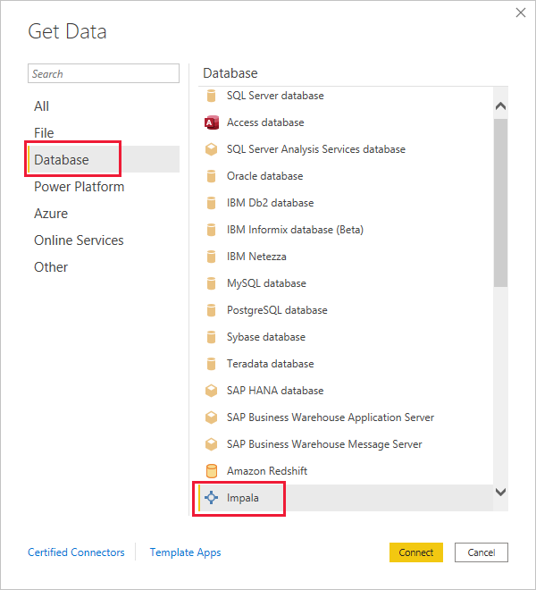
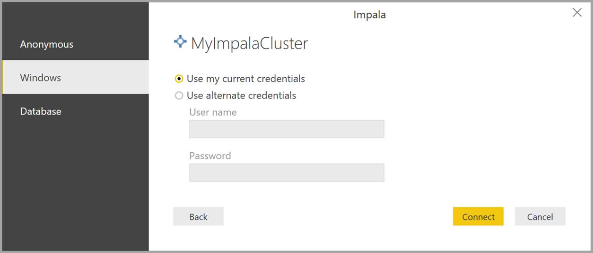
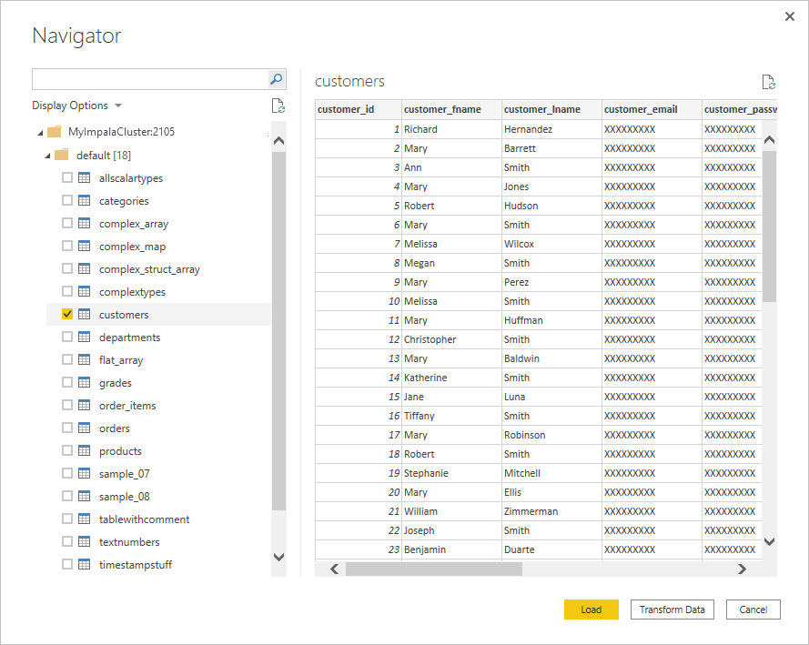

# Connect to an Impala database in Power BI Desktop
In Power BI Desktop, you can connect to an **Impala** database and use the underlying data just like you can with any other data source in Power BI Desktop.

## Connect to an Impala database
To connect to an **Impala** database, take the following steps: 

1. Select **Get Data** from the **Home** ribbon in Power BI Desktop. 

2. Select **Database** from the categories on the left. Then you see **Impala**.

    

3. In the **Impala** window that appears, type or paste the name of your Impala server into the box. Then select **OK**. You can **Import** data directly into Power BI or you can use **DirectQuery**. Learn more about [using DirectQuery](desktop-use-directquery.md).

    

4. When prompted, enter your credentials or connect anonymously. The Impala connector supports Anonymous, Basic (user name + password), and Windows authentication.

    

    > [!NOTE]
    > After you put in your user name and password for a particular **Impala** server, Power BI Desktop uses those same credentials in subsequent connection attempts. You can modify those credentials by going to **File > Options and settings > Data source settings**.

5. After you connect, a **Navigator** window appears and displays the data that's available on the server. Choose elements from this data to import and use in **Power BI Desktop**.

    

## Considerations and limitations
There are a few limitations and considerations to keep in mind with the **Impala** connector:

* The Impala connector is supported on the on-premises data gateway, using any of the three supported authentication mechanisms.

## Next steps
There are many different data sources that you can connect to by using Power BI Desktop. For more information about data sources, check out the following resources:

* [What is Power BI Desktop?](../fundamentals/desktop-what-is-desktop.md)
* [Data sources in Power BI Desktop](desktop-data-sources.md)
* [Shape and combine data with Power BI Desktop](desktop-shape-and-combine-data.md)
* [Connect to Excel workbooks in Power BI Desktop](desktop-connect-excel.md)   
* [Enter data directly into Power BI Desktop](desktop-enter-data-directly-into-desktop.md)   
