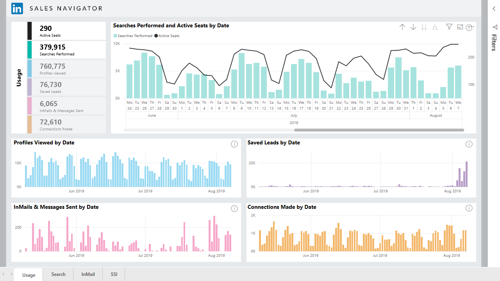
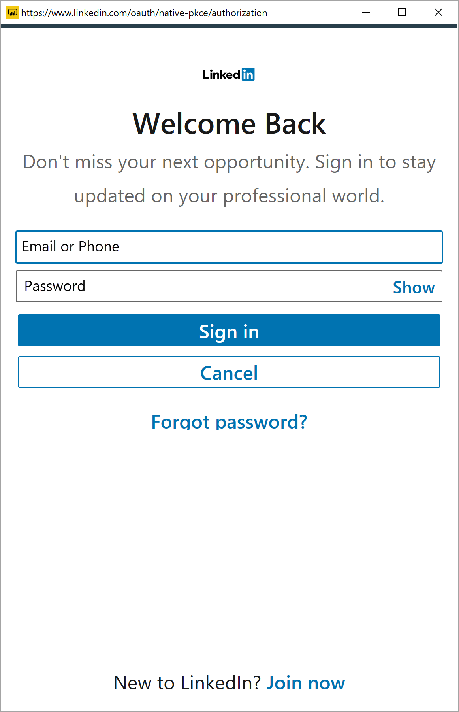
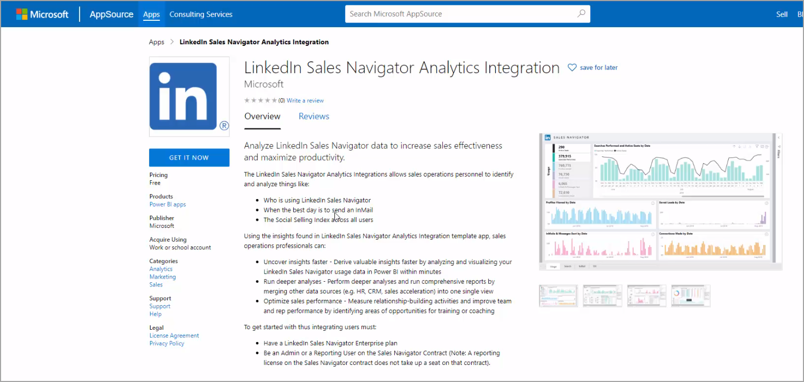
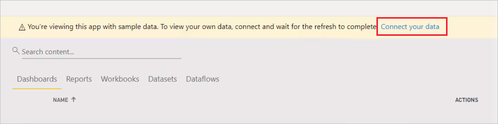

# Connect to LinkedIn Sales Navigator in Power BI Desktop

In **Power BI Desktop**, you can connect to **LinkedIn Sales Navigator** to help find and build relationships just like any other data source in Power BI Desktop, and create ready-made reports about your progress.

To connect to LinkedIn data using the **LinkedIn Sales Navigator**, you need to have a LinkedIn Sales Navigator Enterprise plan, and either be an Admin or Reporting User on the Sales Navigator Contract.

The following video provides a quick tour and tutorial for using the **LinkedIn Sales Navigator** template app, which is described in detail [later in this article](#using-the-linkedin-sales-navigator-template-app). 

> [!NOTE]  
> This video might use earlier versions of Power BI Desktop or the Power BI service.

> [!VIDEO https://www.youtube.com/embed/ZqhmaiORLw0]

## Connect to LinkedIn Sales Navigator

To connect to **LinkedIn Sales Navigator** data, select **Get Data** from the **Home** ribbon in Power BI Desktop. Select **Online Services** from the categories on the left, then scroll until you see **LinkedIn Sales Navigator (Beta)**.

You'll be advised that you're connecting to a third-party connecter that's still under development. 

When you select **Continue**, you're prompted to specify which data you want.

In the **LinkedIn Sales Navigator** window that appears, select which data you want to return, either *All contacts* or *Selected contacts* from the first drop-down selector. You can then specify the start and end dates to constrain the data it receives to a particular time window.

Once you've provided the information, Power BI Desktop connects to the data associated with your LinkedIn Sales Navigator contract. Use the same email address you use to sign in to LinkedIn Sales Navigator through the website. 

When you connect successfully, you're prompted to select which data from your LinkedIn Sales Navigator contract from a **Navigator** window.

You can create whatever reports you like with your LinkedIn Sales Navigator data. To make things easier, there is also a LinkedIn Sales Navigator .PBIX file that you can download, that has sample data already provided, so you can get familiar with the data and the reports, without having to start from scratch.

You can download the PBIX file from the following location:
* [PBIX for LinkedIn Sales Navigator](service-template-apps-samples.md)

In addition to the PBIX file, the LinkedIn Sales Navigator also has a template app that you can download and use, too. The next section describes the template app in detail.

## Using the LinkedIn Sales Navigator template app

To make using the **LinkedIn Sales Navigator** as easy as possible, you can use the [template app](service-template-apps-overview.md) that automatically creates a ready-made report from your LinkedIn Sales Navigator data.

When you download the app, you can select whether to connect to your data, or explore the app with sample data. You can always go back and connect to your own LinkedIn Sales Navigator data after you explore the sample data. 

You can get the **LinkedIn Sales Navigator** template app from the following link:
* [LinkedIn Sales Navigator template app](https://appsource.microsoft.com/en-us/product/power-bi/pbi-contentpacks.linkedin_navigator)

The template app provides four tabs to help analyze and share your information:

* Usage
* Search
* InMail
* SSI

The **Usage** tab shows your overall LinkedIn Sales Navigator data.

The **Search** tab lets you drill deeper into your search results:

The **InMail** provides insights into your InMail usage, including number of InMails sent, acceptance rates, and other useful information:

The **SSI** tab provides additional details into your social selling index (SSI):

To go from the sample data to your own data, select **edit app** in the top-right corner (the pencil icon) and then select **Connect your data** from the screen that appears.

From there you can connect your own data, selecting how many days of data to load. You can load up to 365 days of data. You'll need to sign in, again using the same email address you use to sign in to LinkedIn Sales Navigator through the website. 

the template app then refreshes the data in the app with your data. You can also set up a scheduled refresh, so the data in your app is as current as your refresh frequency specifies. 

Once the data updates, you can see the app populated with your own data.

## Getting help

If you run into problems when connecting to your data, you can contact LinkedIn Sales Navigator support at https://www.linkedin.com/help/sales-navigator. 

## Next steps
There are all sorts of data you can connect to using Power BI Desktop. For more information on data sources, check out the following resources:

* [What is Power BI Desktop?](../fundamentals/desktop-what-is-desktop.md)
* [Data Sources in Power BI Desktop](desktop-data-sources.md)
* [Shape and Combine Data with Power BI Desktop](desktop-shape-and-combine-data.md)
* [Connect to Excel workbooks in Power BI Desktop](desktop-connect-excel.md)   
* [Enter data directly into Power BI Desktop](desktop-enter-data-directly-into-desktop.md)   
