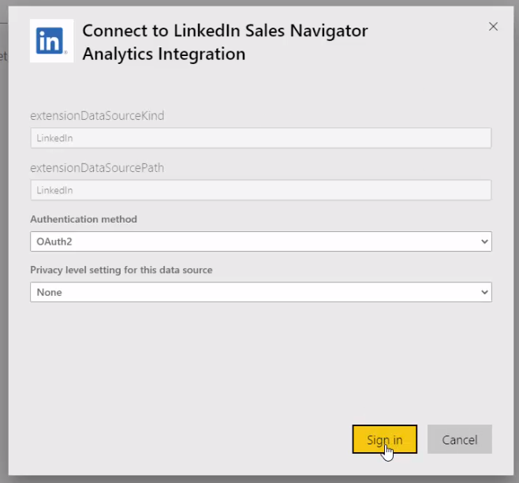

# Connect to LinkedIn Sales Navigator in Power BI Desktop

In Power BI Desktop, you can connect to *LinkedIn Sales Navigator* to help find and build relationships just like any other data source in Power BI Desktop, and create ready-made reports about your progress.  This article tells you how to install [LinkedIn Sales Navigator](https://appsource.microsoft.com/en-us/product/power-bi/pbi-contentpacks.linkedin_navigator) and how to use it once it's connected to your data.

:::image type="content" source="media/desktop-connect-linkedin-sales-navigator/linkedin-sales-navigator-01.png" alt-text="Screenshot shows LinkedIn Sales Navigator Usage tab in the Power BI service." lightbox="media/desktop-connect-linkedin-sales-navigator/linkedin-sales-navigator-01.png":::

To connect to LinkedIn data using the **LinkedIn Sales Navigator**, you need to have a LinkedIn Sales Navigator Enterprise plan, and either be an Admin or Reporting User on the Sales Navigator Contract.

## Connect to LinkedIn Sales Navigator

To connect to LinkedIn Sales Navigator data, follow the instructions in the [Power Query LinkedIn Sales Navigator article](/power-query/connectors/linkedin-sales-navigator).

## Using the LinkedIn Sales Navigator template app

To make using the LinkedIn Sales Navigator as easy as possible, you can use the [template app](service-template-apps-overview.md) that automatically creates a ready-made report from your LinkedIn Sales Navigator data.

:::image type="content" source="media/desktop-connect-linkedin-sales-navigator/linkedin-sales-navigator-10.png" alt-text="Screenshot shows the template app for LinkedIn Sales Navigator." lightbox="media/desktop-connect-linkedin-sales-navigator/linkedin-sales-navigator-10.png":::

When you download the app, you can select whether to connect to your data, or explore the app with sample data. You can always go back and connect to your own LinkedIn Sales Navigator data after you explore the sample data.

:::image type="content" source="media/desktop-connect-linkedin-sales-navigator/linkedin-sales-navigator-11.png" alt-text="Screenshot shows the option to connect to data for LinkedIn Sales Navigator." lightbox="media/desktop-connect-linkedin-sales-navigator/linkedin-sales-navigator-11.png":::

You can get the **LinkedIn Sales Navigator** template app from the following link:

* [LinkedIn Sales Navigator template app](https://appsource.microsoft.com/en-us/product/power-bi/pbi-contentpacks.linkedin_navigator)

The template app provides four tabs to help analyze and share your information:

* **Usage**
* **Search**
* **InMail**
* **SSI**

The **Usage** tab shows your overall LinkedIn Sales Navigator data.

:::image type="content" source="media/desktop-connect-linkedin-sales-navigator/linkedin-sales-navigator-12.png" alt-text="Screenshot shows the LinkedIn Sales Navigator Usage tab, which shows your overall LinkedIn Sales Navigator data." lightbox="media/desktop-connect-linkedin-sales-navigator/linkedin-sales-navigator-12.png":::

The **Search** tab lets you drill deeper into your search results.

:::image type="content" source="media/desktop-connect-linkedin-sales-navigator/linkedin-sales-navigator-13.png" alt-text="Screenshot shows the LinkedIn Sales Navigator Search tab." lightbox="media/desktop-connect-linkedin-sales-navigator/linkedin-sales-navigator-13.png":::

The **InMail** tab provides insights into your InMail usage, including number of InMails sent, acceptance rates, and other useful information.

:::image type="content" source="media/desktop-connect-linkedin-sales-navigator/linkedin-sales-navigator-14.png" alt-text="Screenshot shows the LinkedIn Sales Navigator InMail tab." lightbox="media/desktop-connect-linkedin-sales-navigator/linkedin-sales-navigator-14.png":::

The **SSI** tab provides more details into your social selling index (SSI).

:::image type="content" source="media/desktop-connect-linkedin-sales-navigator/linkedin-sales-navigator-15.png" alt-text="Screenshot shows the LinkedIn Sales Navigator SSI tab." lightbox="media/desktop-connect-linkedin-sales-navigator/linkedin-sales-navigator-15.png":::

To go from the sample data to your own data, select **edit app** in the top-right corner (the pencil icon) and then select **Connect your data** from the screen that appears.

:::image type="content" source="media/desktop-connect-linkedin-sales-navigator/linkedin-sales-navigator-16.png" alt-text="Screenshot shows the Connect your data link in the Power BI service." lightbox="media/desktop-connect-linkedin-sales-navigator/linkedin-sales-navigator-16.png":::

From there you can connect your own data, selecting how many days of data to load. You can load up to 365 days of data. You need to sign in using the same email address you use to sign in to LinkedIn Sales Navigator through the website.

The template app then refreshes the data in the app with your data. You can also [set up a scheduled refresh](refresh-scheduled-refresh.md), so the data in your app is as current as your refresh frequency specifies.

Once the data updates, you can see the app populated with your own data.

## Getting help

If you run into problems when connecting to your data, you can contact [LinkedIn Sales Navigator support](https://www.linkedin.com/help/sales-navigator).

## Related content

There are all sorts of data you can connect to using Power BI Desktop. For more information on data sources, check out the following resources:

* [What is Power BI Desktop?](../fundamentals/desktop-what-is-desktop.md)
* [Data sources in Power BI Desktop](desktop-data-sources.md)
* [Shape and combine Data with Power BI Desktop](desktop-shape-and-combine-data.md)
* [Import Excel workbooks into Power BI Desktop](desktop-import-excel-workbooks.md)
* [Enter data directly into Power BI Desktop](desktop-enter-data-directly-into-desktop.md)
