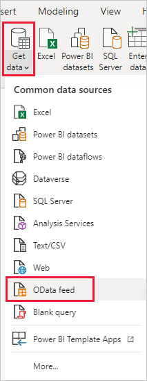
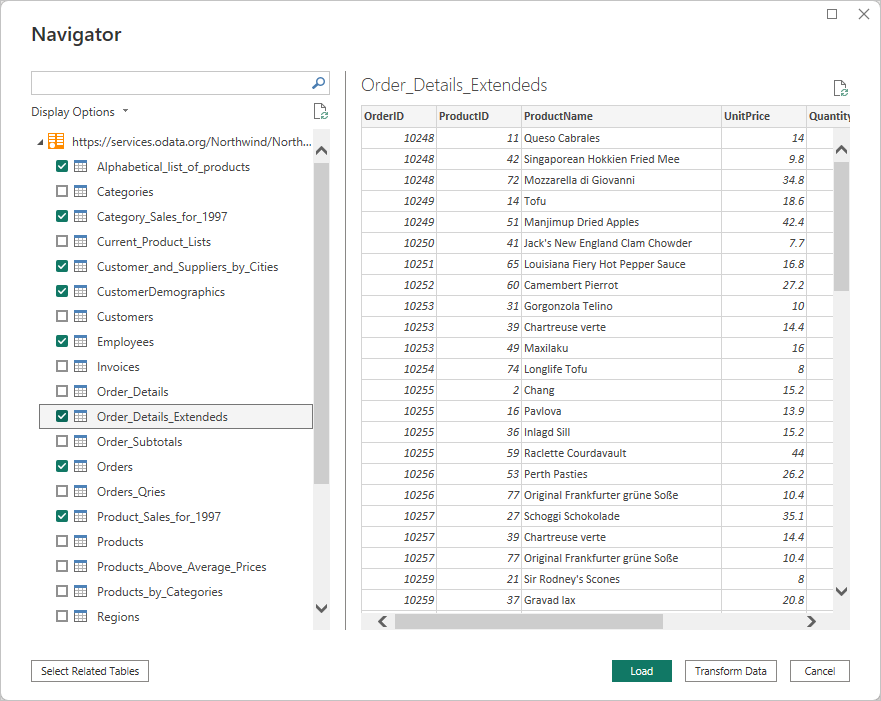
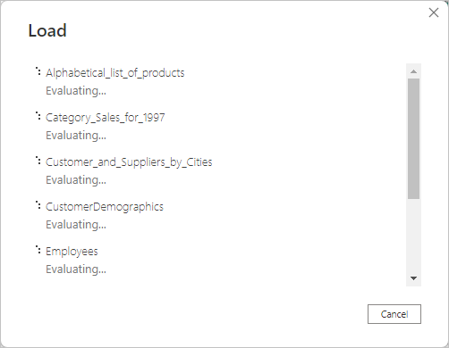
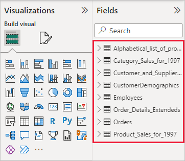

# Connect to OData feeds in Power BI Desktop

In Power BI Desktop, you can connect to an **OData feed** and use the underlying data just like any other data source in Power BI Desktop.

To connect to an OData feed, select **Get data** > **OData feed** from the **Home** ribbon in Power BI Desktop.

In the **OData Feed** window that appears, type or paste your OData feed URL into the box, and select **OK**.

> [!TIP]
> The location of the Northwind OData feed changes occasionally. Currently the link is `https://services.odata.org/v2/northwind/northwind.svc/`.

Power BI Desktop connects to the OData feed, and displays the available tables and other data elements in the **Navigator** window. When you select an element, the right pane of the **Navigator** window displays a preview of the data. You can select as many tables as you want to import. The **Navigator** window shows a preview of the currently selected table.

You can choose the **Transform Data** button, which launches **Power Query Editor**, where you can shape and transform the data from the OData feed before importing it into Power BI Desktop. Or you can select the **Load** button, and import all of the data elements you selected in the left pane.

When you select **Load**, Power BI Desktop imports the selected items, and displays a **Load** window of the import progress.

Once complete, Power BI Desktop makes the selected tables and other data elements available in the **Fields** pane, found on the right side of the *Reports* view in Power BI Desktop.

And that's it!

You’re now ready to use the imported data from the OData feed in Power BI Desktop to create visuals, reports, or interact with any other data you might want to connect with and import, such as other Excel workbooks, databases, or any other data source.

## Next steps

There are all sorts of data you can connect to using Power BI Desktop. For more information on data sources, check out the following resources:

* [What is Power BI Desktop?](../fundamentals/desktop-what-is-desktop.md)
* [Data Sources in Power BI Desktop](desktop-data-sources.md)
* [Shape and Combine Data with Power BI Desktop](desktop-shape-and-combine-data.md)
* [Connect to Excel workbooks in Power BI Desktop](desktop-connect-excel.md)
* [Enter data directly into Power BI Desktop](desktop-enter-data-directly-into-desktop.md)
