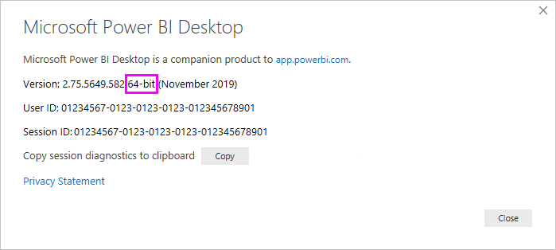

# Connect to an Oracle database with Power BI Desktop
To connect to an Oracle database or Oracle Autonomous Database with Power BI Desktop, install Oracle Client for Microsoft Tools (OCMT) on the computer running Power BI Desktop. The OCMT software you use depends on which version of Power BI Desktop you've installed: 32-bit or 64-bit. It also depends on your version of Oracle server.

Supported Oracle Database versions: 
- Oracle Database 12c (12.1.0.2) and later
- Oracle Autonomous Database - all versions

## Determining which version of Power BI Desktop is installed
To determine which version of Power BI Desktop is installed, on the **Help** ribbon, select **About**, then check the **Version** line. In the following image, a 64-bit version of Power BI Desktop is installed:

## Install the Oracle Client for Microsoft Tools
Oracle Client for Microsoft Tools installs and configures Oracle Data Provider for .NET (ODP.​NET) to support 32-bit and 64-bit Microsoft tool connections with Oracle on-premises and cloud databases, including Oracle Autonomous Database. It is a graphical installer that automates the Oracle Database Client setup process. It supports connecting with Power BI Desktop, Power BI service, Excel, SQL Server Analysis Services, SQL Server Data Tools, SQL Server Integration Services, SQL Server Reporting Services, and BizTalk Server.

OCMT is free software. It can be downloaded from the [Oracle Client for Microsoft Tools page](https://www.oracle.com/database/technologies/appdev/ocmt.html) and is available for 32-bit or 64-bit Power BI Desktop.

Power BI Desktop uses unmanaged ODP.​NET to connect to Oracle database or Oracle Autonomous Database.

Here are [step by step instructions to use OCMT and setup Oracle database connectivity to Power BI Desktop](https://www.oracle.com/a/ocom/docs/database/microsoft-powerbi-connection-adw.pdf).

## Connect to an Oracle database with on-premises data gateway
Some Power BI Desktop app deployments use on-premises data gateway to connect to Oracle database. To connect to an Oracle database with the [on-premises data gateway](/data-integration/gateway/), use 64-bit OCMT on the computer running the gateway since the gateway is a 64-bit app. For more information, go to [Manage your data source - Oracle](./service-gateway-onprem-manage-oracle.md).

## Connect to an Oracle Database

For information about connecting to an Oracle database or an Oracle Autonomous database from either Power BI Desktop or Power BI service, go to the Power Query article on [Oracle databases](/power-query/connectors/oracle-database).

## Related content

* [DirectQuery in Power BI](desktop-directquery-about.md)
* [What is Power BI?](../fundamentals/power-bi-overview.md)  
* [Data sources for the Power BI service](service-get-data.md)  
* [Oracle Client for Microsoft Tools](https://www.oracle.com/database/technologies/appdev/ocmt.html)

More questions? [Ask the Power BI Community](https://community.powerbi.com/)
