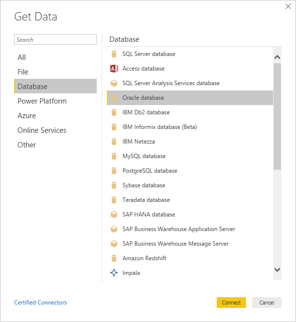
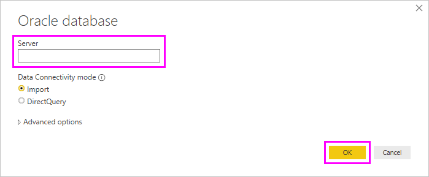
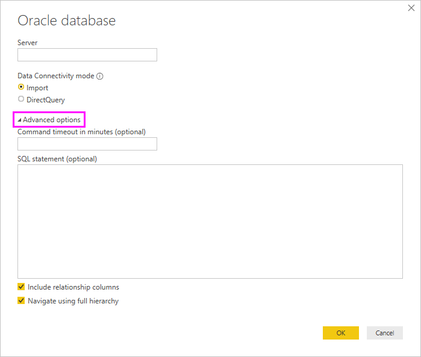

# Connect to an Oracle database with Power BI Desktop
To connect to an Oracle database with Power BI Desktop, the correct Oracle client software must be installed on the computer running Power BI Desktop. The Oracle client software you use depends on which version of Power BI Desktop you've installed: 32-bit or 64-bit. It also depends on your version of Oracle server.

Supported Oracle versions: 
- Oracle Server 9 and later
- Oracle Data Access Client (ODAC) software 11.2 and later

> [!NOTE]
> If you're configuring an Oracle database for Power BI Desktop, On Premises Data Gateway or Power BI Report Server, consult the information in the [Oracle Connection Type](/sql/reporting-services/report-data/oracle-connection-type-ssrs?view=sql-server-ver15) article. 

## Determining which version of Power BI Desktop is installed
To determine which version of Power BI Desktop is installed, select **File** > **Help** > **About**, then check the **Version** line. In the following image, a 64-bit version of Power BI Desktop is installed:

## Install the Oracle client
- For the 32-bit version of Power BI Desktop, [download and install the 32-bit Oracle client](https://www.oracle.com/technetwork/topics/dotnet/utilsoft-086879.html).

- For the 64-bit version of Power BI Desktop, [download and install the 64-bit Oracle client](https://www.oracle.com/database/technologies/odac-downloads.html).

> [!NOTE]
> Choose a version of Oracle Data Access Client (ODAC) which is compatible with your Oracle Server. For instance, ODAC 12.x does not always support Oracle Server version 9.
> Choose the Windows installer of the Oracle Client.
> During the setup of the Oracle client, make sure you enable *Configure ODP.NET and/or Oracle Providers for ASP.NET at machine-wide level* by selecting the corresponding checkbox during the setup wizard. Some versions of the Oracle client wizard selects the checkbox by default, others do not. Make sure that checkbox is selected so that Power BI can connect to your Oracle database.

## Connect to an Oracle database
After you install the matching Oracle client driver, you can connect to an Oracle database. To make the connection, take the following steps:

1. From the **Home** tab, select **Get Data**. 

2. From the **Get Data** window that appears, select **More** (if necessary), select **Database** > **Oracle database**, and then select **Connect**.
   
   
3. In the **Oracle database** dialog that appears, provide the name of the **Server**, and select **OK**. If a SID is required, specify it by using the format: *ServerName/SID*, where *SID* is the unique name of the database. If the *ServerName/SID* format doesn't work, use *ServerName/ServiceName*, where *ServiceName* is the alias you use to connect.

   

   > [!NOTE]
   > If you are using a local database, or autonomous database connections, you may need to place the server name in quotation marks to avoid connection errors. 
      
4. If you want to import data by using a native database query, put your query in the **SQL statement** box, which appears when you expand the **Advanced options** section of the **Oracle database** dialog.
   
   

5. After you've entered your Oracle database information in the **Oracle database** dialog (including any optional information such as a SID or a native database query), select **OK** to connect.
5. If the Oracle database requires database user credentials, input those credentials in the dialog when prompted.

## Troubleshooting

You might encounter any of several errors from Oracle when the naming syntax is either incorrect or not configured properly:

* ORA-12154: TNS:could not resolve the connect identifier specified.
* ORA-12514: TNS:listener does not currently know of service requested in connect descriptor.
* ORA-12541: TNS:no listener.
* ORA-12170: TNS:connect timeout occurred.
* ORA-12504: TNS:listener was not given the SERVICE_NAME in CONNECT_DATA.

These errors might occur if the Oracle client either isn't installed or isn't configured properly. If it's installed, verify that the tnsnames.ora file is properly configured and you're using the proper net_service_name. You also need to make sure that the net_service_name is the same between the machine that uses Power BI Desktop and the machine that runs the gateway. For more information, see [Install the Oracle client](#install-the-oracle-client).

You might also encounter a compatibility issue between the Oracle server version and the Oracle Data Access Client version. Typically, you want these versions to match, as some combinations are incompatible. For instance, ODAC 12.x does not support Oracle Server version 9.

If you downloaded Power BI Desktop from the Microsoft Store, you might be unable to connect to Oracle databases because of an Oracle driver issue. If you encounter this issue, the error message returned is: *Object reference not set*. To address the issue, do one of these steps:

* Download Power BI Desktop from the [Download Center](https://www.microsoft.com/download/details.aspx?id=58494) instead of Microsoft Store.

* If you want to use the version from Microsoft Store: on your local computer, copy oraons.dll from _12.X.X\client_X_ to _12.X.X\client_X\bin_, where _X_ represents version and directory numbers.

If you see the error message, *Object reference not set*, in the Power BI Gateway when you connect to an Oracle database, follow the instructions in [Manage your data source - Oracle](service-gateway-onprem-manage-oracle.md).

If you're using Power BI Report Server, consult the guidance in the [Oracle Connection Type](/sql/reporting-services/report-data/oracle-connection-type-ssrs?view=sql-server-ver15) article.