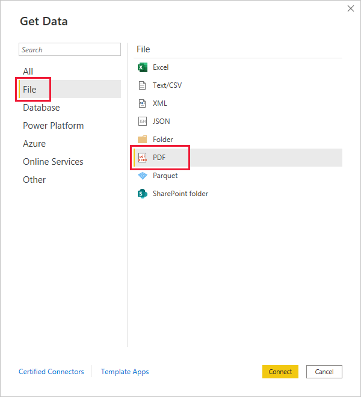

# Connect to PDF files in Power BI Desktop

In Power BI Desktop, you can connect to a PDF file and use the included data from the file, just like any other data source in Power BI Desktop.

:::image type="content" source="media/desktop-connect-pdf/connect-pdf-04.png" alt-text="Screenshot shows the Navigator window with data to be imported into Power BI Desktop." lightbox="media/desktop-connect-pdf/connect-pdf-04.png":::

The following sections describe how to connect to a PDF file, select data, and bring that data into Power BI Desktop.

We always recommend upgrading to the most recent release of **Power BI Desktop**, which you can get from a link in [get Power BI Desktop](../fundamentals/desktop-get-the-desktop.md).

## Connect to a PDF file

To connect to a PDF file, select **Get data** from the **Home** ribbon in Power BI Desktop. Select **File** from the categories on the left, and you see **PDF**.

You're prompted to provide the location of the PDF file you want to use. Once you provide the file location and the PDF file loads, a **Navigator** window appears and displays the data available from the file, from which you can select one or multiple elements to import and use in Power BI Desktop.

:::image type="content" source="media/desktop-connect-pdf/connect-pdf-04.png" alt-text="Screenshot shows the Navigator window with data to be imported into Power BI Desktop." lightbox="media/desktop-connect-pdf/connect-pdf-04.png":::

Selecting a checkbox next to discovered elements in the PDF file displays them in the right pane. When you're ready to import, select the **Load** button to bring the data into Power BI Desktop.

You can specify the **Start page** and **End Page** as optional parameters for your PDF connection. You can also specify these parameters in the M formula language, using the following format:

`Pdf.Tables(File.Contents("c:\sample.pdf"), [StartPage=10, EndPage=11])`

## Next steps

There are all sorts of data you can connect to using Power BI Desktop. For more information on data sources, check out the following resources:

* [What is Power BI Desktop?](../fundamentals/desktop-what-is-desktop.md)
* [Data Sources in Power BI Desktop](desktop-data-sources.md)
* [Shape and Combine Data with Power BI Desktop](desktop-shape-and-combine-data.md)
* [Connect to Excel workbooks in Power BI Desktop](desktop-connect-excel.md)
* [Enter data directly into Power BI Desktop](desktop-enter-data-directly-into-desktop.md)
