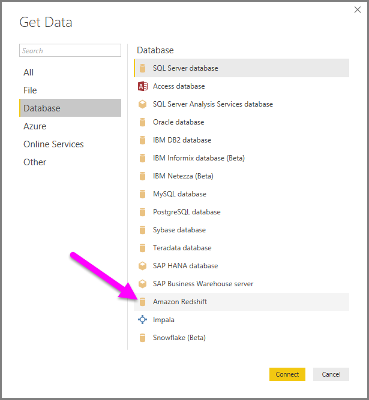
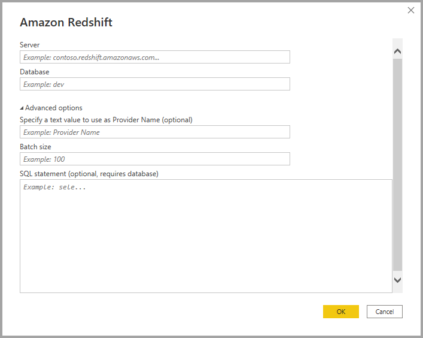
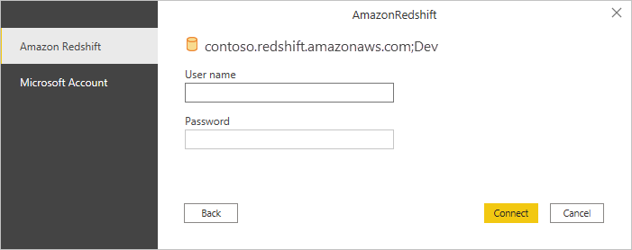
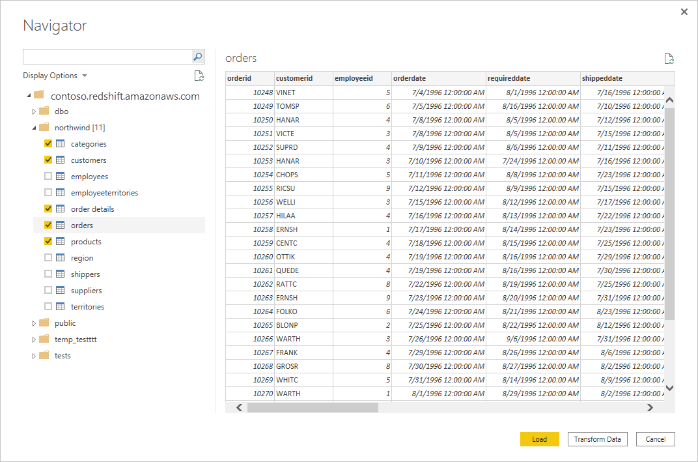

# Connect to an Amazon Redshift database in Power BI Desktop
In **Power BI Desktop**, you can connect to an **Amazon Redshift** database and use the underlying data just like any other data source in Power BI Desktop.

## Connect to an Amazon Redshift database
To connect to an **Amazon Redshift** database, select **Get data** from the **Home** ribbon in Power BI Desktop. Select **Database** from the categories on the left, and you see **Amazon Redshift**.

In the **Amazon Redshift** window that appears, type or paste the name of your **Amazon Redshift** server and database into the box. As part of the *Server* field, users can specify a port in the following format: *ServerURL:Port*

When prompted, put in your username and password. You should use the server name that precisely matches the SSL certificate to avoid errors. 

Once you successfully connect, a **Navigator** window appears and displays the data available on the server, from which you can select one or multiple elements to import and use in **Power BI Desktop**.

Once you make selections from the **Navigator** window, you can either **Load** or transform the data.

* If you choose to **Load** data, you'll be prompted to use either *Import* or *DirectQuery* mode to load the data. For more information, check out this [article that explains DirectQuery](desktop-use-directquery.md).
* If you select to **Transform Data** the data, **Power Query Editor** appears where you can apply all sorts of transformations and filters to the data, many of which are applied to the underlying **Amazon Redshift** database itself (if supported).

## Next steps
There are all sorts of data you can connect to using Power BI Desktop. For more information on data sources, check out the following resources:

* [What is Power BI Desktop?](../fundamentals/desktop-what-is-desktop.md)
* [Data Sources in Power BI Desktop](desktop-data-sources.md)
* [Shape and Combine Data with Power BI Desktop](desktop-shape-and-combine-data.md)
* [Connect to Excel workbooks in Power BI Desktop](desktop-connect-excel.md)   
* [Enter data directly into Power BI Desktop](desktop-enter-data-directly-into-desktop.md)   
