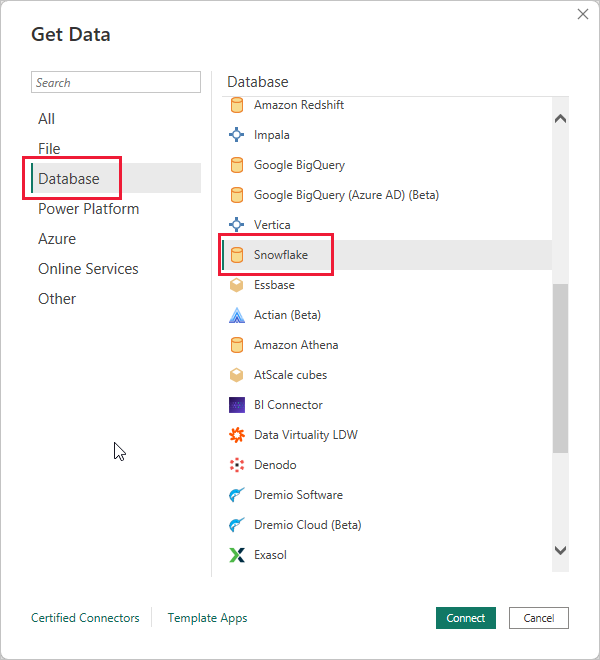
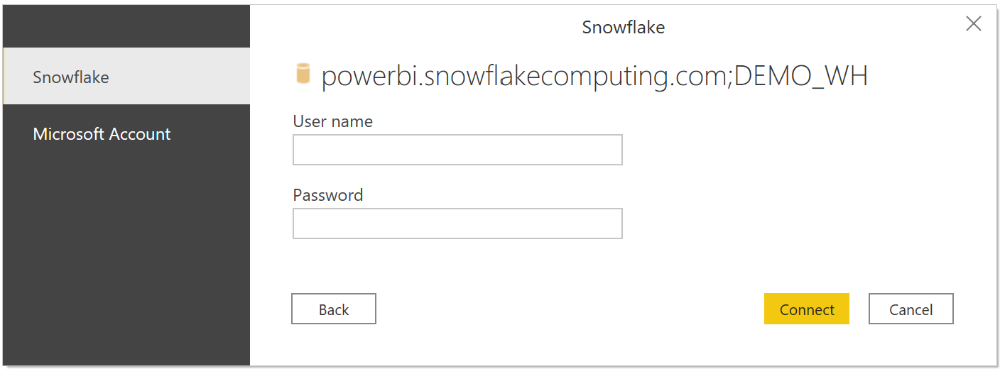
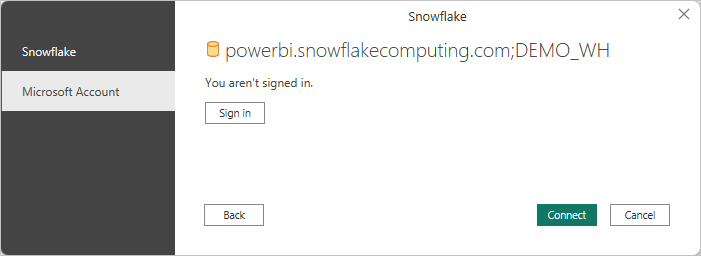
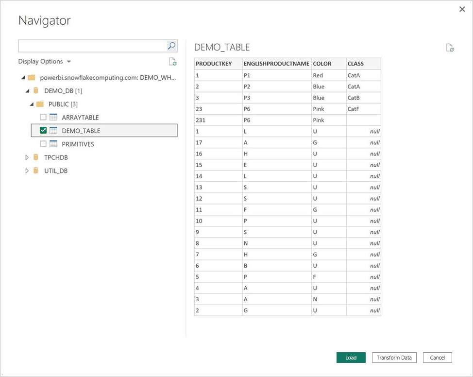

# Connect to Snowflake in Power BI Desktop

In Power BI Desktop, you can connect to a **Snowflake** computing warehouse and use the underlying data just like any other data source in Power BI Desktop.

## Connect to a Snowflake computing warehouse

To connect to a **Snowflake** computing warehouse, select **Get data** from the **Home** ribbon in Power BI Desktop. Select **Database** from the categories on the left, and choose **Snowflake**.

In the **Snowflake** window that appears, type or paste the name of your Snowflake computing warehouse into the box and select **OK**. 

When prompted, put in your username and password.

> [!NOTE]
> Once you enter your username and password for a particular Snowflake server, Power BI Desktop uses those same credentials in subsequent connection attempts. You can modify those credentials by going to **File** > **Options and settings** > **Data source settings**.

If you want to use the Microsoft account option, the Snowflake Azure Active Directory (Azure AD) integration must be configured on the Snowflake side. To do this configuration, see the Getting Started section of [Power BI SSO to Snowflake](https://docs.snowflake.com/en/user-guide/oauth-powerbi.html#getting-started).

Once you successfully connect, a **Navigator** window appears and displays the data available on the server, from which you can select one or multiple elements to import and use in **Power BI Desktop**.

You can **Load** the selected table, which brings the entire table into Power BI Desktop, or you can use **Transform Data** for the query, which opens **Power Query Editor** so you can filter and refine the set of data you want to use, and then load that refined set of data into **Power BI Desktop**.

You can choose to **Import** data directly into Power BI, or you can use **DirectQuery**. For more information, see [Use DirectQuery in Power BI](desktop-use-directquery.md).

## Custom Roles

The Snowflake connector supports *Custom Roles*.

## Next steps

There are all sorts of data you can connect to using Power BI Desktop. For more information on data sources, check out the following resources:

* [What is Power BI Desktop?](../fundamentals/desktop-what-is-desktop.md)
* [Data Sources in Power BI Desktop](desktop-data-sources.md)
* [Shape and Combine Data with Power BI Desktop](desktop-shape-and-combine-data.md)
* [Connect to Excel workbooks in Power BI Desktop](desktop-connect-excel.md)
* [Enter data directly into Power BI Desktop](desktop-enter-data-directly-into-desktop.md)
