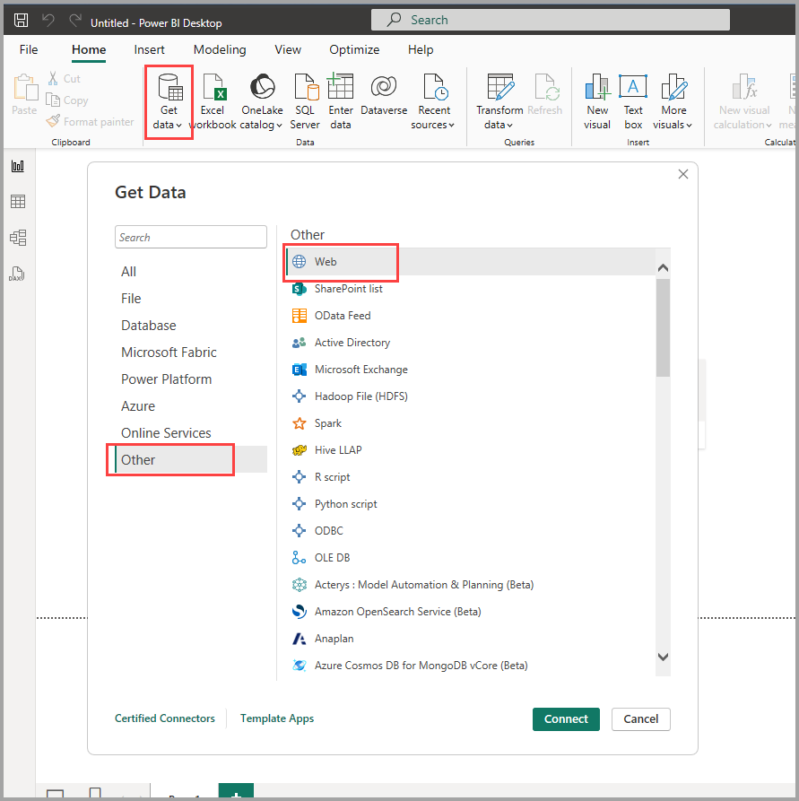
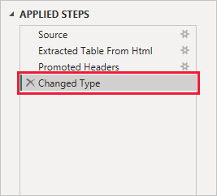

# Connect to data sources in Power BI Desktop

With Power BI Desktop, you can easily connect to the ever expanding world of data. If you don’t have Power BI Desktop, you can [download](https://go.microsoft.com/fwlink/?LinkID=521662) and install it.

There are *all sorts* of data sources available in Power BI Desktop. The following image shows how to connect to data, by selecting **Get data** > **Other** > **Web**.

## Example of connecting to data

For this example, we'll connect to a **Web** data source.

Imagine you’re retiring. You want to live where there’s lots of sunshine, preferable taxes, and good health care. Or… perhaps you’re a data analyst, and you want that information to help your customers, as in, help your raincoat manufacturing client target sales where it rains a *lot*.

Either way, you find a Web resource that has interesting data about those topics, and more:

[https://www.fool.com/research/best-states-to-retire](https://www.fool.com/research/best-states-to-retire)

Select **Get data** > **Other** > **Web**. In **From Web**, enter the address.

When you select **OK**, the *Query* functionality of Power BI Desktop goes to work. Power BI Desktop contacts the Web resource, and the **Navigator** window returns the results of what it found on that Web page. In this case, it found a table. We're interested in that table, so we select it from the list. The **Navigator** window displays a preview.

:::image type="content" source="media/desktop-connect-to-data/datasources_fromnavigatordialog.png" alt-text="Preview of data in Navigator" lightbox="media/desktop-connect-to-data/datasources_fromnavigatordialog.png":::

At this point, you can edit the query before loading the table, by selecting **Transform Data** from the bottom of the window, or just load the table.

Select **Transform Data** to load the table and launch Power Query Editor. The **Query Settings** pane is displayed. If it's not, select **View** from the ribbon, then choose **Query Settings** to display the **Query Settings** pane. Here’s what the editor looks like.

:::image type="content" source="media/desktop-connect-to-data/designer_gsg_editquery.png" alt-text="Power Query Editor with Query Settings" lightbox="media/desktop-connect-to-data/designer_gsg_editquery.png":::

All those scores are text rather than numbers, and we need them to be numbers. No problem. Just right-click the column header, and select **Change Type** > **Whole Number** to change them. To choose more than one column, first select a column then choose **Shift**, select other adjacent columns, and then right-click a column header to change all selected columns. Use **Ctrl** to choose columns that aren't adjacent.

:::image type="content" source="media/desktop-connect-to-data/designer_gsg_changedatatype.png" alt-text="Change data type to Whole Number" lightbox="media/desktop-connect-to-data/designer_gsg_changedatatype.png":::

In **Query Settings**, the **APPLIED STEPS** reflect any changes that were made. As you make more changes to the data, Power Query Editor records those changes in the **APPLIED STEPS** section, which you can adjust, revisit, rearrange, or delete as necessary.

Other changes to the table can still be made after it's loaded, but for now these changes are enough. When you're done, select **Close & Apply** from the **Home** ribbon, and Power BI Desktop applies the changes and closes Power Query Editor.

With the data model loaded, in **Report** view in Power BI Desktop, you can begin creating visualizations by dragging fields onto the canvas.

:::image type="content" source="media/desktop-connect-to-data/connecttodata_dragontoreportview.png" alt-text="Drag a value to the canvas" lightbox="media/desktop-connect-to-data/connecttodata_dragontoreportview.png":::

Of course, this model is simple, with a single data connection. Most Power BI Desktop reports have connections to different data sources, shaped to meet your needs, with relationships that produce a rich data model.

## Related content

There are all sorts of things you can do with Power BI Desktop. For more information on its capabilities, check out the following resources:

* [What is Power BI Desktop?](../fundamentals/desktop-what-is-desktop.md)
* [Query overview in Power BI Desktop](../transform-model/desktop-query-overview.md)
* [Data sources in Power BI Desktop](desktop-data-sources.md)
* [Shape and combine data in Power BI Desktop](desktop-shape-and-combine-data.md)
* [Perform common query tasks in Power BI Desktop](../transform-model/desktop-common-query-tasks.md)

Want to give us feedback? Great! Use the **Submit an Idea** menu item in Power BI Desktop or visit [Community Feedback](https://community.powerbi.com/t5/Community-Feedback/bd-p/community-feedback). We look forward to hearing from you!

