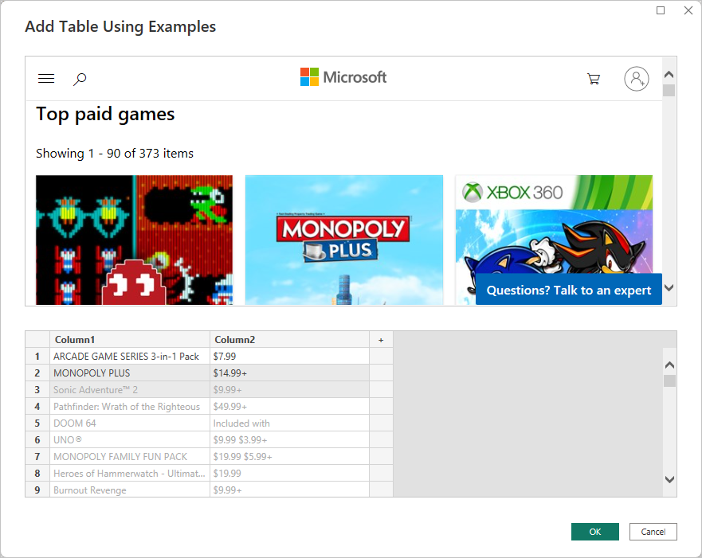
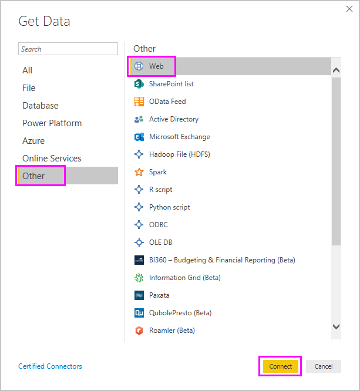
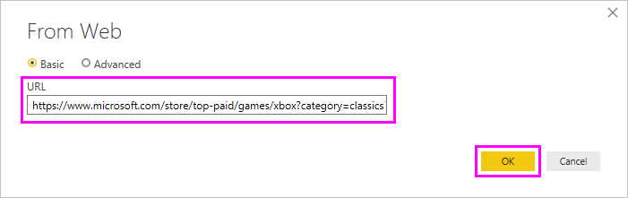
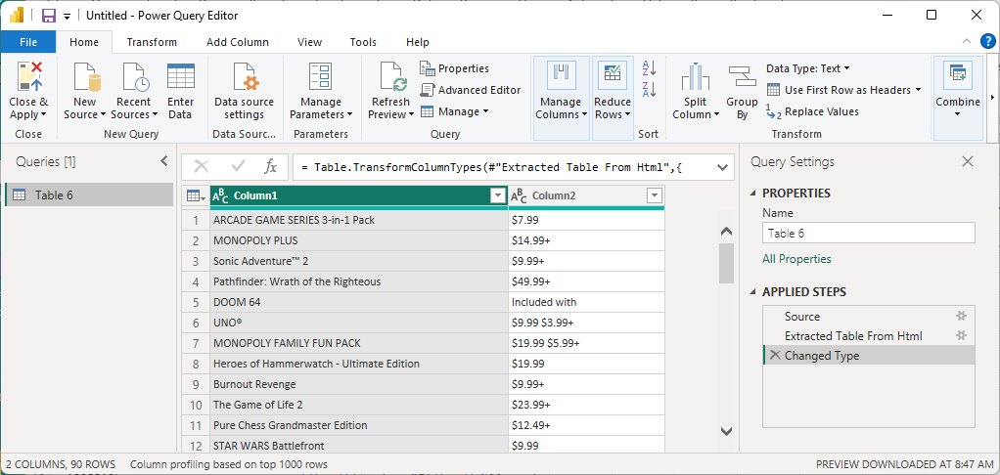

# Get webpage data by providing examples

Getting data from a web page lets users easily extract data from web pages, and import that data into *Power BI Desktop*. Often however, data on Web pages aren't in tidy tables that are easy to extract. Getting data from such pages can be challenging, even if the data is structured and consistent.

There's a solution. With the *Get Data from Web by example* feature, you can essentially show Power BI Desktop which data you want to extract by providing one or more examples within the connector dialog. Power BI Desktop gathers other data on the page that match your examples. With this solution you can extract all sorts of data from Web pages, including  data found in tables *and* other non-table data.



Prices in graphics are for example purposes only.

## Using Get Data from Web by example

Select **Get data** from the **Home** ribbon menu. In the dialog box that appears, select **Other** from the categories in the left pane, and then select **Web**. Select **Connect** to continue.



In **From Web**, enter the URL of the Web page from which you'd like to extract data. In this article, we'll use the Microsoft Store Web page, and show how this connector works.

If you want to follow along, you can use the [Microsoft Store URL](https://www.microsoft.com/store/top-paid/games/xbox?category=classics) that we use in this article:

```http
https://www.microsoft.com/store/top-paid/games/xbox?category=classics
```



When you select **OK**, you're taken to the **Navigator** dialog box where any autodetected tables from the Web page are presented. In the case shown in the image below, no tables were found. Select **Add table using examples** to provide examples.


**Add table using examples** presents an interactive window where you can preview the content of the Web page. Enter sample values of the data you want to extract.

In this example, we'll extract the *Name* and *Price* for each of the games on the page. We can do that by specifying a couple of examples from the page for each column. As you enter examples, *Power Query* extracts data that fits the pattern of example entries using smart data extraction algorithms.


> [!NOTE]
> Value suggestions only include values less than or equal to 128 characters in length.

Once you're happy with the data extracted from the Web page, select **OK** to go to Power Query Editor. You can apply more transformations or shape the data, such as combining this data with other data our sources.



From there, you can create visuals or otherwise use the Web page data when creating your Power BI Desktop reports.

## Next steps

There are all sorts of data you can connect to using Power BI Desktop. For more information on data sources, check out the following resources:

* [Add a column from an example in Power BI Desktop](../create-reports/desktop-add-column-from-example.md)
* [Connect to webpages from Power BI Desktop](desktop-connect-to-web.md)
* [Data sources in Power BI Desktop](desktop-data-sources.md)
* [Shape and combine data in Power BI Desktop](desktop-shape-and-combine-data.md)
* [Connect to Excel workbooks in Power BI Desktop](desktop-connect-excel.md)
* [Connect to CSV files in Power BI Desktop](desktop-connect-csv.md)
* [Enter data directly into Power BI Desktop](desktop-enter-data-directly-into-desktop.md)
