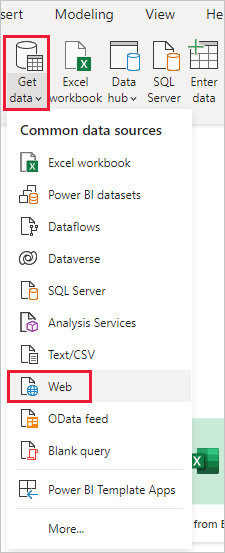
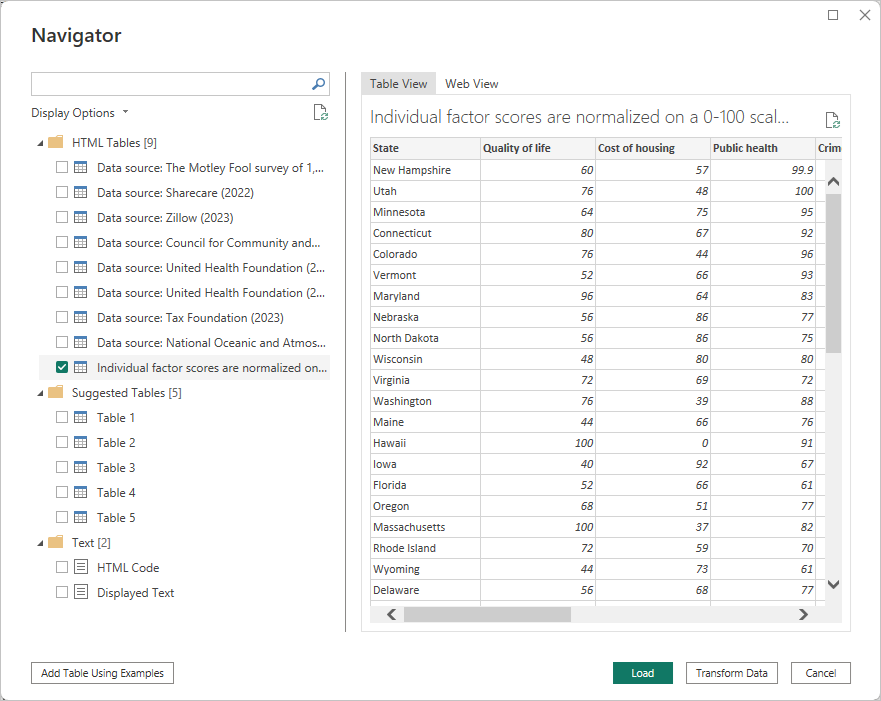
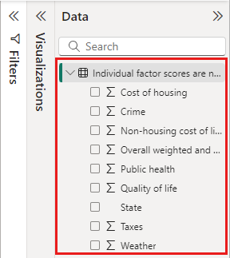
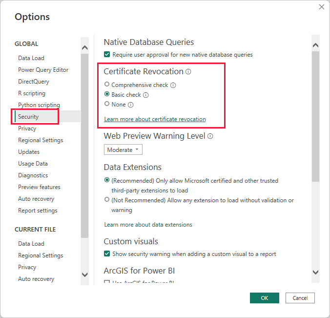

# Connect to webpages from Power BI Desktop

You can connect to a webpage and import its data into Power BI Desktop, to use in your visuals and in your data models.

In Power BI Desktop, select **Get Data > Web** from the **Home** ribbon.

A dialog appears, asking for the URL of the web page from which you want to import data.

Once you’ve typed in (or pasted) the URL, select **OK**. Power BI Desktop prompts you to specify how you want to access the web content.

Power BI Desktop connects to the web page and then presents the page’s available data in the **Navigator** window. When you select one of the available data elements, such as a table of the entire page, the **Navigator** window displays a preview of that data on the right side of the window.

You can choose the **Transform Data** button, which launches **Power Query Editor**, where you can shape and transform the data on that Web page before importing it into Power BI Desktop. Or you can select the **Load** button, and import all of the data elements you selected in the left pane.

When we select **Load**, Power BI Desktop imports the selected items, and makes them available in the **Fields** pane, found on the right side of the Reports view in Power BI Desktop.

That’s all there is to connecting to a web page and bringing its data into Power BI Desktop.

From there, you can drag those fields onto the Report canvas and create all the visualizations you want. You can also use the data from that Web page just like you would any other data – you can shape it, you can create relationships between it and other data sources in your model, and otherwise do what you’d like to create the Power BI report you want.

To see connecting to a Web page in more depth and action, take a look at the [Power BI Desktop Getting Started Guide](../fundamentals/desktop-getting-started.md).

## Certificate revocation check

Power BI applies security for web connections to protect your data. In some scenarios, such as capturing web requests with Fiddler, web connections may not work properly. To enable such scenarios, you can modify the **Check if your certificates have been revoked** option in Power BI Desktop, then restart Power BI Desktop. 

To change this option, select **File** > **Options and settings** > **Options**, then select **Security** in the left pane. 

## Next steps
There are all sorts of data you can connect to using Power BI Desktop. For more information on data sources, check out the following resources:

* [Data Sources in Power BI Desktop](desktop-data-sources.md)
* [Shape and Combine Data with Power BI Desktop](desktop-shape-and-combine-data.md)
* [Connect to Excel workbooks in Power BI Desktop](desktop-connect-excel.md)   
* [Connect to CSV files in Power BI Desktop](desktop-connect-csv.md)   
* [Enter data directly into Power BI Desktop](desktop-enter-data-directly-into-desktop.md)   
