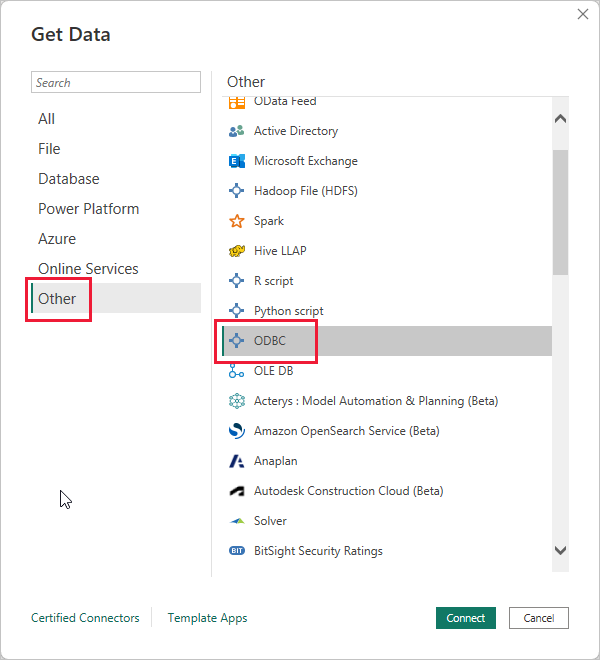
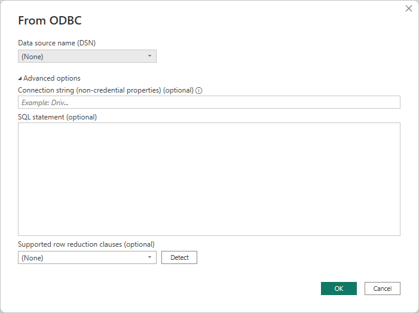
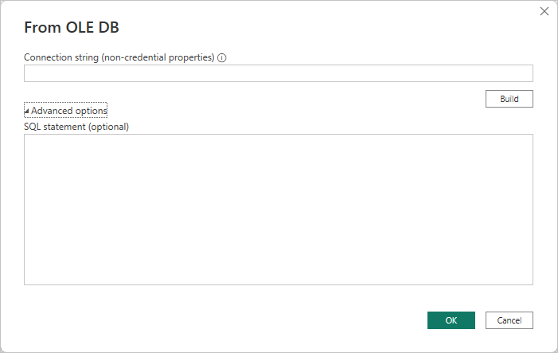
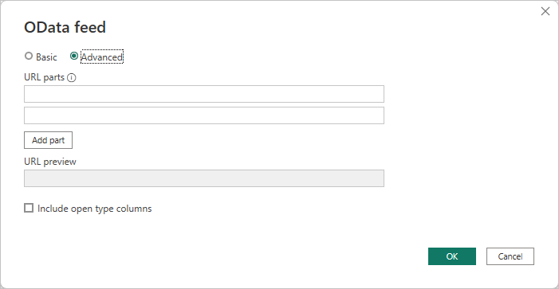
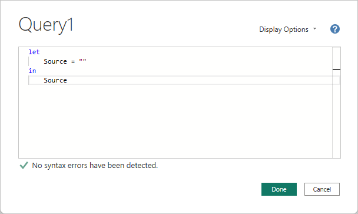
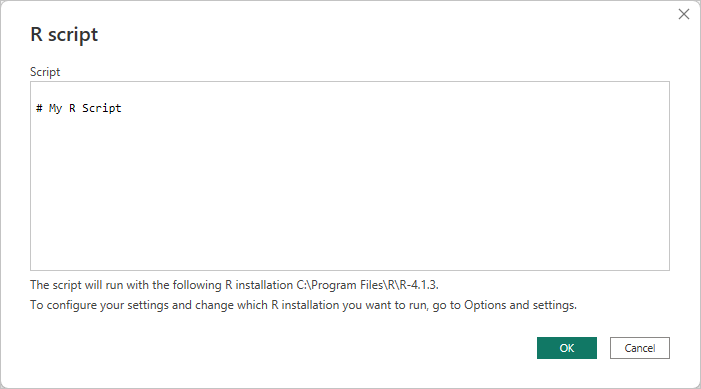

# Connect to data by using Power BI Desktop generic interfaces 

You can connect to a multitude of different data sources in **Power BI Desktop**, using built-in data connectors that range from **Access databases** to **Zendesk** resources, as shown in the **Get Data** window. You can also connect to all sorts of *other* data sources to further expand your connectivity options, by using the generic interfaces (such as **ODBC** or **REST APIs**) built into **Power BI Desktop**.

## Power BI Desktop data interfaces
**Power BI Desktop** includes an ever-growing collection of data connectors that are built to connect to a specific data source. For example, the **SharePoint List** data connector provides specific fields and supporting information during the connection sequence that are designed for **SharePoint Lists**, which is the case with other data sources found in the window that appears when you select **Get data > More...** from the **Home** ribbon.

In addition, **Power BI Desktop** lets you connect to data sources that aren't identified in the **Get Data** lists, by using one of the following generic data interfaces:

* **ODBC**
* **OLE DB**
* **OData**
* **REST APIs**
* **R Scripts**

By providing the appropriate parameters in the connection windows that these generic interfaces provide, the world of data sources you can access and use in **Power BI Desktop** grows significantly.

In the following sections, you can find lists of data sources that can be accessed by these generic interfaces.

Can't find the data source you wanted to use with **Power BI Desktop**? Submit your idea to the Power BI team's [list of ideas and requests](https://ideas.powerbi.com/).

## Data sources accessible through ODBC
The **ODBC** connector in **Power BI Desktop** lets you import data from any third-party ODBC driver simply by specifying a **Data Source Name (DSN)** or a *connection string*. As an option, you can also specify a SQL statement to execute against the ODBC driver.

The following list details a few examples of data sources to which **Power BI Desktop** can connect by using the generic **ODBC** interface.

| Power BI Desktop generic connector | External data source | Link for more information |
| --- | --- | --- |
| ODBC |Cassandra |[Cassandra ODBC driver](https://www.magnitude.com/drivers/cassandra-odbc-jdbc) |
| ODBC |Couchbase DB |[Couchbase and Power BI](https://powerbi.microsoft.com/blog/visualizing-data-from-couchbase-server-v4-using-power-bi/) |
| ODBC |DynamoDB |[DynamoDB ODBC driver](https://www.simba.com/drivers/dynamodb-odbc-jdbc/) |
| ODBC |Google BigQuery |[BigQuery ODBC driver](https://www.simba.com/drivers/bigquery-odbc-jdbc/) |
| ODBC |HBase |[HBase ODBC driver](https://www.simba.com/drivers/hbase-odbc-jdbc/) |
| ODBC |Hive |[Hive ODBC driver](https://www.magnitude.com/drivers/hive-odbc-jdbc) |
| ODBC |IBM Netezza |[IBM Netezza information](https://www.ibm.com/support/knowledgecenter/SSULQD_7.2.1/com.ibm.nz.datacon.doc/c_datacon_plg_overview.html) |
| ODBC |Presto |[Presto ODBC driver](https://www.simba.com/drivers/presto-odbc-jdbc/) |
| ODBC |Project Online |[Project Online article](desktop-project-online-connect-to-data.md) |
| ODBC |Progress OpenEdge |[Progress OpenEdge ODBC driver blog post](https://www.progress.com/blogs/connect-microsoft-power-bi-to-openedge-via-odbc-driver) |

## Data sources accessible through OLE DB
The **OLE DB** connector in **Power BI Desktop** lets you import data from any third-party OLE DB driver simply by specifying a *connection string*. As an option, you can also specify a SQL statement to execute against the OLE DB driver.

The following list details a few examples of the data sources to which **Power BI Desktop** can connect by using the generic **OLE DB** interface.

| Power BI Desktop generic connector | External data source | Link for more information |
| --- | --- | --- |
| OLE DB |SAS OLE DB |[SAS provider for OLE DB](https://support.sas.com/downloads/package.htm?pid=648) |
| OLE DB |Sybase OLE DB |[Sybase provider for OLE DB](http://infocenter.sybase.com/help/index.jsp?topic=/com.sybase.infocenter.dc35888.1550/doc/html/jon1256941734395.html) |

## Data sources accessible through OData
The **OData** connector in **Power BI Desktop** lets you import data from any **OData** URL simply by typing in or pasting the **OData** URL. You can add multiple URL parts by typing or pasting those links in the text boxes provided in the **OData feed** window.

The following list details a few examples of the data sources to which **Power BI Desktop** can connect by using the generic **OData** interface.

| Power BI Desktop generic connector | External data source | Link for more information |
| --- | --- | --- |
| OData |Coming soon |Check back soon for OData data sources |

## Data sources accessible through REST APIs
You can connect to data sources using the **REST APIs** and thereby use data from all sorts of data sources that support **REST**.

The following list details a few examples of the data sources to which **Power BI Desktop** can connect by using the generic **REST APIs** interface.

| Power BI Desktop generic connector | External data source | Link for more information |
| --- | --- | --- |
| REST APIs |Couchbase DB |[Couchbase REST API information](https://powerbi.microsoft.com/blog/visualizing-data-from-couchbase-server-v4-using-power-bi/) |

## Data sources accessible through R Script
You can use **R scripts** to access data sources, and use that data in **Power BI Desktop**.

The following list details a few examples of the data sources to which **Power BI Desktop** can connect by using the generic **R scripts** interface.

| Power BI Desktop generic connector | External data source | Link for more information |
| --- | --- | --- |
| R Script |SAS Files |[R script guidance from CRAN](https://cran.r-project.org/doc/manuals/R-data.html) |
| R Script |SPSS Files |[R script guidance from CRAN](https://cran.r-project.org/doc/manuals/R-data.html) |
| R Script |R Statistical Files |[R script guidance from CRAN](https://cran.r-project.org/doc/manuals/R-data.html) |

## Next steps
There are all sorts of data sources you can connect to using **Power BI Desktop**. For more information on data sources, check out the following resources:

* [What is Power BI Desktop?](../fundamentals/desktop-what-is-desktop.md)
* [Data Sources in Power BI Desktop](desktop-data-sources.md)
* [Shape and Combine Data with Power BI Desktop](desktop-shape-and-combine-data.md)
* [Connect to Excel workbooks in Power BI Desktop](desktop-connect-excel.md)   
* [Enter data directly into Power BI Desktop](desktop-enter-data-directly-into-desktop.md)   
