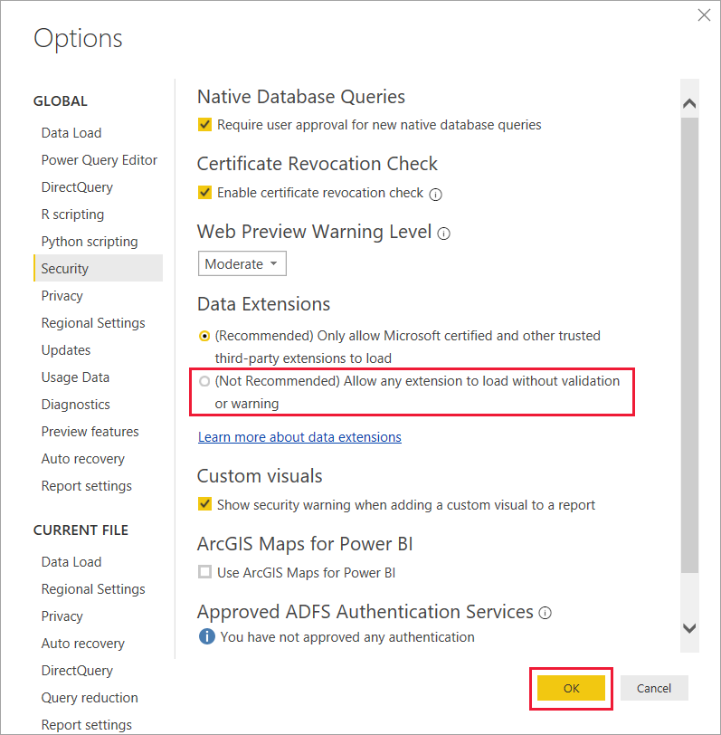
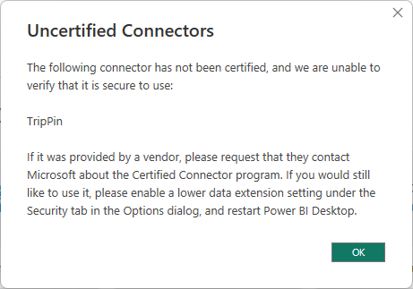

# Connector extensibility in Power BI

Custom connecters allow you to access and use data from hundreds of different sources in Power BI. Keep reading to learn about certified and uncertified connectors and how to use them in Power BI Desktop.

Power BI can connect to data by using existing connectors and generic data sources, like ODBC, OData, OLE DB, Web, CSV, XML, and JSON. Developers can also enable new data sources with custom data extensions called *custom connectors*. Microsoft certifies and distributes some custom connectors as *certified connectors*.

To use uncertified custom connectors that you or another party develop, you must adjust your Power BI Desktop security settings to allow extensions to load without validation or warning. These extensions can ignore privacy levels and handle credentials, including sending them over HTTP, so you should use this setting only if you completely trust your custom connectors.

Another option is for the developer to sign the connector with a certificate and provide the information you need to use the connector without changing your security settings. For more information, see [Trusted third-party connectors](desktop-trusted-third-party-connectors.md).

## Custom connectors

Uncertified custom connectors can range from small business-critical APIs to large industry-specific services that Microsoft hasn't released a connector for. Many connectors are distributed by vendors. If you need a connector for a specific industry or business, contact the vendor.

To use an uncertified custom connector:

1. Put the connector file with the extension *.pq*, *.pqx*, *.m*, or *.mez* in your local *\[Documents]\\Microsoft Power BI Desktop\\Custom Connectors* folder. If the folder doesn't exist, create it.

1. To adjust the data extension security settings, in Power BI Desktop, select **File** > **Options and settings** > **Options** > **Security**.

1. Under **Data Extensions**, select **(Not Recommended) Allow any extension to load without validation or warning**.

1. Select **OK**, and then restart Power BI Desktop. 

The default Power BI Desktop data extension security setting is **(Recommended) Only allow Microsoft certified and other trusted third-party extensions to load**. With this setting, if there are uncertified custom connectors on your system, the **Uncertified Connectors** dialog box appears at Power BI Desktop startup, listing the connectors that can't securely load.

To clear the error if you don't need to use the connectors in this session, select **OK**.

To prevent the error, either change your **Data Extensions** security setting, or remove the uncertified connectors from your *Custom Connectors* folder.

> [!IMPORTANT]
> You can use only one custom connector data source when you work in DirectQuery mode. Multiple custom connector data sources won't work with DirectQuery.

## Certified connectors

Microsoft *certifies* a limited subset of custom data extensions. While Microsoft distributes these connectors, Microsoft isn't responsible for their performance or continued functionality. The third-party developer who created the connector is responsible for its maintenance and support.

In Power BI Desktop, certified third-party connectors appear in the list in the **Get Data** dialog box, along with generic and common connectors. You don't need to adjust security settings to use the certified connectors.

## Related content

To get a custom connector certified, see [Power Query Connector Certification](/power-query/connectorcertification).
