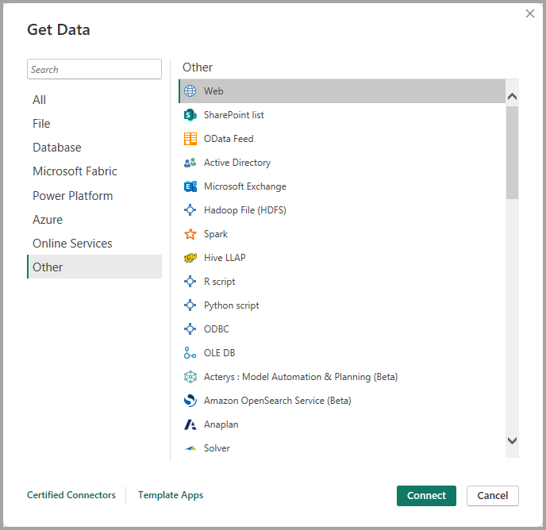
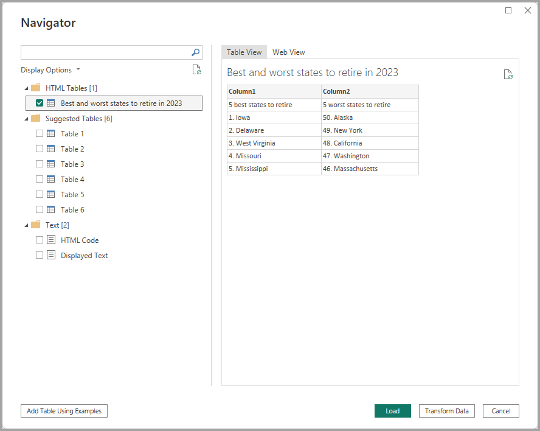
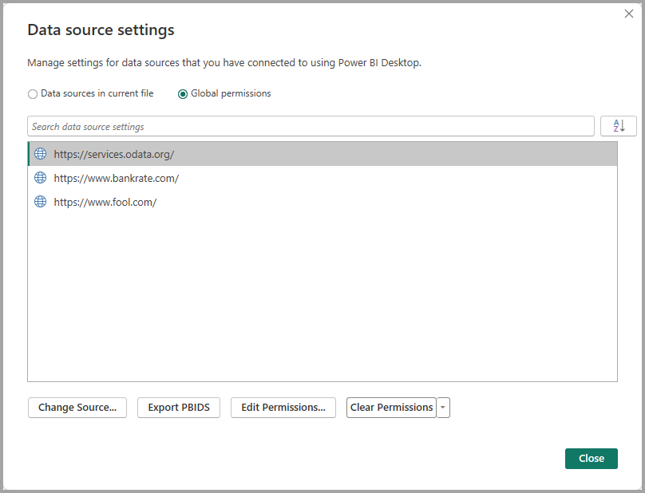

# Data sources in Power BI Desktop

With Power BI Desktop, you can connect to data from many different sources. For a full list of available data sources, see [Power BI data sources](power-bi-data-sources.md).

To see available data sources, in the **Home** group of the Power BI Desktop ribbon, select the **Get data** button label or down arrow to open the **Common data sources** list. If the data source you want isn't listed under **Common data sources**, select **More** to open the **Get Data** dialog box.


Or, open the **Get Data** dialog box directly by selecting the **Get data** icon itself.


This article provides an overview of the available data sources in Power BI Desktop and explains how to connect to them. It also describes how to export or use data sources as PBIDS files to make it easier to build new reports from the same data.

> [!NOTE]
> The Power BI team is continually expanding the data sources available to Power BI Desktop and the Power BI service. As such, you'll often see early versions of work-in-progress data sources marked as **Beta** or **Preview**. Any data source marked as **Beta** or **Preview** has limited support and functionality, and it shouldn't be used in production environments. Additionally, any data source marked as **Beta** or **Preview** for Power BI Desktop may not be available for use in the Power BI service or other Microsoft services until the data source becomes generally available (GA).

## Data sources

The **Get Data** dialog box organizes data types in the following categories:

* All
* File
* Database
* Microsoft Fabric
* Power Platform
* Azure
* Online Services
* Other

The **All** category includes all data connection types from all categories.

### File data sources

The **File** category provides the following data connections:

* Excel Workbook
* Text/CSV
* XML
* JSON
* Folder
* PDF
* Parquet
* SharePoint folder

### Database data sources

The **Database** category provides the following data connections:

* SQL Server database
* Access database
* SQL Server Analysis Services database
* Oracle database
* IBM Db2 database
* IBM Informix database (Beta)
* IBM Netezza
* MySQL database
* PostgreSQL database
* Sybase database
* Teradata database
* SAP HANA database
* SAP Business Warehouse Application Server
* SAP Business Warehouse Message Server
* Amazon Redshift
* Impala
* Google BigQuery
* Google BigQuery (Microsoft Entra ID)
* Vertica
* Snowflake
* Essbase
* AtScale Models
* Actian (Beta)
* Amazon Athena
* BI Connector
* Data Virtuality LDW
* Exact Online Premium (Beta)
* Jethro (Beta)
* Kyligence
* Linkar PICK Style / MultiValue Databases (Beta)
* MariaDB
* MarkLogic
* MongoDB Atlas SQL
* TIBCO® Data Virtualization
* AtScale cubes
* Denodo
* Dremio Software
* Dremio Cloud
* Exasol
* ClickHouse (beta)
* InterSystems Health Insight
* KX kdb Insights Enterprise (beta)
* Kyvos ODBC (beta)

> [!NOTE]
> Some database connectors require that you enable them by selecting **File** > **Options and settings** > **Options**, then selecting **Preview features** and enabling the connector. If you don't see some of the connectors mentioned previously and want to use them, check your **Preview features** settings. Also note that any data source marked as **Beta** or **Preview** has limited support and functionality, and shouldn't be used in production environments.

### Microsoft Fabric

The **Microsoft Fabric** category provides the following data connections:

* Power BI semantic models
* Dataflows
* Datamarts (preview)
* Warehouses
* Lakehouses
* KQL Databases
* Metric Sets

### Power Platform data sources

The **Power Platform** category provides the following data connections:

* Power BI dataflows (Legacy)
* Common Data Service (Legacy)
* Dataverse
* Dataflows

### Azure data sources

The **Azure** category provides the following data connections:

* Azure SQL Database
* Azure Synapse Analytics SQL
* Azure Analysis Services database
* Azure Database for PostgreSQL
* Azure Blob Storage
* Azure Table Storage
* Azure Cosmos DB v1
* Azure Data Explorer (Kusto)
* Azure Data Lake Storage Gen2
* Azure HDInsight (HDFS)
* Azure HDInsight Spark
* HDInsight Interactive Query
* Azure Cost Management
* Azure Resource Graph
* Azure HDInsight on AKS Trino (Beta)
* Azure Cosmos DB v2
* Azure Databricks
* Azure Synapse Analytics workspace (Beta)

### Online Services data sources

The **Online Services** category provides the following data connections:

* SharePoint Online List
* Microsoft Exchange Online
* Dynamics 365 Online (legacy)
* Dynamics 365 (Dataverse)
* Dynamics NAV
* Dynamics 365 Business Central
* Dynamics 365 Business Central (on-premises)
* Azure DevOps (Boards only)
* Azure DevOps Server (Boards only)
* Salesforce Objects
* Salesforce Reports
* Google Analytics
* Adobe Analytics
* appFigures (Beta)
* Data.World - Get Dataset (Beta)
* GitHub (Beta)
* LinkedIn Sales Navigator (Beta)
* Marketo (Beta)
* Mixpanel (Beta)
* Planview Portfolios
* QuickBooks Online (Beta)
* Smartsheet (Legacy)
* SparkPost (Beta)
* SweetIQ (Beta)
* Planview Enterprise Architecture
* Aptix Insights (Beta)
* Asana (Beta)
* Assemble Views
* Autodesk Construction Cloud
* Automy Data Analytics (Beta)
* CData Connect Cloud
* Dynamics 365 Customer Insights (Beta)
* Databricks
* Digital Construction Works Insights
* Emigo Data Source
* Entersoft Business Suite (Beta)
* eWay-CRM
* FactSet Analytics
* Palantir Foundry
* Hexagon PPM Smart® API
* Industrial App Store
* Planview OKR (beta)
* Planview ProjectPlace
* Quickbase
* SoftOne BI (Beta)
* Planview IdeaPlace
* TeamDesk (beta)
* Webtrends Analytics (Beta)
* Witivio (Beta)
* Zoho Creator
* Automation Anywhere
* CData Connect Cloud
* Dynamics 365 Customer Insights (beta)
* Databricks
* Funnel
* Intune Data Warehouse (Beta)
* LEAP (Beta)
* LinkedIn Learning
* Product Insights (Beta)
* Profisee
* Samsara (Beta)
* Supermetrics (beta)
* Viva Insights
* Zendesk (Beta)
* BuildingConnected & TradeTapp (beta)
* Smartsheet (Beta)

### Other data sources

The **Other** category provides the following data connections:

* Web
* SharePoint list
* OData Feed
* Active Directory
* Microsoft Exchange
* Hadoop File (HDFS)
* Spark
* Hive LLAP
* R script
* Python script
* ODBC
* OLE DB
* Acterys : Model Automation & Planning (Beta)
* Amazon OpenSearch Service (Beta)
* Anaplan
* Solver
* Bloomberg Data and Analytics
* Celonis EMS
* Cherwell (Beta)
* CloudBluePSA (Beta)
* Cognite Data Fusion
* EQuIS
* FactSet RMS (Beta)
* inwink (Beta)
* Kognitwin
* MicroStrategy for Power BI
* OneStream (Beta)
* OpenSearch Project (Beta)
* Paxata
* QubolePresto (Beta)
* Roamler (Beta)
* SIS-CC SDMX (Beta)
* Shortcuts Business Insights (Beta)
* Starburst Enterprise
* SumTotal
* SurveyMonkey
* Tenforce (Smart)List
* Usercube (Beta)
* Vena
* Vessel Insight
* Wrike (Beta)
* Zucchetti HR Infinity (Beta)
* BitSight Security Ratings
* BQE CORE
* Wolters Kluwer CCH Tagetik
* Delta Sharing
* Eduframe (Beta)
* FHIR
* Google Sheets
* InformationGrid
* Jamf Pro (Beta)
* SingleStore Direct Query Connector
* Siteimprove
* SolarWinds Service Desk
* Microsoft Teams Personal Analytics (Beta)
* Windsor (beta)
* Blank Query

> [!NOTE]
> At this time, it's not possible to connect to custom data sources secured using Microsoft Entra ID.

### Template apps

You can find template apps for your organization by selecting the **Template Apps** link near the bottom of the **Get data** window.


Available Template Apps may vary based on your organization.

## Connect to a data source

1. To connect to a data source, select the data source from the **Get data** window and select **Connect**. The following screenshot shows **Web** selected from the **Other** data connection category.

   

1. A connection window appears. Enter the URL or resource connection information, and then select **OK**. The following screenshot shows a URL entered in the **From Web** connection dialog box.

   

1. Depending on the data connection, you might be prompted to provide credentials or other information. After you provide all required information, Power BI Desktop connects to the data source and presents the available data sources in the **Navigator** dialog box.

   

1. Select the tables and other data that you want to load. To load the data, select the **Load** button at the bottom of the **Navigator** pane. To transform or edit the query in Power Query Editor before loading the data, select the **Transform Data** button.

Connecting to data sources in Power BI Desktop is that easy. Try connecting to data from our growing list of data sources, and check back often. We continue to add to this list all the time.

<a name="using-pbids-files-to-get-data"></a>
## Use PBIDS files to get data

PBIDS files are Power BI Desktop files that have a specific structure and a *.pbids* extension to identify them as Power BI data source files.

You can create a PBIDS file to streamline the **Get Data** experience for new or beginner report creators in your organization. If you create the PBIDS file from existing reports, it's easier for beginning report authors to build new reports from the same data.

When an author opens a PBIDS file, Power BI Desktop prompts the user for credentials to authenticate and connect to the data source that the file specifies. The **Navigator** dialog box appears, and the user must select the tables from that data source to load into the model. Users might also need to select the database and connection mode if none was specified in the PBIDS file.

From that point forward, the user can begin building visualizations or select **Recent Sources** to load a new set of tables into the model.

Currently, PBIDS files only support a single data source in one file. Specifying more than one data source results in an error.

### How to create a PBIDS connection file

If you have an existing Power BI Desktop PBIX file already connected to the data you’re interested in, you can export the connection files from within Power BI Desktop. This method is recommended, since the PBIDS file can be autogenerated from Desktop. You can also still edit or manually create the file in a text editor.

1. To create the PBIDS file, select **File** > **Options and settings** > **Data source settings**.

   

1. In the dialog that appears, select the data source you want to export as a PBIDS file, and then select **Export PBIDS**.

   

1. In the **Save As** dialog box, give the file a name, and select **Save**. Power BI Desktop generates the PBIDS file, which you can rename and save in your directory, and share with others.

You can also open the file in a text editor, and modify the file further, including specifying the mode of connection in the file itself. The following image shows a PBIDS file open in a text editor.


If you prefer to manually create your PBIDS files in a text editor, you must specify the required inputs for a single connection and save the file with the *.pbids* extension. Optionally, you can also specify the connection `mode` as either `DirectQuery` or `Import`. If `mode` is missing or `null` in the file, the user who opens the file in Power BI Desktop is prompted to select **DirectQuery** or **Import**.

> [!IMPORTANT]
> Some data sources will generate an error if columns are encrypted in the data source. For example, if two or more columns in an Azure SQL Database are encrypted during an Import action, an error will be returned. For more information, see [SQL Database](/power-query/connectors/azuresqldatabase).

### PBIDS file examples

This section provides some examples from commonly used data sources. The PBIDS file type only supports data connections that are also supported in Power BI Desktop, with the following exceptions: Wiki URLs, Live Connect, and Blank Query.

The PBIDS file doesn't include authentication information and table and schema information.  

The following code snippets show several common examples for PBIDS files, but they aren't complete or comprehensive. For other data sources, you can refer to the [git Data Source Reference (DSR) format for protocol and address information](/azure/data-catalog/data-catalog-dsr#data-source-reference-specification).

If you're editing or manually creating the connection files, these examples are for convenience only, aren't meant to be comprehensive, and don't include all supported connectors in DSR format.

#### Azure AS

```json
{ 
    "version": "0.1", 
    "connections": [ 
    { 
        "details": { 
        "protocol": "analysis-services", 
        "address": { 
            "server": "server-here" 
        }, 
        } 
    } 
    ] 
}
```

#### Folder

```json
{ 
  "version": "0.1", 
  "connections": [ 
    { 
      "details": { 
        "protocol": "folder", 
        "address": { 
            "path": "folder-path-here" 
        } 
      } 
    } 
  ] 
} 
```

#### OData

```json
{ 
  "version": "0.1", 
  "connections": [ 
    { 
      "details": { 
        "protocol": "odata", 
        "address": { 
            "url": "URL-here" 
        } 
      } 
    } 
  ] 
} 
```

#### SAP BW

```json
{ 
  "version": "0.1", 
  "connections": [ 
    { 
      "details": { 
        "protocol": "sap-bw-olap", 
        "address": { 
          "server": "server-name-here", 
          "systemNumber": "system-number-here", 
          "clientId": "client-id-here" 
        }, 
      } 
    } 
  ] 
} 
```

#### SAP HANA

```json
{ 
  "version": "0.1", 
  "connections": [ 
    { 
      "details": { 
        "protocol": "sap-hana-sql", 
        "address": { 
          "server": "server-name-here:port-here" 
        }, 
      } 
    } 
  ] 
} 
```

#### SharePoint list

The URL must point to the SharePoint site itself, not to a list within the site. Users get a navigator that allows them to select one or more lists from that site, each of which becomes a table in the model.

```json
{ 
  "version": "0.1", 
  "connections": [ 
    { 
      "details": { 
        "protocol": "sharepoint-list", 
        "address": { 
          "url": "URL-here" 
        }, 
       } 
    } 
  ] 
} 
```

#### SQL Server

```json
{ 
  "version": "0.1", 
  "connections": [ 
    { 
      "details": { 
        "protocol": "tds", 
        "address": { 
          "server": "server-name-here", 
          "database": "db-name-here (optional) "
        } 
      }, 
      "options": {}, 
      "mode": "DirectQuery" 
    } 
  ] 
} 
```

#### Text file

```json
{ 
  "version": "0.1", 
  "connections": [ 
    { 
      "details": { 
        "protocol": "file", 
        "address": { 
            "path": "path-here" 
        } 
      } 
    } 
  ] 
} 
```

#### Web

```json
{ 
  "version": "0.1", 
  "connections": [ 
    { 
      "details": { 
        "protocol": "http", 
        "address": { 
            "url": "URL-here" 
        } 
      } 
    } 
  ] 
} 
```

#### Dataflow

```json
{
  "version": "0.1",
  "connections": [
    {
      "details": {
        "protocol": "powerbi-dataflows",
        "address": {
          "workspace":"workspace id (Guid)",
          "dataflow":"optional dataflow id (Guid)",
          "entity":"optional entity name"
        }
       }
    }
  ]
}
```

## Related content

You can do all sorts of things with Power BI Desktop. For more information on its capabilities, check out the following resources:

* [What is Power BI Desktop?](../fundamentals/desktop-what-is-desktop.md)
* [Query overview in Power BI Desktop](../transform-model/desktop-query-overview.md)
* [Data types in Power BI Desktop](desktop-data-types.md)
* [Tutorial: Shape and combine data in Power BI Desktop](desktop-shape-and-combine-data.md)
* [Perform common query tasks in Power BI Desktop](../transform-model/desktop-common-query-tasks.md)
