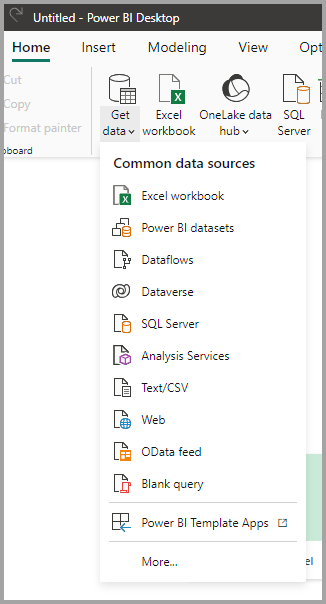
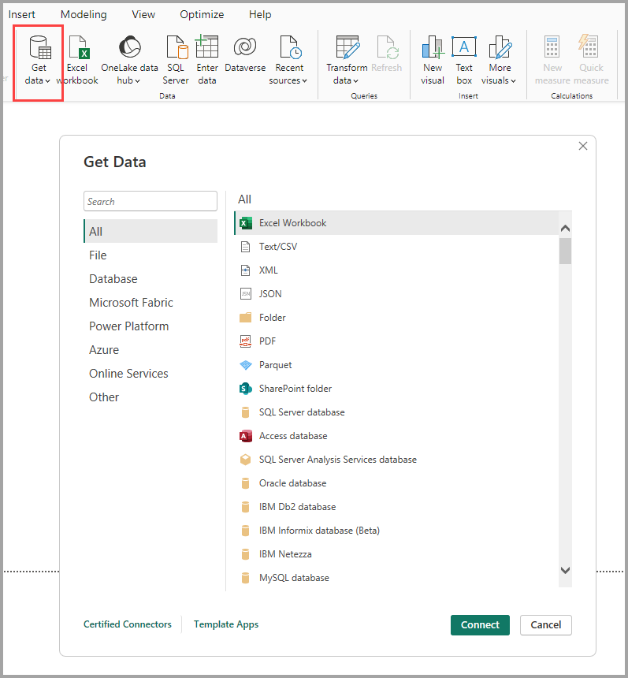
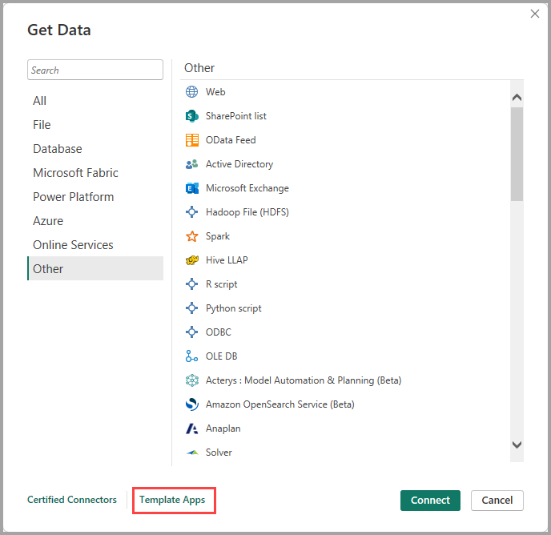
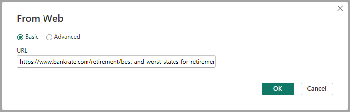

# Data sources in Power BI Desktop

With Power BI Desktop, you can connect to data from many different sources. For a full list of available data sources, see [Power BI data sources](power-bi-data-sources.md).

You connect to data by using the **Home** ribbon. To show the **Most Common** data types menu, select the **Get data** button label or the down arrow.



To go to the **Get Data** dialog box, show the **Most Common** data types menu and select **More**. You can also bring up the **Get Data** dialog box (and bypass the **Most Common** menu) by selecting the **Get Data** icon directly.



> [!NOTE]
> The Power BI team is continually expanding the data sources available to Power BI Desktop and the Power BI service. As such, you'll often see early versions of work-in-progress data sources marked as **Beta** or **Preview**. Any data source marked as **Beta** or **Preview** has limited support and functionality, and it shouldn't be used in production environments. Additionally, any data source marked as **Beta** or **Preview** for Power BI Desktop may not be available for use in the Power BI service or other Microsoft services until the data source becomes generally available (GA).

> [!NOTE]
> There are many data connectors for Power BI Desktop that require Internet Explorer 10 (or newer) for authentication. 


## Data sources

The **Get Data** dialog box organizes data types in the following categories:

* All
* File
* Database
* Power Platform
* Azure
* Online Services
* Other

The **All** category includes all data connection types from all categories.

### File data sources

The **File** category provides the following data connections:

* Excel
* Text/CSV
* XML
* JSON
* Folder
* PDF
* Parquet
* SharePoint folder

The following image shows the **Get Data** window for **File**.


### Database data sources

The **Database** category provides the following data connections:

* SQL Server database
* Access database
* SQL Server Analysis Services database
* Oracle database
* IBM Db2 database
* IBM Informix database (Beta)
* IBM Netezza
* MySQL database
* PostgreSQL database
* Sybase database
* Teradata database
* SAP HANA database
* SAP Business Warehouse Application Server
* SAP Business Warehouse Message Server
* Amazon Redshift
* Impala
* Google BigQuery
* Vertica
* Snowflake
* Essbase
* Actian (Beta)
* AtScale cubes
* BI Connector
* Data Virtuality LDW
* Denodo
* Dremio
* Exasol
* Indexima
* InterSystems IRIS (Beta)
* Jethro (Beta)
* Kyligence
* Linkar PICK Style / MultiValue Databases (Beta)
* MariaDB (Beta)
* MarkLogic


> [!NOTE]
> Some database connectors require that you enable them by selecting **File > Options and settings > Options** then selecting **Preview Features** and enabling the connector. If you don't see some of the connectors mentioned above and want to use them, check your **Preview Features** settings. Also note that any data source marked as *Beta* or *Preview* has limited support and functionality, and should not be used in production environments.

The following image shows the **Get Data** window for **Database**.


### Power Platform data sources

The **Power Platform** category provides the following data connections:

* Power BI datasets
* Power BI dataflows
* Common Data Service (Legacy)
* Dataverse
* Power Platform dataflows (Beta)


The following image shows the **Get Data** window for **Power Platform**.


### Azure data sources

The **Azure** category provides the following data connections:

* Azure SQL Database
* Azure Synapse Analytics (SQL DW)
* Azure Analysis Services database
* Azure Database for PostgreSQL
* Azure Blob Storage
* Azure Table Storage
* Azure Cosmos DB
* Azure Data Explorer (Kusto)
* Azure Data Lake Storage Gen2
* Azure Data Lake Storage Gen1
* Azure HDInsight (HDFS)
* Azure HDInsight Spark
* HDInsight Interactive Query
* Azure Cost Management
* Azure Databricks
* Azure Time Series Insights (Beta)


The following image shows the **Get Data** window for **Azure**.


### Online Services data sources

The **Online Services** category provides the following data connections:

* SharePoint Online List
* Microsoft Exchange Online
* Dynamics 365 (online)
* Dynamics NAV
* Dynamics 365 Business Central
* Dynamics 365 Business Central (on-premises)
* Microsoft Azure Consumption Insights (Beta)
* Azure DevOps (Boards only)
* Azure DevOps Server (Boards only)
* Salesforce Objects
* Salesforce Reports
* Google Analytics
* Adobe Analytics
* appFigures (Beta)
* Data.World - Get Dataset (Beta)
* GitHub (Beta)
* LinkedIn Sales Navigator (Beta)
* Marketo (Beta)
* Mixpanel (Beta)
* Planview Enterprise One - PRM (Beta)
* QuickBooks Online (Beta)
* Smartsheet
* SparkPost (Beta)
* SweetIQ (Beta)
* Planview Enterprise One - CTM (Beta)
* Twilio (Beta)
* Zendesk (Beta)
* Asana (Beta)
* Automation Anywhere
* Emigo Data Source
* Entersoft Business Suite (Beta)
* eWay-CRM (Beta)
* FactSet Analytics
* Palantir Foundry
* Hexagon PPM Smart API
* Industrial App Store
* Intune Data Warehouse (Beta)
* Projectplace for Power BI
* Product Insights (beta)
* Quick Base
* SoftOne BI (beta)
* Spigit (Beta)
* TeamDesk (Beta)
* Webtrends Analytics (Beta)
* Witivio (Beta)
* Workplace Analytics (Beta)
* Zoho Creator (Beta)


The following image shows the **Get Data** window for **Online Services**.


### Other data sources

The **Other** category provides the following data connections:

* Web
* SharePoint list
* OData Feed
* Active Directory
* Microsoft Exchange
* Hadoop File (HDFS)
* Spark
* Hive LLAP
* R script
* Python script
* ODBC
* OLE DB
* Acterys : Model Automation & Planning (Beta)
* Anaplan Connector v1.0 (Beta)
* Solver
* Bloomberg Data and Analytics (Beta)
* Cherwell (Beta)
* Cognite Data Fusion
* EQuIS (Beta)
* FHIR
* Information Grid (Beta)
* Jamf Pro (Beta)
* Kognitwin
* Paxata
* QubolePresto (Beta)
* Roamler (Beta)
* Shortcuts Business Insights (Beta)
* Siteimprove
* Starburst Enterprise Presto (Beta)
* SurveyMonkey (Beta)
* Tenforce (Smart)List
* TIBCO(R) Data Virtualization (Beta)
* Vena (Beta)
* Vessel Insight (Beta)
* Zucchetti HR Infinity (Beta)
* Blank Query


The following image shows the **Get Data** window for **Other**.


> [!NOTE]
> At this time, it's not possible to connect to custom data sources secured using Azure Active Directory.

### Template apps

You can find template apps for your organization by selecting the **Template Apps** link near the bottom of the **Get Data** window. 



Available Template Apps may vary based on your organization.

## Connecting to a data source

To connect to a data source, select the data source from the **Get Data** window and select **Connect**. In the following image, **Web** is selected from the **Other** data connection category.


A connection window is displayed, specific to the type of data connection. If credentials are required, you’ll be prompted to provide them. The following image shows a URL being entered to connect to a Web data source.



Enter the URL or resource connection information, and then select **OK**. Power BI Desktop makes the connection to the data source, and it presents the available data sources in the **Navigator**.


To load the data, select the **Load** button at the bottom of the **Navigator** pane. To transform or edit the query in Power Query Editor before loading the data, select the **Transform Data** button.

That’s all there is to connecting to data sources in Power BI Desktop! Try connecting to data from our growing list of data sources, and check back often - we continue to add to this list all the time.

## Using PBIDS files to get data

PBIDS files are Power BI Desktop files that have a specific structure, and they have a .PBIDS extension to identify it is a Power BI data source file.

You can create a PBIDS file to streamline the **Get Data** experience for new or beginner report creators in your organization. If you create the PBIDS file from existing reports, it's easier for beginning report authors to build new reports from the same data.

When an author opens a PBIDS file, Power BI Desktop opens and prompts the user for credentials to authenticate and connect to the data source that's specified in the file. The **Navigation** dialog box appears, and the user must select the tables from that data source to load into the model. Users may also need to select the database(s) and connection mode if none was specified in the PBIDS file.

From that point forward, the user can begin building visualizations or select **Recent Sources** to load a new set of tables into the model.

Currently, PBIDS files only support a single data source in one file. Specifying more than one data source results in an error.


### How to create a PBIDS connection file

If you have an existing Power BI Desktop (.PBIX) file that's already connected to the data you’re interested in, you can simply export these connection files from within Power BI Desktop. This is the recommended method, since the PBIDS file can be auto-generated from Desktop. In addition, you can still edit or manually create the file in a text editor. 

To create the PBIDS file, select **File > Options and settings > Data source settings**:


In the dialog that appears, select the data source you want to export as a PBIDS, and then select **Export PBIDS**.


When you select the **Export PBIDS** button, Power BI Desktop generates the PBIDS file, which you can rename and save in your directory, and share with others. You can also open the file in a text editor, and modify the file further, including specifying the mode of connection in the file itself, as shown in the following image. 


If you prefer to manually create your PBIDS files in a text editor, you must specify the required inputs for a single connection and save the file with the PBIDS extension. Optionally, you can also specify the connection mode as either DirectQuery or Import. If **mode** is missing/null in the file, the user who opens the file in Power BI Desktop is prompted to select **DirectQuery** or **Import**.

> [!IMPORTANT]
> Some data sources will generate an error if columns are encrypted in the data source. For example, if two or more columns in an Azure SQL Database are encrypted during an Import action, an error will be returned. For more information, see [SQL Database](/power-query/connectors/azuresqldatabase).


### PBIDS file examples

This section provides some examples from commonly used data sources. The PBIDS file type only supports data connections that are also supported in Power BI Desktop, with the following exceptions: Wiki URLS, Live Connect and Blank Query.

The PBIDS file *doesn't* include authentication information and table and schema information.  

The following code snippets show several common examples for PBIDS files, but they aren't complete or comprehensive. For other data sources, you can refer to the [Data Source Reference (DSR) format for protocol and address information](/azure/data-catalog/data-catalog-dsr#data-source-reference-specification).

If you're editing or manually creating the connection files, these examples are for convenience only, aren't meant to be comprehensive, and don't include all supported connectors in DSR format.

#### Azure AS

```json
{ 
    "version": "0.1", 
    "connections": [ 
    { 
        "details": { 
        "protocol": "analysis-services", 
        "address": { 
            "server": "server-here" 
        }, 
        } 
    } 
    ] 
}
```

#### Folder

```json
{ 
  "version": "0.1", 
  "connections": [ 
    { 
      "details": { 
        "protocol": "folder", 
        "address": { 
            "path": "folder-path-here" 
        } 
      } 
    } 
  ] 
} 
```

#### OData

```json
{ 
  "version": "0.1", 
  "connections": [ 
    { 
      "details": { 
        "protocol": "odata", 
        "address": { 
            "url": "URL-here" 
        } 
      } 
    } 
  ] 
} 
```

#### SAP BW

```json
{ 
  "version": "0.1", 
  "connections": [ 
    { 
      "details": { 
        "protocol": "sap-bw-olap", 
        "address": { 
          "server": "server-name-here", 
          "systemNumber": "system-number-here", 
          "clientId": "client-id-here" 
        }, 
      } 
    } 
  ] 
} 
```

#### SAP Hana

```json
{ 
  "version": "0.1", 
  "connections": [ 
    { 
      "details": { 
        "protocol": "sap-hana-sql", 
        "address": { 
          "server": "server-name-here:port-here" 
        }, 
      } 
    } 
  ] 
} 
```

#### SharePoint list

The URL must point to the SharePoint site itself, not to a list within the site. Users get a navigator that allows them to select one or more lists from that site, each of which becomes a table in the model.

```json
{ 
  "version": "0.1", 
  "connections": [ 
    { 
      "details": { 
        "protocol": "sharepoint-list", 
        "address": { 
          "url": "URL-here" 
        }, 
       } 
    } 
  ] 
} 
```

#### SQL Server

```json
{ 
  "version": "0.1", 
  "connections": [ 
    { 
      "details": { 
        "protocol": "tds", 
        "address": { 
          "server": "server-name-here", 
          "database": "db-name-here (optional) "
        } 
      }, 
      "options": {}, 
      "mode": "DirectQuery" 
    } 
  ] 
} 
```

#### Text file

```json
{ 
  "version": "0.1", 
  "connections": [ 
    { 
      "details": { 
        "protocol": "file", 
        "address": { 
            "path": "path-here" 
        } 
      } 
    } 
  ] 
} 
```

#### Web

```json
{ 
  "version": "0.1", 
  "connections": [ 
    { 
      "details": { 
        "protocol": "http", 
        "address": { 
            "url": "URL-here" 
        } 
      } 
    } 
  ] 
} 
```

#### Dataflow

```json
{
  "version": "0.1",
  "connections": [
    {
      "details": {
        "protocol": "powerbi-dataflows",
        "address": {
          "workspace":"workspace id (Guid)",
          "dataflow":"optional dataflow id (Guid)",
          "entity":"optional entity name"
        }
       }
    }
  ]
}
```

## Next steps

You can do all sorts of things with Power BI Desktop. For more information on its capabilities, check out the following resources:

* [What is Power BI Desktop?](../fundamentals/desktop-what-is-desktop.md)
* [Query overview with Power BI Desktop](../transform-model/desktop-query-overview.md)
* [Data types in Power BI Desktop](desktop-data-types.md)
* [Shape and combine data with Power BI Desktop](desktop-shape-and-combine-data.md)
* [Common query tasks in Power BI Desktop](../transform-model/desktop-common-query-tasks.md)
