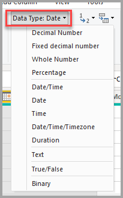
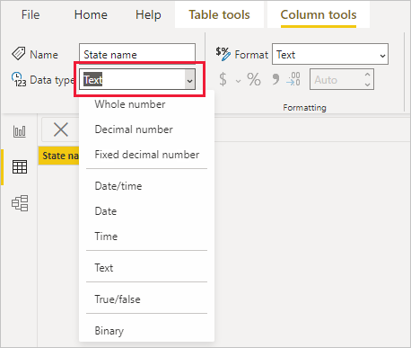

# Data types in Power BI Desktop

This article describes data types that Power BI Desktop and Data Analysis Expressions (DAX) support.

When Power BI loads data, it tries to convert the data types of source columns into data types that support more efficient storage, calculations, and data visualization. For example, if a column of values you import from Excel has no fractional values, Power BI Desktop converts the data column to a **Whole number** data type, which is better suited for storing integers.

This concept is important because some DAX functions have special data type requirements. In many cases DAX [implicitly converts data types](#implicit-and-explicit-data-type-conversion), but in some cases it doesn't. For instance, if a DAX function requires a **Date** data type, but the data type for your column is **Text**, the DAX function won't work correctly. So it's important and useful to use the correct data types for columns.

## Determine and specify a column's data type

In Power BI Desktop, you can determine and specify a column's data type in the Power Query Editor, in Table view, or in Report view:

- In Power Query Editor, select the column and then select **Data Type** in the **Transform** group of the ribbon.

  

- In Table view or Report view, select the column, and then select the dropdown arrow next to **Data type** on the **Column tools** tab of the ribbon.

  

The Data type dropdown selection in Power Query Editor has two data types not present in Table view or Report view: **Date/Time/Timezone** and **Duration**. When you load a column with these data types into the Power BI model, a **Date/Time/Timezone** column converts into a **Date/time** data type, and a **Duration** column converts into a **Decimal number** data type.

The **Binary** data type isn't supported outside of the Power Query Editor. In the Power Query Editor, you can use the **Binary** data type when you load binary files if you convert it to other data types before loading it into the Power BI model. The **Binary** selection exists in the Table view and Report view menus for legacy reasons, but if you try to load **Binary** columns into the Power BI model, you might run into errors.

## Number types

Power BI Desktop supports three number types: **Decimal number**, **Fixed decimal number**, and **Whole number**.

You can use the Tabular Object Model (TOM) Column <xref:Microsoft.AnalysisServices.Tabular.Column.DataType> property to specify the <xref:Microsoft.AnalysisServices.Tabular.DataType> Enums for number types. For more information about programmatically modifying objects in Power BI, see [Program Power BI semantic models with the Tabular Object Model](/analysis-services/tom/tom-pbi-datasets?view=power-bi-premium-current&preserve-view=true).

### Decimal number

**Decimal number** is the most common number type, and can handle numbers with fractional values and whole numbers. **Decimal number** represents 64-bit (eight-byte) floating point numbers with negative values from *-1.79E +308* through *-2.23E -308*, positive values from *2.23E -308* through *1.79E +308*, and *0*. Numbers like *34*, *34.01*, and *34.000367063* are valid decimal numbers.

The highest precision that the **Decimal number** type can represent is 15 digits. The decimal separator can occur anywhere in the number. This type corresponds to how Excel stores its numbers, and TOM specifies this type as `DataType.Double` Enum.

### Fixed decimal number

The **Fixed decimal number** data type has a fixed location for the decimal separator. The decimal separator always has four digits to its right, and allows for 19 digits of significance. The largest value the **Fixed decimal number** can represent is positive or negative *922,337,203,685,477.5807*.

The **Fixed decimal number** type is useful in cases where rounding might introduce errors. Numbers that have small fractional values can sometimes accumulate and force a number to be slightly inaccurate. The **Fixed decimal number** type can help you avoid these kinds of errors by truncating the values past the four digits to the right of decimal separator.

This data type corresponds to SQL Server’s **Decimal (19,4)**, or the **Currency** data type in Analysis Services and Power Pivot in Excel. TOM specifies this type as `DataType.Decimal` Enum.

### Whole number

**Whole number** represents a 64-bit (eight-byte) integer value. Because it's an integer, **Whole number** has no digits to the right of the decimal place. This type allows for 19 digits of positive or negative whole numbers between *-9,223,372,036,854,775,807* (*-2^63+1*) and *9,223,372,036,854,775,806* (*2^63-2*), so can represent the largest possible numbers of the numeric data types.

As with the **Fixed decimal** type, the **Whole number** type can be useful when you need to control rounding. TOM represents the **Whole number** data type as `DataType.Int64` Enum.

> [!NOTE]
> The Power BI Desktop data model supports 64-bit integer values, but due to JavaScript limitations, the largest number Power BI visuals can safely express is *9,007,199,254,740,991* (*2^53-1*). If your data model has larger numbers, you can reduce their size through calculations before you add them to visuals.

### Accuracy of number type calculations

Column values of **Decimal number** data type are stored as *approximate* data types, according to the IEEE 754 Standard for floating point numbers. Approximate data types have inherent precision limitations, because instead of storing exact number values, they might store extremely close, or rounded, approximations.

Precision loss, or *imprecision*, can occur if the floating-point value can't reliably quantify the number of floating point digits. Imprecision can potentially appear as unexpected or inaccurate calculation results in some reporting scenarios.

Equality-related comparison calculations between values of **Decimal number** data type can potentially return unexpected results. Equality comparisons include equals `=`, greater than `>`, less than `<`, greater than or equal to `>=`, and less than or equal to `<=`.

This issue is most apparent when you use the [RANKX function](/dax/rankx-function-dax) in a DAX expression, which calculates the result twice, resulting in slightly different numbers. Report users might not notice the difference between the two numbers, but the rank result can be noticeably inaccurate. To avoid unexpected results, you can change the column data type from **Decimal number** to either **Fixed decimal number** or **Whole number**, or do a forced rounding by using [ROUND](/dax/round-function-dax). The **Fixed decimal number** data type has greater precision, because the decimal separator always has four digits to its right.

Rarely, calculations that sum the values of a column of **Decimal number** data type can return unexpected results. This result is most likely with columns that have large amounts of both positive numbers and negative numbers. The sum result is affected by the distribution of values across rows in the column.

If a required calculation sums most of the positive numbers before summing most of the negative numbers, the large positive partial sum at the beginning can potentially skew the results. If the calculation happens to add balanced positive and negative numbers, the query retains more precision, and therefore returns more accurate results. To avoid unexpected results, you can change the column data type from **Decimal number** to **Fixed decimal number** or **Whole number**.

## Date/time types

Power BI Desktop supports five **Date/Time** data types in Power Query Editor. Both **Date/Time/Timezone** and **Duration** convert during load into the Power BI Desktop data model. The model supports **Date/Time**, or you can format the values as **Date** or **Time** independently.

- **Date/Time**  represents both a date and time value. The underlying **Date/Time** value is stored as a **Decimal number** type, so you can convert between the two types. The time portion stores as a fraction to whole multiples of 1/300 seconds (3.33 ms). The data type supports dates between years 1900 and 9999.

- **Date** represents just a date with no time portion.  A **Date** converts into the model as a **Date/Time** value with zero for the fractional value.

- **Time** represents just a time with no date portion. A **Time** converts into the model as a **Date/Time** value with no digits to the left of the decimal point.

- **Date/Time/Timezone** represents a UTC date/time with a timezone offset, and converts into **Date/Time** when loaded into the model. The Power BI model doesn't adjust the timezone based on a user's location or locale. A value of 09:00 loaded into the model in the USA displays as 09:00 wherever the report is opened or viewed.

- **Duration** represents a length of time, and converts into a **Decimal number** type when loaded into the model. As **Decimal number** type, you can add or subtract the values from **Date/Time** values with correct results, and easily use the values in visualizations that show magnitude.

## Text type

The **Text** data type is a Unicode character data string, which can be letters, numbers, or dates represented in a text format. The practical maximum limit for string length is approximately 32,000 Unicode characters, based on Power BI's underlying Power Query engine, and its limits on **text** data type lengths. Text data types beyond the practical maximum limit are likely to result in errors.

The way Power BI stores text data can cause the data to display differently in certain situations. The next sections describe common situations that can cause **Text** data to change appearance slightly between querying data in Power Query Editor and loading it into Power BI.

### Case sensitivity

The engine that stores and queries data in Power BI is *case insensitive*, and treats different capitalization of letters as the same value. "A" is equal to "a". However, Power Query is *case sensitive*, where "A" isn't the same as "a". The difference in case sensitivity can lead to situations where text data changes capitalization seemingly inexplicably after loading into Power BI.

The following example shows order data: An **OrderNo** column that's unique for each order, and an **Addressee** column that shows the addressee name entered manually at order time. Power Query Editor shows several orders with the same **Addressee** names entered into the system with varying capitalizations.

:::image type="content" source="media/desktop-data-types/desktop-data-types-text-01.png" alt-text="Screenshot of textual data with various capitalizations in Power Query":::

After Power BI loads the data, capitalization of the duplicate names in the **Data** tab changes from the original entry into one of the capitalization variants.

:::image type="content" source="media/desktop-data-types/desktop-data-types-text-02.png" alt-text="Screenshot that shows the textual data with changed capitalization after loading into Power BI.":::

This change happens because Power Query Editor is case sensitive, so it shows the data exactly as stored in the source system. The engine that stores data in Power BI is case insensitive, so it treats the lowercase and uppercase versions of a character as identical. Power Query data loaded into the Power BI engine can change accordingly.

The Power BI engine evaluates each row individually when it loads data, starting from the top. For each text column, such as **Addressee**, the engine stores a dictionary of unique values, to improve performance through data compression. The engine sees the first three values in the **Addressee** column as unique and stores them in the dictionary. After that, because the engine is case insensitive, it evaluates the names as identical.

The engine sees the name "Taina Hasu" as identical to "TAINA HASU" and "Taina HASU", so it doesn't store those variations, but refers to the first variation it stored. The name "MURALI DAS" appears in uppercase letters, because that's how the name appeared the first time the engine evaluated it when loading the data from top to bottom.

This image illustrates the evaluation process:

:::image type="content" source="media/desktop-data-types/desktop-data-types-text-03.png" alt-text="Diagram that shows the data load process and mapping text values to a dictionary of unique values." border="false":::

In the preceding example, the Power BI engine loads the first row of data, creates the **Addressee** dictionary, and adds *Taina Hasu* to it. The engine also adds a reference to that value in the **Addressee** column on the table it loads. The engine does the same for the second and third rows, because these names aren't equivalent to the others when ignoring case.

For the fourth row, the engine compares the value against the names in the dictionary and finds the name. Since the engine is case insensitive, "TAINA HASU" and "Taina Hasu" are the same. The engine doesn't add a new name to the dictionary, but refers to the existing name. The same process happens for the remaining rows.

> [!NOTE]
> Because the engine that stores and queries data in Power BI is case insensitive, take special care when you work in DirectQuery mode with a case-sensitive source. Power BI assumes that the source has eliminated duplicate rows. Because Power BI is case insensitive, it treats two values that differ only by case as duplicate, whereas the source might not treat them as such. In such cases, the final result is undefined.
>
> To avoid this situation, if you use DirectQuery mode with a case-sensitive data source, normalize casing in the source query or in Power Query Editor.

### Leading and trailing spaces

The Power BI engine automatically trims any trailing spaces that follow text data, but doesn't remove leading spaces that precede the data. To avoid confusion, when you work with data that contains leading or trailing spaces, you should use the [Text.Trim](/powerquery-m/text-trim) function to remove spaces at the beginning or end of the text. If you don't remove leading spaces, a relationship might fail to create because of duplicate values, or visuals might return unexpected results.

The following example shows data about customers: a **Name** column that contains the name of the customer and an **Index** column that's unique for each entry. The names appear within quotes for clarity. The customer name repeats four times, but each time with different combinations of leading and trailing spaces. These variations can occur with manual data entry over time.

|Row|Leading space|Trailing space|Name|Index|Text length|
|---|---|---|---|---|---|
|1|No|No|"Dylan Williams"|1|14|
|2|No|Yes|"Dylan Williams "|10|15|
|3|Yes|No|" Dylan Williams"|20|15|
|4|Yes|Yes|" Dylan Williams "|40|16|

In Power Query Editor, the resulting data appears as follows.

:::image type="content" source="media/desktop-data-types/desktop-data-types-text-04.png" alt-text="Screenshot of textual data with various leading and trailing spaces in Power Query Editor.":::

When you go to the **Table** tab in Power BI after you load the data, the same table looks like the following image, with the same number of rows as before.

:::image type="content" source="media/desktop-data-types/desktop-data-types-text-05.png" alt-text="Screenshot of the same textual data after loading into Power BI returns the same number of rows as before.":::

However, a visual based on this data returns just two rows.

:::image type="content" source="media/desktop-data-types/desktop-data-types-text-06.png" alt-text="Screenshot of a table visual based on the same data returning just two lines of data.":::

In the preceding image, the first row has a total value of *60* for the **Index** field, so the first row in the visual represents the last two rows of the loaded data. The second row with total **Index** value of *11* represents the first two rows. The difference in the number of rows between the visual and the data table is caused by the engine automatically removing or trimming trailing spaces, but not leading spaces. So the engine evaluates the first and second rows, and the third and fourth rows, as identical, and the visual returns these results.

This behavior can also cause error messages related to relationships, because duplicate values are detected. For example, depending on the configuration of your relationships, you might see an error similar to the following image:

:::image type="content" source="media/desktop-data-types/desktop-data-types-text-08.png" alt-text="Screenshot of an error message about duplicate values.":::

In other situations, you might be unable to create a many-to-one or one-to-one relationship because duplicate values are detected.

:::image type="content" source="media/desktop-data-types/desktop-data-types-text-07.png" alt-text="Screenshot of the relationship dialog showing an 'invalid cardinality for this relationship' error related to duplicate values being detected.":::

You can trace these errors back to leading or trailing spaces, and resolve them by using [Text.Trim](/powerquery-m/text-trim), or **Format** > **Trim** under **Transform**, to remove the spaces in Power Query Editor.

## True/false type

The **True/false** data type is a Boolean value of either *True* or *False*. For the best and most consistent results, when you load a column that contains Boolean true/false information into Power BI, set the column type to **True/False**.

Power BI converts and displays data differently in certain situations. This section describes common cases of converting Boolean values, and how to address conversions that create unexpected results in Power BI.

In this example, you load data about whether your customers have signed up for your newsletter. A value of *TRUE* indicates the customer has signed up for the newsletter, and a value of *FALSE* indicates the customer hasn't signed up.

However, when you publish the report to the Power BI service, the newsletter signup status column shows *0* and *-1* instead of the expected values of *TRUE* or *FALSE*. The following steps describe how this conversion occurs, and how to prevent it.

The simplified query for this table appears in the following image:

:::image type="content" source="media/desktop-data-types/desktop-data-types-boolean-01.png" alt-text="Screenshot that shows columns set to Boolean.":::

The data type of the **Subscribed To Newsletter** column is set to **Any**, and as a result, Power BI loads the data into the model as **Text**.

:::image type="content" source="media/desktop-data-types/desktop-data-types-boolean-02.png" alt-text="Screenshot showing the data loaded into Power BI.":::

When you add a simple visualization that shows the detailed information per customer, the data appears in the visual as expected, both in Power BI Desktop and when published to the Power BI service.

:::image type="content" source="media/desktop-data-types/desktop-data-types-boolean-03.png" alt-text="Screenshot of a visual that shows the data appearing as expected.":::

However, when you refresh the semantic model in the Power BI service, the **Subscribed To Newsletter** column in the visuals displays values as *-1* and *0*, instead of displaying them as *TRUE* or *FALSE*:

:::image type="content" source="media/desktop-data-types/desktop-data-types-boolean-04.png" alt-text="Screenshot of a visual that shows data appearing in an unexpected format after refresh.":::

If you republish the report from Power BI Desktop, the **Subscribed To Newsletter** column again shows *TRUE* or *FALSE* as you expect, but once a refresh occurs in the Power BI service, the values again change to show *-1* and *0*.

The solution to prevent this situation is to set any Boolean columns to type **True/False** in Power BI Desktop, and republish your report.

:::image type="content" source="media/desktop-data-types/desktop-data-types-boolean-05.png" alt-text="Screenshot of changing the data type of the column to True/False.":::

When you make the change, the visualization shows the values in the **Subscribed To Newsletter** column slightly differently. Rather than the text being all capital letters as entered in the table, only the first letter is capitalized. This change is one result of changing the column's data type.

:::image type="content" source="media/desktop-data-types/desktop-data-types-boolean-06.png" alt-text="Screenshot of values appearing differently when you change the data type.":::

Once you change the data type, republish to the Power BI service, and a refresh occurs, the report displays the values as *True* or *False*, as expected.

:::image type="content" source="media/desktop-data-types/desktop-data-types-boolean-07.png" alt-text="Screenshot that shows true or false values that use the True/False data type appear as expected after refresh.":::

To summarize, when working with Boolean data in Power BI, make sure your columns are set to the **True/False** data type in Power BI Desktop.

## Blank type

**Blank** is a DAX data type that represents and replaces SQL nulls. You can create a blank by using the [BLANK](/dax/blank-function-dax) function, and test for blanks by using the [ISBLANK](/dax/isblank-function-dax) logical function.

## Binary type

You can use the **Binary** data type to represent any data with a binary format. In the Power Query Editor, you can use this data type when loading binary files if you convert it to other data types before you load it into the Power BI model.

Binary columns aren't supported in the Power BI data model. The **Binary** selection exists in the Table view and Report view menus for legacy reasons, but if you try to load binary columns to the Power BI model, you might run into errors.

> [!NOTE]
> If a binary column is in the output of the steps of a query, attempting to refresh the data through a gateway can cause errors. It's recommended that you explicitly remove any binary columns as the last step in your queries.

## Table type

DAX uses a Table data type in many functions, such as aggregations and time intelligence calculations. Some functions require a reference to a table. Other functions return a table that you can then use as input to other functions.

In some functions that require a table as input, you can specify an expression that evaluates to a table. Some functions require a reference to a base table. For information about the requirements of specific functions, see the [DAX function reference](/dax/dax-function-reference).

## Implicit and explicit data type conversion

Each DAX function has specific requirements for the types of data to use as inputs and outputs. For example, some functions require integers for some arguments and dates for others. Other functions require text or tables.

If the data in the column you specify as an argument is incompatible with the data type the function requires, DAX might return an error. However, wherever possible DAX attempts to implicitly convert the data to the required data type.

For example:

- If you type a date as a string, DAX parses the string and tries to cast it as one of the Windows date and time formats.
- You can add *TRUE + 1* and get the result *2*, because DAX implicitly converts *TRUE* to the number *1*, and does the operation *1+1*.
- If you add values in two columns with one value represented as text ("12") and the other as a number (12), DAX implicitly converts the string to a number, and then does the addition for a numeric result. The expression *= "22" + 22* returns *44*.
- If you try to concatenate two numbers, DAX presents them as strings, and then concatenates. The expression *= 12 & 34* returns *"1234"*.

### Tables of implicit data conversions

The operator determines the type of conversion DAX performs by casting the values it requires before doing the requested operation. The following tables list the operators, and the conversion DAX does on each data type when it pairs with the data type in the intersecting cell.

> [!NOTE]
> These tables don't include **Text** data type. When a number is represented in a text format, in some cases Power BI tries to determine the number type and represent the data as a number.

#### Addition (+)

|| INTEGER | CURRENCY | REAL | Date/time |
| --- | --- | --- | --- | --- |
| **INTEGER** |INTEGER |CURRENCY |REAL |Date/time |
| **CURRENCY** |CURRENCY |CURRENCY |REAL |Date/time |
| **REAL** |REAL |REAL |REAL |Date/time |
| **Date/time** |Date/time |Date/time |Date/time |Date/time |

For example, if an addition operation uses a real number in combination with currency data, DAX converts both values to REAL and returns the result as REAL.

#### Subtraction (-)

In the following table, the row header is the minuend (left side) and the column header is the subtrahend (right side).

|| INTEGER | CURRENCY | REAL | Date/time |
| --- | --- | --- | --- | --- |
| **INTEGER** |INTEGER |CURRENCY |REAL |REAL |
| **CURRENCY** |CURRENCY |CURRENCY |REAL |REAL |
| **REAL** |REAL |REAL |REAL |REAL |
| **Date/time** |Date/time |Date/time |Date/time |Date/time |

For example, if a subtraction operation uses a date with any other data type, DAX converts both values to dates, and the return value is also a date.

> [!NOTE]
> Data models support the unary operator, - (negative), but this operator doesn't change the data type of the operand.
>
>

#### Multiplication (\*)

|| INTEGER | CURRENCY | REAL | Date/time |
| --- | --- | --- | --- | --- |
| **INTEGER** |INTEGER |CURRENCY |REAL |INTEGER |
| **CURRENCY** |CURRENCY |REAL |CURRENCY |CURRENCY |
| **REAL** |REAL |CURRENCY |REAL |REAL |

For example, if a multiplication operation combines an integer with a real number, DAX converts both numbers to real numbers, and the return value is also REAL.

#### Division (/)

In the following table, the row header is the numerator and the column header is the denominator.

|| INTEGER | CURRENCY | REAL | Date/time |
| --- | --- | --- | --- | --- |
|**INTEGER**|REAL |CURRENCY |REAL |REAL |
|**CURRENCY**|CURRENCY |REAL |CURRENCY |REAL |
|**REAL**|REAL |REAL |REAL |REAL |
|**Date/time**|REAL |REAL |REAL |REAL |

For example, if a division operation combines an integer with a currency value, DAX converts both values to real numbers, and the result is also a real number.

### Comparison operators

In comparison expressions, DAX considers Boolean values greater than string values, and string values greater than numeric or date/time values. Numbers and date/time values have the same rank.

DAX doesn't do any implicit conversions for Boolean or string values. BLANK or a blank value is converted to *0*, *""*, or *False*, depending on the data type of the other compared value.

The following DAX expressions illustrate this behavior:

- `=IF(FALSE()>"true","Expression is true", "Expression is false")` returns "Expression is true".

- `=IF("12">12,"Expression is true", "Expression is false")` returns "Expression is true".

- `=IF("12"=12,"Expression is true", "Expression is false")` returns "Expression is false".

DAX does implicit conversions for numeric or date/time types as the following table describes:

| Comparison Operator | INTEGER | CURRENCY | REAL | Date/time |
| --- | --- | --- | --- | --- |
| **INTEGER** |INTEGER |CURRENCY |REAL |REAL |
| **CURRENCY** |CURRENCY |CURRENCY |REAL |REAL |
| **REAL** |REAL |REAL |REAL |REAL |
| **Date/time** |REAL |REAL |REAL |Date/Time |

### Blanks, empty strings, and zero values

DAX represents a null, blank value, empty cell, or missing value by the same new value type, a BLANK. You can also generate blanks by using the BLANK function, or test for blanks by using the ISBLANK function.

How operations such as addition or concatenation handle blanks depends on the individual function. The following table summarizes the differences between how DAX and Microsoft Excel formulas handle blanks.

| Expression | DAX | Excel |
| --- | --- | --- |
| BLANK + BLANK |BLANK |0 (zero) |
| BLANK + 5 |5 |5 |
| BLANK \* 5 |BLANK |0 (zero) |
| 5/BLANK |Infinity |Error |
| 0/BLANK |NaN |Error |
| BLANK/BLANK |BLANK |Error |
| FALSE OR BLANK |FALSE |FALSE |
| FALSE AND BLANK |FALSE |FALSE |
| TRUE OR BLANK |TRUE |TRUE |
| TRUE AND BLANK |FALSE |TRUE |
| BLANK OR BLANK |BLANK |Error |
| BLANK AND BLANK |BLANK |Error |

## Related content

You can do all sorts of things with Power BI Desktop and data. For more information on Power BI capabilities, see the following resources:

- [What is Power BI Desktop?](../fundamentals/desktop-what-is-desktop.md)
- [Query overview in Power BI Desktop](../transform-model/desktop-query-overview.md)
- [Data sources in Power BI Desktop](desktop-data-sources.md)
- [Shape and combine data in Power BI Desktop](desktop-shape-and-combine-data.md)
- [Common query tasks in Power BI Desktop](../transform-model/desktop-common-query-tasks.md)
