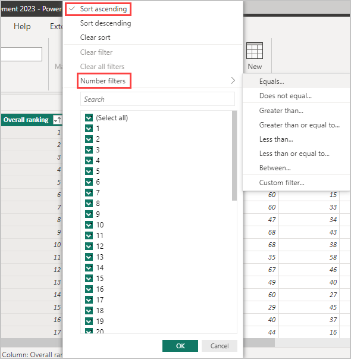

# Work with Table view in Power BI Desktop

*Table view* helps you inspect, explore, and understand data in your Power BI Desktop model. It's different from how you view tables, columns, and data in the Power Query Editor. With Table view, you're looking at your data after it has been loaded into the model.

> [!NOTE]
> Since Table view shows data after it's loaded into the model, the Table view icon isn't visible if all data sources are based on DirectQuery.

When you're modeling your data, sometimes you want to see what's actually in a table or column without creating a visual on the report canvas. You might want to see right down to the row level. This ability is especially useful when you're creating measures and calculated columns, or you need to identify a data type or data category.

Let's take a closer look at some of the elements found in Table view.

:::image type="content" source="media/desktop-data-view/dataview_fullscreen.png" alt-text="Screenshot shows the Table view in Power BI Desktop." lightbox="media/desktop-data-view/dataview_fullscreen.png":::

1. **Table view icon**. Select this icon to enter **Table** view.

2. **Data Grid**. This area shows the selected table and all columns and rows in it. Columns hidden from the **Report** view are greyed out. You can right-click on a column for options.

3. **Formula bar**. Enter Data Analysis Expression (DAX) formulas for Measures and Calculated columns.

4. **Search**. Search for a table or column in your model.

5. **Fields list**. Select a table or column to view in the data grid.

## Filtering in Table view

You can also filter and sort data in Table view. Each column shows an icon that identifies the sort direction, if applied.

You can filter individual values, or use advanced filtering based on the data in the column.

> [!NOTE]
> When a Power BI model is created in a different culture than your current user interface, the search box doesn't appear in the Table view user interface for anything other than text fields. For example, this behavior would apply for a model created in US English that you view in Spanish.

## Related content

You can do all sorts of things with Power BI Desktop. For more information on its capabilities, check out the following resources:

* [What is Power BI Desktop?](../fundamentals/desktop-what-is-desktop.md)
* [Query overview with Power BI Desktop](../transform-model/desktop-query-overview.md)
* [Data types in Power BI Desktop](desktop-data-types.md)
* [Shape and combine data with Power BI Desktop](desktop-shape-and-combine-data.md)
* [Common query tasks in Power BI Desktop](../transform-model/desktop-common-query-tasks.md)
