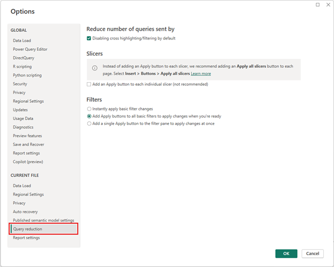

# DirectQuery in Power BI

In Power BI Desktop or the Power BI service, you can connect to many different data sources in different ways. You can *import* data to Power BI, which is the most common way to get data. You can also connect directly to some data in its original source repository, which is called *DirectQuery*. This article primarily discusses DirectQuery capabilities.

This article describes:

- The different Power BI data connectivity options.
- Guidance about when to use DirectQuery rather than import.
- Limitations and implications of using DirectQuery.
- Recommendations for successfully using DirectQuery.
- How to diagnose DirectQuery performance issues.

The article focuses on the DirectQuery workflow when you create a report in Power BI Desktop, but also covers connecting through DirectQuery in the Power BI service.

> [!NOTE]
> DirectQuery is also a feature of SQL Server Analysis Services. That feature shares many details with DirectQuery in Power BI, but there are also important differences. This article primarily covers DirectQuery with Power BI, not SQL Server Analysis Services.
>
> For more information about using DirectQuery with SQL Server Analysis Services, see [Use composite models in Power BI Desktop)](../transform-model/desktop-composite-models.md). You can also download the PDF [DirectQuery in SQL Server 2016 Analysis Services](https://download.microsoft.com/download/F/6/F/F6FBC1FC-F956-49A1-80CD-2941C3B6E417/DirectQuery%20in%20Analysis%20Services%20-%20Whitepaper.pdf).

## Power BI data connectivity modes

Power BI connects to a large number of varied data sources, such as:

- Online services like Salesforce and Dynamics 365.
- Databases like SQL Server, Access, and Amazon Redshift.
- Simple files in Excel, JSON, and other formats.
- Other data sources like Spark, websites, and Microsoft Exchange.

You can import data from these sources into Power BI. For some sources, you can also connect using DirectQuery. For a summary of the sources that support DirectQuery, see [Power BI data sources](power-bi-data-sources.md). DirectQuery-enabled sources are primarily sources that can deliver good interactive query performance.

You should import data into Power BI wherever possible. Importing takes advantage of Power BI's high-performance query engine and provides a highly interactive, fully featured experience.

If you can't meet your goals by importing data, for example, if the data changes frequently and reports must reflect the latest data, consider using DirectQuery. DirectQuery is feasible only when the underlying data source can provide interactive query results in less than five seconds for a typical aggregate query, and can handle the generated query load. Carefully consider the limitations and implications of using DirectQuery.

Power BI import and DirectQuery capabilities evolve over time. Changes that provide more flexibility when using imported data let you import more often, and eliminate some of the drawbacks of using DirectQuery. Regardless of improvements, the performance of the underlying data source is a major consideration when using DirectQuery. If an underlying data source is slow, using DirectQuery for that source remains infeasible.

The following sections cover these three options for connecting to data: import, DirectQuery, and live connection. The remainder of the article focuses on DirectQuery.

### Import connections

When you connect to a data source like SQL Server and import data in Power BI Desktop, the following connectivity conditions are present:

- When you initially use **Get data**, each set of tables you select defines a query that returns a set of data. You can edit those queries before loading the data, for example, to apply filters, aggregate the data, or join different tables.

- Upon load, all the data defined by the queries imports into the Power BI cache.

- Building a visual within Power BI Desktop queries the cached data. The Power BI store ensures the query is fast, and that all changes to the visual reflect immediately.

- Visuals don't reflect changes to the underlying data in the data store. You need to reimport to refresh the data.

- Publishing the report to the Power BI service as a *.pbix* file creates and uploads a semantic model that includes the imported data. You can then schedule data refresh to reimport the data daily, for example. Depending on the location of the original data source, it might be necessary to configure an on-premises data gateway for the refresh.

- Opening an existing report or authoring a new report in the Power BI service queries the imported data again, ensuring interactivity.

- You can pin visuals or entire report pages as dashboard tiles in the Power BI service. The tiles automatically refresh whenever the underlying semantic model refreshes.

### DirectQuery connections

When you use DirectQuery to connect to a data source in Power BI Desktop, the following data connectivity conditions are present:

- You use **Get data** to select the source. For relational sources, you can still select a set of tables that define a query that logically returns a set of data. For multidimensional sources like SAP Business Warehouse (SAP BW), you select only the source.

- Upon load, no data is imported into the Power BI store. Instead, when you build a visual, Power BI Desktop sends queries to the underlying data source to retrieve the necessary data. The time it takes to refresh the visual depends on the performance of the underlying data source.

- Any changes to the underlying data aren't immediately reflected in existing visuals. It's still necessary to refresh. Power BI Desktop resends the necessary queries for each visual, and updates the visual as necessary.

- Publishing the report to the Power BI service creates and uploads a semantic model, the same as for import. However, that semantic model includes no data.

- Opening an existing report or authoring a new report in the Power BI service queries the underlying data source to retrieve the necessary data. Depending upon the location of the original data source, it might be necessary to configure an on-premises data gateway to get the data.

- You can pin visuals or entire report pages as dashboard tiles. To ensure that opening a dashboard is fast, the tiles automatically refresh on a schedule, for example every hour. You can control refresh frequency depending on how frequently the data changes and the importance of seeing the latest data.

- When you open a dashboard, the tiles reflect the data at the time of the last refresh, not necessarily the latest changes made to the underlying source. You can refresh an open dashboard to ensure that it's current.

### Live connections

When you connect to SQL Server Analysis Services, you can choose to import the data or use a *live connection* to the selected data model. Using a live connection is similar to DirectQuery. No data is imported, and the underlying data source is queried to refresh visuals. 

For example, when you use import to connect to SQL Server Analysis Services, you define a query against the external SQL Server Analysis Services source, and import the data. If you connect live, you don't define a query, and the entire external model shows in the fields list.

This situation also applies when you connect to the following sources, except there's no option to import the data:

- Power BI semantic models, for example connecting to a Power BI semantic model that's already published to the service, to author a new report over it.

- Microsoft Dataverse.

When you publish SQL Server Analysis Services reports that use live connections, the behavior in the Power BI service is similar to DirectQuery reports in the following ways:

- Opening an existing report or authoring a new report in the Power BI service queries the underlying SQL Server Analysis Services source, possibly requiring an on-premises data gateway.

- Dashboard tiles automatically refresh on a schedule, such as every hour.

A live connection also differs from DirectQuery in several ways. For example, live connections always pass the identity of the user opening the report to the underlying SQL Server Analysis Services source.

## DirectQuery use cases

Connecting with DirectQuery can be useful in the following scenarios. In several of these cases, leaving the data in its original source location is necessary or beneficial.

DirectQuery in Power BI offers the greatest benefits in the following scenarios:

- The data changes frequently, and you need near real-time reporting.
- You need to handle large data without having to pre-aggregate.
- The underlying source defines and applies security rules.
- Data sovereignty restrictions apply.
- The source is a multidimensional source containing measures, such as SAP BW.

### Data changes frequently, and you need near real-time reporting

You can refresh models with imported data at most once per hour, or more frequently with Power BI Pro or Power BI Premium subscriptions. If the data is continually changing, and it's necessary for reports to show the latest data, using import with scheduled refresh might not meet your needs. You can stream data directly into Power BI, although there are limits on the data volumes supported for this case.

Using DirectQuery means that opening or refreshing a report or dashboard always shows the latest data in the source. The dashboard tiles can also be updated more frequently, as often as every 15 minutes.

### Data is very large

If the data is very large, it's not feasible to import all of it. DirectQuery requires no large transfer of data, because it queries data in place. However, large data might also make the performance of queries against that underlying source too slow.

You don't always have to import full, detailed data. The Power Query Editor makes it easy to pre-aggregate data during import. Technically, it's possible to import exactly the aggregate data you need for each visual. While DirectQuery is the simplest approach to large data, importing aggregate data might offer a solution if the underlying data source is too slow for DirectQuery.

These details relate to using Power BI alone. For more information about using large models in Power BI, see [large semantic models in Power BI Premium](../enterprise/service-premium-large-models.md). There's no restriction on how frequently the data can be refreshed.

### The underlying source defines security rules

When you import data, Power BI connects to the data source by using the current user's Power BI Desktop credentials, or the credentials configured for scheduled refresh from the Power BI service. In publishing and sharing reports that have imported data, you must be careful to share only with users allowed to see the data, or you must define row-level security as part of the semantic model.

DirectQuery lets a report viewer's credentials pass through to the underlying source, which applies security rules. DirectQuery supports single sign-on (SSO) to Azure SQL data sources, and through a data gateway to on-premises SQL servers. For more information, see [Overview of single sign-on (SSO) for on-premises data gateways in Power BI](service-gateway-sso-overview.md).

### Data sovereignty restrictions apply

Some organizations have policies around data sovereignty, meaning that data can't leave the organization premises. This data presents issues for solutions based on data import. With DirectQuery, the data remains in the underlying source location. However, even with DirectQuery, the Power BI service keeps some caches of data at the visual level, because of scheduled refresh of tiles.

### The underlying data source uses measures

An underlying data source such as SAP HANA or SAP BW contains *measures*. Measures mean that imported data is already at a certain level of aggregation, as defined by the query. A visual that asks for data at a higher-level aggregate, such as **TotalSales** by **Year**, further aggregates the aggregate value. This aggregation is fine for additive measures, such as **Sum** and **Min**, but can be an issue for non-additive measures, such as **Average** and **DistinctCount**.

Easily getting the correct aggregate data needed for a visual directly from the source requires sending queries per visual, as in DirectQuery. When you connect to SAP BW, choosing DirectQuery allows this treatment of measures. For more information, see [DirectQuery and SAP BW](desktop-directquery-sap-bw.md).

Currently DirectQuery over SAP HANA treats data the same as a relational source, and produces behavior similar to import. For more information, see [DirectQuery and SAP HANA](desktop-directquery-sap-hana.md).

<a name="implications-of-using-directquery"></a>

## DirectQuery limitations

Using DirectQuery has some potentially negative implications. Some of these limitations differ slightly depending on the exact source you use. The following sections list general implications of using DirectQuery, and limitations related to performance, security, transformations, modeling, and reporting.

### General implications

Some general implications and limitations of using DirectQuery follow:

- **If data changes, you must refresh to show the latest data.** Given the use of caches, there's no guarantee that visuals always show the latest data. For example, a visual might show transactions in the past day. A slicer change might refresh the visual to show transactions for the past two days, including recent, newly arrived transactions. But returning the slicer to its original value could result in it again showing the cached previous value. Select **Refresh** to clear any caches and refresh all the visuals on the page to show the latest data.

- **If data changes, there's no guarantee of consistency between visuals.** Different visuals, whether on the same page or on different pages, might be refreshed at different times. If the data in the underlying source is changing, there's no guarantee that each visual shows the data at the same point in time.

  Given that more than one query might be required for a single visual, for example to obtain the details and the totals, even consistency within a single visual isn't guaranteed. To guarantee this consistency would require the overhead of refreshing all visuals whenever any visual refreshed, along with using costly features like snapshot isolation in the underlying data source.

  You can mitigate this issue to a large extent by selecting **Refresh** to refresh all of the visuals on the page. Even for Import mode, there's a similar problem of maintaining consistency when you import data from more than one table.

- **You must refresh in Power BI Desktop to reflect schema changes.** After a report is published, **Refresh** in the Power BI service refreshes the visuals in the report. But if the underlying source schema changes, the Power BI service doesn't automatically update the available fields list. If tables or columns are removed from the underlying source, it might result in query failure upon refresh. To update the fields in the model to reflect the changes, you must open the report in Power BI Desktop and choose **Refresh**.

- **A limit of 1 million rows can return on any query.** There's a fixed limit of 1 million rows that can return in any single query to the underlying source. This limit generally has no practical implications, and visuals won't display that many points. However, the limit can occur in cases where Power BI doesn't fully optimize the queries sent, and requests some intermediate result that exceeds the limit.

  The limit can also occur while building a visual, on the path to a more reasonable final state. For example, including **Customer** and **TotalSalesQuantity** could hit this limit if there are more than 1 million customers, until you apply some filter. The error that returns is: **The resultset of a query to external data source has exceeded the maximum allowed size of '1000000' rows.**

  > [!NOTE]
  > Premium capacities let you exceed the one million-row limit. For more information, see [Max Intermediate Row Set Count](../enterprise/service-admin-premium-workloads.md#max-intermediate-row-set-count).

- **You can't change a model from import to DirectQuery mode.** You can switch a model from DirectQuery mode to Import mode if you import all the necessary data. It's not possible to switch back to DirectQuery mode, primarily because of the feature set that DirectQuery mode doesn't support. For multidimensional sources like SAP BW, you can't switch from DirectQuery to Import mode either, because of the different treatment of external measures.

### Performance and load implications

When you use DirectQuery, the overall experience depends on the performance of the underlying data source. If refreshing each visual, for example after changing a slicer value, takes less than five seconds, the experience is reasonable, although it might feel sluggish compared to the immediate response with imported data. If the slowness of the source causes individual visuals to take longer than tens of seconds to refresh, the experience becomes unreasonably poor. Queries might even time out.

Along with the performance of the underlying source, the load placed on the source also impacts performance. Each user who opens a shared report, and each dashboard tile that refreshes, sends at least one query per visual to the underlying source. The source must be able to handle such a query load while maintaining reasonable performance.

### Security implications

Unless the underlying data source uses SSO, a DirectQuery report always uses the same fixed credentials to connect to the source once it's published to the Power BI service. Immediately after you publish a DirectQuery report, you must configure the credentials of the user to use. Until you configure the credentials, trying to open the report in the Power BI service results in an error.

Once you provide the user credentials, Power BI uses those credentials for whoever opens the report, the same as for imported data. Every user sees the same data, unless row-level security is defined as part of the report. You must pay the same attention to sharing the report as for imported data, even if there are security rules defined in the underlying source.

- Connecting to Power BI semantic models and Analysis Services in DirectQuery mode always uses SSO, so the security is similar to live connections to Analysis Services.

- Alternate credentials aren't supported when making DirectQuery connections to SQL Server from Power BI Desktop. You can use your current Windows credentials or database credentials.

- You can use multiple data sources in a DirectQuery model by using [composite models](../transform-model/desktop-composite-models.md). When you use multiple data sources, it's important to understand the [security implications](../transform-model/desktop-composite-models.md#security-implications) of how data moves back and forth between the underlying data sources.

### Data transformation limitations

DirectQuery limits the data transformations you can apply within Power Query Editor. With imported data, you can easily apply a sophisticated set of transformations to clean and reshape the data before using it to create visuals. For example, you can parse JSON documents, or pivot data from a column to a row form. These transformations are more limited in DirectQuery.

When you connect to an online analytical processing (OLAP) source like SAP BW, you can't define any transformations, and the entire external model is taken from the source. For relational sources like SQL Server, you can still define a set of transformations per query, but those transformations are limited for performance reasons.

Any transformations must be applied on every query to the underlying source, rather than once on data refresh. Transformations must be able to reasonably translate into a single native query. If you use a transformation that's too complex, you get an error saying that either it must be deleted or the connection model must be switched to import.

Also, the **Get Data** dialog or Power Query Editor use subselects within the queries they generate and send to retrieve data for a visual. Queries defined in Power Query Editor must be valid within this context. In particular, it's not possible to use a query with common table expressions, nor one that invokes stored procedures.

### Modeling limitations

The term *modeling* in this context means the act of refining and enriching raw data as part of authoring a report using the data. Examples of modeling include:

- Defining relationships between tables.
- Adding new calculations, like calculated columns and measures.
- Renaming and hiding columns and measures.
- Defining hierarchies.
- Defining column formatting, default summarization, and sort order.
- Grouping or clustering values.

You can still make many of these model enrichments when you use DirectQuery, and use the principle of enriching the raw data to improve later consumption. However, some modeling capabilities aren't available or are limited with DirectQuery. The limitations are applied to avoid performance issues.

The following limitations are common to all DirectQuery sources. More limitations might apply to individual sources.

- **No built-in date hierarchy:** With imported data, every date/datetime column also has a built-in date hierarchy available by default. For example, if you import a table of sales orders that includes a column **OrderDate**, and you use **OrderDate** in a visual, you can choose the appropriate date level to use, such as year, month, or day. This built-in date hierarchy isn't available with DirectQuery. If there's a **Date** table available in the underlying source, as is common in many data warehouses, you can use the Data Analysis Expressions (DAX) time-intelligence functions as usual.

- **Date/time support only to the seconds level:** For semantic models that use time columns, Power BI issues queries to the underlying DirectQuery source only up to the seconds detail level, not milliseconds. Remove milliseconds data from your source columns.

- **Limitations in calculated columns:** Calculated columns can only be intra-row, that is they can refer only to values of other columns of the same table, without using any aggregate functions. Also, the allowed DAX scalar functions, such as `LEFT()`, are limited to those functions that can be pushed to the underlying source. The functions vary depending upon the exact capabilities of the source. Functions that aren't supported aren't listed in autocomplete when authoring the DAX query for a calculated column, and result in an error if used.

- **No support for parent-child DAX functions:** When in DirectQuery mode, it's not possible to use the family of `DAX PATH()` functions that usually handle parent-child structures, such as charts of accounts or employee hierarchies.

- **No clustering:** When you use DirectQuery, you can't use the clustering capability to automatically find groups.

### Reporting limitations

Almost all reporting capabilities are supported for DirectQuery models. As long as the underlying source offers a suitable level of performance, you can use the same set of visualizations as for imported data.

One general limitation is that the maximum length of data in a text column for DirectQuery semantic models is 32,764 characters. Reporting on longer texts results in an error.

The following Power BI reporting capabilities can cause performance issues in DirectQuery-based reports:

- **Measure filters:** Visuals that use measures or aggregates of columns can contain filters in those measures. For example, the following graphic shows **SalesAmount** by **Category**, but only for categories with more than **20M** of sales.
  
  
  
  This approach causes two queries to be sent to the underlying source:
  
  - The first query retrieves the categories that meet the condition **SalesAmount** greater than 20 million.
  - The second query retrieves the necessary data for the visual, which includes the categories that met the `WHERE` condition.
  
  This approach generally works well if there are hundreds or thousands of categories, as in this example. Performance can degrade if the number of categories is much larger. The query fails if there are more than a million categories.

- **TopN filters:** You can define advanced filters to filter on only the top or bottom `N` values ranked by some measure. For example, filters can include the top 10 categories. This approach again sends two queries to the underlying source. However, the first query returns all categories from the underlying source, and then the `TopN` are determined based on the returned results. Depending on the cardinality of the column involved, this approach can lead to performance issues or query failures because of the one million-row limit on query results.

- **Median:** Any aggregation, such as `Sum` or `Count Distinct`, is pushed to the underlying source. However, the `median` aggregate isn't usually supported by the underlying source. For `median`, the detail data is retrieved from the underlying source, and the median is calculated from the returned results. This approach is reasonable for calculating the median over a relatively small number of results.

  Performance issues or query failures can arise if the cardinality is large because of the one million-row limit. For example, querying for **Median Country/Region Population** might be reasonable, but **Median Sales Price** might not be reasonable.

- **Advanced text filters like 'contains':** Advanced filtering on a text column allows filters like `contains` and `begins with`. These filters can result in degraded performance for some data sources. In particular, don't use the default `contains` filter if you need an exact match. Although the results might be the same depending on the actual data, the performance might be drastically different because of indexes.

- **Multi-select slicers:** By default, slicers only allow making a single selection. Allowing multi-selection in filters can cause performance issues. For example, if the user selects 10 products of interest, each new selection results in queries being sent to the source. Although the user can select the next item before the query completes, this approach results in extra load on the underlying source.

- **Totals on table visuals:** By default, tables and matrices display totals and subtotals. In many cases, getting the values for such totals requires sending separate queries to the underlying source. This requirement applies whenever you use `DistinctCount` aggregation, or in all cases that use DirectQuery over SAP BW or SAP HANA. You can switch off such totals by using the **Format** pane.

## DirectQuery recommendations

This section provides high-level guidance on how to successfully use DirectQuery, given its implications.

### Underlying data source performance

Validate that simple visuals refresh within five seconds, providing a reasonable interactive experience. If visuals take longer than 30 seconds to refresh, it's likely that further issues following report publication will make the solution unworkable.

If queries are slow, examine the queries sent to the underlying source, and the reason for the slow performance. For more information, see [Performance diagnostics](#performance-diagnostics).

This article doesn't cover the wide range of database optimization recommendations across the full set of potential underlying sources. The following standard database practices apply to most situations:

- For better performance, base relationships on integer columns rather than joining columns of other data types.

- Create the appropriate indexes. Index creation generally means using column store indexes in sources that support them, for example SQL Server.

- Update any necessary statistics in the source.

### Model design

When you define the model, follow this guidance:

- **Avoid complex queries in Power Query Editor.** Power Query Editor translates a complex query into a single SQL query. The single query appears in the subselect of every query sent to that table. If that query is complex, it might result in performance issues on every query sent. You can get the actual SQL query for a set of steps by right-clicking the last step under **Applied steps** in Power Query Editor and choosing **View Native Query**.

- **Keep measures simple.** At least initially, limit measures to simple aggregates. If the measures operate in a satisfactory manner, you can define more complex measures, but pay attention to performance.

- **Avoid relationships on calculated columns.** In databases where you need to do multi-column joins, Power BI doesn't allow basing relationships on multiple columns as the primary key or foreign key. The common workaround is to concatenate the columns by using a calculated column, and base the join on that column.

  This workaround is reasonable for imported data, but for DirectQuery it results in a join on an expression. That result usually prevents using any indexes, and leads to poor performance. The only workaround is to actually materialize the multiple columns into a single column in the underlying data source.

- **Avoid relationships on 'uniqueidentifier' columns.** Power BI doesn't natively support a `uniqueidentifier` datatype. Defining a relationship between `uniqueidentifier` columns results in a query with a join that involves a cast. Again, this approach commonly leads to poor performance. The only workaround is to materialize columns of an alternative type in the underlying data source.

- **Hide the 'to' column on relationships.** The `to` column on relationships is commonly the primary key on the `to` table. That column should be hidden, but if hidden, it doesn't appear in the fields list and can't be used in visuals. Often the columns on which relationships are based are actually *system columns*, for example surrogate keys in a data warehouse. It's still best to hide such columns.

  If the column has meaning, introduce a calculated column that's visible and that has a simple expression of being equal to the primary key, for example:

  ```sql  
      ProductKey_PK   (Destination of a relationship, hidden)
      ProductKey (= [ProductKey_PK],   visible)
      ProductName
      ...
  ```

- **Examine all calculated columns and data type changes.** You can use calculated tables when you use DirectQuery with [composite models](../transform-model/desktop-composite-models.md#calculated-tables). These capabilities aren't necessarily harmful, but they result in queries that contain expressions rather than simple references to columns. Those queries might result in indexes not being used.

- **Avoid bidirectional cross filtering on relationships.** Using bidirectional cross filtering can lead to query statements that don't perform well. For more information about bidirectional cross filtering, see [Enable bidirectional cross filtering for DirectQuery in Power BI Desktop](../transform-model/desktop-bidirectional-filtering.md), or download the [Bidirectional cross-filtering](https://download.microsoft.com/download/2/7/8/2782DF95-3E0D-40CD-BFC8-749A2882E109/Bidirectional%20cross-filtering%20in%20Analysis%20Services%202016%20and%20Power%20BI.docx) white paper. The examples in the paper are for SQL Server Analysis Services, but the fundamental points also apply to Power BI.

- **Experiment with setting *Assume referential integrity*.** The **Assume referential integrity** setting on relationships enables queries to use `INNER JOIN` rather than `OUTER JOIN` statements. This guidance generally improves query performance, although it depends on the specifics of the data source.

- **Don't use the relative date filtering in Power Query Editor.** It's possible to define relative date filtering in Power Query Editor. For example, you can filter to the rows where the date is in the last 14 days.
  
  
  
  However, this filter translates into a filter based on a fixed date, such as the time the query was authored, as you can see in the native query.
  
  
  
  This data is probably not what you want. To ensure the filter is applied based on the date at the time the report runs, apply the date filter in the report. You can create a calculated column that calculates the number of days ago by using the `DAX DATE()` function, and use that calculated column in the filter.

<a name="report-design-guidance"></a>

### Report design

When you create a report that uses a DirectQuery connection, follow this guidance:

- **Consider using query reduction options:** Power BI provides report options to send fewer queries, and to disable certain interactions that cause a poor experience if the resulting queries take a long time to run. These options apply when you interact with your report in Power BI Desktop, and also apply when users consume the report in the Power BI service.

  To access these options in Power BI Desktop, go to **File** > **Options and settings** > **Options** and select **Query reduction**.

  

  Selections on the **Query reduction** screen let you show an **Apply** button for slicers or filter selections. No queries are sent until you select the **Apply** button on the filter or slicer. The queries then use your selections to filter the data. This button lets you make several slicer and filter selections before you apply them.

- **Apply filters first:** Always apply any applicable filters at the start of building a visual. For example, rather than drag in **TotalSalesAmount** and **ProductName**, and then filter to a particular year, apply the filter on **Year** at the beginning.

  Each step of building a visual sends a query. Although it's possible to make another change before the first query completes, this approach still leaves unnecessary load on the underlying source. Applying filters early generally makes those intermediate queries less costly. Failing to apply filters early can result in hitting the one million-row limit.

- **Limit the number of visuals on a page:** When you open a page or change a page level slicer or filter, all the visuals on the page refresh. There's a limit on the number of parallel queries. As the number of visuals increases, some visuals refresh serially, which increases the time it takes to refresh the page. Therefore, it's best to limit the number of visuals on a single page, and instead have more, simpler pages.

- **Consider switching off interaction between visuals:** By default, visualizations on a report page can be used to cross filter and cross highlight the other visualizations on the page. For example, if you select **1999** on the pie chart, the column chart is cross highlighted to show the sales by category for **1999**.
  
  
  
  Cross filtering and cross highlighting in DirectQuery require queries to be submitted to the underlying source. You should switch off this interaction if the time taken to respond to users' selections is unreasonably long.

  You can use the **Query reduction** settings to disable cross highlighting throughout your report, or on a case-by-case basis. For more information, see [How visuals cross filter each other in a Power BI report](../consumer/end-user-interactions.md).

<a name="maximum-number-of-connections-option-for-directquery"></a>

### Maximum number of connections

You can set the maximum number of connections DirectQuery opens for each underlying data source, which controls the number of queries concurrently sent to each data source.

DirectQuery opens a default maximum number of 10 concurrent connections. To change the maximum number for the current file in Power BI Desktop, go to **File** > **Options and Settings** > **Options**, and select **DirectQuery** in the **Current File** section of the left pane.


The setting is enabled only when there's at least one DirectQuery source in the current report. The value applies to all DirectQuery sources, and to any new DirectQuery sources added to that report.

Increasing **Maximum connections per data source** allows sending more queries, up to the maximum number specified, to the underlying data source. This approach is useful when many visuals are on a single page, or many users access a report at the same time. Once the maximum number of connections is reached, further queries are queued until a connection becomes available. A higher limit results in more load on the underlying source, so the setting isn't guaranteed to improve overall performance.

Once you publish a report to the Power BI service, the maximum number of concurrent queries also depends on fixed limits set on the target environment where the report is published. Power BI, Power BI Premium, and Power BI Report Server impose different limits. The table below lists the upper limits of the active connections per data source for each Power BI environment. These limits apply to cloud data sources and on-premises data sources such as SQL Server, Oracle, and Teradata.

|Environment            |Upper limit per data source |
|-----------------------|-------------|
|Power BI Pro           |10 active connections|
|Power BI Premium       |Depends on [semantic model SKU limitation](../enterprise/service-premium-what-is.md#semantic-model-sku-limitation)|
|Power BI Report Server |10 active connections|

> [!NOTE]
> The maximum number of DirectQuery connections setting applies to all DirectQuery sources when you enable [enhanced metadata](desktop-enhanced-dataset-metadata.md), which is the default setting for all models created in Power BI Desktop. 

## DirectQuery in the Power BI service

All DirectQuery data sources are supported from Power BI Desktop, and some sources are also available directly from within the Power BI service. A business user can use Power BI to connect to their data in Salesforce, for example, and immediately get a dashboard, without using Power BI Desktop.

Only the following two DirectQuery-enabled sources are available directly in the Power BI service:

- Spark
- Azure Synapse Analytics (formerly SQL Data Warehouse)

Even for these two sources, it's still best to start DirectQuery use within Power BI Desktop. While it's easy to initially make the connection in the Power BI service, there are limitations on further enhancing the resulting report. For example, in the service it's not possible to create any calculations, or use many analytical features, or refresh the metadata to reflect changes to the underlying schema.

The performance of a DirectQuery report in the Power BI service depends on the degree of load placed on the underlying data source. The load depends on:

- The number of users that share the report and dashboard.
- The complexity of the report.
- Whether the report defines row-level security.

### Report behavior in the Power BI service

When you open a report in the Power BI service, all the visuals on the currently visible page refresh. Each visual requires at least one query to the underlying data source. Some visuals might require more than one query. For example, a visual might show aggregate values from two different fact tables, or contain a more complex measure, or contain totals of a non-additive measure like **Count Distinct**. Moving to a new page refreshes those visuals. Refreshing sends a new set of queries to the underlying source.

Every user interaction on the report might result in visuals being refreshed. For example, selecting a different value on a slicer requires sending a new set of queries to refresh all of the affected visuals. The same is true for selecting a visual to cross highlight other visuals, or changing a filter. Similarly, creating or editing a report requires queries to be sent for each step on the path to produce the final visual.

There's some caching of results. The refresh of a visual is instantaneous if the exact same results were recently obtained. If row-level security is defined, these caches aren't shared across users.

Using DirectQuery imposes some important limitations in some of the capabilities the Power BI service offers for published reports:

- **Quick insights aren't supported:** Power BI quick insights search different subsets of your semantic model while applying a set of sophisticated algorithms to discover potentially interesting insights. Because quick insights require high-performance queries, this feature isn't available on semantic models that use DirectQuery.

- **Using Explore in Excel results in poor performance:** You can explore a semantic model by using the **Explore in Excel** capability, which lets you create pivot tables and pivot charts in Excel. This capability is supported for semantic models that use DirectQuery, but performance is slower than creating visuals in Power BI. If using Excel is important for your scenarios, account for this issue in deciding whether to use DirectQuery.

- **Excel doesn't show hierarchies:** For example, when you use [Analyze in Excel](../collaborate-share/service-analyze-in-excel.md), Excel doesn't show any hierarchies defined in Azure Analysis Services models or Power BI semantic models that use DirectQuery.

### Dashboard refresh

In the Power BI service, you can pin individual visuals or entire pages to dashboards as tiles. Tiles that are based on DirectQuery semantic models refresh automatically by sending queries to the underlying data sources on a schedule. By default, semantic models refresh every hour, but you can configure the refresh schedule intervals between weekly and every 15 minutes as part of the semantic model settings.

If no [row-level security](/fabric/security/service-admin-row-level-security) is defined in the model, each tile is refreshed once, and the results are shared across all users. If you use row-level security, each tile requires separate queries per user to be sent to the underlying source.

There can be a large multiplier effect. A dashboard with 10 tiles, shared with 100 users, created on a semantic model using DirectQuery with row-level security, results in at least 1,000 queries being sent to the underlying data source for every refresh. Give careful consideration to the use of row-level security and the configuration of the refresh schedule.

### Query timeouts

A timeout of four minutes applies to individual queries in the Power BI service. Queries that take longer than four minutes fail. This limit is intended to prevent issues caused by overly long execution times. You should use DirectQuery only for sources that can provide interactive query performance.

When this limit is reached users will see visuals failing to load with error 
```The query has exceeded the available resources. try filtering to decrease the amount of data requested. The XML for Analysis request timed out before it was completed. Timeout value: 225 sec```.

## Performance diagnostics

This section describes how to diagnose performance issues, or how to get more detailed information to optimize your reports.

Start diagnosing performance issues in Power BI Desktop, rather than in the Power BI service. Performance issues are often based on the performance of the underlying source. You can more easily identify and diagnose issues in the more isolated Power BI Desktop environment.

This approach initially eliminates certain components, such as the Power BI gateway. If the performance issues don't occur in Power BI Desktop, you can investigate the specifics of the report in the Power BI service.

The Power BI Desktop [Performance analyzer](../create-reports/desktop-performance-analyzer.md) is a useful tool for identifying issues. Try to isolate any issues to one visual, rather than many visuals on a page. If a single visual on a Power BI Desktop page is sluggish, use the **Performance analyzer** to analyze the queries that Power BI Desktop sends to the underlying source.

You can also view traces and diagnostic information that some underlying data sources emit. Even if there are no traces from the source, the trace file might contain useful details of how a query runs and how you can improve it. You can use the following process to view the queries Power BI sends and their execution times.

### Use SQL Server Profiler to see queries

By default, Power BI Desktop logs events during a given session to a trace file called *FlightRecorderCurrent.trc*. The trace file is in the Power BI Desktop folder for the current user, in a folder called *AnalysisServicesWorkspaces*.

For some DirectQuery sources, this trace file includes all queries sent to the underlying data source. The following data sources send queries to the log:

- SQL Server
- Azure SQL Database
- Azure Synapse Analytics (formerly SQL Data Warehouse)
- Oracle
- Teradata
- SAP HANA

You can read the trace files by using the *SQL Server Profiler*, part of the free download [SQL Server Management Studio](/sql/ssms/download-sql-server-management-studio-ssms).


To open the trace file for the current session:

1. During a Power BI Desktop session, select **File** > **Options and settings** > **Options**, and then select **Diagnostics**.

1. Under **Crash Dump Collection**, select **Open crash dump/traces folder**.

   

   The *Power BI Desktop\\Traces* folder opens.

1. Navigate to the parent folder and then to the *AnalysisServicesWorkspaces* folder, which contains one workspace folder for every open instance of Power BI Desktop. These folders are named with an integer suffix, such as *AnalysisServicesWorkspace2058279583*. The workspace folder is deleted when the associated Power BI Desktop session ends.

   Inside the workspace folder for the current Power BI session, the *\\Data* folder contains the *FlightRecorderCurrent.trc* trace file. Make a note of the location.

1. Open SQL Server Profiler and select **File** > **Open** > **Trace File**.

1. Navigate to or enter the path to the trace file for the current Power BI session and open *FlightRecorderCurrent.trc*.

SQL Server Profiler displays all events from the current session. The following screenshot highlights a group of events for a query. Each query group has the following events:

- A `Query Begin` and `Query End` event, which represent the start and end of a DAX query generated by changing a visual or filter in the Power BI UI, or from filtering or transforming data in the Power Query Editor.

- One or more pairs of `DirectQuery Begin` and `DirectQuery End` events, which represent queries sent to the underlying data source as part of evaluating the DAX query.

[ ](media/desktop-directquery-about/directquery-about_08.png#lightbox)

Multiple DAX queries can run in parallel, so events from different groups can be interleaved. You can use the `ActivityID` value to determine which events belong to the same group.

The following columns are also of interest:

- **TextData:** The textual detail of the event. For `Query Begin` and `Query End` events, the detail is the DAX query. For `DirectQuery Begin` and `DirectQuery End` events, the detail is the SQL query sent to the underlying source. The **TextData** for the currently selected event also appears in the pane at the bottom of the screen.
- **EndTime:** The time when the event completed.
- **Duration:** The duration, in milliseconds, it took to run the DAX or SQL query.
- **Error:** Whether an error occurred, in which case the event also displays in red.

To capture a trace to help diagnose a potential performance issue:

1. Open a single Power BI Desktop session, to avoid the confusion of multiple workspace folders.

1. Do the set of actions of interest in Power BI Desktop. Include a few more actions, to ensure that the events of interest are flushed into the trace file.

1. Open SQL Server Profiler and examine the trace. Remember that closing Power BI Desktop deletes the trace file. Also, further actions in Power BI Desktop don't immediately appear. You must close and reopen the trace file to see new events.

Keep individual sessions reasonably small, perhaps 10 seconds of actions, not hundreds. This approach makes it easier to interpret the trace file. There's also a limit on the size of the trace file. For long sessions, there's a chance of early events being dropped.

### Understand the format of queries

The general format of Power BI Desktop queries uses subselects for each table they reference. The Power Query Editor query defines the subselect queries. For example, assume you have the following [TPC-DS](https://www.tpc.org/tpcds/default5.asp) tables in SQL Server:


Running the following query:

```sql
SalesAmount (SUMX(Web_Sales, [ws_sales_price]*[ws_quantity]))
by Item[i_category]
for Date_dim[d_year] = 2000
```
Results in the following visual in Power BI:


Refreshing that visual produces the SQL query in the following image. There are three subselect queries for `Web_Sales`, `Item`, and `Date_dim`, which each return all the columns on the respective table, even though the visual references only four columns.


Power Query Editor defines the exact subselect queries. This use of subselect queries hasn't been shown to affect performance for the data sources DirectQuery supports. Data sources like SQL Server optimize away the references to the other columns.

Power BI uses this pattern because the analyst provides the SQL query directly. Power BI uses the query as provided, without any attempt to rewrite it.

## Related content

For more information about DirectQuery in Power BI, see:

- [Use DirectQuery in Power BI Desktop](desktop-use-directquery.md)

This article described aspects of DirectQuery that are common across all data sources. See the following articles for details about specific sources:

- [DirectQuery and SAP HANA](desktop-directquery-sap-hana.md)
- [DirectQuery and SAP BW](desktop-directquery-sap-bw.md)
- [Use DirectQuery for Power BI semantic models and Analysis Services](desktop-directquery-datasets-azure-analysis-services.md)
