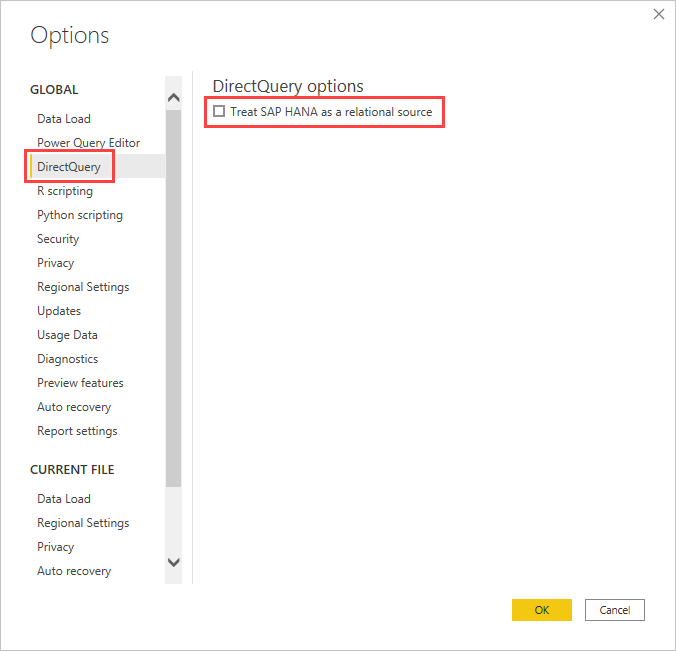
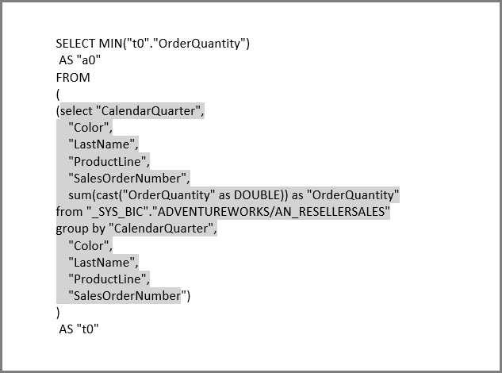

# Connect to SAP HANA data sources by using DirectQuery in Power BI

You can connect to SAP HANA data sources directly using DirectQuery, which is often required for large datasets that exceed available resources to support import models. There are two approaches for connecting to SAP HANA in DirectQuery mode, each with different capabilities:

* **Treat SAP HANA as a multi-dimensional source (default):**  In this case, the behavior is similar to when Power BI connects to other multi-dimensional sources like SAP Business Warehouse, or Analysis Services. When you connect to SAP HANA as a multi-dimensional source, a single analytic or calculation view is selected and all the measures, hierarchies and attributes of that view are available in the field list. You cannot add calculated columns or other data customizations in the semantic model. As visuals are created, the aggregate data is directly retrieved from SAP HANA. Treat SAP HANA as a multi-dimensional source is the default for new DirectQuery reports over SAP HANA.

* **Treat SAP HANA as a relational source:** In this case, Power BI treats SAP HANA as a relational data source. This approach offers greater flexibility. Among other things, you can add calculated columns and include data from other sources, but care must be taken to ensure that measures are aggregated as expected. Avoid non-additive measures. Also, make sure you use simple views with few columns and joins to avoid performance issues. Consider recreating measures in the semantic model, but keep in mind that complex measures might not fold. SAP HANA hierarchies are unavailable when using SAP HANA as a relational source.

The connection method is determined by a global tool option, which is set by selecting **File** > **Options and settings** and then **Options** > **DirectQuery**, then selecting the option **Treat SAP HANA as a relational source**, as shown in the following image.

The option to treat SAP HANA as a relational source controls the connection method for any *new* report using DirectQuery over SAP HANA. It has no effect on any existing SAP HANA connections in the current report, nor on connections in any other reports that are opened. So if the option is currently unchecked, then upon adding a new connection to SAP HANA using **Get Data**, that connection is treating SAP HANA as a multi-dimensional source. However, if a different report is opened that also connects to SAP HANA, then that report continues to behave according to the option that was set *at the time it was created*. This fact means that any reports connecting to SAP HANA as a relational source continue to treat SAP HANA as a relational source even if the option is now unchecked.

The two SAP HANA connection methods constitute different behavior, and it's not possible to switch an existing report from one connection method to the other.

## Treat SAP HANA as a multi-dimensional source (default)

All new connections to SAP HANA use this connection method by default, treating SAP HANA as a multi-dimensional source. When connecting to SAP HANA as a multi-dimensional source, the following considerations apply:

* In the **Get Data Navigator**, a single SAP HANA view can be selected. It isn't possible to select individual measures or attributes. There's no query defined at the time of connecting, which is different from importing data or when using DirectQuery while treating SAP HANA as a relational source. This consideration also means that it's not possible to directly use an SAP HANA SQL query when selecting this connection method.

* All the measures, hierarchies, and attributes of the selected view are displayed in the field list.

* As a measure is used in a visual, SAP HANA is queried to retrieve the measure value at the level of aggregation necessary for the visual. When dealing with non-additive measures, such as counters and ratios, all aggregations are performed by SAP HANA, and no further aggregation is performed by Power BI.

* To ensure the correct aggregate values can always be obtained from SAP HANA, certain restrictions must be imposed. For example, it's not possible to add calculated columns, or to combine data from multiple SAP HANA views within the same report. It is also not possible to delete columns or change their data types.

Treating SAP HANA as a multi-dimensional source offers less flexibility than the alternative *relational* approach, but it's more straightforward. This connection method ensures correct aggregate values when dealing with more complex SAP HANA measures, and generally results in higher performance.

The **Field** list includes all measures, attributes, and hierarchies from the SAP HANA view. Note the following behaviors that apply when using this connection method:

* Any attribute that is included in at least one hierarchy is hidden by default. However, they can be seen if required by selecting **View hidden** from the context menu on the field list. From the same context menu they can be made visible, if necessary.

* In SAP HANA, an attribute can be defined to use another attribute as its label. For example, **Product**, with values `1`, `2`, `3`, and so on, could use **ProductName**, with values `Bike`, `Shirt`, `Gloves`, and so on, as its label. In this case, a single field **Product** is shown in the field list, whose values are the labels `Bike`, `Shirt`, `Gloves`, and so on, but which is sorted by, and with uniqueness determined by, the key values `1`, `2`, `3`. A hidden column **Product.Key** is also created, allowing access to the underlying key values if necessary.

Any variables defined in the underlying SAP HANA view are displayed at the time of connecting, and the necessary values can be entered. Those values can later be changed by selecting **Transform data** from the ribbon, and then **Edit parameters** from the dropdown menu displayed.

The modeling operations allowed are more restrictive than in the general case when using DirectQuery, given the need to ensure that correct aggregate data can always be obtained from SAP HANA. However, it's still possible to make some additions and changes, including defining measures, renaming and hiding fields, and defining display formats. All such changes are preserved on refresh, and any non-conflicting changes made to the SAP HANA view are applied.

### Additional modeling restrictions

In addition to the aforementioned limitations, be aware of the following modeling restrictions when connecting to SAP HANA as a multi-dimensional source:

* **No support for calculated columns:** The ability to create calculated columns is disabled. This fact also means that Grouping and Clustering, which rely on calculated columns, aren't available.
* **Additional limitations for measures:** There are other limitations imposed on the DAX expressions that can be used in measures, to reflect the level of support offered by SAP HANA. For example, it's not possible to use an aggregate function over a table.
* **No support for defining relationships:** Only a single view can be queried within a report, and as such, there's no support for defining relationships.
* **No Data View:** The **Data View** normally displays the detail level data in the tables. Given the nature of multi-dimensional sources, this view isn't available when using SAP HANA as a multi-dimensional source.
* **Column and measure details are fixed:** The columns and measures in the field list are determined by the underlying source and can't be modified. For example, it's not possible to delete a column, nor change its datatype. It can, however, be renamed.

### Additional visualization restrictions

There are restrictions in visuals when connecting to SAP HANA as a multi-dimensional source:

* **No aggregation of columns:** It's not possible to change the aggregation for a column on a visual, and it's always *Do Not Summarize*.

## Treat SAP HANA as a relational source

In order to connect to SAP HANA as a relational source, you must select **File** > **Options and settings** and then **Options** > **DirectQuery**, and then select the option **Treat SAP HANA as a relational source**.

When using SAP HANA as a relational source, some extra flexibility is available. For example, you can create calculated columns, include data from multiple SAP HANA views, and create relationships between the resulting tables. However, there are differences from the behavior when connecting to SAP HANA as a multidimensional source, particularly when the SAP HANA view contains non-additive measures, for example, distinct counts, or averages, rather than simple sums. Non-additive measures can produce wrong results. The measures can also reduce the efficiency of query plan optimization in SAP HANA and result in poor query performance and timeouts.

### Understanding SAP HANA as a relational source

It's useful to start by clarifying the behavior of a relational source, such as SQL Server, when the query defined in **Get Data** or Power Query Editor performs an aggregation. In the example that follows, a query defined in Power Query Editor returns the average price by *ProductID*.  

If the data was imported into Power BI instead of using DirectQuery, the following situation would result:

* The data is imported at the level of aggregation defined by the query created in Power Query Editor. For example, average price by product. This fact results in a table with the two columns *ProductID* and *AveragePrice* that can be used in visuals.
* In a visual, any subsequent aggregation, such as *Sum*, *Average*, *Min*, and others, is performed over that imported data. For example, including *AveragePrice* on a visual uses the *Sum* aggregate by default, and would return the sum over the *AveragePrice* for each *ProductID*, in this example, 13.67. The same applies to any alternative aggregate function, such as *Min* or *Average*, used on the visual. For example, *Average* of *AveragePrice* returns the average of 6.66, 4 and 3, which equates to 4.56, and not the average of *Price* on the six records in the underlying table, which is 5.17.
  
If DirectQuery over that same relational source is being used instead of Import, the same semantics apply and the results would be exactly the same:  

* Given the same query, logically exactly the same data is presented to the reporting layer – even though the data isn't actually imported.

* In a visual, any subsequent aggregation, such as *Sum*, *Average*, and *Min*, is again performed over that logical table from the query. And again, a visual containing *Average* of *AveragePrice* returns the same 4.56.
  
Consider SAP HANA when the connection is treated as a relational source. Power BI can work with both *Analytic Views* and *Calculation Views* in SAP HANA, both of which can contain measures. Yet today the approach for SAP HANA follows the same principles as described previously in this section: the query defined in **Get Data** or Power Query Editor determines the data available, and then any subsequent aggregation in a visual is over that data, and the same applies for both Import and DirectQuery. However, given the nature of SAP HANA, the query defined in the initial **Get Data** dialog or **Power Query Editor** is always an aggregate query, and generally includes measures where the actual aggregation that are used is defined by the SAP HANA view.

The equivalent of the previous SQL Server example is that there's an SAP HANA view containing *ID*, *ProductID*, *DepotID*, and measures including *AveragePrice*, defined in the view as *Average of Price*.  

If in the **Get Data** experience, the selections made were for **ProductID** and the **AveragePrice** measure, then that is defining a query over the view, requesting that aggregate data. In the earlier example, for simplicity pseudo-SQL is used that doesn’t match the exact syntax of SAP HANA SQL. Then any further aggregations defined in a visual are further aggregating the results of such a query. Again, as described previously for SQL Server, this result applies both for the Import and DirectQuery case. In the DirectQuery case, the query from **Get Data** or Power Query Editor are used in a subselect within a single query sent to SAP HANA, and thus it isn't actually the case that all the data would be read in, prior to aggregating further.  

All of these considerations and behaviors necessitate the following important considerations when using DirectQuery over SAP HANA as a relational source:

* Attention must be paid to any further aggregation performed in visuals, whenever the measure in SAP HANA is non-additive, for example, not a simple *Sum*, *Min*, or *Max*.

* In **Get Data** or Power Query Editor, only the required columns should be included to retrieve the necessary data, reflecting the fact that the result is a query that must be a reasonable query that can be sent to SAP HANA. For example, if dozens of columns were selected, with the thought that they might be needed on subsequent visuals, then even for DirectQuery a simple visual means the aggregate query used in the subselect contains those dozens of columns, which generally perform poorly and can encounter timeouts.
  
In the following example, selecting five columns (**CalendarQuarter**, **Color**, **LastName**, **ProductLine**, **SalesOrderNumber**) in the **Get Data** dialog, along with the measure *OrderQuantity*, means that later creating a simple visual containing the **Min OrderQuantity** results in the following SQL query to SAP HANA. The shaded is the subselect, containing the query from **Get Data** / Power Query Editor. If this subselect gives a high cardinality result, then the resulting SAP HANA performance is likely to be poor or encounter timeouts. The performance impact is not due to Power BI requesting all fields in the subselect; most of those fields will be projected away by the outer query. Rather, the impact is due to measures in the subselect forcing it to be materialized in the HANA server. 

Because of this behavior, we recommend the items selected in **Get Data** or Power Query Editor be limited to those items that are needed, while still resulting in a reasonable query for SAP HANA. If possible, consider recreating all required measures in the semantic model and using SAP HANA more like a traditional relational source.

## Best practices

For both methods to connect to SAP HANA, follow the general recommendations for using DirectQuery, particularly recommendations related to ensuring good query performance. For more information, see [using DirectQuery in Power BI](desktop-directquery-about.md).

## Considerations and limitations

The following list describes all SAP HANA features that aren't fully supported, or features that behave differently when using Power BI.

* **Parent Child Hierarchies:** Parent child hierarchies aren't visible in Power BI. This is because Power BI accesses SAP HANA using the SQL interface, and parent child hierarchies can't be fully accessed by using SQL.
* **Other hierarchy metadata:** The basic structure of hierarchies is displayed in Power BI, however some hierarchy metadata, such as controlling the behavior of ragged hierarchies, have no effect. Again, this is due to limitations imposed by the SQL interface.
* **Connection using SSL:** You can connect using Import and multi-dimensional with TLS, but can't connect to SAP HANA instances configured to use TLS for the relational connection method.
* **Support for Attribute views:** Power BI can connect to Analytic and Calculation views, but can't connect directly to Attribute views.
* **Support for Catalog objects:** Power BI can't connect to Catalog objects.
* **Change to Variables after publish:** You can't change the values for any SAP HANA variables directly in the Power BI service, after the report is published.

## Known issues

The following list describes all known issues when connecting to SAP HANA (DirectQuery) using Power BI.

* **SAP HANA issue when query for Counters, and other measures:** Incorrect data is returned from SAP HANA if connecting to an Analytical View, and a Counter measure and some other ratio measure, are included in the same visual. This issue is covered by [SAP Note 2128928 (Unexpected results when query a Calculated Column and a Counter)](https://userapps.support.sap.com/sap/support/knowledge/en/2128928). The ratio measure is incorrect in this case.

* **Multiple Power BI columns from single SAP HANA column:** For some calculation views, where an SAP HANA column is used in more than one hierarchy, SAP HANA exposes the column as two separate attributes. This approach results in two columns being created in Power BI. Those columns are hidden by default, however, and all queries involving the hierarchies, or the columns directly, behave correctly.

## Related content

For more information about DirectQuery, check out the following resources:

* [DirectQuery in Power BI](desktop-directquery-about.md)
* [Data sources supported by DirectQuery](power-bi-data-sources.md)
* [DirectQuery and SAP BW](desktop-directquery-sap-bw.md)
* [On-premises data gateway](service-gateway-onprem.md)
