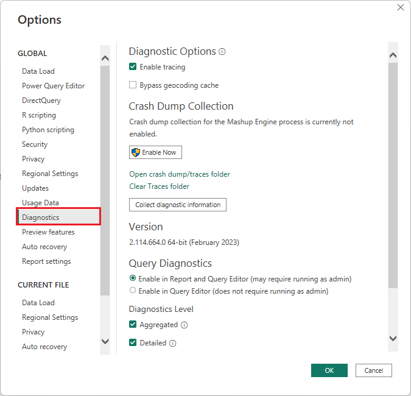
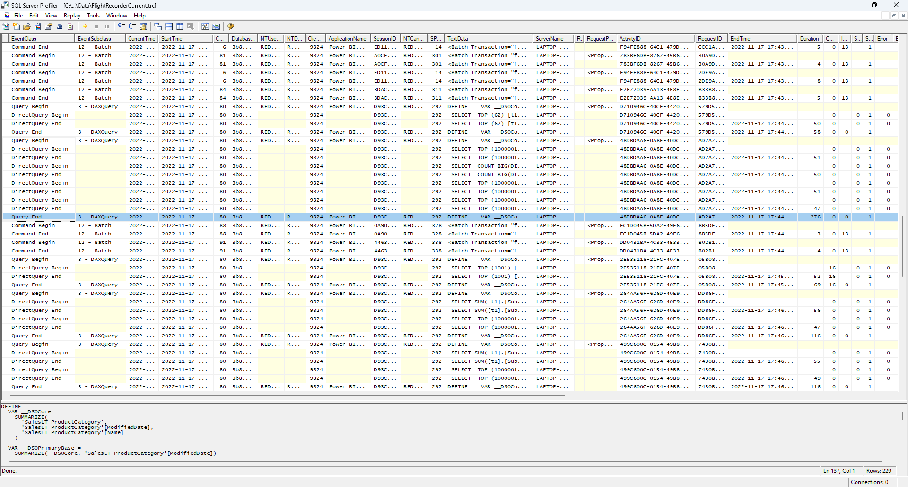
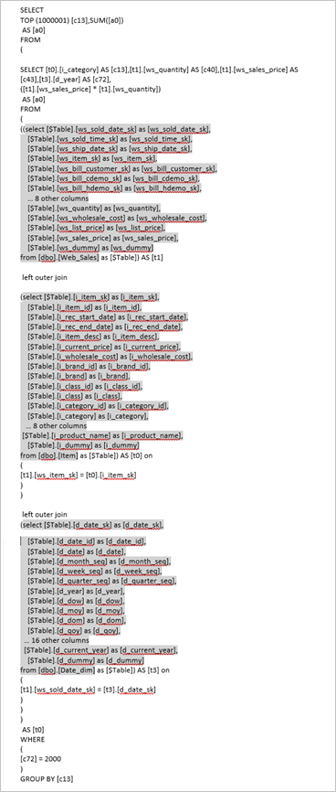

# Troubleshoot DirectQuery models in Power BI Desktop

This article helps you diagnose performance issues with Power BI DirectQuery data models you develop in Power BI Desktop or the Power BI service. The article also describes how to get detailed information to help you optimize reports.

You should start any diagnosis of performance issues in Power BI Desktop, rather than in the Power BI service or Power BI Report Server. Performance issues often depend on the performance level of the underlying data source. You can more easily identify and diagnose these issues in the isolated Power BI Desktop environment, without involving components like an on-premises gateway.

If you don't find the performance issues in Power BI Desktop, you can focus your investigation on the specifics of the report in the Power BI service.

You should also try to isolate issues to an individual visual before you look at many visuals on a page.

## Performance Analyzer

[Performance Analyzer](../create-reports/desktop-performance-analyzer.md) is a useful tool for identifying performance issues throughout the troubleshooting process. If you can identify a single sluggish visual on a page in Power BI Desktop, you can use Performance Analyzer to determine what queries Power BI Desktop sends to the underlying source.

You also might be able to view traces and diagnostic information that the underlying data sources emit. Such traces can contain useful information about the details of how the query executed, and how to improve it.

Even without traces from the source, you can view the queries Power BI sent, along with their execution times.

>[!NOTE]
>For DirectQuery SQL-based sources, Performance Analyzer shows queries only for SQL Server, Oracle, and Teradata data sources.

## Trace file

By default, Power BI Desktop logs events during a given session to a trace file called *FlightRecorderCurrent.trc*. You can find the trace file for the current session in the *AppData* folder for the current user, at *\<User>\AppData\Local\Microsoft\Power BI Desktop\AnalysisServicesWorkspaces*.

The following DirectQuery data sources write all the queries that Power BI sends them to the trace file. The log might support other DirectQuery sources in the future.

- SQL Server
- Azure SQL Database
- Azure Synapse Analytics (formerly SQL Data Warehouse)
- Oracle
- Teradata
- SAP HANA

To easily get to the trace file folder in Power BI Desktop, select **File** > **Options and settings** > **Options**, and then select **Diagnostics**.



Under **Crash Dump Collection**, select the **Open crash dump/traces folder** link to open the *\<User>\AppData\Local\Microsoft\Power BI Desktop\Traces* folder.

Navigate to that folder's parent folder, and then open the *AnalysisServicesWorkspaces* folder, which contains one workspace subfolder for every open instance of Power BI Desktop. The subfolder names have integer suffixes, such as *AnalysisServicesWorkspace2058279583*.

Each *AnalysisServicesWorkspace* folder includes a *Data* subfolder that contains the trace file *FlightRecorderCurrent.trc* for the current Power BI session. This folder disappears when the associated Power BI Desktop session ends.

You can open the trace files by using the SQL Server Profiler tool, which you can get as part of the free [SQL Server Management Studio (SSMS) download](/sql/ssms/download-sql-server-management-studio-ssms). After you download and install SQL Server Management Studio, open SQL Server Profiler.

[ ](media/desktop-directquery-troubleshoot/desktop-directquery-troubleshoot-sql-server-profiler-blank.png#lightbox)

To open a trace file:

1. In SQL Server Profiler, select **File** > **Open** > **Trace File**.

1. Navigate to or enter the path to the trace file for the current Power BI session, such as *\<User>\AppData\Local\Microsoft\Power BI Desktop\AnalysisServicesWorkspaces\AnalysisServicesWorkspace2058279583\Data*, and open *FlightRecorderCurrent.trc*.

SQL Server Profiler displays all events from the current session. The following screenshot highlights a group of events for a query. Each query group has the following events:

- A `Query Begin` and `Query End` event, which represent the start and end of a DAX query generated by changing a visual or filter in the Power BI UI, or from filtering or transforming data in the Power Query Editor.

- One or more pairs of `DirectQuery Begin` and `DirectQuery End` events, which represent queries sent to the underlying data source as part of evaluating the DAX query.

[ ](media/desktop-directquery-troubleshoot/desktop-directquery-troubleshoot-sql-server-profiler-trace.png#lightbox)

Multiple DAX queries can run in parallel, so events from different groups can interleave. You can use the value of the `ActivityID` to determine which events belong to the same group.

The following columns are also of interest:

- **TextData:** The textual detail of the event. For `Query Begin` and `Query End` events, the detail is the DAX query. For `DirectQuery Begin` and `DirectQuery End` events, the detail is the SQL query sent to the underlying source. The **TextData** value for the currently selected event also appears in the pane at the bottom of the screen.
- **EndTime:** The time when the event completed.
- **Duration:** The duration, in milliseconds, it took to run the DAX or SQL query.
- **Error:** Whether an error occurred, in which case the event also displays in red.

The preceding image narrows some of the less interesting columns, so you can see the more interesting columns more easily.

Follow this approach to capture a trace to help diagnose a potential performance issue:

1. Open a single Power BI Desktop session, to avoid the confusion of multiple workspace folders.

1. Do the set of actions of interest in Power BI Desktop. Include a few more actions, to ensure that the events of interest flush into the trace file.

1. Open SQL Server Profiler and examine the trace. Remember that closing Power BI Desktop deletes the trace file. Also, further actions in Power BI Desktop don't immediately appear. You must close and reopen the trace file to see new events.

Keep individual sessions reasonably small, perhaps 10 seconds of actions, not hundreds. This approach makes it easier to interpret the trace file. There's also a limit on the size of the trace file, so for long sessions, there's a chance of early events dropping.

## Query and subquery format

The general format of Power BI Desktop queries is to use subqueries for each model table the queries reference. The Power Query Editor query defines the subselect queries. For example, assume you have the following [TPC-DS](https://www.tpc.org/tpcds/default5.asp) tables in a SQL Server relational database:


In the Power BI visual, the following expression defines the `SalesAmount` measure:

```dax

SalesAmount = SUMX(Web_Sales, [ws_sales_price] * [ws_quantity])

```


Refreshing the visual produces the T-SQL query in the following image. There are three subqueries for the `Web_Sales`, `Item`, and `Date_dim` model tables. Each query returns all the model table columns, even though the visual references only four columns.

These shaded subqueries are the exact definition of the Power Query queries. This use of subqueries doesn't affect performance for the data sources DirectQuery supports. Data sources like SQL Server optimize away the references to the other columns.

One reason Power BI uses this pattern is so you can define a Power Query query to use a specific query statement. Power BI uses the query as provided, without an attempt to rewrite it. This pattern restricts using query statements that use Common Table Expressions (CTEs) and stored procedures. You can't use these statements in subqueries.



## Gateway performance

For information about troubleshooting gateway performance, see [Troubleshoot gateways - Power BI](service-gateway-onprem-tshoot.md).

## Related content

For more information about DirectQuery, check out the following resources:

- [Use DirectQuery in Power BI Desktop](desktop-use-directquery.md)
- [Data sources supported by DirectQuery](power-bi-data-sources.md)
- [DirectQuery models in Power BI Desktop](desktop-directquery-about.md)
- [DirectQuery model guidance in Power BI Desktop](../guidance/directquery-model-guidance.md)

Questions? [Try asking the Power BI Community](https://community.powerbi.com/)
