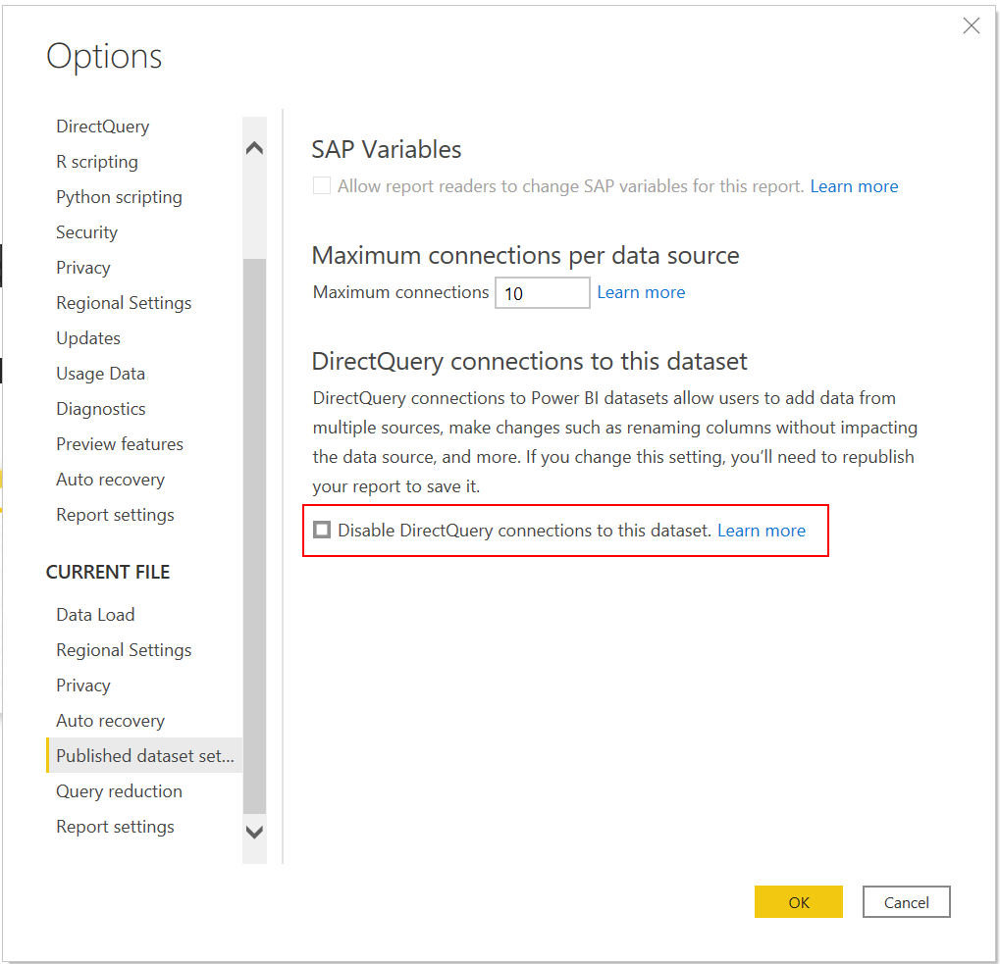

# Managing DirectQuery connections to a published dataset

By default, when a dataset is published to the Power BI service, a DirectQuery connection can be made to it, assuming proper permissions. This connection can be used to create new composite models on top of the dataset.

In some situations, however, you need to stop these connections from happening. This is especially important in the composite models scenario, where you might want to prohibit new composite models to be created on top of the dataset (so-called chaining). By disabling DirectQuery connections to a dataset your are effectively ending the chain or stopping it from forming in the first place.

> [!NOTE]
> Power BI will honor this setting and disable making DirectQuery connections to a dataset, but third party tools might not and still allow users to make DirectQuery connectoins to a dataset even if you disabled it.

## Disabling DirectQuery connections to a dataset using Power BI Desktop
In order to disable DirectQuery connections to a dataset go to **File > Options and settings > Options > Current File > Published dataset settings**. On this page, check the box for 'Disable DirectQuery connections to this dataset' and click 'OK'.

## Disabling DirectQuery connections to a dataset using third-party tools
Using third party tools, you can disable DirectQuery connections to a dataset by setting the `DiscourageCompositeModels` property on a Model to `True`.

## Next steps
- [Using DirectQuery in Power BI](desktop-directquery-about.md)
- [Datasets in the Power BI service](service-dataset-modes-understand.md)
- [Use composite models in Power BI Desktop](../transform-model/desktop-composite-models.md)
- More questions? [Try asking the Power BI Community](https://community.powerbi.com/)