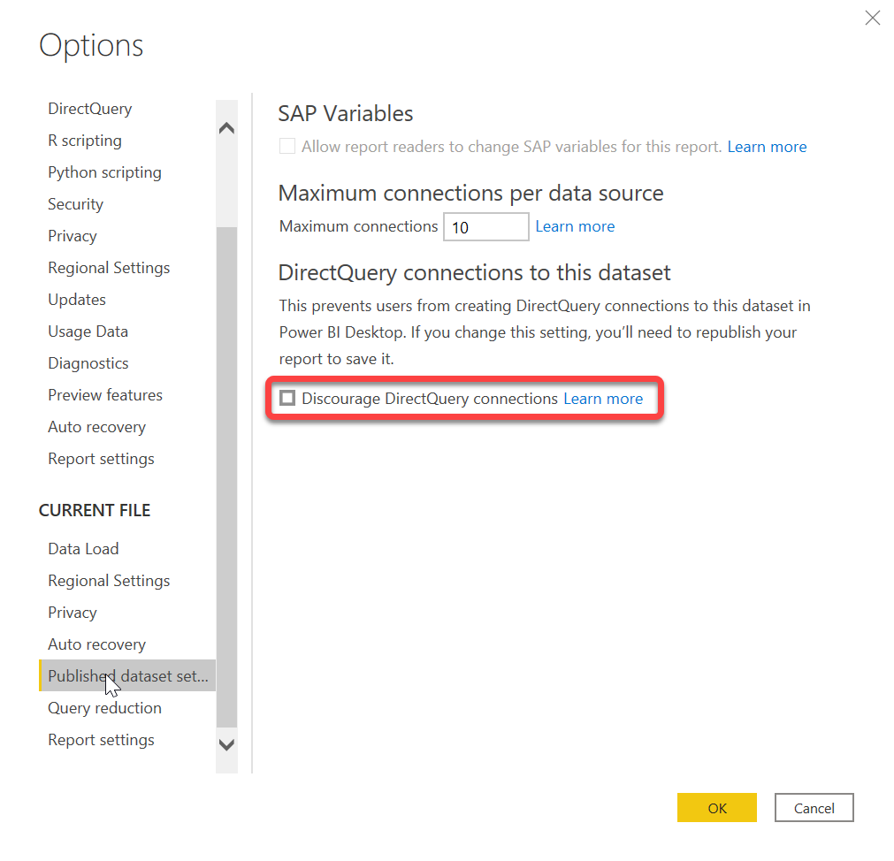

# Manage DirectQuery connections to a published dataset

By default, when you publish a dataset to the Power BI service, you can make a DirectQuery connection to it, assuming you have proper permissions. You can use this connection to create new composite models on top of the dataset.

In some situations, however, you need to discourage these connections from happening. Discouraging these connections is especially important in the composite models scenario, where you might want to prohibit creation of new composite models on top of the dataset (so-called *chaining*). By discouraging DirectQuery connections to a dataset, you're effectively ending the chain or stopping it from forming in the first place.

> [!NOTE]
> Power BI honors this setting and disables making DirectQuery connections to a dataset, but third-party tools might not and still allow users to make DirectQuery connections to a dataset even if you disabled it.

## Use Power BI Desktop to discourage DirectQuery connections to a dataset

1. To discourage DirectQuery connections to a dataset, go to **File > Options and settings > Options > Current File > Published dataset settings**. 
2. On this page, choose the **Discourage DirectQuery connections** option, and select **OK**.

    

## Use third-party tools to discourage DirectQuery connections to a dataset
Using third-party tools, you can discourage DirectQuery connections to a dataset by setting the `DiscourageCompositeModels` property on a model to `True`.

## Next steps
- [Using DirectQuery in Power BI](desktop-directquery-about.md)
- [Datasets in the Power BI service](service-dataset-modes-understand.md)
- [Use composite models in Power BI Desktop](../transform-model/desktop-composite-models.md)
- More questions? [Try asking the Power BI Community](https://community.powerbi.com/)
