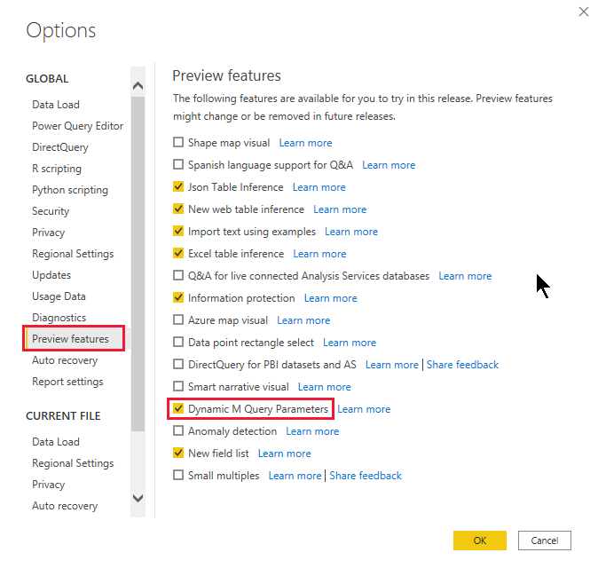
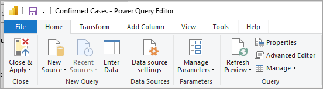

# Dynamic M query parameters in Power BI Desktop (preview)

With **Dynamic M Query Parameters**, model authors can let **report viewers** to use filters or slicers to set the value(s) for an [M Query Parameter](/power-query/power-query-query-parameters), which can be especially useful for query performance optimizations. With Dynamic M Query Parameters, model authors have more control over how filter selections get incorporated into DirectQuery source queries. 

When model authors understand the intended semantics of their filters, they often know how to write efficient queries against their data source, and can thus ensure filter selections get incorporated into source queries at the right point to achieve their intended results with improved performance.

Watch Justyna explain and use Dynamic M Query Parameters, and then try it out yourself. 

> [!VIDEO https://www.microsoft.com/videoplayer/embed/RE4M2hq]

## Enabling Dynamic M query parameters

**Dynamic M Query Parameters** are currently in preview, and must be enabled to be used. On the **File** ribbon, select **Options and settings** > **Options** and then select **Preview features** from the left pane. From there, make sure the **Dynamic M Query Parameters** checkbox is selected. You may need to restart Power BI Desktop for the change to be enabled.



As a prerequisite for this feature, you must have a valid [M Query Parameter](/power-query/power-query-query-parameters) created and referred in one or more Direct Query tables. 

> [!NOTE]
> Be sure to check the [Considerations and limitations](#considerations-and-limitations) section in this article, since not all DirectQuery sources are supported with this feature.

Let's step through an example for passing a **single value** to a parameter dynamically:

1. In Power BI Desktop, select **Home** > **Transform data** > **Transform data** to open the Power Query Editor. Select **New Parameters** under the **Manage Parameters** button in the ribbon.

    

2. Then fill out the following information about the Parameter.

    

3. Click **New** again if you have more parameters to add.

    

4. Once you've created the parameters, you can reference them in the M query. To modify the M Query, open the Advanced editor while you have the Query that you want to modify selected:

    

5. Next, reference the parameters in the M Query, highlighted in yellow in the following image. 

    

6. Now that you have created the parameters and referenced them in the M Query, next, you will need to create a table with a column that provides the possible values available for that parameter. This will allow it such that the parameters are dynamically set based on filter selection. In this example, we want our *StartTime* Parameter and *EndTime* Parameter to be dynamic. Since these parameters are requiring a Date/Time parameter, I want to generate date inputs that can be used to set the date for the parameter. To start, we create a new table:

    

7. Here's the first table I created for the values for *StartTime* Parameter:

    ```StartDateTable = CALENDAR (DATE(2016,1,1), DATE(2016,12,31))```

    

8. Here's the second table I created for the values for EndTime Parameter:

    ```EndDateTable = CALENDAR (DATE(2016,1,1), DATE(2016,12,31))```

    

    > [!NOTE]
    > We recommend using a different column name that is not in an actual table. If they are same name, the selected value will be applied as a filter to the actual query.

9. Now that the tables with the *Date* field have been created, we can bind each field to a parameter. Binding the field to a parameter essentially means that as the selected value for the field changes, the value will get passed to the parameter and update the query where the parameter is referenced. So to bind field, go to the **Modeling** tab, select the newly created field, and then go to the **Advanced** properties:

    > [!NOTE]
    > Column Data type should match with M parameter type.

    

10. Select the dropdown under **Bind to parameter** and select the Parameter that you want to bind to the field:

    

    Since this example is for a single-select value (setting the parameter to a single value), you'll want to keep **Multi-select** set to **No**, which is the default:

    

    If your use cases require multi-selection (passing multi-values to a single parameter), you must toggle the switch to **Yes** and ensure that your M query is set up properly to accept multiple values in the M query. Here's an example for *RepoNameParameter*, which allows for multiple values:

    

11. You can repeat these steps if you have other fields to bind to other parameters:

    

12. Finally, you can reference this field in a slicer or as a filter:

    

If the mapped column is set to **No** for Multi-select, you must use either a single select mode in the slicer, or require single select in the filter card.

## Enable Select all

There are additional steps if you want end-users to be able to use the **Select all** option in the slicer or filter card. 
Let’s use the following scenario as an example. Within the **Model** tab of Power BI Desktop, you can see we have a field called **Country** (list of countries) that is bound to an M parameter called **countryNameMParameter**:


You’ll also notice that this parameter is enabled for **Multi-select** but not enabled for **Select all**. 
When we enable the **Select all** toggle, we’ll see an enabled input called **Select all value**:


The **Select all value** is used to refer to the Select all option in the M Query. This value is passed to parameter as a list that contains the value you defined for select all. Therefore, when you are defining this value or using the default value, you will need to make sure that this value is unique and does not exist in the field bound to the parameter. 
Once you have set the value or used the default value for Select all, you will then need to update the M Query to account for this Select all value. 


To edit the M Query, you will need first launch the **Power Query Editor** and then select **Advanced Editor** in the Query section:



In the **Advanced Editor**, we need to add a Boolean expression that will evaluate to true if the parameter is enabled for **Multi-select** and contains the **Select all value** (else return false). For our example that would look like this: 


Next, we will need to incorporate the result of this Select all Boolean expression into the source query. For our example, we have a Boolean query parameter in the source query called includeAllCountries that is set to the result of the Boolean expression from the previous step. We then use this parameter in a filter clause in the query, such that false for the Boolean will filter to the selected country name(s) and a true would effectively apply no filter:


For reference here is the full query we used: 

```
let
    selectedcountryNames = if Type.Is(Value.Type(countryNameMParameter), List.Type) then 
      Text.Combine({"'", Text.Combine(countryNameMParameter, "','") , "'"})
    else
      Text.Combine({"'" , countryNameMParameter , "'"}),

    selectAllCountries = if Type.Is(Value.Type(countryNameMParameter), List.Type) then 
      List.Contains(countryNameMParameter, "__SelectAll__")
    else
      false,

    KustoParametersDeclareQuery = Text.Combine({"declare query_parameters(", 
                                 "startTimep:datetime = datetime(", DateTime.ToText(StartTimeMParameter, "yyyy-MM-dd hh:mm"), "), " , 
                                 "endTimep:datetime = datetime(", DateTime.ToText(EndTimeMParameter, "yyyy-MM-dd hh:mm:ss"), "), ",   
                                 "includeAllCountries: bool = ", Logical.ToText(selectAllCountries) ,",",
                                 "countryNames: dynamic = dynamic([", selectedcountryNames, "]));" }),

   ActualQueryWithKustoParameters = 
                                "Covid19
                                | where includeAllCountries or Country in(countryNames)
                                | where Timestamp > startTimep and Timestamp < endTimep
                                | summarize sum(Confirmed) by Country, bin(Timestamp, 30d)",

    finalQuery = Text.Combine({KustoParametersDeclareQuery, ActualQueryWithKustoParameters}),

    Source = AzureDataExplorer.Contents("help", "samples", finalQuery, [MaxRows=null, MaxSize=null, NoTruncate=null, AdditionalSetStatements=null]),
    #"Renamed Columns" = Table.RenameColumns(Source,{{"Timestamp", "Date"}, {"sum_Confirmed", "Confirmed Cases"}})
in
    #"Renamed Columns"
```

Once you have updated your M Query to account for this new **Select all value**, you can now use the **Select all** function in slicers or filters: 


## Potential security risk

When you allow report readers to dynamically set the values for the M Query parameters, they may be able to access additional data or trigger modifications to the source system using **injection attacks**, depending how the parameters are referenced in the M Query and what values are passed to that parameter.

For example, let's say you have a parameterized Kusto query constructed like the following:

```
Products
| where Category == [Parameter inserted here] & HasReleased == 'True'
 | project ReleaseDate, Name, Category, Region```
```

You may have no issues with a friendly user who passes an appropriate value for the parameter, for example, *Games*:

```
| where Category == 'Games' & HasReleased == 'True'
```

However, an attacker may be able to pass a value that modifies the query to get access to more data, for example, *'Games' //*:

```
Products
| where Category == 'Games'// & HasReleased == 'True'
| project ReleaseDate, Name, Category, Region
```

In this example, the attacker can get access to information on games that have not been released yet by changing part of the query into a comment.

**How to mitigate the risk**

To mitigate the security risk, it's best to avoid string concatenation of M parameter values within the query.  Instead, consume those parameter values in M operations that fold to the source query, so that the M engine and connector construct the final query. Alternatively, if available, make use of a parameter passing mechanism built-in to the source query language and connectors. For example, [Azure Data Explorer](/azure/data-explorer/kusto/query/queryparametersstatement?pivots=azuredataexplorer) has built-in query parameter capabilities that are designed to protect against injection attacks.

Here are some examples:

* Example using M query's filtering operations:
    ```
    Table.SelectRows(Source, (r) =\&gt; r[Columns] = Parameter)
    ```

* Example declaring the parameter in the source query (or passing the parameter value as an input to a source query function):
    ```
    declare query\_parameters (Name of Parameter : Type of Parameter);
    ```

## Considerations and limitations

There are some considerations and limitations to consider when using dynamic M query parameters:

* A single parameter cannot be bound to multiple fields nor vice-versa.
* The feature is only supported for M based data sources. The following DirectQuery sources are not supported:
    * T-SQL based data sources: SQL Server, Azure SQL Database, Synapse SQL pools (such as Azure Synapse Analytics (formerly SQL Data Warehouse)), and Synapse SQL OnDemand pools
    * Live connect data sources: Azure Analysis Services, SQL Server Analysis Services, Power BI Datasets
    * Other unsupported data sources: Oracle, Teradata, and Relational SAP Hana, PostgreSQL
    * Partially supported through XMLA / TOM endpoint programmability: SAP BW and SAP Hana 
* [Aggregations](../transform-model/desktop-aggregations.md) are not supported with the feature

* Unsupported out-of-box parameter types are the following:
  * Any
  * Duration
  * True/False
  * Binary

* Unsupported filters:
  * Relative time slicer or filter
  * Relative date
  * Hierarchy slicer
  * Multi-field include filter
  * Exclude filter / Not filters
  * Cross-highlighting
  * Drill-down filter
  * Cross drill filter
  * Top N filter
* Unsupported operations:
  * And
  * Contains
  * Less than
  * Greater than
  * Starts with
  * Does not start with
  * Is not
  * Does not contains
  * Is blank
  * Is not blank


## Next steps

You can do all sorts of things with Power BI Desktop. For more information on its capabilities, check out the following resources:

* [About using DirectQuery in Power BI](desktop-directquery-about.md)
* [What is Power BI Desktop?](../fundamentals/desktop-what-is-desktop.md)
* [Query overview with Power BI Desktop](../transform-model/desktop-query-overview.md)
* [Data types in Power BI Desktop](desktop-data-types.md)
* [Shape and combine data with Power BI Desktop](desktop-shape-and-combine-data.md)
* [Common query tasks in Power BI Desktop](../transform-model/desktop-common-query-tasks.md)
