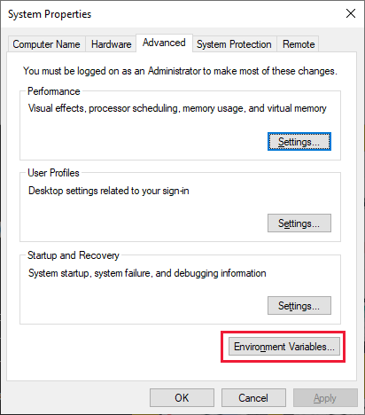

# Troubleshoot Power BI Desktop startup

This article describes and provides remedies for several circumstances where Power BI can't open or can't connect to data sources.

## Issues with opening encrypted PBIX files

You can't open encrypted PBIX files by using a Power BI Desktop version that doesn't support information protection. If you need to continue using Power BI Desktop, update to a version that supports information protection.

**Solution:** [Select this link to directly download the latest Power BI Desktop installation executable](https://www.microsoft.com/download/confirmation.aspx?id=58494). The latest version of Power BI Desktop supports information protection and can decrypt and open any encrypted PBIX file. 

## On-premises data gateway issues

Users who installed and are running earlier versions of the Power BI on-premises data gateway can be blocked from opening Power BI Desktop. Previous versions of the on-premises data gateway placed administrative policy restrictions on named pipes on the local machine.

**Solution:** To resolve the issue associated with the on-premises data gateway and enable Power BI Desktop to open, use one of the following options:

- Install the latest version of the Power BI on-premises data gateway.

  The latest version of the Power BI on-premises data gateway doesn't place named pipe restrictions on the local machine, and allows Power BI Desktop to open properly. If you need to continue using the Power BI on-premises data gateway, the recommended resolution is to update it. [Select this link to directly download the latest Power BI on-premises data gateway installation executable](https://www.microsoft.com/download/details.aspx?id=53127). 

- Uninstall or stop the Power BI on-premises data gateway service. You can uninstall the Power BI on-premises data gateway if you no longer need it. Or you can stop the Power BI on-premises data gateway service, which removes the policy restriction and allows Power BI Desktop to open.

- Run Power BI Desktop with administrator privileges.

  You can launch Power BI Desktop as an administrator, which also allows Power BI Desktop to successfully open. It's still recommended to install the latest version of the Power BI on-premises data gateway.

  Power BI Desktop is a multiprocess architecture, and several of these processes communicate by using Windows named pipes. Other processes might interfere with those named pipes. The most common reason for such interference is security, including situations where antivirus software or firewalls block the pipes or redirect traffic to a specific port.

  Opening Power BI Desktop with administrator privilege might resolve that issue. If you can't open Power BI Desktop with administrator privilege, ask your administrator which security rules are preventing named pipes from properly communicating. Then add Power BI Desktop and its subprocesses to the allowlists.

## Issues connecting to SQL Server

If you attempt to connect to a SQL Server database using a different account than the account you have logged-in on your computer, using _Windows > Use alternate credentials_, you might see a message similar to the following error:

**An error happened while reading data from the provider: 
'Could not load file or assembly 'System.EnterpriseServices, Version=4.0.0.0, Culture=neutral, PublicKeyToken=xxxxxxxxxxxxx' or one of its dependencies. Either a required impersonation level was not provided, or the provided impersonation level is invalid. (Exception from HRESULT: 0x80070542)'**

**Cause:** This is due to the way your local system and accounts are configured by your IT department. If the alternate Windows account you're trying to use is not allowed access to the system, then it is blocked from registering the needed DLLs for Power BI Desktop to establish the connection. 

**Solution:** You can often resolve the issue if you open Power BI Desktop as an administrator before you make the SQL Server connection, or if you ask your system administrators to provide the alternate windows account the correct permissions for your computer. Opening Power BI Desktop as an administrator and establishing the connection registers the required DLLs, after that, you no longer have to open Power BI Desktop as an administrator for this connection. However, if you choose to connect to SQL server with yet another different alternate Windows credentials, you have to open Power BI Desktop as an administrator every time you connect.

## "Unable to sign in" issues

You might see a message similar to the following error:

**Unable to sign in. Sorry, we encountered an error while trying to sign you in. Details: The underlying connection was closed: Could not establish trust relationship for the SSL/TLS secure channel.**

**Solution:** Disable the certification revocation check at **Options and settings** > **Options** > **Security** > **Certification Revocation**. For details, see [Certificate revocation check, Power BI Desktop](../create-reports/desktop-certificate-revocation.md). 

## Issues starting the Microsoft Store version of Power BI Desktop

You might see a message similar to the following error:

**Hmmmm... can't reach this page. ms-pbi.pbi.microsoft.com's server IP address could not be found. Application event log message - The description for Event ID 1 from source**

The message might include further information, such as the following details:

**Either the component that raises this event is not installed on your local computer or the installation is corrupted. You can install or repair the component on the local computer.**

**Solution:** Reinstall WebView2 by using the following steps, which don't require elevated administrative permissions.

1. Uninstall webview2.
1. Reinstall webview2 by using this [installation link](https://go.microsoft.com/fwlink/p/?LinkId=2124703).

## Issues related to WebView2

Rarely, Power BI Desktop might fail to start and displays a gray window, or an error message that mentions **WebView2**.

:::image type="content" source="media/desktop-error-launching-desktop/webview2-error.png" alt-text="Screenshot of an error message mentioning WebView2.":::

Most cases are caused by a program on your machine, usually antivirus software. To verify whether a program is causing the issue, take the following steps:

1. Close Power BI Desktop.
1. Open Windows **Settings** > **About** > **Advanced system settings** and select **Environment Variables**.

   

   Select **New** under **User variables** and add variable name *WEBVIEW2_ADDITIONAL_BROWSER_ARGUMENTS* with the value *--disable-features=RendererCodeIntegrity*.

   :::image type="content" source="media/desktop-error-launching-desktop/environment-variable-new-user-variable.png" alt-text="Screenshot of the new User variable and value.":::
 
1. Start Power BI Desktop and verify that it starts successfully this time.
1. Delete the environment variable you set.

**Solution:** If the preceding steps fixed the issue, disable any software that might be interfering with Power BI Desktop startup, or provide an exemption for the WebView2 process.

If you still have issues, submit a support incident to [Power BI support](https://support.powerbi.com), and provide the following information:

- **WebView2 error reports.** If you use the Microsoft Store version of Power BI Desktop, the error reports are at *c:\\Users\\\<username>\\Microsoft\Power BI Desktop Store App\\WebView2\\EBWebView\\Crashpad\\reports* or *c:\\Users\\\<username>\\Microsoft\Power BI Desktop Store App\\WebView2Elevated\\EBWebView\\Crashpad\\reports*.

  If you use the downloaded *.exe* version of Power BI Desktop, the error reports are at *c:\\Users\\\<username>\\AppData\Local\Microsoft\Power BI Desktop\\WebView2\\EBWebView\\Crashpad\\reports* or *c:\\Users\\\<username>\\AppData\Local\Microsoft\Power BI Desktop\\WebView2Elevated\\EBWebView\\Crashpad\\reports*.
  
- **Your machine's Device ID,** from Windows **Settings** > **System** > **About**.

- **Installer and update logs.** Collect the following files from the following locations by copying and pasting the paths into File Explorer and then copying the files to another location. Some files have the same names, so be sure not to overwrite them but instead rename them when copying.

  |Path|File|
  |----|----|
  |%temp%\ | msedge_installer.log|
  |%ProgramData%\Microsoft\EdgeUpdate\Log\ | MicrosoftEdgeUpdate.log|
  |%windir%\Temp\ | MicrosoftEdgeUpdate.log|
  |%allusersprofile%\Microsoft\EdgeUpdate\Log\ | MicrosoftEdgeUpdate.log|
  |%systemroot%\Temp\ | msedge_installer.log|
  |%localappdata%\Temp\ | msedge_installer.log|
  |%localappdata%\Temp\ | MicrosoftEdgeUpdate.log|

- **Event Viewer logs.** Start Event Viewer from the **Start** menu. In Event Viewer, go to **Applications and Services log** > **Microsoft** > **Windows** > **CodeIntegrity** > **Operational**. Right-click **Operational** in the left pane and choose **Save All Events As**. Store the file somewhere you can retrieve it. Do the same for **Windows Logs** > **Application**.

  :::image type="content" source="media/desktop-error-launching-desktop/eventviewer-save-all-events-as.png" alt-text="Screenshot of Event viewer showing the context menu with Save All Events As highlighted.":::

- **The ClientState key from Registry Editor.** Open Registry Editor by searching for *regedit* in Windows Search or the **Start** menu. In Registry Editor, navigate to **HKEY_LOCAL_MACHINE\\SOFTWARE\\WOW6432Node\\Microsoft\\EdgeUpdate\\ClientState**. Right-click **ClientState** in the left pane, choose **Export**, and save the file.

  :::image type="content" source="media/desktop-error-launching-desktop/export-registry-key.png" alt-text="Screenshot of Registry Editor showing the context menu with Export highlighted.":::

- **Process traces.** Follow these steps to collect process traces by using Process Monitor:

  1. Download [Process Monitor](/sysinternals/downloads/procmon), extract the downloaded file, and run *Procmon.exe*.

  1. Stop capturing by selecting the open-square **Capture** button.

     :::image type="content" source="media/desktop-error-launching-desktop/procmon-stop.png" alt-text="Screenshot of Process Monitor with Capture button highlighted to stop capturing.":::

  1. Clear all traces by selecting the **Clear** garbage can button.

     :::image type="content" source="media/desktop-error-launching-desktop/procmon-clear.png" alt-text="Screenshot of Process Monitor with Clear button highlighted.":::

  1. Start capturing by selecting the **Capture** button.

     :::image type="content" source="media/desktop-error-launching-desktop/procmon-start.png" alt-text="Screenshot of Process Monitor with Capture button highlighted to start capturing.":::

  1. Launch Power BI Desktop and wait for the error to appear.

  1. Stop the capture by selecting the **Capture** button.

     :::image type="content" source="media/desktop-error-launching-desktop/procmon-stop.png" alt-text="Screenshot of Process Monitor with Capture button highlighted to stop capturing again.":::

  1. Save the traces by choosing **File** > **Save**. In the **Save to File** dialog box, select **All events** and **Native Process Monitor Format (PML)**, provide a path for the file, and then select **OK**.

     :::image type="content" source="media/desktop-error-launching-desktop/procmon-save.png" alt-text="Screenshot of Process Monitor Save to File dialog with All events and Native Process Monitor Format (PML) highlighted.":::

  1. Share the traces with the support team on request.

- **Extra diagnostic information.** Use the Windows Assessment and Deployment Kit to collect extra information.

  1. Download the [Windows Assessment and Deployment Kit](/windows-hardware/get-started/adk-install).

  1. After downloading, start *adksetup.exe*, select **Install the Windows Assessment and Development Kit to this computer**, and then select **Next**:

     :::image type="content" source="media/desktop-error-launching-desktop/install-adk.png" alt-text="Screenshot of the installer showing Install the Windows Assessment and Development Kit to this computer selected.":::
    
  1. Continue the wizard. On the **Select the features you want to install** page, select **Windows Performance Toolkit**, and then select **Install**:

     :::image type="content" source="media/desktop-error-launching-desktop/install-adk-features.png" alt-text="Screenshot showing the Select the features you want to install page with Windows Performance Toolkit selected.":::

  1. Complete the installation, and then start Windows Performance Recorder.
  1. Download the [EdgeWebView2_General_EventsOnly.wprp](https://github.com/microsoft/powerbi-troubleshooting/raw/main/WebView2/EdgeWebView2_General_EventsOnly.zip) file to your machine and unpack it.
  1. In Windows Performance Recorder, choose **More options**.

     :::image type="content" source="media/desktop-error-launching-desktop/performance-recorder-more-options.png" alt-text="Screenshot of Windows Performance Recorder with More options highlighted.":::

  1. Choose **Add Profiles** to add the **EdgeWebView2_General_EventsOnly.wprp** profile that you downloaded in the previous step.

     :::image type="content" source="media/desktop-error-launching-desktop/performance-recorder-load-profile.png" alt-text="Screenshot of the Windows Performance Recorder with EdgeWebView2_General_EventsOnly profile loaded.":::

  1. Choose **Start** to start recording.

     :::image type="content" source="media/desktop-error-launching-desktop/performance-recorder-start.png" alt-text="Screenshot of Windows Performance Recorder with Start highlighted.":::

  1. With the recording running, start Power BI Desktop and make sure the startup issue occurs.

  1. When you're done, choose **Save** to stop the recording and save the results to your computer.

     :::image type="content" source="media/desktop-error-launching-desktop/performance-recorder-save.png" alt-text="Screenshot of Windows Performance Recorder with Save highlighted.":::

  1. Provide all information you collected to the support team on request.

## Data connection time-outs

When you try to create a new connection or connect to an existing Power BI semantic model, Power BI Desktop might time out without establishing the connection. The connection spinner might continue to turn, but the connection never completes.

This situation can happen if your machine has a security product such as Digital Guardian or other security products installed. In some cases, the installed security product can interfere with outgoing network connection request calls, causing the connection attempt to time out or fail.

**Solution:** Try disabling the security product, and then attempt the connection again. If the connection succeeds after you disable the security product, you know that the security product was probably the cause of the connection failure.

## Other launch issues

The Power BI documentation team strives to cover as many Power BI Desktop issues as possible. The team regularly looks at issues that might affect many customers, and includes them in articles.

If your issue isn't related to an on-premises data gateway, or if the resolutions in this article don't work, you can submit a support incident to [Power BI support](https://support.powerbi.com).

Whenever you experience issues with Power BI Desktop, it's helpful to turn on tracing and gather log files. Log files can help isolate and identify the issue. To turn on tracing in Power BI Desktop, choose **File** > **Options and settings** > **Options**, select **Diagnostics**, and then select **Enable tracing**. Power BI Desktop must be running to set this option, but it's helpful for any future issues associated with opening Power BI Desktop.

## Related content

* [Get Power BI Desktop](../fundamentals/desktop-get-the-desktop.md)
