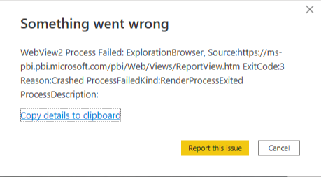

# Troubleshoot opening Power BI Desktop

This article describes and provides a remedy for a number of circumstances where Power BI cannot open. 

## Resolve issues with opening encrypted PBIX files

You cannot open encrypted PBIX files using a Power BI Desktop version that does not support information protection.

If you need to continue using Power BI Desktop, the recommended resolution is to update it to a version that supports information protection. You can download the [latest version of Power BI Desktop](https://www.microsoft.com/download/confirmation.aspx?id=58494) (this link is a direct download link to the installation executable). The latest version of Power BI Desktop supports information protection and can decrypt and open any encrypted PBIX file.

## Resolve issues with the On-premises data gateway and Power BI Desktop

In Power BI Desktop, users who installed and are running previous versions of the *Power BI On-premises data gateway* can be blocked from opening Power BI Desktop, because of administrative policy restrictions that the Power BI on-premises gateway placed on named pipes on the local machine.

You have three options to resolve the issue associated with the On-premises data gateway, and to enable Power BI Desktop to open:

### Resolution 1: Install the latest version of Power BI On-premises data gateway

The latest version of the Power BI On-premises data gateway doesn't place named pipe restrictions on the local machine, and allows Power BI Desktop to open properly. If you need to continue using Power BI On-premises data gateway, the recommended resolution is to update it. You can download the [latest version of Power BI On-premises data gateway](https://www.microsoft.com/download/details.aspx?id=53127). The link is a direct download link to the installation executable.

### Resolution 2: Uninstall or stop the Power BI On-premises data gateway Microsoft service

You can uninstall the Power BI On-premises data gateway if you no longer need it. Or you can stop the Power BI On-premises data gateway Microsoft service, which removes the policy restriction and allows Power BI Desktop to open.

### Resolution 3: Run Power BI Desktop with administrator privilege

You can instead successfully launch Power BI Desktop as administrator, which also allows Power BI Desktop to successfully open. It's still recommended that you install the latest version of Power BI On-premises data gateway, as described earlier.

Power BI Desktop is engineered as a multiprocess architecture, and several of these processes communicate using Windows named pipes. There may be other processes that interfere with those named pipes. The most common reason for such interference is security, including situations where antivirus software or firewalls may block the pipes or redirect traffic to a specific port. Opening Power BI Desktop with administrator privilege may resolve that issue. If you can't open with administrator privilege, ask your administrator to determine which security rules are preventing named pipes from properly communicating. Then, add Power BI Desktop and its respective subprocesses to allowlists.

## Resolve issues when connecting to SQL Server

When you attempt to connect to a SQL Server database, you may come across an error message similar to the following text:

`"An error happened while reading data from the provider:`\
`'Could not load file or assembly 'System.EnterpriseServices, Version=4.0.0.0, Culture=neutral, PublicKeyToken=xxxxxxxxxxxxx' or one of its dependencies.`\
`Either a required impersonation level was not provided, or the provided impersonation level is invalid. (Exception from HRESULT: 0x80070542)'"`

You can often resolve the issue if you open Power BI Desktop as an administrator before you make the SQL Server connection.

After you open Power BI Desktop as an administrator and establish the connection, the required DLLs are registered properly. After that, opening Power BI Desktop as an administrator isn't necessary. In cases where you are connecting to SQL server with alternate windows credentials, you will have to open Power BI Desktop as an administrator every time you connect.

## "Unable to sign in" issue

You may see a message similar to this:

"Unable to sign in. Sorry, we encountered an error while trying to sign you in. Details: The underlying connection was closed: Could not establish trust relationship for the SSL/TLS secure channel."

**Solution**: You need to uncheck the **Enable certification revocation check**. See [Certificate revocation check, Power BI Desktop](../create-reports/desktop-certificate-revocation.md) for details. 

## Resolve issues starting the Microsoft Store version of Power BI Desktop

You may see a message similar to this:

"Hmmmm... can't reach this page. ms-pbi.pbi.microsoft.com's server IP address could not be found. Application event log message - The description for Event ID 1 from source"

It may include further information, such as the following:

"Either the component that raises this event is not installed on your local computer or the installation is corrupted. You can install or repair the component on the local computer."

**Solution**: Reinstall WebView2 with the following steps:

1. Uninstall webview2, which does not require elevated permissions (you don't have to be an administrator).
1. Install webview2 using the [installation link](https://go.microsoft.com/fwlink/p/?LinkId=2124703), which also does not require elevated permissions.

## Resolve issues related to WebView2

In rare cases, Power BI Desktop might fail to start at all. Instead, it might show a gray window and/or an error message that mentions 'WebView2':

The majority of the cases is caused by some program on your machine, mostly anti-virus software. To verify this is the case, please perform the following steps:
1. Close Power BI Desktop.
2. Open Windows **Settings** > **About** > **Advanced System Settings** and configure a new Environment Variable:

   

   Add `WEBVIEW2_ADDITIONAL_BROWSER_ARGUMENTS` to the User environment variables and set the value to `--disable-features=RendererCodeIntegrity`:

   :::image type="content" source="media/desktop-error-launching-desktop/environment-variable-new-user-variable.png" alt-text="New User Variable with name 'WEBVIEW2_ADDITIONAL_BROWSER_ARGUMENTS' and value '--disable-features=RendererCodeIntegrity'.":::
 
 3. Launch Power BI Desktop and verify it starts successfully this time.
 4. Delete the Environment Variable you have set above and disable any software that might be interfering or provide an exemption for the WebView2 process.

If you are still having issues, please  [reach out to us](#get-help-with-other-launch-issues) with the following information:
* WebView2 error reports. If you use the Microsoft Store version of Power BI Desktop, this information is stored in `c:\Users\[username]\Microsoft\Power BI Desktop Store App\WebView2\EBWebView\Crashpad\reports` or `c:\Users\[username]\Microsoft\Power BI Desktop Store App\WebView2Elevated\EBWebView\Crashpad\reports`. If you use the downloaded version of Power BI Desktop (EXE), this information is stored in `c:\Users\][username]\AppData\Local\Microsoft\Power BI Desktop\WebView2\EBWebView\Crashpad\reports` or `c:\Users\[username]\AppData\Local\Microsoft\Power BI Desktop\WebView2Elevated\EBWebView\Crashpad\reports`.
* Your machine's Device ID. This you can find in Windows **Settings** > **System** > **About**.
* Installer and update logs. Please collect the following files from the following locations by copying and pasting the path into File Explorer and copying the file to another location. Keep in mind that some files have the same name, so take care not to overwrite them but instead rename them when copying.

    |Path|File|
    |----|----|
    |%temp%\ | msedge_installer.log|
    |%ProgramData%\Microsoft\EdgeUpdate\Log\ | MicrosoftEdgeUpdate.log|
    |%windir%\Temp\ | MicrosoftEdgeUpdate.log|
    |%allusersprofile%\Microsoft\EdgeUpdate\Log\ | MicrosoftEdgeUpdate.log|
    |%systemroot%\Temp\ | msedge_installer.log|
    |%localappdata%\Temp\ | msedge_installer.log|
    |%localappdata%\Temp\ | MicrosoftEdgeUpdate.log|

* Event Viewer logs. To retrieve this, please start `Event Viewer` from your start menu, go to **Applications and Services log** > **Microsoft** > **Windows** > **CodeIntegrity** > **Operational**. Right click on `Operational` in the left bar and choose **Save All Events As...**. Store this file somewhere where you can retrieve it when asked.

    :::image type="content" source="media/desktop-error-launching-desktop/eventviewer-save-all-events-as.png" alt-text="Event viewer showing context menu with 'Save All Events As...' highlighted.":::

* Open **Registry Editor** by searching for `regedit` in Windows Search or in the start menu and navigate to `HKEY_LOCAL_MACHINE\SOFTWARE\WOW6432Node\Microsoft\EdgeUpdate\ClientState`. Right-click on the **ClientState** key in the left bar and choose **Export** and save the file:

    :::image type="content" source="media/desktop-error-launching-desktop/export-registry-key.png" alt-text="Registry Editor showing context menu with 'Export' highlighted.":::

* Process traces. For this, you will need to use [Process Monitor](/sysinternals/downloads/procmon). Please follow these steps to collect the process traces:

    1. Download [Process Monitor](/sysinternals/downloads/procmon), extract the downloaded file and run 'Procmon.exe'.

    2. Stop capturing by clicking the following button:

        :::image type="content" source="media/desktop-error-launching-desktop/procmon-stop.png" alt-text="Process Monitor with stop button highlighted.":::

    3. Clear all traces by clicking the following button:

        :::image type="content" source="media/desktop-error-launching-desktop/procmon-clear.png" alt-text="Process Monitor with garbage can icon highlighted.":::

    4. Start capturing by clicking the following button:

        :::image type="content" source="media/desktop-error-launching-desktop/procmon-start.png" alt-text="Process Monitor with start button highlighted.":::

    5. Launch Power BI Desktop and wait for the error to appear.

    6. Stop the capture by clicking the following button:

        :::image type="content" source="media/desktop-error-launching-desktop/procmon-stop.png" alt-text="Process Monitor with stop button highlighted.":::

    7. Save the traces by choosing **File** > **Save**, making sure to select **All events** and **Native Process Monitor Format (PML)** before choosing 'OK':

        :::image type="content" source="media/desktop-error-launching-desktop/procmon-save.png" alt-text="Process Monitor Save to File dialog with 'All events' and 'Native Process Monitor Format (PML) highlighted.":::

    8. Share the traces when asked.

* Extra diagnostic information. For this, you will need to have the [Windows Assessment and Deployment Kit](/windows-hardware/get-started/adk-install) installed. 

### Install the Windows Assessment and Deployment Kit

Please follow these steps to install the required tools:

1. Download the [Windows Assessment and Deployment Kit](/windows-hardware/get-started/adk-install).
    
2. After downloading, start `adksetup.exe` and select **Install the Windows Assessment and Development Kit to this computer** and select **Next**:

   :::image type="content" source="media/desktop-error-launching-desktop/install-adk.png" alt-text="Assessment and Deployment Kit installer showing Install the Windows Assessment and Development Kit to this computer option selected.":::
    
3. Continue the wizard until the **Select the features you want to install** page shows. On this page, make sure to select **Windows Performance Toolkit** and select **Install**:

   :::image type="content" source="media/desktop-error-launching-desktop/install-adk-features.png" alt-text="Assessment and Deployment Kit installer showing the Select the features you want to install page with Windows Performance Toolkit selected.":::

4. Complete the installation and then start **Windows Performance Recorder**.
5. Download the [EdgeWebView2_General_EventsOnly.wprp](https://github.com/microsoft/powerbi-troubleshooting/raw/main/WebView2/EdgeWebView2_General_EventsOnly.zip) file to your machine and unpack it.
6. In Windows Performance Recorder, choose **More options**:

   :::image type="content" source="media/desktop-error-launching-desktop/performance-recorder-more-options.png" alt-text="Windows Performance Recorder with More options highlighted.":::

7. Choose **Add Profiles...** to add the **EdgeWebView2_General_EventsOnly.wprp** profile that you downloaded in the previous step:

   :::image type="content" source="media/desktop-error-launching-desktop/performance-recorder-load-profile.png" alt-text="Windows Performance Recorder with EdgeWebView2_General_EventsOnly profile loaded.":::

8. Choose **Start** to start the recording:

   :::image type="content" source="media/desktop-error-launching-desktop/performance-recorder-start.png" alt-text="Windows Performance Recorder with Start highlighted.":::

9. With the recording running, Start Power BI Desktop and make sure the issue occurs again.
10. Once done, choose **Save** to stop the recording and save the results to your machine:

    :::image type="content" source="media/desktop-error-launching-desktop/performance-recorder-save.png" alt-text="Windows Performance Recorder with Save highlighted.":::

11. Provide all information collected to our support team when requested.

## Resolve data connection time-out

In this situation, when you attempt to create a new connection or connect to an existing Power BI dataset, Power BI Desktop times out without establishing the connection. You may see the connection spinner continue to turn, but never complete the connection.

This situation can occur if your machine has a security product installed, such as Digital Guardian or other security products. In some cases, the installed security product can interfere with outgoing connection request calls (network connection attempts), thereby causing the connection attempt to time out or fail. 

To troubleshoot, try disabling the security product and then attempt the connection again. If it succeeds after disabling the security product, you know that it was the cause of the connection failure. 

## Get help with other launch issues

We strive to cover as many issues that occur with Power BI Desktop as possible. We regularly look at issues that may be affecting many customers, and include them in our articles.

If the issue with opening Power BI Desktop isn't associated with the On-premises data gateway, or when the previous resolutions don't work, you can submit a support incident to *Power BI support* (<https://support.powerbi.com>) to help identify and solve your issue.

Should you come across other issues in the future with Power BI Desktop, it's helpful to turn on tracing and gather log files. Log files may help to isolate and identify the issue. To turn on tracing, choose **File** > **Options and settings** > **Options**, select **Diagnostics**, and then select **Enable tracing**. Power BI Desktop must be running to set this option, but it's helpful for future issues associated with opening Power BI Desktop.

## Next steps

* [Get Power BI Desktop](../fundamentals/desktop-get-the-desktop.md)
