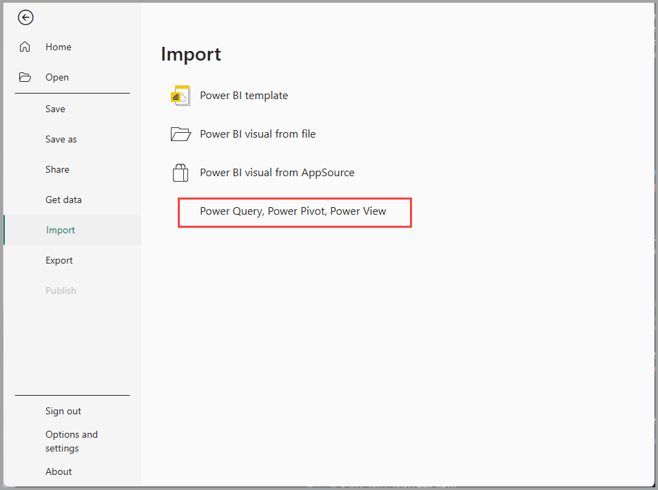
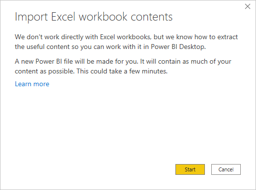

# Import Excel workbooks into Power BI Desktop

With Power BI Desktop, you can easily import Excel workbooks that contain Power Query queries and Power Pivot models into Power BI Desktop. Power BI Desktop automatically creates reports and visualizations based on the Excel workbook. Once imported, you can continue to improve and refine those reports with Power BI Desktop, using the existing features and new features released with each Power BI Desktop monthly update.

> [!TIP]
> This article covers importing Excel workbooks that contain Power Query queries or Power Pivot models. To import data from a simple Excel worksheet, use **Get Data > Excel** instead. For more information, see [Get started with Power BI Desktop](../fundamentals/desktop-getting-started.md#connect-power-bi-to-excel).

## Import an Excel workbook

1. To import an Excel workbook into Power BI Desktop, select **File** > **Import** > **Power Query, Power Pivot, Power View**.

   

2. From the **Open** window, select an Excel workbook to import.

   Although there's currently no limitation on the size or number of objects in the workbook, larger workbooks take longer for Power BI Desktop to analyze and import.

   > [!NOTE]
   > To load or import Excel files from shared OneDrive for work or school folders or from Microsoft 365 group folders, use the URL of the Excel file, and input it into the Web data source in Power BI Desktop. There are a few steps you need to follow to properly format the OneDrive for work or school URL; for information and the correct series of steps, see [Use OneDrive for work or school links in Power BI Desktop](desktop-use-onedrive-business-links.md).
   > 
   > 

3. From the import dialog box that appears, select **Start**.

   

   Power BI Desktop analyzes the workbook and converts it into a Power BI Desktop file (.pbix). This action is a one-time event. Once created with these steps, the Power BI Desktop file has no dependence on the original Excel workbook. You can modify, save, and share it without affecting the original workbook.

   After the import finishes, a summary page appears that describes the items that were converted. The summary page also lists any items that couldn't be imported.

   

4. Select **Close**.

   Power BI Desktop imports the Excel workbook and loads a report based on the workbook contents.

   

After the workbook is imported, you can continue working on the report. You can create new visualizations, add data, or create new report pages by using any of the features and capabilities included in Power BI Desktop.

## Which workbook elements import?

Power BI Desktop can import the following elements, commonly referred to as *objects*, in Excel.

| Object in Excel workbook | Final result in Power BI Desktop file |
| --- | --- |
| Power Query queries |All Power Query queries from Excel are converted to queries in Power BI Desktop. If there are query groups defined in the Excel Workbook, the same organization replicates in Power BI Desktop. All queries are loaded unless they're set to **Only Create Connection** in the **Import Data** Excel dialog box. Customize the load behavior by selecting **Properties** from the **Home** tab of Power Query Editor in Power BI Desktop. |
| Power Pivot external data connections |All Power Pivot external data connections convert to queries in Power BI Desktop. |
| Linked tables or current workbook tables |If there's a worksheet table in Excel linked to the data model, or linked to a query (by using *From Table* or the *Excel.CurrentWorkbook()* function in M), you'll see the following options:   **Import the table to the Power BI Desktop file**. This table is a one-time snapshot of the data, after which the data is read-only in the table in Power BI Desktop. There's a size limitation of 1 million characters (total, combining all column headers and cells) for tables created using this option.  **Keep a connection to the original workbook**. Alternatively, you can keep a connection to the original Excel Workbook. Power BI Desktop retrieves the latest content in this table with each refresh, just like any other query you create against an Excel workbook in Power BI Desktop. |
| Data model calculated columns, measures, KPIs, data categories, and relationships |These data model objects convert to the equivalent objects in Power BI Desktop. Note there are certain data categories that aren't available in Power BI Desktop, such as Image. In these cases, the data category information resets for the columns in question. |

## Are there any limitations to importing a workbook?

There are a few limitations to importing a workbook into Power BI Desktop:

* **External connections to SQL Server Analysis Services tabular models:** In Excel 2013, it's possible to create a connection to SQL Server Analysis Services tabular models without the need to import the data. This type of connection isn't currently supported as part of importing Excel workbooks into Power BI Desktop. As a workaround, you must recreate these external connections in Power BI Desktop.
* **Hierarchies:** This type of data model object isn't currently supported in Power BI Desktop. As such, hierarchies are skipped as part of importing an Excel workbook into Power BI Desktop.
* **Binary data columns:** This type of data model column isn't currently supported in Power BI Desktop. Binary data columns are removed from the resulting table in Power BI Desktop.
* **Named Ranges using** ***From Table*** **in Power Query, or using** ***Excel.CurrentWorkbook*** **in M:** Importing this named range data into Power BI Desktop isn't currently supported, but it's a planned update. Currently, these named ranges are loaded into Power BI Desktop as a connection to the external Excel workbook.
* **PowerPivot to SSRS:** PowerPivot external connections to SQL Server Reporting Services (SSRS) aren't currently supported, because that data source isn't currently available in Power BI Desktop.