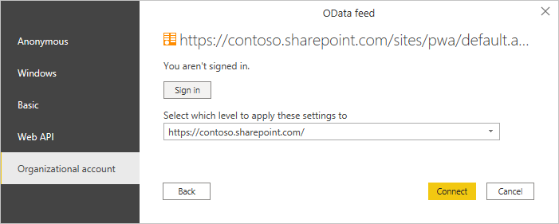

# Connect to Project Online data through Power BI Desktop

You can connect to data in Project Online through Power BI Desktop.

## Step 1: Download Power BI Desktop

[Download Power BI Desktop](https://go.microsoft.com/fwlink/?LinkID=521662), then run the installer to get **Power BI Desktop** on your computer.

## Step 2: Connect to Project Online with OData

1. Open **Power BI Desktop**.
1. On the *Welcome* screen, select **Get data**.
1. Select **OData Feed** and choose **Connect**.
1. Enter the address for your OData feed in the URL box, and then select **OK**.

   If the address for your Project Web App site resembles *https://\<tenantname\>.sharepoint.com/sites/pwa*, then the address to enter for your OData Feed is *https://\<tenantname\>.sharepoint.com/sites/pwa/\_api/Projectdata*.

1. Power BI Desktop prompts you to authenticate with your work or school account. Select **Organizational account** and then enter your credentials.

   

The account you use to connect to the OData feed must have at least Portfolio Viewer access to the Project Web App site.

From here, you can choose which tables you would like to connect to and build a query.
