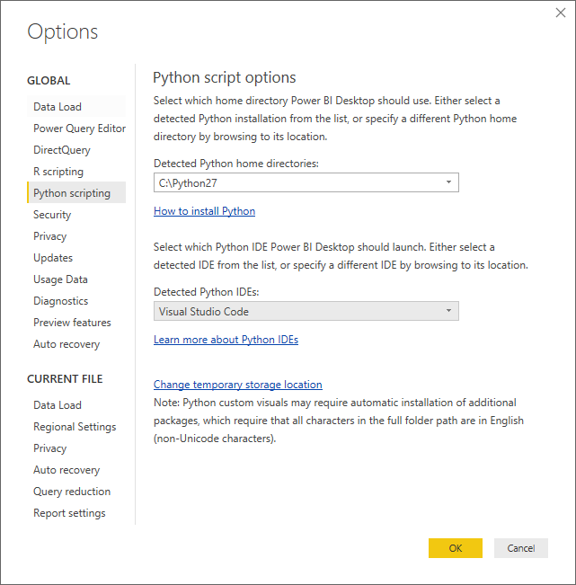
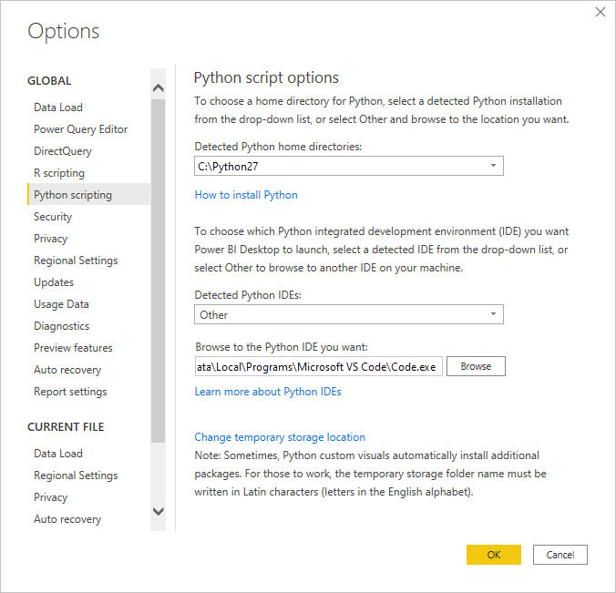
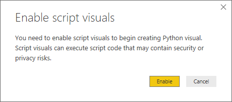
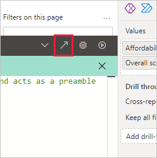

# Use an external Python IDE with Power BI

With Power BI Desktop, you can use your external Python Integrated Development Environment (IDE) to create and refine Python scripts, then use those scripts in Power BI.

## Enable an external Python IDE

You can launch your external Python IDE from Power BI Desktop and have your data automatically imported and displayed in the Python IDE. From there, you can modify the script in that external Python IDE, then paste it back into Power BI Desktop to create Power BI visuals and reports.

You can specify which Python IDE to use, and have it launch automatically from within Power BI Desktop.

### Requirements

To use this feature, you need to install a Python IDE on your local computer. Power BI Desktop doesn't include, deploy, or install the Python engine, so you must separately install Python on your local computer. You can choose which Python IDE to use, with the following options:

* You can install your favorite Python IDE, many of which are available for free, such as the [Visual Studio Code download page](https://code.visualstudio.com/download/).
* Power BI Desktop also supports Visual Studio.
* You can also install a different Python IDE and have Power BI Desktop launch that **Python IDE** by doing one of the following:
  
  * You can associate *.PY* files with the external IDE you want Power BI Desktop to launch.
  * You can specify the *.exe* that Power BI Desktop launches by selecting *Other* from the **Python script options** section of the **Options** dialog. You can bring up the **Options** dialog by going to **File** > **Options and settings** > **Options**.

   

If you have multiple Python IDEs installed, you can specify which is launched by selecting it from the **Detected Python IDEs** drop-down in the **Options** dialog.

By default, Power BI Desktop launches Visual Studio Code as the external Python IDE if it's installed on your local computer. If Visual Studio Code isn't installed and you have Visual Studio that is launched instead. If neither of those Python IDEs is installed, the application associated with *.PY* files is launched.

And if no *.PY* file association exists, it's possible to specify a path to a custom IDE in the **Set a Python home directory** section of the **Options** dialog. You can also launch a different Python IDE by selecting the **Settings** gear icon beside the **Launch Python IDE** arrow icon, in Power BI Desktop.

## Launch a Python IDE from Power BI Desktop

To launch a Python IDE from Power BI Desktop, take the following steps:

1. Load data into Power BI Desktop.
2. Add a Python visualization to your canvas. If you haven't enabled script visuals yet, you're prompted to do so.

   

3. After script visuals are enabled, a blank Python visual appears that's ready to display the results of your script. The **Python script editor** pane also appears.

   :::image type="content" source="media/desktop-python-ide/python-ide-4.png" alt-text="Screenshot of the Visualizations pane, showing a blank Python visual." lightbox="media/desktop-python-ide/python-ide-4.png":::

4. Now you can select the fields you want to use in your Python script. When you select a field, the **Python script editor** field automatically creates script code based on the field or fields you select. You can either create or paste your Python script directly in the **Python script editor** pane, or you can leave it empty.

   :::image type="content" source="media/desktop-python-ide/python-ide-5.png" alt-text="Screenshot of the Visualizations pane, showing a blank Python visual with script codes in the script editor." lightbox="media/desktop-python-ide/python-ide-5.png":::

   > [!NOTE]
   > The default aggregation type for Python visuals is *do not summarize*.

5. You can now launch your Python IDE directly from Power BI Desktop. Select the **Launch Python IDE** button, found on the right side of the **Python script editor** title bar, as shown in this screenshot.

   

6. Your specified Python IDE is launched by Power BI Desktop, as shown in the following image. In this image, Visual Studio Code is the default Python IDE.

   :::image type="content" source="media/desktop-python-ide/python-ide-7.png" alt-text="Screenshot of the Python IDE, showing it in Visual Studio Code." lightbox="media/desktop-python-ide/python-ide-7.png":::

   > [!NOTE]
   > Power BI Desktop adds the first three lines of the script so it can import your data from Power BI Desktop once you run the script.

7. Any script you created in the **Python script editor pane** of Power BI Desktop appears, starting in line 4, in your Python IDE. At this point, you can create your Python script in the Python IDE. Once your Python script is complete in your Python IDE, you need to copy and paste it back into the **Python script editor** pane in Power BI Desktop, *excluding* the first three lines of the script that Power BI Desktop automatically generated. Don't copy the first three lines of script back into Power BI Desktop, those lines were only used to import your data to your Python IDE from Power BI Desktop.

### Known limitations

Launching a Python IDE directly from Power BI Desktop has a few limitations:

* Automatically exporting your script from your Python IDE into Power BI Desktop isn't supported.

## Related content

Take a look at the following additional information about Python in Power BI.

* [Running Python Scripts in Power BI Desktop](desktop-python-scripts.md)
* [Create Power BI visuals using Python](desktop-python-visuals.md)
