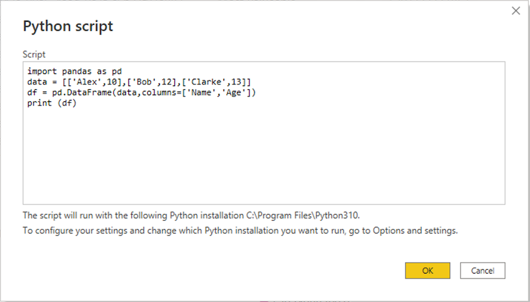
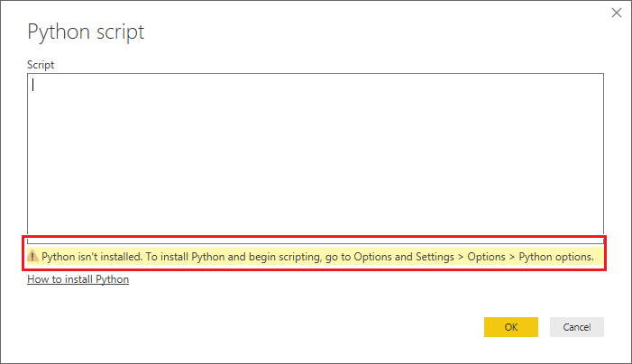

# Run Python scripts in Power BI Desktop

You can run Python scripts directly in Power BI Desktop and import the resulting datasets into a Power BI Desktop data model. From this model, you can create reports and share them on the Power BI service.

## Prerequisites

- To run Python scripts in Power BI Desktop, you need to install Python on your local machine. You can download Python from the [Python website](https://www.python.org). The current Python scripting release supports Unicode characters and spaces in the installation path.

- The Power BI Python integration requires installation of the following two Python packages. In a console or shell, use the [pip](https://pip.pypa.io/en/stable) command-line tool to install the packages. The pip tool is packaged with recent Python versions.

  - [Pandas](https://pandas.pydata.org) is a software library for data manipulation and analysis. Pandas offers data structures and operations for manipulating numerical tables and time series. To import into Power BI, Python data must be in a [pandas data frame](https://www.tutorialspoint.com/python_pandas/python_pandas_dataframe.htm). A data frame is a two-dimensional data structure, such as a table with rows and columns.

  - [Matplotlib](https://matplotlib.org) is a plotting library for Python and its numerical mathematics extension [NumPy](https://www.numpy.org). Matplotlib provides an object-oriented API for embedding plots into general-purpose graphical user interface (GUI) applications for Python, such as Tkinter, wxPython, Qt, or GTK+.

  ```console
  pip install pandas
  pip install matplotlib
  ```

## Enable Python scripting

To enable Python scripting in Power BI:

1. In Power BI Desktop, select **File** > **Options and settings** > **Options** > **Python scripting**. The **Python script options** page appears.

   

1. If necessary, supply or edit your local Python installation path under **Detected Python home directories**. In the preceding image, the Python's installation local path is *C:\\Python*. If you have more than one local Python installation, make sure to select the one that you want to use.

1. Select **OK**.

> [!IMPORTANT]
> Power BI runs scripts directly by using the *python.exe* executable from the directory you provide in **Settings**. Python distributions that require an extra step to prepare the environment, such as Conda, might fail to run. To avoid these issues, use the official Python distribution from [https://www.python.org](https://www.python.org). Another possible solution is to start Power BI Desktop from your custom Python environment prompt.

## Create a Python script

Create a script in your local Python development environment and make sure it runs successfully. To prepare and run a Python script in Power BI Desktop, there are a few limitations:

- Only pandas data frames import, so make sure the data you want to import to Power BI is represented in a data frame.
- Any Python script that runs longer than 30 minutes times out.
- Interactive calls in the Python script, such as waiting for user input, halt the script's execution.
- If you set a working directory within the Python script, you must define a full path to the working directory rather than a relative path.
- Nested tables aren't supported.

Here's a simple example Python script that imports pandas and uses a data frame:

```python
import pandas as pd
data = [['Alex',10],['Bob',12],['Clarke',13]]
df = pd.DataFrame(data,columns=['Name','Age'])
print (df)
```

When run, this script returns:

```output
     Name   Age
0    Alex  10.0
1     Bob  12.0
2  Clarke  13.0
```

## Run the script and import data

To run your Python script:

1. In the **Home** group of the Power BI Desktop ribbon, select **Get data**.

1. In the **Get Data** dialog box, select **Other** > **Python script**, and then select **Connect**. Power BI uses your latest installed Python version as the Python engine.

   

1. On the **Python script** screen, paste your Python script into the **Script** field, and select **OK**.

   

1. If the script runs successfully, the **Navigator** window appears, and you can load the data. Select the **df** table, and then select **Load**.

   
   
Power BI imports the data, and you can use it to create visualizations and reports. To refresh the data, select **Refresh** in the **Home** group of the Power BI Desktop ribbon. When you refresh, Power BI runs the Python script again.

> [!IMPORTANT]
> If Python isn't installed or identified, a warning appears. You might also get a warning if you have multiple local machine installations.
> 
> 

## Related content

For more information about Python in Power BI, see:

- [Create Python visuals in Power BI Desktop](desktop-python-visuals.md)
- [Use an external Python IDE with Power BI](desktop-python-ide.md)
- [Use Python in Power Query Editor](desktop-python-in-query-editor.md)

