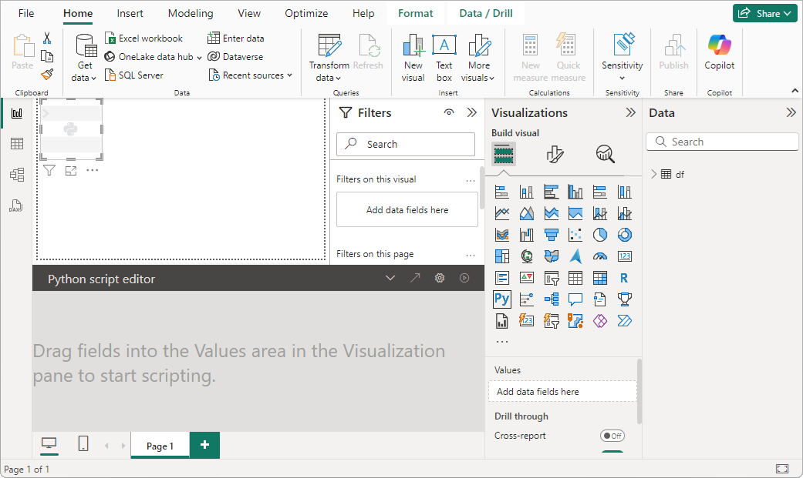

# Create Power BI visuals with Python

This tutorial helps you get started creating visuals with Python data in Power BI Desktop. You use a few of the many available options and capabilities for creating visual reports by using Python, pandas, and the Matplotlib library.

## Prerequisites

Work through [Run Python scripts in Power BI Desktop](desktop-python-scripts.md) to:

- Install [Python](https://www.python.org) on your local machine.
- Enable Python scripting in Power BI Desktop.
- Install the [pandas](https://pandas.pydata.org) and [Matplotlib](https://matplotlib.org) Python libraries.
- Import the following Python script into Power BI Desktop:

  ```python
  import pandas as pd 
  df = pd.DataFrame({ 
      'Fname':['Harry','Sally','Paul','Abe','June','Mike','Tom'], 
      'Age':[21,34,42,18,24,80,22], 
      'Weight': [180, 130, 200, 140, 176, 142, 210], 
      'Gender':['M','F','M','M','F','M','M'], 
      'State':['Washington','Oregon','California','Washington','Nevada','Texas','Nevada'],
      'Children':[4,1,2,3,0,2,0],
      'Pets':[3,2,2,5,0,1,5] 
  }) 
  print (df) 
  ```

## Create a Python visual in Power BI Desktop

1. After you import the Python script, select the **Python visual** icon in the Power BI Desktop **Visualizations** pane.

   

1. In the **Enable script visuals** dialog box that appears, select **Enable**.

   A placeholder Python visual image appears on the report canvas, and the **Python script editor** appears along the bottom of the center pane.

   

1. Drag the **Age**, **Children**, **Fname**, **Gender**, **Pets**, **State**, and **Weight** fields to the **Values** section where it says **Add data fields here**.

   

   Based on your selections, the Python script editor generates the following binding code.

   - The editor creates a *dataset* dataframe with the fields you add.
   - The default aggregation is **Don't summarize**.
   - Similar to table visuals, fields are grouped and duplicate rows appear only once.

1. With the dataframe automatically generated by the fields you selected, you can write a Python script that results in plotting to the Python default device. When the script is complete, select the **Run** icon from the **Python script editor** title bar to run the script and generate the visual.

   

### Tips

- Your Python script can use only fields that are added to the **Values** section. You can add or remove fields while you work on your Python script. Power BI Desktop automatically detects field changes. As you select or remove fields from the **Values** section, supporting code in the Python script editor is automatically generated or removed.

- In some cases, you might not want automatic grouping to occur, or you might want all rows to appear, including duplicates. In those cases, you can add an index field to your dataset that causes all rows to be considered unique and prevents grouping.

- You can access columns in the dataset by using their names. For example, you can code `dataset["Age"]` in your Python script to access the age field.

- Power BI Desktop replots the visual when you select **Run** from the **Python script editor** title bar, or whenever a data change occurs due to data refresh, filtering, or highlighting.

- When you run a Python script that results in an error, the Python visual isn't plotted, and an error message appears on the canvas. For error details, select **See details** in the message.

- To get a larger view of the visualizations, you can minimize the **Python script editor**.

## Create a scatter plot

Create a scatter plot to see if there's a correlation between age and weight.

1. In the **Python script editor**, under **Paste or type your script code here**, enter this code:

   ```python
   import matplotlib.pyplot as plt 
   dataset.plot(kind='scatter', x='Age', y='Weight', color='red')
   plt.show() 
   ```

   Your Python script editor pane should now look like the following image:

   

   The code imports the Matplotlib library, which plots and creates the visual.

1. Select the **Run** button to generate the following scatter plot in the Python visual.

   

## Create a line plot with multiple columns

Create a line plot for each person that shows their number of children and pets.

1. Under **Paste or type your script code here**, remove or comment out the previous code, and enter the following Python code:

   ```python
   import matplotlib.pyplot as plt 
   ax = plt.gca() 
   dataset.plot(kind='line',x='Fname',y='Children',ax=ax) 
   dataset.plot(kind='line',x='Fname',y='Pets', color='red', ax=ax) 
   plt.show() 
   ```

1. Select the **Run** button to generate the following line plot with multiple columns:

   

## Create a bar plot

Create a bar plot for each person's age.

1. Under **Paste or type your script code here**, remove or comment out the previous code, and enter the following Python code:

   ```python
   import matplotlib.pyplot as plt 
   dataset.plot(kind='bar',x='Fname',y='Age') 
   plt.show() 
   ```

1. Select the **Run** button to generate the following bar plot:

    

## Limitations

Python visuals in Power BI Desktop have the following limitations:

- The data the Python visual uses for plotting is limited to 150,000 rows. If more than 150,000 rows are selected, only the top 150,000 rows are used, and a message appears on the image. The input data also has a limit of 250 MB.

- If the input dataset of a Python visual has a column that contains a string value longer than 32,766 characters, that value is truncated.

- All Python visuals display at 72 DPI resolution.

- If a Python visual calculation exceeds five minutes, the execution times out, which results in an error.

- As with other Power BI Desktop visuals, if you select data fields from different tables with no defined relationship between them, an error occurs.

- Python visuals refresh upon data updates, filtering, and highlighting. The image itself isn't interactive.

- Python visuals respond to highlighting elements in other visuals, but you can't select elements in the Python visual to cross filter other elements.

- Only plots to the Python default display device display correctly on the canvas. Avoid explicitly using a different Python display device.

- Python visuals don't support renaming input columns. Columns are referred to by their original names during script execution.

### Security

Python visuals use Python scripts, which could contain code that has security or privacy risks. When you attempt to view or interact with a Python visual for the first time, you get a security warning. Enable Python visuals only if you trust the author and source, or after you review and understand the Python script.

### Licensing

Python visuals require a [Power BI Pro](../fundamentals/service-self-service-signup-for-power-bi.md) or Premium Per User (PPU) license to render in reports, refresh, filter, and cross filter. Users of free Power BI can consume only tiles that are shared with them in Premium workspaces.

The following table describes Python visuals capabilities based on licensing.

|  |Author Python visuals in Power BI Desktop  | Create Power BI service reports with Python visuals |View Python visuals in reports  |  
|---------|---------|---------|---------|
|**Guest** (Power BI embedded)     |  Supported|  Not supported      | Supported in Premium/Azure capacity only  |  
|**Unmanaged tenant** (domain not verified) | Supported | Not supported |  Not supported | 
|**Managed tenant** with free license    |  Supported       |  Not supported       |    Supported in Premium capacity only    |  
|**Managed tenant** with Pro or PPU license     |   Supported      | Supported      | Supported    | 

For more information about Power BI Pro licenses and how they differ from free licenses, see [Purchase and assign Power BI Pro user licenses](../enterprise/service-admin-purchasing-power-bi-pro.md).

## Related content

This tutorial barely scratches the surface of the options and capabilities for creating visual reports using Python, pandas, and the Matplotlib library. For more information, see the following resources:

- Documentation on the [Matplotlib](https://matplotlib.org/) website.
- [Matplotlib Tutorial : A Basic Guide to Use Matplotlib with Python](https://www.datasciencelearner.com/matplotlib-tutorial-complete-guide-to-use-matplotlib-with-python)
- [Matplotlib Tutorial – Python Matplotlib Library with Examples](https://www.edureka.co/blog/python-matplotlib-tutorial)
- [Pandas API reference](https://pandas.pydata.org/pandas-docs/stable/reference/index.html)
- [Python visualizations in Power BI service](https://powerbi.microsoft.com/blog/python-visualizations-in-power-bi-service)
- [Using Python Visuals in Power BI](https://www.absentdata.com/how-to-user-python-and-power-bi)
- [Comprehensive Python Scripting Tutorial](https://www.janbasktraining.com/blog/python-scripting-tutorial/)

For more information about Python in Power BI, see:

- [Run Python scripts in Power BI Desktop](desktop-python-scripts.md)
- [Use an external Python IDE with Power BI](desktop-python-ide.md)
