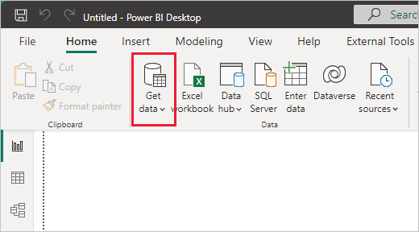
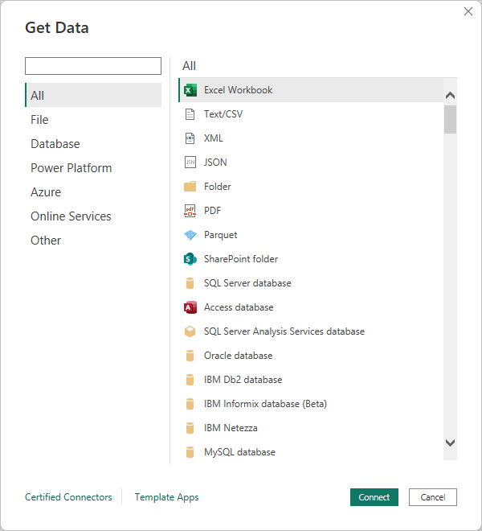

# Quickstart: Connect to data in Power BI Desktop

In this quickstart, you connect to data using Power BI Desktop, which is the first step in building data models and creating reports.

:::image type="content" source="media/desktop-quickstart-connect-to-data/what-is-desktop_01.png" alt-text="Screenshot shows Power BI Desktop with the Retail Analysis sample loaded, displaying the Overview tab." lightbox="media/desktop-quickstart-connect-to-data/what-is-desktop_01.png":::

If you're not signed up for Power BI, [sign up for a free trial](https://app.powerbi.com/signupredirect?pbi_source=web) before you begin.

## Prerequisites

To complete the steps in this article, you need the following resources:

* Download and install Power BI Desktop, which is a free application that runs on your local computer. You can [download Power BI Desktop](https://powerbi.microsoft.com/desktop) directly, or you can get it from [the Microsoft Store](https://aka.ms/pbidesktopstore).
* [Download this sample Excel workbook](https://go.microsoft.com/fwlink/?LinkID=521962), and create a folder called *C:\PBID-qs* where you can store the Excel file. Later steps in this quickstart assume that is the file location for the downloaded Excel workbook.
* For many data connectors in Power BI Desktop, Internet Explorer 10 (or newer) is required for authentication.

## Launch Power BI Desktop

Once you install Power BI Desktop, launch the application so it's running on your local computer. You're presented with a Power BI tutorial. Follow the tutorial or close the dialog to start with a blank canvas. The canvas is where you create visuals and reports from your data.

:::image type="content" source="media/desktop-quickstart-connect-to-data/qs-connect-data_01.png" alt-text="Screenshot shows Power BI Desktop with blank canvas." lightbox="media/desktop-quickstart-connect-to-data/qs-connect-data_01.png":::

## Connect to data

With Power BI Desktop, you can connect to many different types of data. These sources include basic data sources, such as a Microsoft Excel file. You can connect to online services that contain all sorts of data, such as Salesforce, Microsoft Dynamics, Azure Blob Storage, and many more.

To connect to data, from the **Home** ribbon select **Get data**.

The **Get Data** window appears. You can choose from the many different data sources to which Power BI Desktop can connect. In this quickstart, use the Excel workbook that you downloaded in [Prerequisites](#prerequisites).

Since this data source is an Excel file, select **Excel** from the **Get Data** window, then select the **Connect** button.

Power BI prompts you to provide the location of the Excel file to which to connect. The downloaded file is called *Financial Sample*. Select that file, and then select **Open**.

Power BI Desktop then loads the workbook and reads its contents, and shows you the available data in the file using the **Navigator** window. In that window, you can choose which data you would like to load into Power BI Desktop. Select the tables by marking the checkboxes beside each table you want to import. Import both available tables.

:::image type="content" source="media/desktop-quickstart-connect-to-data/qs-connect-data_05.png" alt-text="Screenshot shows the Navigator window with both display options selected." lightbox="media/desktop-quickstart-connect-to-data/qs-connect-data_05.png":::

Once you've made your selections, select **Load** to import the data into Power BI Desktop.

## View data in the Fields pane

Once you've loaded the tables, the **Fields** pane shows you the data. You can expand each table by selecting the arrow beside its name. In the following image, the *financials* table is expanded, showing each of its fields.

:::image type="content" source="media/desktop-quickstart-connect-to-data/qs-connect-data_06.png" alt-text="Screenshot shows Power BI Desktop with data loaded and the Financials field expanded." lightbox="media/desktop-quickstart-connect-to-data/qs-connect-data_06.png":::

And that's it! You've connected to data in Power BI Desktop, loaded that data, and now you can see all the available fields within those tables.

## Related content

There are all sorts of things you can do with Power BI Desktop once you've connected to data. You can create visuals and reports. Take a look at the following resource to get you going:

* [Get started with Power BI Desktop](../fundamentals/desktop-getting-started.md)
