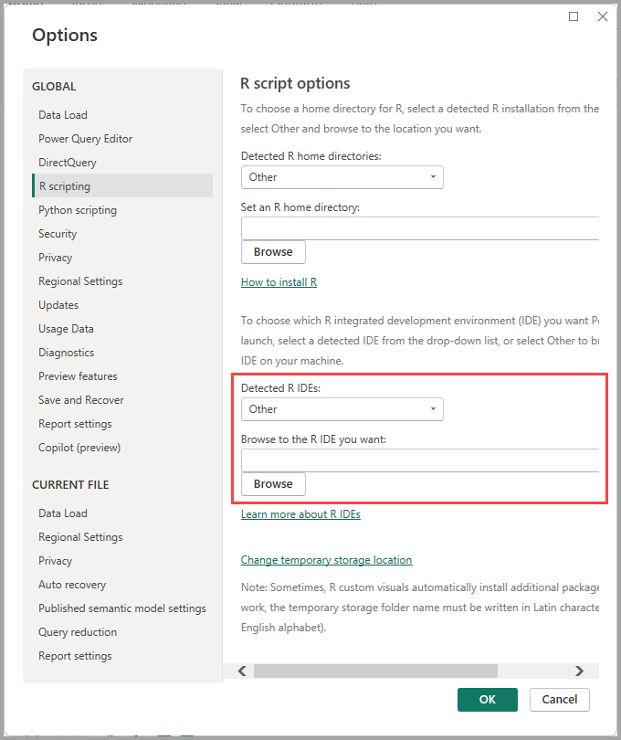
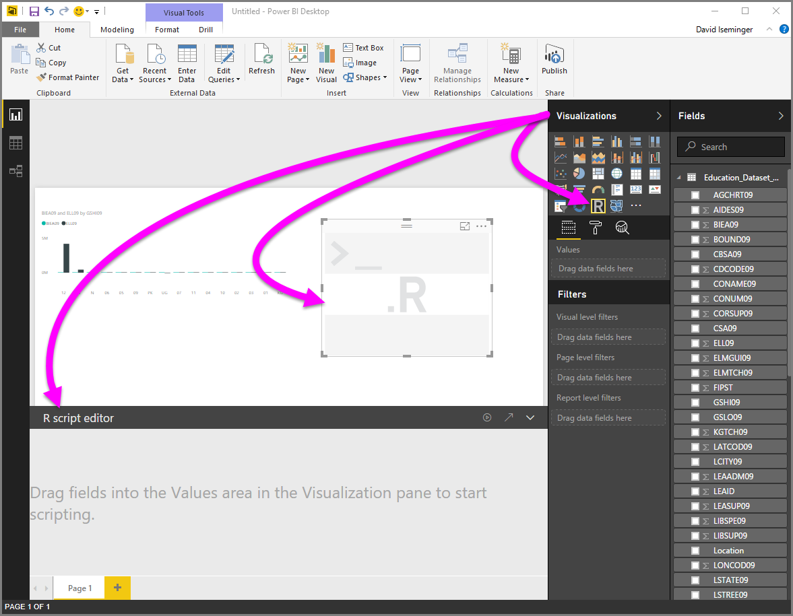
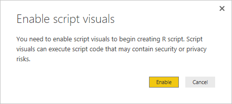
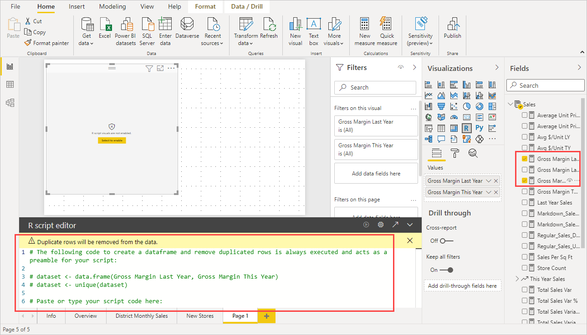
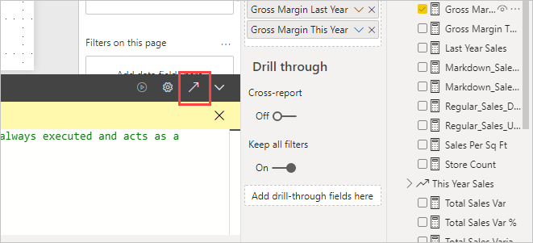

# Use an external R IDE with Power BI
With **Power BI Desktop**, you can use your external R IDE (Integrated Development Environment) to create and refine R scripts, then use those scripts in Power BI.

## Enable an external R IDE
Launch your external R IDE from **Power BI Desktop** and have your data automatically imported and displayed in the R IDE. From there, you can modify the script in that external R IDE, then paste it back into **Power BI Desktop** to create Power BI visuals and reports. Specify which R IDE you would like to use, and have it launch automatically from within **Power BI Desktop**.

### Requirements
To use this feature, you need to install an **R IDE** on your local computer. **Power BI Desktop** does not include, deploy, or install the R engine, so you must separately install **R** on your local computer. You can choose which R IDE to use, with the following options:

* You can install your favorite R IDE, many of which are available for free, such as the [CRAN Repository](https://cran.r-project.org/bin/windows/base/).
* **Power BI Desktop** also supports [R Studio](https://www.rstudio.com/) and **Visual Studio 2015** with [*R Tools for Visual Studio*](/visualstudio/rtvs) editors.
* You can also install a different R IDE and have **Power BI Desktop** launch that **R IDE** by doing one of the following:
  
  * You can associate **.R** files with the external IDE you want **Power BI Desktop** to launch.
  * You can specify the .exe that **Power BI Desktop** should launch by selecting *Other* from the **R Script Options** section of the **Options** dialog. You can bring up the **Options** dialog by going to **File > Options and settings > Options**.
    
    

If you have multiple R IDEs installed, you can specify which will be launched by selecting it from the *Detected R IDEs* drop-down in the **Options** dialog.

By default, **Power BI Desktop** will launch **R Studio** as the external R IDE if it's installed on your local computer; if **R Studio** is not installed and you have **Visual Studio 2015** with **R Tools for Visual Studio**, that will be launched instead. If neither of those R IDEs is installed, the application associated with **.R** files is launched.

And if no **.R** file association exists, it's possible to specify a path to a custom IDE in the *Browse to your preferred R IDE* section of the **Options** dialog. You can also launch a different R IDE by selecting the **Settings** gear icon beside the **Edit script in external IDE** arrow icon, in **Power BI Desktop**.

## Launch an R IDE from Power BI Desktop
To launch an R IDE from **Power BI Desktop**, take the following steps:

1. Load data into **Power BI Desktop**.

2. When script visuals are enabled, you can select an R visual from the **Visualizations** pane, which creates a blank R visual that's ready to display the results of your script. The **R script editor** pane also appears.
   
   

3. Select some fields from the **Fields** pane that you want to work with. If you haven't enabled script visuals yet, you'll be prompted to do so.
   
   

4. Now you can select the fields you want to use in your R script. When you select a field, the **R script editor** field automatically creates script code based on the field or fields you select. You can either create (or paste) your R script directly in the **R script editor** pane, or you can leave it empty.
   
   
   
   > [!NOTE]
   > The default aggregation type for R visuals is *do not summarize*.
   > 
   > 
5. You can now launch your R IDE directly from **Power BI Desktop**. Select the **Edit script in external IDE** button, found on the right side of the **R script editor** title bar, as shown below.
   
   
6. Your specified R IDE is launched by Power BI Desktop, as shown in the following image (in this image, **RStudio** is the default R IDE).
   
   
   
   > [!NOTE]
   > **Power BI Desktop** adds the first three lines of the script so it can import your data from **Power BI Desktop** once you run the script.
   > 
   > 
7. Any script you created in the **R script editor pane** of **Power BI Desktop** appears starting in line 4 in your R IDE. At this point, you can create your R script in the R IDE. Once your R script is complete in your R IDE, you need to copy and paste it back into the **R script editor** pane in **Power BI Desktop**, *excluding* the first three lines of the script that **Power BI Desktop** automatically generated. Do not copy the first three lines of script back into **Power BI Desktop**, those lines were only used to import your data to your R IDE from **Power BI Desktop**.

### Known limitations
Launching an R IDE directly from Power BI Desktop has a few limitations:

* Automatically exporting your script from your R IDE into **Power BI Desktop** is not supported.
* **R Client** editor (RGui.exe) is not supported, because the editor itself does not support opening files.

## Related content
Take a look at the following additional information about R in Power BI.

* [Running R Scripts in Power BI Desktop](desktop-r-scripts.md)
* [Create Power BI visuals using R](../create-reports/desktop-r-visuals.md)
