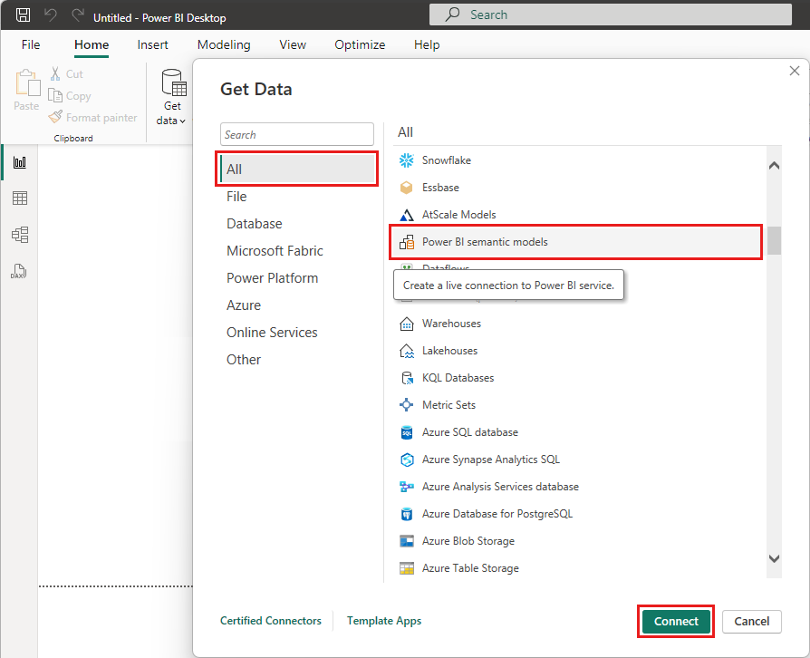
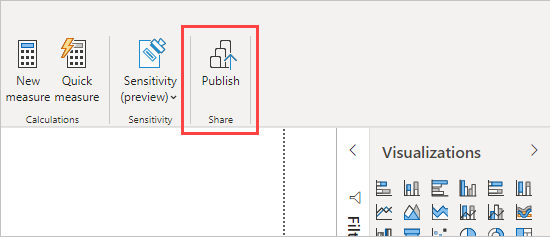
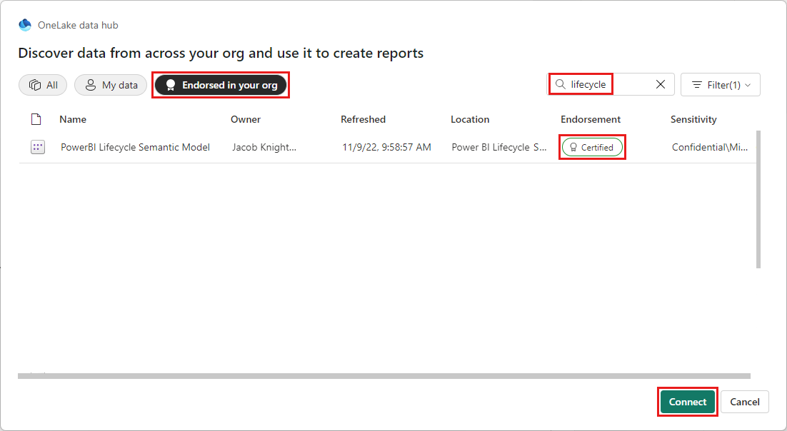
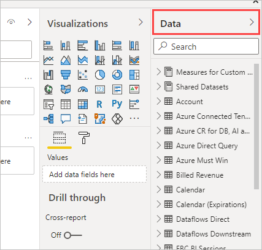

# Connect to datasets in the Power BI service from Power BI Desktop

In Power BI Desktop, you can create a data model and publish it to the Power BI service. Then you and others can establish a live connection to the shared dataset that's in the Power BI service, and create many different reports from that common data model. You can use the *Power BI service live connection* feature to create multiple reports in *.pbix* files from the same dataset, and save them to different workspaces.

This article discusses the benefits, best practices, and considerations and limitations of the Power BI service live connection feature.

## Power BI live connection and report lifecycle management

One challenge with the popularity of Power BI is the proliferation of reports, dashboards, and underlying data models. It's easy to create compelling reports in Power BI Desktop, [publish](../create-reports/desktop-upload-desktop-files.md) those reports in the Power BI service, and create great dashboards from those datasets. Report creators often use the same or nearly the same datasets, so knowing which dataset a report is based on and the freshness of that dataset becomes a challenge. The Power BI service live connection addresses that challenge by making it easier and more consistent to create, share, and expand on common-dataset reports and dashboards.

### Create and share a dataset everyone can use

A business analyst on your team who is skilled at creating good data models, often called datasets, can create a dataset and report and then share that report in the Power BI service.

If everyone on the team creates their own versions of the dataset and shares their reports with the team, there are many reports from different datasets in your team's Power BI workspace. It's hard to tell which report is the most recent, whether the datasets are the same, or what the differences are. With the Power BI service live connection feature, other team members can use the analyst's published dataset for their own reports in their own workspaces. Everyone can use the same solid, vetted, published dataset to build their unique reports.

### Connect to the dataset using a Power BI service live connection

In Power BI Desktop, the team business analyst creates a report and the dataset the report is based on. The analyst then publishes the report to the Power BI service, and the report shows up in the team's workspace. For more information about workspaces, see [Workspaces in Power BI](../collaborate-share/service-new-workspaces.md).

The report owner uses the **Build permission** setting to make the report available to everyone in and out of the workspace to see and use. Team members in and out of the team workspace can now establish a live connection to the analyst's shared data model by using the Power BI service live connection feature. Team members can create their own unique reports, from the original dataset, in their own workspaces.

The following image shows how one Power BI Desktop report and its data model publish to the Power BI service. Others users connect to the data model by using the Power BI service live connection, and base their own unique reports in their own workspaces on the shared dataset.

## How to use a Power BI service live connection

Now you know the usefulness of the Power BI service live connection for report lifecycle management. Learn the steps to get from a great report and dataset to a shared dataset that your teammates can use in Power BI.

### Publish a Power BI report and dataset

The first step in managing the report lifecycle by using a Power BI service live connection is to have a report and dataset for teammates to use.

1. To publish the report, from Power BI Desktop, select **Publish** from the **Home** tab.

   

   If you're not signed in to the Power BI service account, Power BI prompts you to sign in.

   

1. Select the workspace destination to publish the report and dataset to, and choose **Select**. Anyone who has Build permission can then have access to that dataset.

   You set Build permission in the Power BI service after publishing. If you save work to a classic workspace, only members who have access to the workspace where a report is published can access its dataset by using a Power BI service live connection.

   

   The publishing process begins, and Power BI Desktop shows the progress.

   

   Once complete, Power BI Desktop shows success, and provides links to the report in the Power BI service and to get quick insights about the report.

   

1. Now that your report with its dataset is in the Power BI service, you can also *promote* it, or attest to its quality and reliability. You can also request that it be *certified* by a central authority in your Power BI tenant. With either of these endorsements, your dataset always appears at the top of the list when people are looking for datasets. For more information, see [Endorse your content](../collaborate-share/service-endorse-content.md).

1. The last step is to set Build permission for the dataset the report is based on. Build permission determines who can see and use your dataset. You can set Build permission in the workspace itself, or when you share an app from the workspace. For more information, see [Build permission for shared datasets](service-datasets-build-permissions.md).

### Establish a Power BI service live connection to the published dataset

Next, see how teammates who have access to the workspace where the report and dataset were published can connect to the dataset and build their own reports.

To establish a connection to the published report, and create your own report based on the published dataset:

1. Select **Get data** from the **Home** tab in Power BI Desktop.

1. On the **Get Data** screen, select **Power Platform** in the left pane, select **Power BI datasets**, and then select **Connect**. If you're not signed in, Power BI prompts you to sign in.

1. The **Data hub** shows which workspaces you're a member of. You can select the workspace that contains the dataset you want to connect to.

   The datasets in the list are all the shared datasets you have Build permission for, in any workspace. You can search for a specific dataset and see its name, owner, the workspace where it resides, and when it was last refreshed.

   You can also see **Endorsement** for datasets, either **Certified** or **Promoted**, at the top of the list.

   

1. Select **Connect** to establish a live connection to the selected dataset. Power BI Desktop loads the dataset fields and their values in real time.

   

Now you and others can create and share custom reports, all from the same dataset. This approach is a great way to have one knowledgeable person create a well-formed dataset. Many teammates can use that shared dataset to create their own reports.

## Considerations and limitations

When you use the Power BI service live connection, keep a few considerations and limitations in mind.

- Only users with Build permission for a dataset can connect to a published dataset by using the Power BI service live connection.
- Free users only see datasets that are in their **My Workspace** and in Premium-based workspaces.
- Because this connection is live, left navigation and modeling are disabled. You can connect to only one dataset in each report. The behavior is similar when connected to SQL Server Analysis Services (SSAS). However, a new preview feature in Power BI now makes it possible to combine data from different sources. For more information, see [Use DirectQuery for Power BI datasets and Azure Analysis Services (preview)](../connect-data/desktop-directquery-datasets-azure-analysis-services.md).
- Because this connection is live, row-level security (RLS) and similar connection behaviors are enforced. This is the same as when connected to SSAS.
- If the owner modifies the original shared *.pbix* file, the shared dataset and report in the Power BI service are overwritten. Reports based on the dataset aren't overwritten, but any changes to the dataset reflect in the report.
- Members of a workspace can't replace the original shared report. If you try to do so, you get a prompt to rename the file and publish.
- If you delete the shared dataset in the Power BI service, reports based on that dataset will no longer work properly or display visuals. No one can access that dataset from Power BI Desktop anymore.
- Reports that share a dataset on the Power BI service don't support automated deployments that use the Power BI REST API.

## Next steps
For more information on DirectQuery and other Power BI data connection features, check out the following resources:

- [Use DirectQuery in Power BI](desktop-directquery-about.md)
- [Data sources supported by DirectQuery](power-bi-data-sources.md)
- [Using DirectQuery for Power BI datasets and Azure Analysis Services (preview)](../connect-data/desktop-directquery-datasets-azure-analysis-services.md)

For more information about Power BI, see the following articles:

- [What is Power BI Desktop?](../fundamentals/desktop-what-is-desktop.md)
- [Query overview with Power BI Desktop](../transform-model/desktop-query-overview.md)
- [Data types in Power BI Desktop](desktop-data-types.md)
- [Shape and combine data with Power BI Desktop](desktop-shape-and-combine-data.md)
- [Common query tasks in Power BI Desktop](../transform-model/desktop-common-query-tasks.md)
- [Publish datasets and reports from Power BI Desktop](../create-reports/desktop-upload-desktop-files.md)
