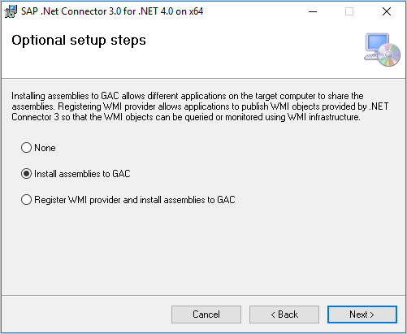
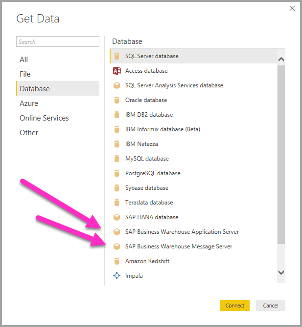
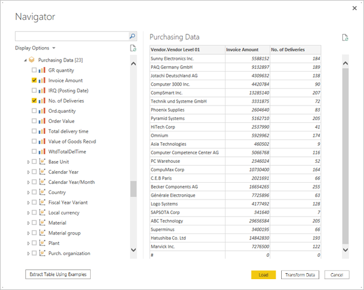
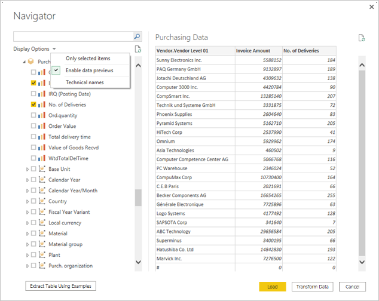
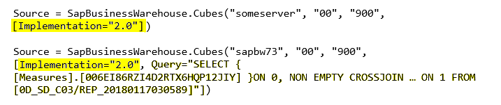
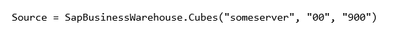
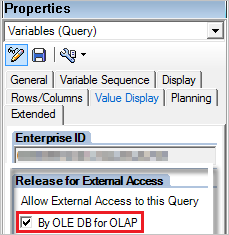

# Use the SAP Business Warehouse connector in Power BI Desktop

You can use Power BI Desktop to access SAP Business Warehouse (SAP BW) data. The SAP BW Connector Implementation 2.0 has significant improvements in performance and capabilities from version 1.0.

This article provides instructions on how to use the SAP BW Connector in Power BI Desktop, including installation, connection setup, and troubleshooting steps, as well as information on updating existing reports to use the latest connector implementation.

For information about how SAP customers can benefit from connecting Power BI to their SAP BW systems, see the [Power BI and SAP BW whitepaper](https://aka.ms/powerbiandsapbw). For details about using DirectQuery with SAP BW, see [DirectQuery and SAP Business Warehouse (BW)](desktop-directquery-sap-bw.md).

>[!IMPORTANT]
>Version 1.0 of the SAP BW connector is deprecated. New connections use Implementation 2.0 of the SAP BW connector. All support for version 1.0 will be removed from the connector in the near future. Use the information in this article to update existing version 1.0 reports to use Implementation 2.0 of the connector.

## Use the SAP BW Connector

Follow these steps to install and connect to data with the SAP BW Connector.

### Prerequisite

Implementation 2.0 of the SAP Connector requires the SAP .NET Connector 3.0 or 3.1. You can download the [SAP .NET Connector 3.0 or 3.1](https://support.sap.com/en/product/connectors/msnet.html) from SAP. Access to the download requires a valid S-user sign-in.

The .NET Framework connector comes in 32-bit and 64-bit versions. Choose the version that matches your Power BI Desktop installation version.

When you install, in **Optional setup steps**, make sure you select **Install assemblies to GAC**.



>[!NOTE]
>The first version of the SAP BW Connector required the NetWeaver DLLs. The current version doesn't require NetWeaver DLLs.

### Connect to SAP BW data in Power BI Desktop

To connect to SAP BW data by using the SAP BW Connector, follow these steps:

1. In Power BI Desktop, select **Get data**.

1. On the **Get Data** screen, select **Database**, and then select either **SAP Business Warehouse Application Server** or **SAP Business Warehouse Message Server**.

   

1. Select **Connect**.

1. On the next screen, enter server, system, and client information, and whether to use **Import** or **DirectQuery** connectivity method. For detailed instructions, see:

   - [Connect to an SAP BW Application Server from Power Query Desktop](/power-query/connectors/sap-bw/application-setup-and-connect#connect-to-an-sap-bw-application-server-from-power-query-desktop)
   - [Connect to an SAP BW Message Server from Power Query Desktop](/power-query/connectors/sap-bw/message-setup-and-connect#connect-to-an-sap-bw-message-server-from-power-query-desktop)

   >[!NOTE]
   >You can use the SAP BW Connector to import data from your SAP BW Server cubes, which is the default, or you can use DirectQuery to connect to the data. For more information about using the SAP BW Connector with DirectQuery, see [DirectQuery and SAP Business Warehouse (BW)](desktop-directquery-sap-bw.md).

   You can also select **Advanced options**, and select a **Language code**, a custom **MDX statement** to run against the specified server, and other options. For more information, see [Use advanced options](/power-query/connectors/sap-bw/use-advanced-options).
   
1. Select **OK** to establish the connection.

1. Provide any necessary authentication data and select **Connect**. For more information about authentication, see [Authentication in desktop apps](/power-query/connector-authentication).

1. If you didn't specify a custom MDX statement, the **Navigator** screen shows a list of all cubes available on the server. You can drill down and select items from the available cubes, including dimensions and measures. Power BI shows queries and cubes that the [Open Analysis Interfaces](https://help.sap.com/saphelp_nw70/helpdata/en/d9/ed8c3c59021315e10000000a114084/content.htm) expose.

   When you select one or more items from the server, the **Navigator** shows a preview of the output table.

   

   The **Navigator** dialog also provides the following display options:

   - **Only selected items**. By default, **Navigator** displays all items. This option is useful to verify the final set of items you select. Alternatively, you can select the column names in the preview area to view the selected items.
   - **Enable data previews**. This value is the default, and displays data previews. Deselect this option to reduce the number of server calls by no longer requesting preview data.
   - **Technical names**. SAP BW supports user-defined *technical names* for objects within a cube. Cube owners can expose these friendly names for cube objects, instead of exposing only the physical names for the objects.

   

1. After you select all the objects you want, choose one of the following options:

   - **Load** to load the entire set of rows for the output table into the Power BI Desktop data model. The **Report** view opens. You can begin visualizing the data, or make further modifications by using the **Table** or **Model** views.
   - **Transform Data** to open **Power Query Editor** with the data. You can specify more data transformation and filtering steps before you bring the entire set of rows into the Power BI Desktop data model.

Along with data from SAP BW cubes, you can also import data from a wide range of other data sources in Power BI Desktop, and combine them into a single report. This ability presents many interesting scenarios for reporting and analytics on top of SAP BW data.

## New options in SAP BW Implementation 2.0

This section lists some SAP BW Connector Implementation 2.0 features and improvements. For more information, see [Implementation details](/power-query/connectors/sap-bw/implementation-details).

### Advanced options

You can set the following options under **Advanced options** on the SAP BW connection screen:

- **Execution mode** specifies how the MDX interface executes queries on the server. The following options are valid:

  - **BasXml**
  - **BasXmlGzip**
  - **DataStream**

  The default value is **BasXmlGzip**. This mode can improve performance for low-latency or high-volume queries.

- **Batch size** specifies the maximum number of rows to retrieve at a time when executing an MDX statement. A small number means more calls to the server while retrieving a large semantic model. A large value might improve performance, but could cause memory issues on the SAP BW server. The default value is **50000**.

- **Enable characteristic structures** changes the way the **Navigator** displays characteristic structures. The default value for this option is false, or unchecked. This option affects the list of objects available for selection, and isn't supported in native query mode.

### Other improvements

The following list describes other Implementation 2.0 improvements:

- Better performance.
- Ability to retrieve several million rows of data, and fine-tuning through the batch size parameter.
- Ability to switch execution modes.
- Support for compressed mode, especially beneficial for high-latency connections or large semantic models.
- Improved detection of `Date` variables.
- `Date` (ABAP type `DATS`) and `Time` (ABAP type `TIMS`) dimensions exposed as dates and times, instead of text values. For more information, see [Support for typed dates in SAP BW](/power-query/connectors/sap-bw/implementation-details#support-for-typed-dates-in-sap-bw).
- Better exception handling. Errors that occur in BAPI calls are now surfaced.
- Column folding in `BasXml` and `BasXmlGzip` modes. For example, if the generated MDX query retrieves 40 columns but the current selection only needs 10, this request passes on to the server to retrieve a smaller semantic model.

## Update existing Implementation 1.0 reports

You can change existing reports to use Implementation 2.0 only in Import mode.

1. From the existing report in Power BI Desktop, select **Transform data** in the ribbon, and then select the SAP Business Warehouse query to update.

1. Right-click the query and select **Advanced Editor**.

1. In the **Advanced Editor**, change the `SapBusinessWarehouse.Cubes` calls as follows:

1. Determine whether the query already contains an option record, using the following examples as a reference.

   

   If so, add the `[Implementation 2.0]` option, and remove any `ScaleMeasures` option:

   

   >[!NOTE]
   >The `ScaleMeasures` option is deprecated in this implementation. The connector now always shows unscaled values.

1. If the query doesn't already include an options record, add it. For example, change the following entry:

   

   to:

   

>[!NOTE]
>Implementation 2.0 of the SAP BW Connector should be compatible with version 1. However, there might be some differences because of the different SAP BW MDX execution modes. To resolve any discrepancies, try switching between execution modes.

## Troubleshooting

This section provides some troubleshooting situations and solutions for the SAP BW connector. For more information, see [SAP Business Warehouse connector troubleshooting](/power-query/connectors/sap-bw/sap-bw-troubleshooting).

### Numeric data from SAP BW returns misformatted numeric data

In this issue, SAP BW returns numeric data with decimal points instead of commas. For example, 1,000,000 returns as 1.000.000.

SAP BW returns decimal data with either a comma or a period as the decimal separator. To specify which of these characters SAP BW should use for the decimal separator, the Power BI Desktop driver makes a call to `BAPI_USER_GET_DETAIL`. This call returns a structure called `DEFAULTS`, which has a field called `DCPFM` that stores *Decimal Format Notation* as one of the following values:

- `' '` (space) = Decimal point is comma: `N.NNN,NN`
- `'X'` = Decimal point is period: `N,NNN.NN`
- `'Y'` = Decimal point is N: `NNN NNN,NN`

With this issue, the call to `BAPI_USER_GET_DETAIL` fails for a particular user, who gets the misformatted data, with an error message similar to the following message:

```xml
 You are not authorized to display users in group TI:
     <item>
         <TYPE>E</TYPE>
         <ID>01</ID>
         <NUMBER>512</NUMBER>
         <MESSAGE>You are not authorized to display users in group TI</MESSAGE>
         <LOG_NO/>
         <LOG_MSG_NO>000000</LOG_MSG_NO>
         <MESSAGE_V1>TI</MESSAGE_V1>
         <MESSAGE_V2/>
         <MESSAGE_V3/>
         <MESSAGE_V4/>
         <PARAMETER/>
         <ROW>0</ROW>
         <FIELD>BNAME</FIELD>
         <SYSTEM>CLNTPW1400</SYSTEM>
     </item>
```

To solve this error, the SAP admin must grant the Power BI SAP BW user the right to execute `BAPI_USER_GET_DETAIL`. Also, verify that the user's data has the correct `DCPFM` value.

### Need connectivity for SAP BEx queries

You can do BEx queries in Power BI Desktop by enabling the **Release for External Access** property, as shown in the following image:



### Navigator doesn't display a data preview

In this issue, **Navigator** doesn't display a data preview and instead shows an **Object reference not set to an instance of an object** error message.

SAP users need access to the following specific BAPI function modules to get metadata and retrieve data from SAP BW's InfoProviders:

- BAPI_MDPROVIDER_GET_CATALOGS
- BAPI_MDPROVIDER_GET_CUBES
- BAPI_MDPROVIDER_GET_DIMENSIONS
- BAPI_MDPROVIDER_GET_HIERARCHYS
- BAPI_MDPROVIDER_GET_LEVELS
- BAPI_MDPROVIDER_GET_MEASURES
- BAPI_MDPROVIDER_GET_MEMBERS
- BAPI_MDPROVIDER_GET_VARIABLES
- BAPI_IOBJ_GETDETAIL

To solve this issue, verify that the user has access to the `MDPROVIDER` modules and `BAPI_IOBJ_GETDETAIL`.

### Enable tracing

To further troubleshoot these or similar issues, you can enable tracing:

1. In Power BI Desktop, select **File** > **Options and settings** > **Options**.
1. In **Options**, select **Diagnostics**, and then select **Enable tracing** under **Diagnostic Options**.
1. Try to get data from SAP BW while tracing is active, and examine the trace file for more detail.

## SAP BW Connection support

The following table describes current Power BI support for SAP BW.

|Product  |Mode  |Authentication  |Connector  |SNC Library  |Supported  |
|---------|---------|---------|---------|---------|---------|
|Power BI Desktop     |Any         | User / password  | Application Server | N/A  | Yes  |
|Power BI Desktop     |Any         | Windows          | Application Server | sapcrypto + gsskrb5/gx64krb5  | Yes  |
|Power BI Desktop     |Any         | Windows via impersonation | Application Server | sapcrypto + gsskrb5/gx64krb5  | Yes  |
|Power BI Desktop     |Any         | User / password        | Message Server | N/A  | Yes  |
|Power BI Desktop     |Any         | Windows        | Message Server | sapcrypto + gsskrb5/gx64krb5  | Yes  |
|Power BI Desktop     |Any         | Windows via impersonation | Message Server | sapcrypto + gsskrb5/gx64krb5  | Yes  |
|Power BI Gateway     |Import      | Same as Power BI Desktop |         |   |   |
|Power BI Gateway     |DirectQuery | User / password        | Application Server | N/A  | Yes  |
|Power BI Gateway     |DirectQuery | Windows via impersonation (fixed user, no SSO) | Application Server | sapcrypto + gsskrb5/gx64krb5  | Yes  |
|Power BI Gateway     |DirectQuery | Use SSO via Kerberos for DirectQuery queries option | Application Server | sapcrypto + gsskrb5/gx64krb5   | Yes  |
|Power BI Gateway     |DirectQuery | User / password        | Message Server | N/A  | Yes  |
|Power BI Gateway     |DirectQuery | Windows via impersonation (fixed user, no SSO) | Message Server | sapcrypto + gsskrb5/gx64krb5  | Yes  |
|Power BI Gateway     |DirectQuery | Use SSO via Kerberos for DirectQuery queries option | Message Server | gsskrb5/gx64krb5  | No  |
|Power BI Gateway     |DirectQuery | Use SSO via Kerberos for DirectQuery queries option | Message Server | sapcrypto  | Yes  |

## Related content

- [SAP BW fundamentals](/power-query/connectors/sap-bw/sap-bw-fundamentals)
- [DirectQuery and SAP HANA](desktop-directquery-sap-hana.md)
- [DirectQuery and SAP Business Warehouse (BW)](desktop-directquery-sap-bw.md)
- [Use DirectQuery in Power BI](desktop-directquery-about.md)
- [Power BI data sources](power-bi-data-sources.md)
- [Power BI and SAP BW whitepaper](https://aka.ms/powerbiandsapbw)
