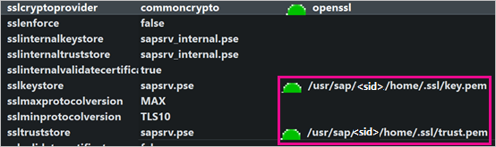
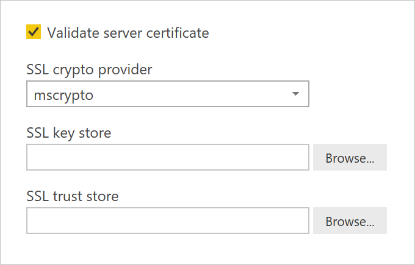
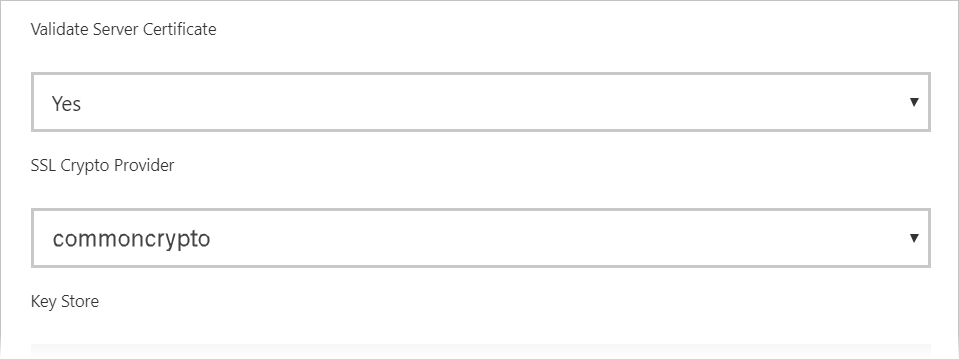

# Enable encryption for SAP HANA

We recommend that you encrypt connections to an SAP HANA server from Power BI Desktop and the Power BI service. You can enable HANA encryption using SAP's proprietary CommonCryptoLib (formerly known as sapcrypto) library. SAP recommends using CommonCryptoLib.

> [!IMPORTANT]
> SAP no longer supports the OpenSSL, and as a result, Microsoft also has discontinued its support. Use CommonCryptoLib instead.

This article provides an overview of enabling encryption using OpenSSL and references some specific areas of the SAP documentation. We update content and links periodically, but for comprehensive instructions and support, always refer to the official SAP documentation. If you want to set up encryption using CommonCryptoLib instead of OpenSSL, see [How to Configure TLS/SSL in SAP HANA 2.0](https://blogs.sap.com/2018/11/13/how-to-configure-tlsssl-in-sap-hana-2.0/) For steps on how to migrate from OpenSSL to CommonCryptoLib, see [SAP Note 2093286](https://launchpad.support.sap.com/#/notes/2093286) (s-user required).

> [!NOTE]
> The setup steps for encryption detailed in this article overlap with the setup and configuration steps for SAML SSO. Whether you choose OpenSSL or CommonCryptoLib as your HANA server's encryption provider, make sure that your choice is consistent across SAML and encryption configurations.

There are four phases to enabling encryption for SAP HANA using OpenSSL. We cover these phases next.  For more information, see [Securing the Communication between SAP HANA Studio and SAP HANA Server through SSL](https://blogs.sap.com/2015/09/28/securing-the-communication-between-sap-hana-studio-and-sap-hana-server-through-ssl/).

## Use OpenSSL

Ensure your HANA server is configured to use OpenSSL as its cryptographic provider. Replace the missing path information below with the server ID (sid) of your HANA server.



## Create a certificate signing request

Create an X509 certificate signing request for the HANA server.

1. Using SSH, connect to the Linux machine that the HANA server runs on as \<sid\>adm.

1. Go to the Home directory _/__usr/sap/\<sid\>/home_.

1. Create a hidden directory with the name _.__ssl_if one does not already exist.

1. Execute the following command:

    ```
    openssl req -newkey rsa:2048 -days 365 -sha256 -keyout Server\_Key.pem -out Server\_Req.pem -nodes
    ```

This command creates a certificate signing request and private key. Once signed, the certificate is valid for a year (see the -days parameter). When prompted for the common name (CN), enter the fully qualified domain name (FQDN) of the computer the HANA server is installed on.

## Get the certificate signed

Get the certificate signed by a certificate authority (CA) that is trusted by the client(s) you'll use to connect to the HANA server.

1. If you already have a trusted company CA (represented by CA\_Cert.pem and CA\_Key.pem in the following example), sign the certificate request by running the following command:

    ```
    openssl x509 -req -days 365 -in Server\_Req.pem -sha256 -extfile /etc/ssl/openssl.cnf -extensions usr\_cert -CA CA\_Cert.pem -CAkey CA\_Key.pem -CAcreateserial -out Server\_Cert.pem
    ```

    If you don't already have a CA you can use, you can create a root CA yourself by following the steps outlined in [Securing the Communication between SAP HANA Studio and SAP HANA Server through SSL](https://blogs.sap.com/2015/09/28/securing-the-communication-between-sap-hana-studio-and-sap-hana-server-through-ssl/).

1. Create the HANA server certificate chain by combining the server certificate, key, and the CA's certificate (the key.pem name is the convention for SAP HANA):

    ```
    cat Server\_Cert.pem Server\_Key.pem CA\_Cert.pem \> key.pem
    ```

1. Create a copy of CA\_Cert.pem named trust.pem (the trust.pem name is the convention for SAP HANA):

    ```
    cp CA\_Cert.pem trust.pem
    ```

1. Restart the HANA server.

1. Verify the trust relationship between a client and the CA you used to sign the SAP HANA server's certificate.

    The client must trust the CA used to sign the HANA server's X509 certificate before an encrypted connection can be made to the HANA server from the client's machine.

    There are various ways to ensure this trust relationship exists using Microsoft Management Console (mmc) or the command line. You can import the CA's X509 certificate (trust.pem) into the **Trusted Root Certification Authorities** folder for the user that will establish the connection, or into the same folder for the client machine itself, if that is desirable.

    

    You must first convert trust.pem into a .crt file before you can import the certificate into the Trusted Root Certification Authorities folder, for example by executing the following OpenSSL command:

    ```
    openssl x509 -outform der -in your-cert.pem -out your-cert.crt
    ```
    
    For information about using OpenSSL for the conversion, see the [OpenSSL documentation](https://www.openssl.org/docs/man1.0.2/man3/x509.html).

## Test the connection

Test the connection in Power BI Desktop or the Power BI service.

1. In Power BI Desktop or in the **Manage gateways** page of the Power BI service, ensure that **Validate server certificate** is enabled before attempting to establish a connection to your SAP HANA server. For **SSL crypto provider**, select mscrypto if you've followed the OpenSSL setup steps and commoncrypto if you've configured that library as your crypto provider. Leave the SSL key store and SSL trust store fields blank.

    - Power BI Desktop

        

    - Power BI service

        

1. Verify that you can successfully establish an encrypted connection to the server with the **Validate server certificate** option enabled, by loading data in Power BI Desktop or refreshing a published report in Power BI service.
