# Tutorial: Shape and combine data in Power BI Desktop

With Power BI Desktop, you can connect to many different types of data sources, then shape the data to meet your needs, enabling you to create visual reports to share with others. *Shaping* data means transforming the data: renaming columns or tables, changing text to numbers, removing rows, setting the first row as headers, and so on. *Combining* data means connecting to two or more data sources, shaping them as needed, then consolidating them into a useful query.

In this tutorial, you'll learn how to:

* Shape data by using Power Query Editor.
* Connect to different data sources.
* Combine those data sources, and create a data model to use in reports.

This tutorial demonstrates how to shape a query by using Power BI Desktop, highlighting the most common tasks. The query used here is described in more detail, including how to create the query from scratch, in [Getting Started with Power BI Desktop](../fundamentals/desktop-getting-started.md).

Power Query Editor in Power BI Desktop makes ample use of right-click menus, as well as the **Transform** ribbon. Most of what you can select in the ribbon is also available by right-clicking an item, such as a column, and choosing from the menu that appears.

## Shape data
When you shape data in Power Query Editor, you provide step-by-step instructions for Power Query Editor to carry out for you to adjust the data as it loads and presents it. The original data source isn't affected; only this particular view of the data is adjusted, or *shaped*.

The steps you specify (such as rename a table, transform a data type, or delete a column) are recorded by Power Query Editor. Each time this query connects to the data source, Power Query Editor carries out those steps so that the data is always shaped the way you specify. This process occurs whenever you use Power Query Editor, or for anyone who uses your shared query, such as on the Power BI service. Those steps are captured, sequentially, in the **Query Settings** pane, under **Applied Steps**. We’ll go through each of those steps in the next few paragraphs.

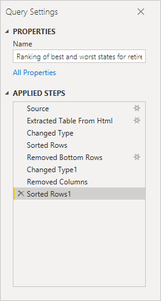

From [Getting Started with Power BI Desktop](../fundamentals/desktop-getting-started.md), let's use the retirement data, which we found by connecting to a web data source, to shape that data to fit our needs. We'll add a custom column to calculate rank based on all data being equal factors, and compare this column to the existing column, **Rank**.  

1. From the **Add Column** ribbon, select **Custom Column**, which lets you add a custom column.

    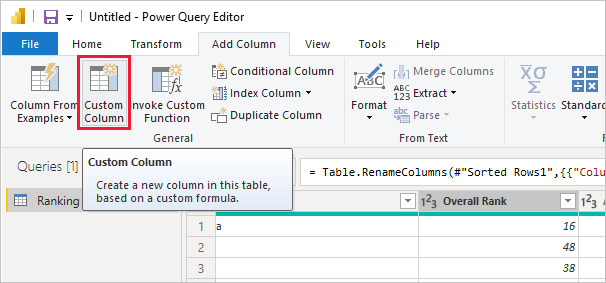

1. In the **Custom Column** window, in **New column name**, enter _New Rank_. In **Custom column formula**, enter the following data:

    ```
    ([Cost of living] + [Weather] + [Health care quality] + [Crime] + [Tax] + [Culture] + [Senior] + [#"Well-being"]) / 8
    ```
 
1. Make sure the status message is *No syntax errors have been detected*, and select **OK**.

    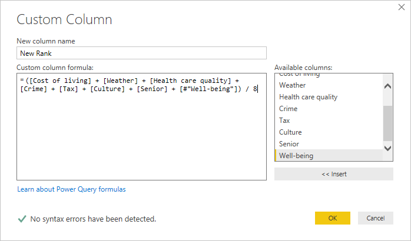

1. To keep column data consistent, transform the new column values to whole numbers. To change them, right-click the column header, and then select **Change Type \> Whole Number**. 

    If you need to choose more than one column, select a column, hold down **SHIFT**, select additional adjacent columns, and then right-click a column header. You can also use the **CTRL** key to choose non-adjacent columns.

    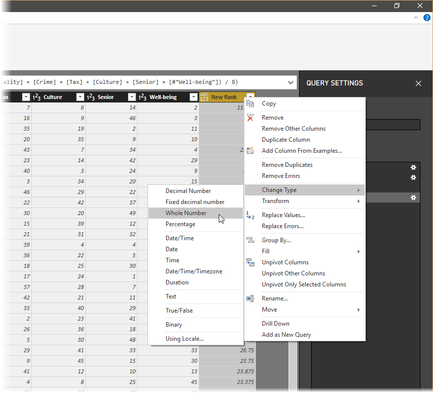

1. To *transform* column data types, in which you transform the current data type to another, select **Data Type Text** from the **Transform** ribbon. 

   

1. In **Query Settings**, the **Applied Steps** list reflects any shaping steps applied to the data. To remove a step from the shaping process, select the **X** to the left of the step. 

    In the following image, the **Applied Steps** list reflects the added steps so far: 
     - **Source**: Connecting to the website.
     - **Extracted Table from Html**: Selecting the table. 
     - **Changed Type**: Changing text-based number columns from *Text* to *Whole Number*. 
     - **Added Custom**: Adding a custom column.
     - **Changed Type1**: The last applied step.

       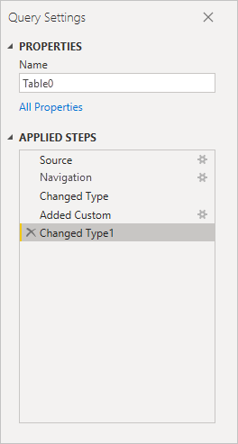

## Adjust data

Before we can work with this query, we need to make a few changes to adjust its data:

   - Adjust the rankings by removing a column.

       We've decided **Cost of living** is a non-factor in our results. After removing this column, we find that the data remains unchanged. 

   - Fix a few errors.

       Because we removed a column, we need to readjust our calculations in the **New Rank** column, which involves changing a formula.

   - Sort the data.

       Sort the data based on the **New Rank** and **Rank** columns.
 
   - Replace the data.

       We'll highlight how to replace a specific value and the need of inserting an **Applied Step**.

   - Change the table name. 

       Because **Table 0** isn't a useful descriptor for the table, we'll change its name.

1. To remove the **Cost of living** column, select the column, choose the **Home** tab from the ribbon, and then select **Remove Columns**.

    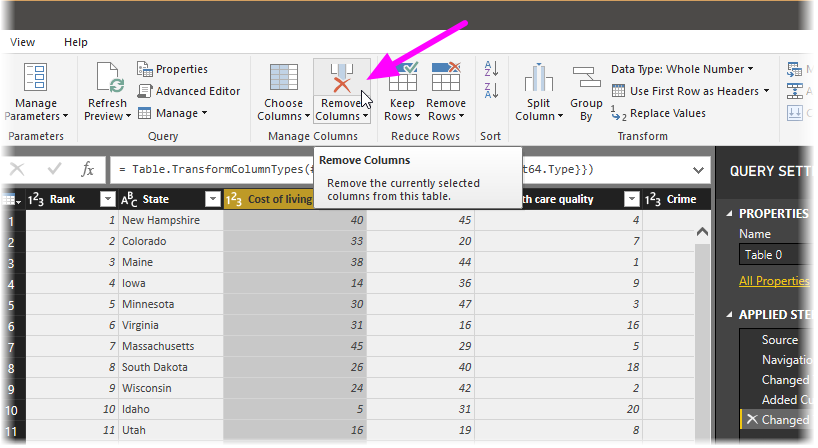

   Notice the **New Rank** values haven't changed, due to the ordering of the steps. Because Power Query Editor records the steps sequentially, yet independently, of each other, you can move each **Applied Step** up or down in the sequence. 

1. Right-click a step. Power Query Editor provides a menu that lets you do the following tasks: 
   - **Rename**; Rename the step.
   - **Delete**: Delete the step.
   - **Delete** **Until End**: Remove the current step, and all subsequent steps.
   - **Move before**: Move the step up in the list.
   - **Move after**: Move the step down in the list.

1. Move up the last step, **Removed Columns**, to just above the **Added Custom** step.

   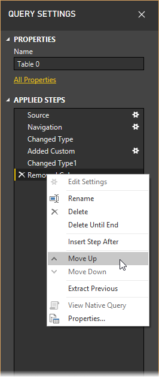

1. Select the **Added Custom** step. 

   Notice the data now shows _Error_, which we'll need to address.

   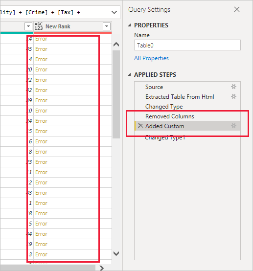

   There are a few ways to get more information about each error. If you select the cell without clicking on the word *Error*, Power Query Editor displays the error information.

   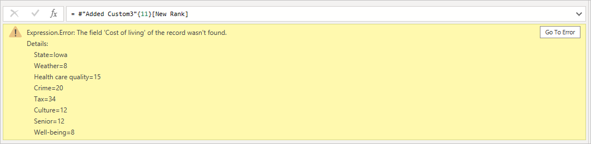

   If you select the word *Error* directly, Power Query Editor creates an **Applied Step** in the **Query Settings** pane and displays information about the error. 

1. Because we don't need to display information about the errors, select **Cancel**.

1. To fix the errors, select the **New Rank** column, then display the column's data formula by selecting the **Formula Bar** checkbox from the **View** tab. 

   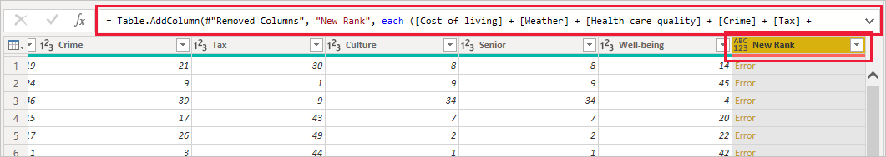

1. Remove the _Cost of living_ parameter and decrement the divisor, by changing the formula as follows: 
   ```
    Table.AddColumn(#"Removed Columns", "New Rank", each ([Weather] + [Health care quality] + [Crime] + [Tax] + [Culture] + [Senior] + [#"Well-being"]) / 7)
   ```

1. Select the green checkmark to the left of the formula box or press **Enter**.

  Power Query Editor replaces the data with the revised values and the **Added Custom** step completes with no errors.

   > [!NOTE]
   > You can also select **Remove Errors**, by using the ribbon or the right-click menu, which removes any rows that have errors. However, we didn't want to do so in this tutorial because we wanted to preserve the data in the table.

1. Sort the data based on the **New Rank** column. First, select the last applied step, **Changed Type1** to display the most recent data. Then, select the drop-down located next to the **New Rank** column header and select **Sort Ascending**.

   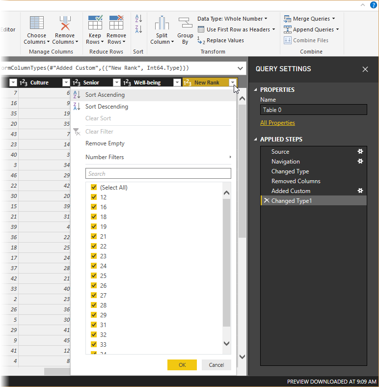

   The data is now sorted according to **New Rank**. However, if you look at the **Rank** column, you'll notice the data isn't sorted properly in cases where the **New Rank** value is a tie. We'll fix it in the next step.

1. To fix the data sorting issue, select the **New Rank** column and change the formula in the **Formula Bar** to the following formula:

   ```
    = Table.Sort(#"Changed Type1",{{"New Rank", Order.Ascending},{"Rank", Order.Ascending}})
   ```

1. Select the green checkmark to the left of the formula box or press **Enter**. 

   The rows are now ordered in accordance with both **New Rank** and **Rank**. In addition, you can select an **Applied Step** anywhere in the list, and continue shaping the data at that point in the sequence. Power Query Editor automatically inserts a new step directly after the currently selected **Applied Step**. 

1. In **Applied Step**, select the step preceding the custom column, which is the **Removed Columns** step. Here we'll replace the value of the **Weather** ranking in Arizona. Right-click the appropriate cell that contains Arizona's **Weather** ranking, and then select **Replace Values**. Note which **Applied Step** is currently selected.

   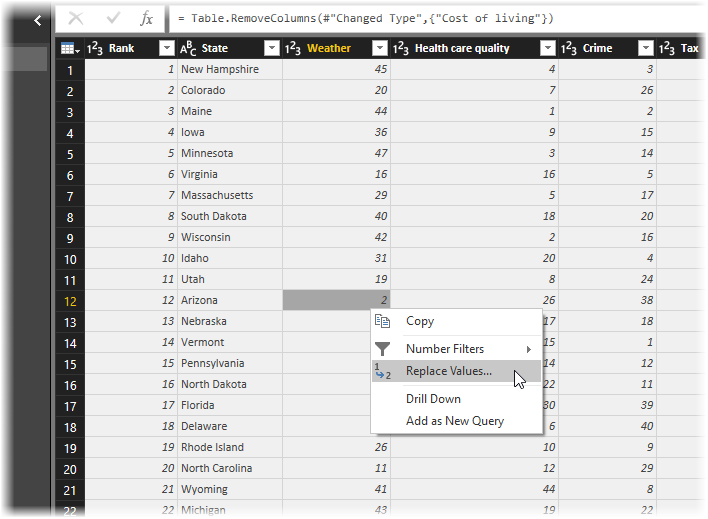

1. Select **Insert**.

    Because we're inserting a step, Power Query Editor warns us about the danger of doing so; subsequent steps could cause the query to break. 

    

1. Change the data value to _51_. 

   Power Query Editor replaces the data for Arizona. When you create a new **Applied Step**, Power Query Editor names it based on the action; in this case, **Replaced Value**. If you have more than one step with the same name in your query, Power Query Editor adds a number (in sequence) to each subsequent **Applied Step** to differentiate between them.

1. Select the last **Applied Step**, **Sorted Rows**. 

   Notice the data has changed regarding Arizona's new ranking. This change occurs because we inserted the **Replaced Value** step in the correct location, before the **Added Custom** step.

1. Lastly, we want to change the name of that table to something descriptive. In the **Query Settings** pane, under **Properties**, enter the new name of the table, and then select **Enter**. Name this table *RetirementStats*.

   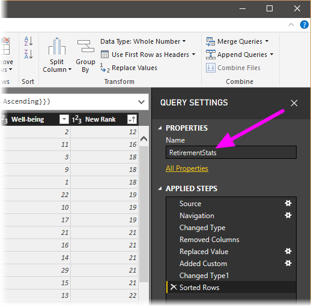

   When we start creating reports, it’s useful to have descriptive table names, especially when we connect to multiple data sources, which are listed in the **Fields** pane of the **Report** view.

   We’ve now shaped our data to the extent we need to. Next let’s connect to another data source, and combine data.

## Combine data
The data about various states is interesting, and will be useful for building additional analysis efforts and queries. But there’s one problem: most data out there uses a two-letter abbreviation for state codes, not the full name of the state. We need a way to associate state names with their abbreviations.

We’re in luck; there’s another public data source that does just that, but it needs a fair amount of shaping before we can connect it to our retirement table. TO shape the data, follow these steps:

1. From the **Home** ribbon in Power Query Editor, select **New Source \> Web**. 

2. Enter the address of the website for state abbreviations, *https://en.wikipedia.org/wiki/List_of_U.S._state_abbreviations*, and then select **Connect**.

   The Navigator displays the content of the website.

    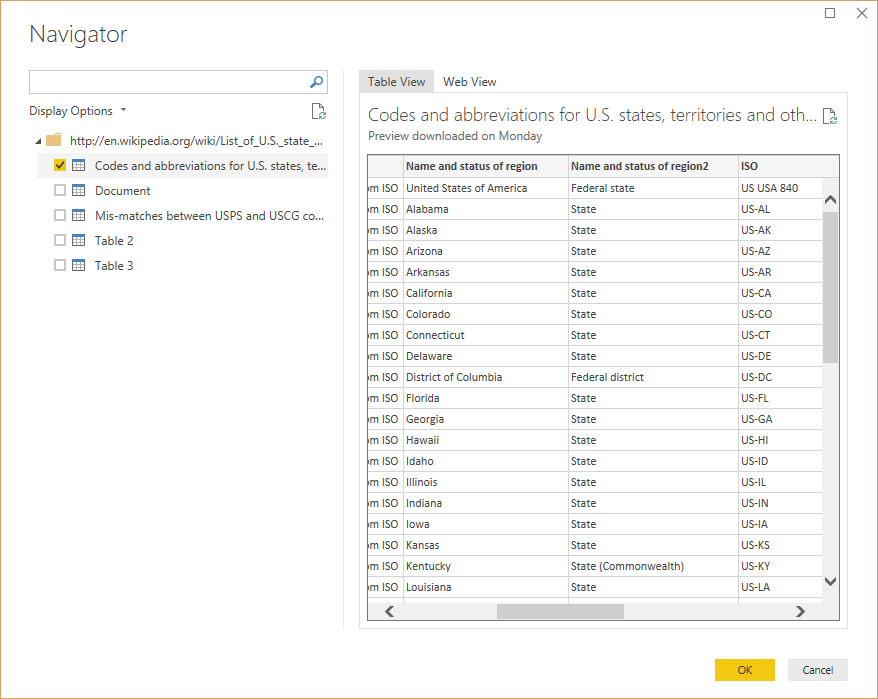

1. Select **Codes and abbreviations**. 

   > [!TIP]
   > It will take quite a bit of shaping to pare this table’s data down to what we want. Is there a faster or easier way to accomplish the steps below? Yes, we could create a *relationship* between the two tables, and shape the data based on that relationship. The following steps are still good to learn for working with tables; however, relationships can help you quickly use data from multiple tables.
> 
> 

To get the data into shape, follow these steps:

1. Remove the top row. Because it's a result of the way that the web page’s table was created, we don’t need it. From the **Home** ribbon, select **Remove Rows \> Remove Top Rows**.

    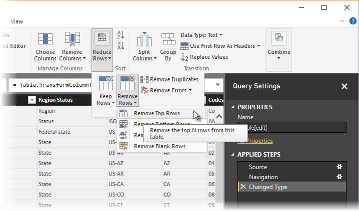

    The **Remove Top Rows** window appears, letting you specify how many rows you want to remove.

    > [!NOTE]
    > If Power BI accidentally imports the table headers as a row in your data table, you can select **Use First Row As Headers** from the **Home** tab, or from the **Transform** tab in the ribbon, to fix your table.

1. Remove the bottom 26 rows. These rows are U.S. territories, which we don’t need to include. From the **Home** ribbon, select **Remove Rows \> Remove Bottom Rows**.

    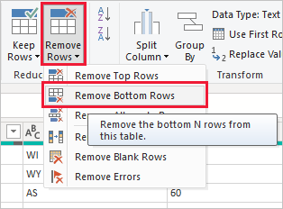

1. Because the RetirementStats table doesn't have information for Washington DC, we need to filter it from our list. Select the **Region Status** drop-down, then clear the checkbox beside **Federal district**.

    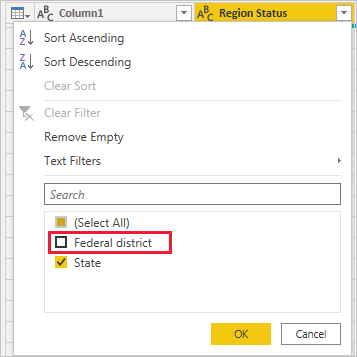

1. Remove a few unneeded columns. Because we need only the mapping of each state to its official two-letter abbreviation, we can remove several columns. First select a column, then hold down the **CTRL** key and select each of the other columns to be removed. From the **Home** tab on the ribbon, select **Remove Columns \> Remove Columns**.

   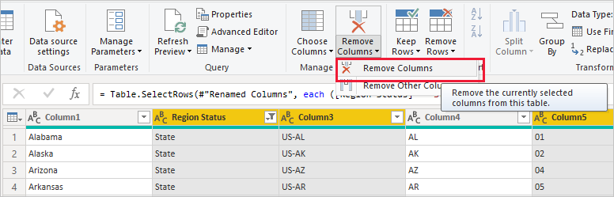

   > [!NOTE]
   > This is a good time to point out that the *sequence* of applied steps in Power Query Editor is important, and can affect how the data is shaped. It’s also important to consider how one step may impact another subsequent step; if you remove a step from the Applied Steps, subsequent steps may not behave as originally intended, because of the impact of the query’s sequence of steps.

   > [!NOTE]
   > When you resize the Power Query Editor window to make the width smaller, some ribbon items are condensed to make the best use of visible space. When you increase the width of the Power Query Editor window, the ribbon items expand to make the most use of the increased ribbon area.

1. Rename the columns and the table. There are a few ways to rename a column: First, select the column, then either select **Rename** from the **Transform** tab on the ribbon, or right-click and select **Rename**. The following image has arrows pointing to both options; you only need to choose one.

   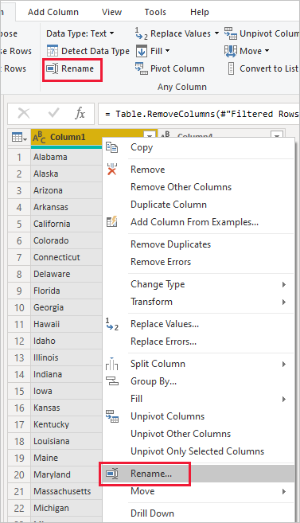

1. Rename the columns to *State Name* and *State Code*. To rename the table, enter the **Name** in the **Query Settings** pane. Name this table *StateCodes*.

## Combine queries

Now that we’ve shaped the StateCodes table the way we want, let’s combine these two tables, or queries, into one. Because the tables we now have are a result of the queries we applied to the data, they’re often referred to as *queries*.

There are two primary ways of combining queries: *merging* and *appending*.

- When you have one or more columns that you’d like to add to another query, you *merge* the queries. 
- When you have additional rows of data that you’d like to add to an existing query, you *append* the query.

In this case, we want to merge the queries. To do so, follow these steps:
 
1. From the left pane of Power Query Editor, select the query *into which* you want the other query to merge. In this case, it's **RetirementStats**. 

1. Select **Merge Queries \> Merge Queries** from the **Home** tab on the ribbon.

   

   You may be prompted to set the privacy levels, to ensure the data is combined without including or transferring data you don't want transferred.

   The **Merge** window appears. It prompts you to select which table you'd like merged into the selected table, and the matching columns to use for the merge. 

1. Select **State** from the RetirementStats table, then select the **StateCodes** query. 

   When you select the correct matching columns, the **OK** button is enabled.

   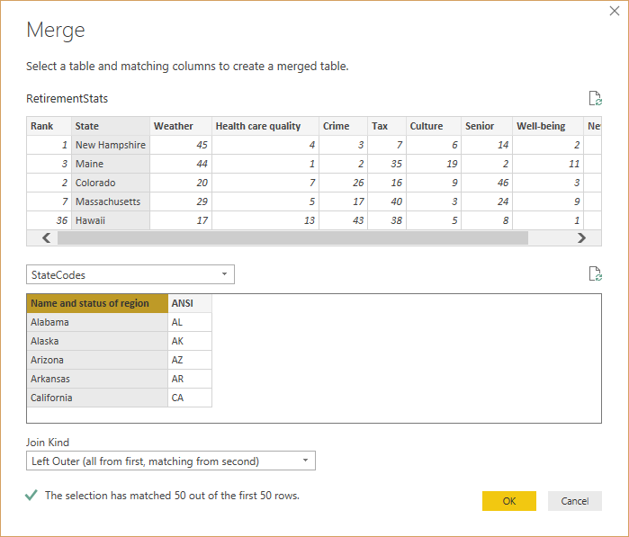

1. Select **OK**.

   Power Query Editor creates a new column at the end of the query, which contains the contents of the table (query) that was merged with the existing query. All columns from the merged query are condensed into the column, but you can **Expand** the table and include whichever columns you want.

   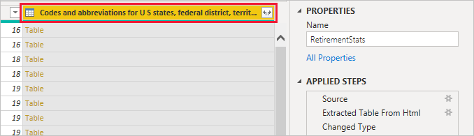

1. To expand the merged table, and select which columns to include, select the expand icon (). 

   The **Expand** window appears.

   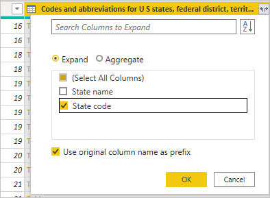

1. In this case, we want only the **State Code** column. Select that column, clear **Use original column name as prefix**, and then select **OK**.

   If we had left the checkbox selected for **Use original column name as prefix**, the merged column would be named **NewColumn.State Code**.

   > [!NOTE]
   > Want to explore how to bring in the NewColumn table? You can experiment a bit, and if you don’t like the results, just delete that step from the **Applied Steps** list in the **Query Settings** pane; your query returns to the state prior to applying that **Expand** step. You can do this as many times as you like until the expand process looks the way you want it.

   We now have a single query (table) that combines two data sources, each of which has been shaped to meet our needs. This query can serve as a basis for many additional and interesting data connections, such as housing cost statistics, demographics, or job opportunities in any state.

1. To apply your changes and close Power Query Editor, select **Close & Apply** from the **Home** ribbon tab. 

   The transformed dataset appears in Power BI Desktop, ready to be used for creating reports.

   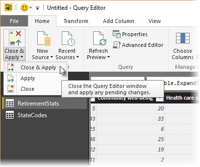

## Next steps
For more information on Power BI Desktop and its capabilities, see the following resources:

* [What is Power BI Desktop?](../fundamentals/desktop-what-is-desktop.md)
* [Query overview in Power BI Desktop](../transform-model/desktop-query-overview.md)
* [Data sources in Power BI Desktop](desktop-data-sources.md)
* [Connect to data in Power BI Desktop](desktop-connect-to-data.md)
* [Common query tasks in Power BI Desktop](../transform-model/desktop-common-query-tasks.md)   
