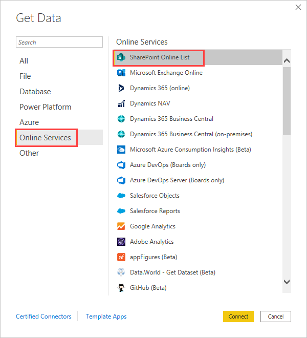
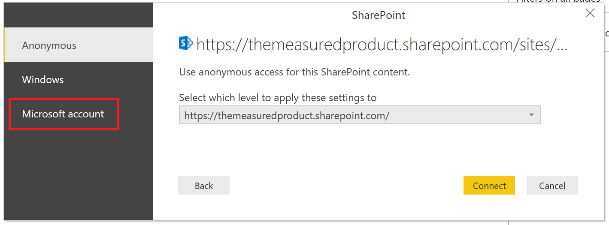
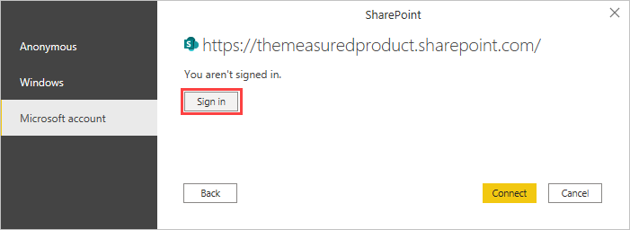
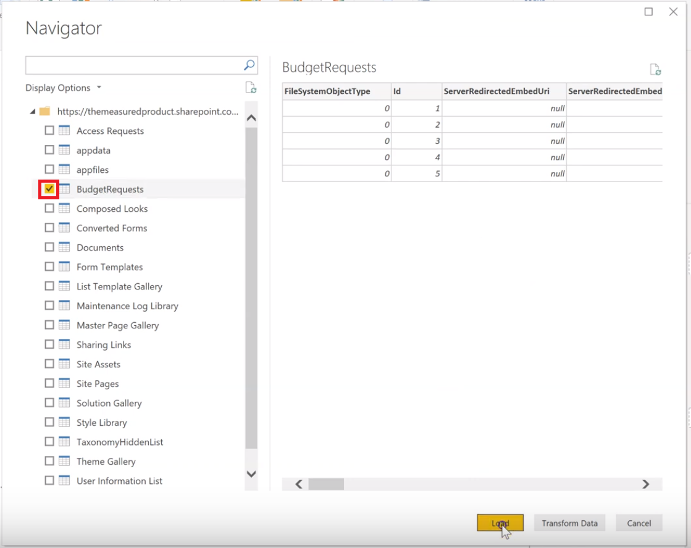

# Create a report on a SharePoint List in Power BI Desktop

Many teams and organizations use lists in SharePoint Online to store data because it's easy to set up and easy for users to update.  Sometimes a chart is a much easier way for users to quickly understand the data rather than looking at the list itself. In this tutorial, you learn how to transform your SharePoint list data into a Power BI report.

Watch this five-minute tutorial video, or scroll down for step-by-step instructions.

> [!NOTE]  
> This video might use earlier versions of Power BI Desktop or the Power BI service.

> [!VIDEO https://www.youtube.com/embed/OZO3x2NF8Ak]

In the Power BI service, you can also [create a report quickly from data in a SharePoint list](../create-reports/service-quick-create-sharepoint-list.md).

If your purpose is to quickly create a semantic model in the Power BI service, you can do so directly from the SharePoint list. For more information, see [Create a semantic model from a SharePoint list](./create-dataset-sharepoint-online-list.md).

## Part 1: Connect to your SharePoint List

1. If you don't have it already, download and install [Power BI Desktop](https://powerbi.microsoft.com/desktop/).
2. Open Power BI Desktop and in the **Home** tab of the ribbon, select **Get data** > **More**.
3. Select **Online Services**, and then select **SharePoint Online List**.  

    

4. Select **Connect**.
4. Find the address (also known as a URL) of your SharePoint Online site that contains your list.  From a page in SharePoint Online, you can usually get the site address by selecting **Home** in the navigation pane, or the icon for the site at the top, then copying the address from your web browser's address bar.

   Watch a video of this step:

   > [!NOTE]  
   > This video might use earlier versions of Power BI Desktop or the Power BI service.

   > [!VIDEO https://www.youtube.com/embed/OZO3x2NF8Ak?start=48&end=90]

5. In Power BI Desktop, paste the address into the **Site URL** field of the **SharePoint Online Lists** dialog box, and then select **OK**.

6. You might or might not see a SharePoint access screen like the following image.  If you don't see it, skip to step 10.  If you do see it, select **Microsoft Account** on the left side of the page.

    

7. Select **Sign In**, and enter the user name and password you use to sign in to Microsoft 365.

    

8. When you finish signing in, select **Connect**.

9. On the left side of the **Navigator** dialog box, select the checkbox beside the SharePoint list you want to connect to.

    

10. Select **Load**.  Power BI loads your list data into a new report.

## Part 2: Create a report

1. On the left side of the Power BI Desktop screen, select the **Data** icon to see that your SharePoint list data was loaded.

2. Make sure your list columns with numbers show the Sum, or Sigma, icon in the **Data** pane on the right.  For any that don't, select the column header in the table view, select the **Structure** group in the **Column tools** tab, then change the **Data type** to **Decimal Number** or **Whole Number**, depending on the data.  If prompted to confirm your change, select **Yes**.  If your number is a special format, like currency, you can also choose that by setting the **Format** in the **Formatting** group.

   Watch a video of this step:

   > [!NOTE]  
   > This video might use earlier versions of Power BI Desktop or the Power BI service.

   > [!VIDEO https://www.youtube.com/embed/OZO3x2NF8Ak?start=147&end=204]

3. On the left side of the Power BI Desktop screen, select the **Report** icon.
4. Select columns you want to visualize by selecting the checkboxes beside them in the **Fields** pane on the right.

   Watch a video of this step:
   
   > [!NOTE]  
   > This video might use earlier versions of Power BI Desktop or the Power BI service.

   > [!VIDEO https://www.youtube.com/embed/OZO3x2NF8Ak?start=215&end=252]

5. Change the visual type if you need to.
6. You can create multiple visualizations in the same report by deselecting the existing visual, then selecting checkboxes for other columns in the **Fields** pane.
7. Select **Save** to save your report.

## Related content

- [Create a report quickly from a SharePoint list](../create-reports/service-quick-create-sharepoint-list.md)