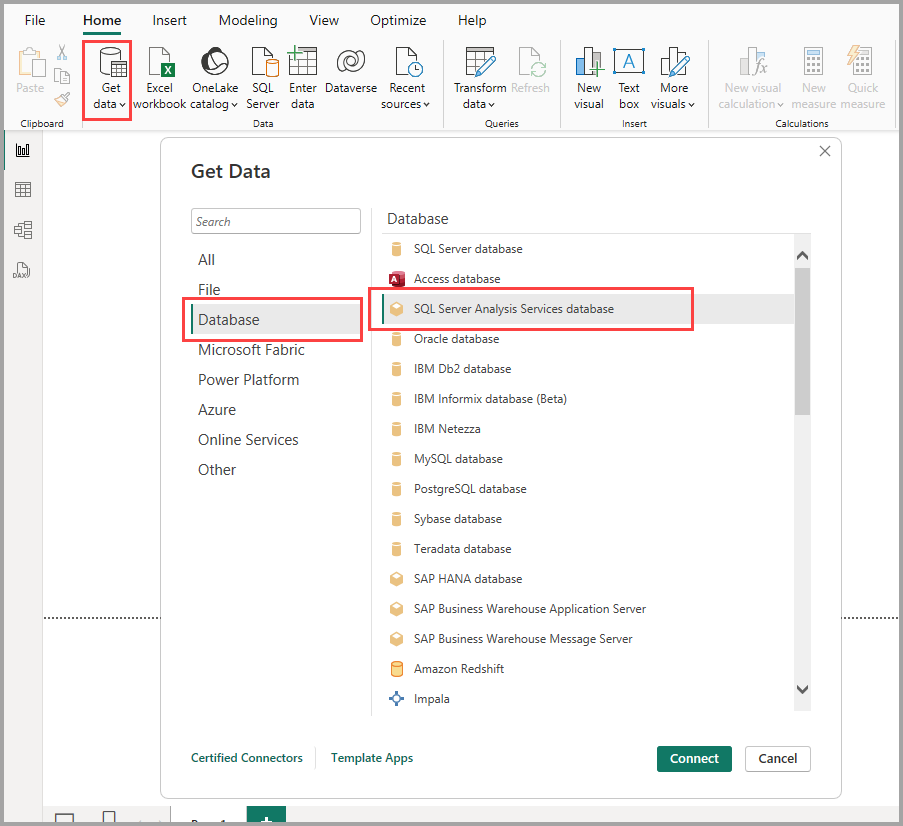

# Connect to SSAS multidimensional models in Power BI Desktop

With Power BI Desktop, you can access *SSAS multidimensional models*, commonly referred to as *SSAS MD*.

To connect to an SSAS MD database, select **Get data**, choose **Database** > **SQL Server Analysis Services database**, and then select **Connect**:

The Power BI service and Power BI Desktop both support SSAS multidimensional models in live connection mode. You can publish and upload reports that use **SSAS Multidimensional models** in live mode to the Power BI service.

## Capabilities and features of SSAS MD

The following sections describe features and capabilities of Power BI and SSAS MD connections.

### Tabular metadata of multidimensional models

The following table shows the correspondence between multidimensional objects and the tabular metadata that's returned to Power BI Desktop. Power BI queries the model for tabular metadata. Based on the returned metadata, Power BI Desktop runs appropriate DAX queries against SSAS when you create a visualization (such as a table, matrix, chart, or slicer).

| BISM-Multidimentional object | Tabular Metadata |
| --- | --- |
| Cube |Model |
| Cube dimension |Table |
| Dimension attributes (keys), name |Columns |
| Measure group |Table |
| Measure |Measure |
| Measures without associated measure group |Within table called *Measures* |
| Measure group -> Cube dimension relationship |Relationship |
| Perspective |Perspective |
| KPI |KPI |
| User/parent-child hierarchies |Hierarchies |

### Measures, measure groups, and KPIs

Measure groups in a multidimensional cube are exposed as tables with a sigma (∑) beside them in the **Fields** pane. Calculated measures without an associated measure group are grouped under a special table called *Measures* in the tabular metadata.

To help simplify complex models in a multidimensional model, you can define a set of measures or KPIs in a cube to be located within a *display folder*. Power BI recognizes display folders in tabular metadata, and it shows measures and KPIs within the display folders. KPIs in multidimensional databases support *Value*, *Goal*, *Status Graphic*, and *Trend Graphic*.

### Dimension attribute type

Multidimensional models also support associating dimension attributes with specific dimension attribute types. For example, a **Geography** dimension where the *City*, *State-Province*, *Country*, and *Postal Code* dimension attributes have appropriate geography types associated with them are exposed in the tabular metadata. Power BI recognizes the metadata, enabling you to create map visualizations. You'll recognize these associations by the *map* icon next to the element in the **Field** pane in Power BI.

Power BI can also render images when you provide a field that contains URLs (uniform resource locators) of the images. You may specify these fields as *ImageURL* types in SQL Server Data Tools (or then in Power BI). Its type information is then provided to Power BI in the tabular metadata. Power BI can then retrieve those images from the URL and display them in visuals.

### Parent-child hierarchies

Multidimensional models support parent-child hierarchies, which are presented as a *hierarchy* in the tabular metadata. Each level of the parent-child hierarchy is exposed as a hidden column in the tabular metadata. The key attribute of the parent-child dimension isn't exposed in the tabular metadata.

### Dimension calculated members

Multidimensional models support creation of various types of *calculated members*. The two most common types of calculated members are:

* Calculated members on attribute hierarchies that aren't siblings of *All*
* Calculated members on user hierarchies

Multidimensional models expose *calculated members on attribute hierarchies* as values of a column. You have a few additional options and constraints if you expose this type of calculated member:

* A dimension attribute can have an optional *UnknownMember*.

* An attribute containing calculated members can't be the key attribute of the dimension unless it's the only attribute of the dimension.

* An attribute containing calculated members can't be a parent-child attribute.

The calculated members of user hierarchies aren't exposed in Power BI. You can instead connect to a cube that contains calculated members on user hierarchies. However, you'll be unable to see calculated members if they don't meet the constraints that we mentioned in the previous bulleted list.

### Security

Multidimensional models support dimension and cell level security by way of *roles*. When you connect to a cube with Power BI, you're authenticated and evaluated for appropriate permissions. If a user has *dimension security* applied, the respective dimension members aren't seen by the user in Power BI. However, when a user has defined a *cell security* permission where certain cells are restricted, that user can't connect to the cube using Power BI.

## Considerations and limitations

There are certain limitations to using SSAS MD:

* Only enterprise and BI editions of SQL Server 2014 support live connections. For the standard edition of SQL Server, SQL Server 2016 or later is required for live connections.

* *Actions* and *named sets* aren't exposed to Power BI. To create visuals and reports, you can still connect to cubes that also contain actions or named sets.

* When Power BI displays metadata for an SSAS model, occasionally you can't retrieve data from the model. This scenario can occur if you've installed the 32-bit version of the MSOLAP provider, but not the 64-bit version. Installing the 64-bit version may resolve the issue.

* You can't create *report level* measures when authoring a report that is connected live to an SSAS multidimensional model. The only measures that are available are measures defined in the MD model.

## Supported features of SSAS MD in Power BI Desktop

Consumption of the following elements is supported in this release of SSAS MD. For more information about these features, see [Understanding power view for multidimensional models](/sql/analysis-services/multidimensional-models/understanding-power-view-for-multidimensional-models).

* Default members
* Dimension attributes
* Dimension attribute types
* Dimension calculated members, which:
  * must be a single real member when the dimension has more than one attribute;
  * can't be the key attribute of the dimension unless it's the only attribute; and
  * can't be a parent-child attribute.
* Dimension security
* Display folders
* Hierarchies
* ImageUrls
* KPIs
* KPI trends
* Measures (with or without measure groups)
* Measures as variant

## Troubleshooting

The following list describes all known issues when connecting to SQL Server Analysis Services (SSAS).

* **Error : Couldn't load model schema** - This error usually occurs when the user connecting to Analysis Services doesn't have access to database/cube.
