# Tutorial: Analyze webpage data by using Power BI Desktop

As a long-time soccer fan, you want to report on the UEFA European Championship (Euro Cup) winners over the years. With Power BI Desktop, you can import this data from a web page into a report and create visualizations that show the data. In this tutorial, you learn how to use Power BI Desktop to:

- Connect to a web data source and navigate across its available tables.
- Shape and transform data in the Power Query Editor.
- Name a query and import it into a Power BI Desktop report.
- Create and customize a map and a pie chart visualization.

## Connect to a web data source

You can get the UEFA winners data from the Results table on the UEFA European Football Championship Wikipedia page at https://en.wikipedia.org/wiki/UEFA_European_Football_Championship. 

Web connections are only established using basic authentication. Web sites requiring authentication may not work properly with the Web connector.

To import the data:

1. In the Power BI Desktop **Home** ribbon tab, drop down the arrow next to **Get Data**, and then select **Web**.

    

   >[!NOTE]
   >You can also select the **Get Data** item itself, or select **Get Data** from the Power BI Desktop get started dialog, then select **Web** from the **All** or **Other** section of the **Get Data** dialog, and then select **Connect**.

1. In the **From Web** dialog, paste the URL `https://en.wikipedia.org/wiki/UEFA_European_Football_Championship` into the **URL** text box, and then select **OK**.

    

   After connecting to the Wikipedia web page, the **Navigator** dialog shows a list of available tables on the page. You can select any of the table names to preview its data. The **Results[edit]** table has the data you want, although it's not exactly in the shape you want. You'll reshape and clean up the data before loading it into your report.

   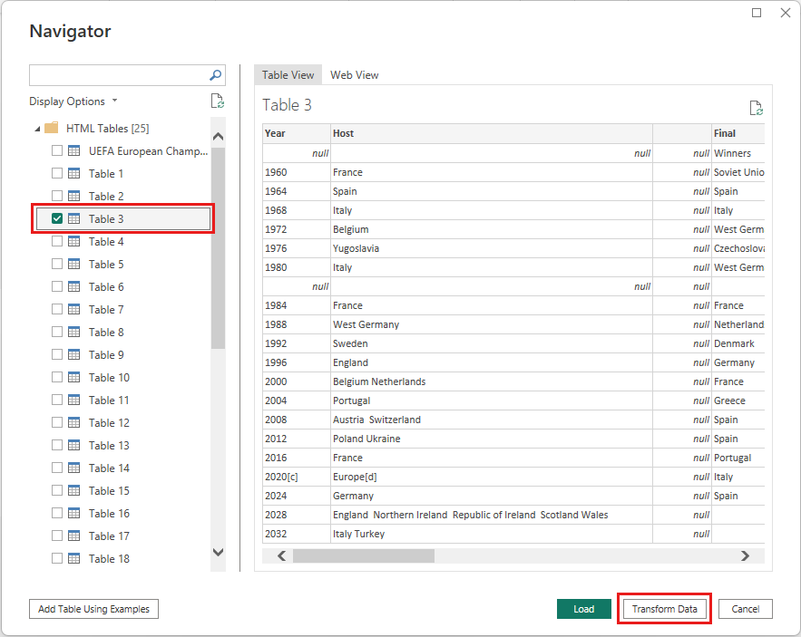

   >[!NOTE]
   >The **Preview** pane shows the most recent table selected, but all selected tables will load into the Power Query Editor when you select **Transform Data** or **Load**.

1. Select the **Results[edit]** table in the **Navigator** list, and then select **Transform Data**.

   A preview of the table opens in **Power Query Editor**, where you can apply transformations to clean up the data.

   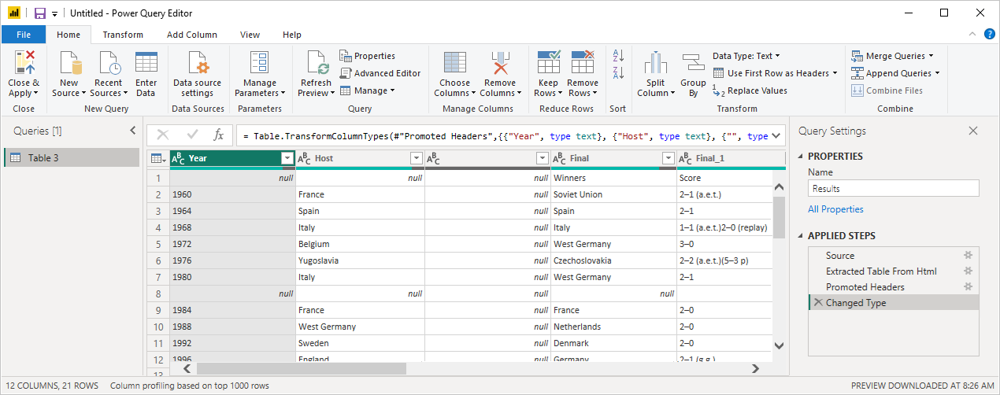

## Shape data in Power Query Editor

You want to make the data easier to scan by displaying only the years and the countries that won. You can use the Power Query Editor to perform these data shaping and cleansing steps.

First, remove all the columns except for two from the table. Rename these columns as *Year* and *Country* later in the process.

1. In the **Power Query Editor** grid, select the columns. Select Ctrl to select multiple items.

1. Right-click and select **Remove Other Columns**, or select **Remove Columns** > **Remove Other Columns** from the **Manage Columns** group in the **Home** ribbon tab, to remove all other columns from the table.

   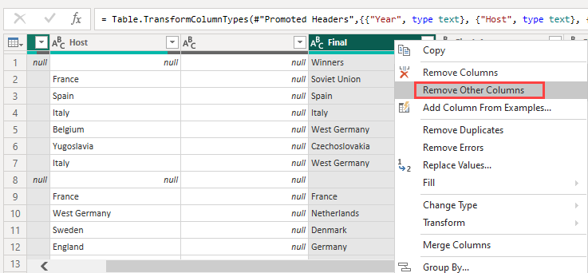

   or

   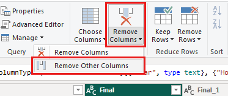

Next, remove the extra word *Details* from the first column cells.

1. Select the first column.

1. Right-click, and select **Replace Values**, or select **Replace Values** from the **Transform** group in the **Home** tab of the ribbon. This option is also found in the **Any Column** group in the **Transform** tab.

    

   or

   

1. In the **Replace Values** dialog, type **Details** in the **Value To Find** text box, leave the **Replace With** text box empty, and then select **OK** to delete the word *Details* from this column.

   

Some cells contain only the word "Year" rather than year values. You can filter the column to only display rows that don't contain the word "Year".

1. Select the filter drop-down arrow on the column.

1. In the drop-down menu, scroll down and clear the checkbox next to the **Year** option, and then select **OK**.

   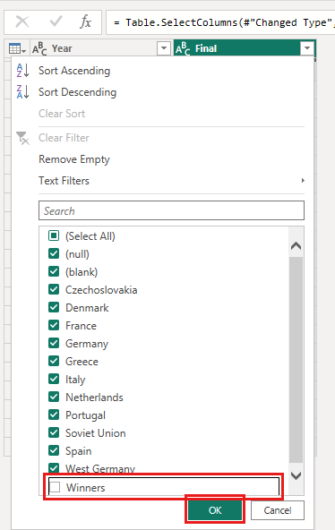

Since you're only looking at the final winners data now, you can rename the second column to **Country**. To rename the column:

1. Double-click or tap and hold in the second column header, or
   - Right-click the column header, and select **Rename**, or
   - Select the *column and select **Rename** from the **Any Column** group in the **Transform** tab of the ribbon.

    
  
   or

   

1. Type **Country** in the header and press **Enter** to rename the column.

You also want to filter out rows like "2020" that have null values in the **Country** column. You could use the filter menu as you did with the **Year** values, or you can:

1. Right-click on the **Country** cell in the **2020** row, which has the value *null*.

1. Select **Text Filters** > **Does not Equal** in the context menu to remove any rows that contain that cell's value.

   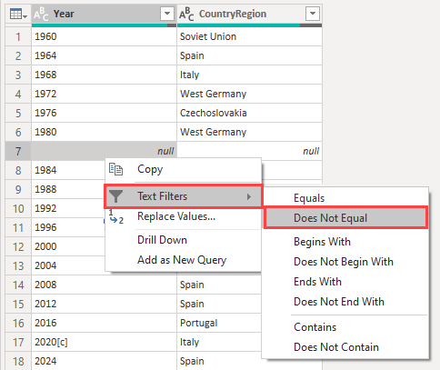

## Import the query into Report View

Now that you've shaped the data the way you want, you're ready to name your query "Euro Cup Winners" and import it into your report.

1. In the **Query Settings** pane, in the **Name** text box, enter **Euro Cup Winners**.

   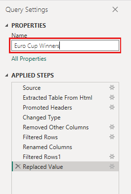

1. Select **Close & Apply** > **Close & Apply** from the **Home** tab of the ribbon.

   

The query loads into the Power BI Desktop *Report* view, where you can see it in the **Fields** pane.

   

>[!TIP]
>You can always get back to the Power Query Editor to edit and refine your query by:
>- Selecting the **More options** ellipsis (**...**) next to **Euro Cup Winners** in the **Fields** pane, and selecting **Edit query**, or
>- Selecting **Transform data** in the **Queries** group of the **Home** ribbon tab in Report view. 

## Create a visualization

To create a visualization based on your data:

1. Select the **Country** field in the **Fields** pane, or drag it to the report canvas. Power BI Desktop recognizes the data as country names, and automatically creates a **Map** visualization.

   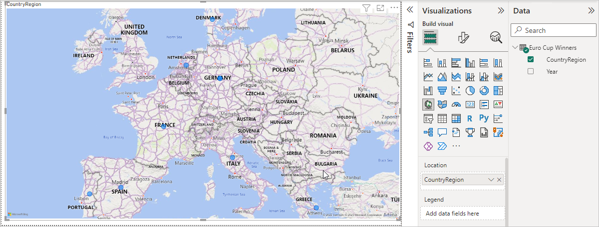

1. Enlarge the map by dragging the handles in the corners so all the winning country names are visible.  

   

1. The map shows identical data points for every country that won a Euro Cup tournament. To make the size of each data point reflect how often the country has won, drag the **Year** field to **Drag data fields here** under **Size** in the lower part of the **Visualizations** pane. The field automatically changes to a **Count of Year** measure, and the map visualization now shows larger data points for countries that have won more tournaments.

   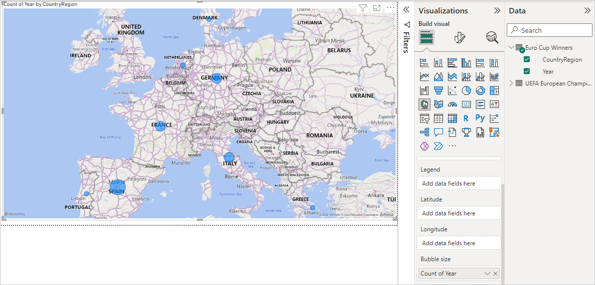

## Customize the visualization

As you can see, it's very easy to create visualizations based on your data. It's also easy to customize your visualizations to better present the data in ways that you want.

### Format the map

You can change the appearance of a visualization by selecting it and then selecting the **Format** (paint roller) icon in the **Visualizations** pane. For example, the "Germany" data points in your visualization could be misleading, because West Germany won two tournaments and Germany won one, and the map superimposes the two points rather than separating or adding them together. You can color these two points differently to highlight this fact. You can also give the map a more descriptive and attractive title.

1. With the visualization selected, select the **Format** icon, and then select **Data colors** to expand the data color options.

   

1. Turn **Show all** to **On**, and then select the drop-down menu next to **West Germany** and choose a yellow color.

   

1. Select **Title** to expand the title options, and in the **Title text** field, type **Euro Cup Winners** in place of the current title.

1. Change **Font color** to red, **Text size** to **12**, and **Font family** to **Segoe (Bold)**.

   

Your map visualization now looks like this:

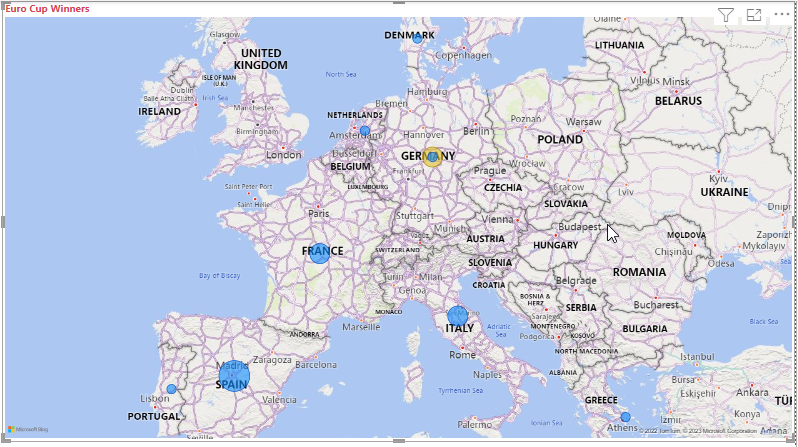

### Change the visualization type

You can change the type of a visualization by selecting it and then selecting a different icon at the top of the **Visualizations** pane. For example, your map visualization is missing the data for the Soviet Union and Czechoslovakia, because those countries no longer exist on the world map. Another type of visualization like a treemap or pie chart may be more accurate, because it shows all the values.

To change the map to a pie chart, select the map and then select the **Pie chart** icon in the **Visualizations** pane.

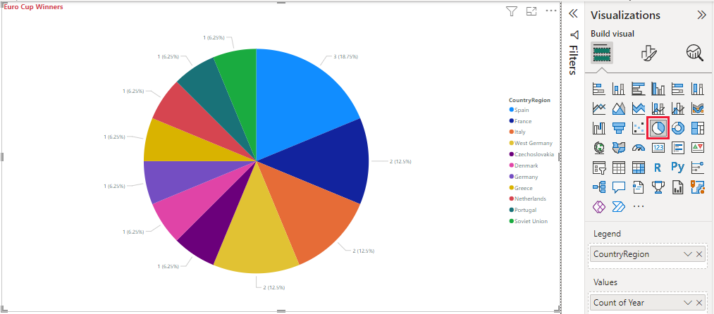

>[!TIP]
>- You can use the **Data colors** formatting options to make "Germany" and "West Germany" the same color. 
>- To group the countries with the most wins together on the pie chart, select the ellipsis (**...**) at the upper right of the visualization, and then select **Sort by Count of Year**.

Power BI Desktop provides a seamless end-to-end experience, from getting data from a wide range of data sources and shaping it to meet your analysis needs, to visualizing this data in rich and interactive ways. Once your report is ready, you can [upload it to Power BI](../create-reports/desktop-upload-desktop-files.md) and create dashboards based on it, which you can share with other Power BI users.

## See also

* [Microsoft Learn for Power BI](/learn/powerplatform/power-bi?WT.mc_id=powerbi_landingpage-docs-link)
* [Watch Power BI Desktop videos](../fundamentals/desktop-videos.md)
* [Visit the Power BI Forum](https://go.microsoft.com/fwlink/?LinkID=519326)
* [Read the Power BI Blog](https://go.microsoft.com/fwlink/?LinkID=519327)