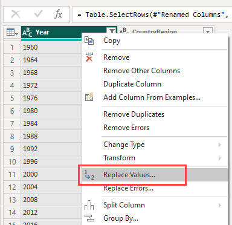
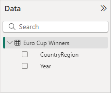
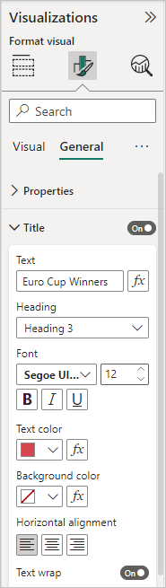

# Tutorial: Analyze webpage data by using Power BI Desktop

As a long-time soccer fan, you want to report on the UEFA European Championship (Euro Cup) winners over the years. With Power BI Desktop, you can import this data from a webpage into a report and create visualizations that show the data. In this tutorial, you learn how to use Power BI Desktop to:

- Connect to a web data source and navigate across its available tables.
- Shape and transform data in the Power Query Editor.
- Name a query and import it into a Power BI Desktop report.
- Create and customize a map and a pie chart visualization.

## Connect to a web data source

You can get the UEFA winners data from the Results table on the UEFA European Football Championship Wikipedia page at `https://en.wikipedia.org/wiki/UEFA_European_Football_Championship`.

Web connections are only established using basic authentication. Web sites requiring authentication might not work properly with the Web connector.

To import the data:

1. In the Power BI Desktop **Home** ribbon tab, dropdown the arrow next to **Get data**, and then select **Web**.

   

   > [!NOTE]
   >
   > You can also select the **Get data** item itself, or select **Get data from other sources** from Power BI Desktop Home, then select **Web** from the **All** or the **Other** section of the **Get Data** dialog, and then select **Connect**.

1. In the **From Web** dialog, paste the URL `https://en.wikipedia.org/wiki/UEFA_European_Football_Championship` into the **URL** text box, and then select **OK**.

    

   After you connect to the Wikipedia webpage, the **Navigator** dialog shows a list of available tables on the page. You can select any of the table names to preview its data. **Table 3** has the data you want, although it's not exactly in the shape you want. You'll reshape and clean up the data before loading it into your report.

   :::image type="content" source="media/desktop-tutorial-importing-and-analyzing-data-from-a-web-page/tutorialimanaly_navigator.png" alt-text="Screenshot shows the Navigator dialog with a table selected and Transform Data highlighted." lightbox="media/desktop-tutorial-importing-and-analyzing-data-from-a-web-page/tutorialimanaly_navigator.png":::

   > [!NOTE]
   >
   > The **Preview** pane shows the most recent table selected, but all selected tables load into the Power Query Editor when you select **Transform Data** or **Load**.

1. Select **Table 3** in the **Navigator** list, and then select **Transform Data**.

   A preview of the table opens in **Power Query Editor**, where you can apply transformations to clean up the data.

   :::image type="content" source="media/desktop-tutorial-importing-and-analyzing-data-from-a-web-page/webpage3.png" alt-text="Screenshot shows Power Query Editor with imported data ready for transformations." lightbox="media/desktop-tutorial-importing-and-analyzing-data-from-a-web-page/webpage3.png":::

## Shape data in Power Query Editor

You want to make the data easier to scan by displaying only the years and the countries/regions that won. You can use the Power Query Editor to perform these data shaping and cleansing steps.

First, remove all the columns except for two from the table. Rename one of these columns as *CountryRegion* later in the process.

1. In the **Power Query Editor** grid, select the columns. Press **Ctrl** to select multiple items.

1. Right-click and select **Remove Other Columns**, or select **Remove Columns** > **Remove Other Columns** from the **Manage Columns** group in the **Home** ribbon tab, to remove all other columns from the table.

   

   or

   

The second row of the imported data contains values that aren't needed. You can filter the **Final** column to exclude the word "Winners".

1. Select the filter dropdown arrow on the column.

1. In the dropdown menu, scroll down and clear the checkbox next to the **Winners** option, and then select **OK**.

   

The cell with the word "Winners" is filtered out along with the one next to it, the `null` value in the same row for the other column.

1. Do the same thing for **2028** and **2032**, as these games are yet to be played and the outcomes are unknown.

Since you're only looking at the final winners data now, you can rename the second column to **CountryRegion**. To rename the column:

1. Double-click or tap and hold in the second column header, or
   - Right-click the column header and select **Rename**, or
   - Select the column and select **Rename** from the **Any Column** group in the **Transform** tab of the ribbon.

   
  
   or

   

1. Type **CountryRegion** in the header and press **Enter** to rename the column.

You also want to filter out rows that have `null` values in the **CountryRegion** column. You could use the filter menu as you did with the **Winner** value, or you can:

1. Right-click on the row that has the value *null* in it. Since both columns have the value *null* in the same row, you can right-click on the cell in either column.

1. Select **Text Filters** > **Does not Equal** in the context menu to remove any rows that contain that cell's value.

   

The imported data has the superscript note marker *[c]* appended to the year 2020. You can remove the note marker *[c]*, or you can change the value to 2021, which is when the match took place, according to the note.

1. Select the first column.

1. Right-click and select **Replace Values**, or select **Replace Values** from the **Transform** group in the **Home** tab of the ribbon. This option is also found in the **Any Column** group in the **Transform** tab.

   

   or

   

1. In the **Replace Values** dialog, type **2020[c]** in the **Value To Find** text box, enter **2021** in the **Replace With** text box, and then select **OK** to replace the value in the column.

   

## Import the query into Report view

Now that you've shaped the data the way you want, you're ready to name your query "Euro Cup Winners" and import it into your report.

1. In the **Queries** pane, in the **Name** text box, enter **Euro Cup Winners**.

   

1. Select **Close & Apply** > **Close & Apply** from the **Home** tab of the ribbon.

   

The query loads into the Power BI Desktop *Report* view, where you can see it in the **Data** pane.

   

> [!TIP]
>
> You can always get back to the Power Query Editor to edit and refine your query by:
>
> - Selecting the **More options** ellipsis (**...**) next to **Euro Cup Winners** in the **Fields** pane, and selecting **Edit query**, or
> - Selecting **Transform data** in the **Queries** group of the **Home** ribbon tab in Report view.

## Create a visualization

To create a visualization based on your data:

1. Select the **CountryRegion** field in the **Data** pane, or drag it to the report canvas. Power BI Desktop recognizes the data as country/region names, and automatically creates a **Map** visualization.

   :::image type="content" source="media/desktop-tutorial-importing-and-analyzing-data-from-a-web-page/get-data-web14.png" alt-text="Screenshot shows a map visualization of the Country/Region field." lightbox="media/desktop-tutorial-importing-and-analyzing-data-from-a-web-page/get-data-web14.png":::

1. Enlarge the map by dragging the handles in the corners so all the winning country/region names are visible.  

   

1. The map shows identical data points for every country/region that won a Euro Cup tournament. To make the size of each data point reflect how often the country/region has won, drag the **Year** field to **Add data fields here** under **Bubble size** in the lower part of the **Visualizations** pane. The field automatically changes to a **Count of Year** measure, and the map visualization now shows larger data points for countries/regions that have won more tournaments.

   :::image type="content" source="media/desktop-tutorial-importing-and-analyzing-data-from-a-web-page/webpage15.png" alt-text="Screenshot shows the result of dragging Count of Year into Bubble size." lightbox="media/desktop-tutorial-importing-and-analyzing-data-from-a-web-page/webpage15.png":::

## Customize the visualization

As you can see, it's very easy to create visualizations based on your data. It's also easy to customize your visualizations to better present the data in ways that you want.

### Format the map

You can change the appearance of a visualization by selecting it and then selecting the **Format** (paint brush) icon in the **Visualizations** pane. For example, the "Germany" data points in your visualization could be misleading, because West Germany won two tournaments and Germany won one. The map superimposes the two points rather than separating or adding them together. You can color these two points differently to highlight this fact. You can also give the map a more descriptive and attractive title.

1. With the visualization selected, select the **Format** icon, and then select **Visual** > **Bubbles** > **Colors** to expand the data color options.

   

1. Turn **Show all** to **On**, and then select the dropdown menu next to **West Germany** and choose a yellow color.

   

1. Select **General** > **Title** to expand the title options, and in the **Text** field, type **Euro Cup Winners** in place of the current title.

1. Change **Text color** to red, size to **12**, and **Font** to **Segoe UI (Bold)**.

   

Your map visualization now looks like this example:

:::image type="content" source="media/desktop-tutorial-importing-and-analyzing-data-from-a-web-page/get-data-web18.png" alt-text="Screenshot shows the map visualization with the formatting changes applied." lightbox="media/desktop-tutorial-importing-and-analyzing-data-from-a-web-page/get-data-web18.png":::

### Change the visualization type

You can change the type of a visualization by selecting it and then selecting a different icon at the top of the **Visualizations** pane. For example, your map visualization is missing the data for the Soviet Union, because that country/region no longer exists on the world map. Another type of visualization like a *treemap* or *pie chart* might be more accurate, because it shows all the values.

To change the map to a pie chart, select the map and then choose the **Pie chart** icon in the **Visualizations** pane.

:::image type="content" source="media/desktop-tutorial-importing-and-analyzing-data-from-a-web-page/get-data-web19.png" alt-text="Screenshot shows the same fields changed to a pie chart." lightbox="media/desktop-tutorial-importing-and-analyzing-data-from-a-web-page/get-data-web19.png":::

> [!TIP]
>
> - You can use the **Data colors** formatting options to make "Germany" and "West Germany" the same color. 
> - To group the countries/regions with the most wins together on the pie chart, select the ellipsis (**...**) at the upper right of the visualization, and then select **Sort axis** and **Count of Year**.

Power BI Desktop provides a seamless end-to-end experience, from getting data from a wide range of data sources and shaping it to meet your analysis needs, to visualizing this data in rich and interactive ways. Once your report is ready, you can [upload it to Power BI](../create-reports/desktop-upload-desktop-files.md) and create dashboards based on it, which you can share with other Power BI users.

## Related content

- [Watch Power BI videos](../fundamentals/videos.md)
- [Visit the Power BI Forum](https://go.microsoft.com/fwlink/?LinkID=519326)
- [Read the Power BI Blog](https://go.microsoft.com/fwlink/?LinkID=519327)
