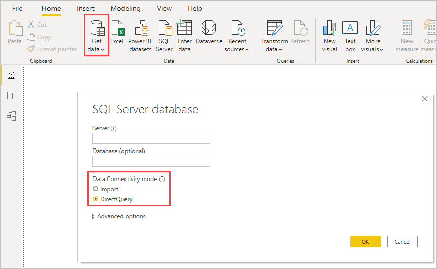
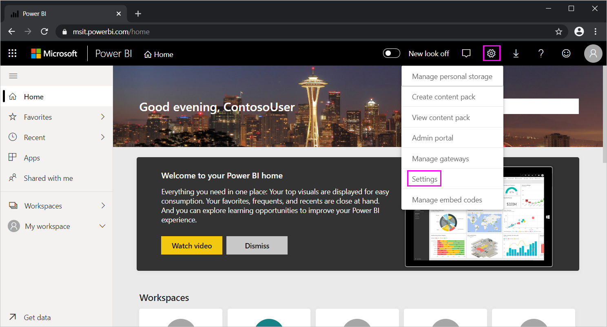

# Use DirectQuery in Power BI Desktop

When you connect to any data source with Power BI Desktop, you can import a copy of the data. For some data sources, you can also connect directly to the data source without importing data by using DirectQuery. 

To determine whether a data source supports DirectQuery, view the full listing of available data sources found in the article [Connectors in Power Query](/power-query/connectors/) which also applies to Power BI, select the article that describes the data source you're interested in from the list of supported connectors, then see the section in that connector's article titled **Capabilities supported**. If DirectQuery isn't listed in that section for the data source's article, DirectQuery isn't supported for that data connector.

Here are the differences between using import and DirectQuery connectivity modes:

- **Import**: A copy of the data from the selected tables and columns imports into Power BI Desktop. As you create or interact with visualizations, Power BI Desktop uses the imported data. To see underlying data changes after the initial import or the most recent refresh, you must import the full semantic model again to refresh the data.

- **DirectQuery**: No data imports into Power BI Desktop. For relational sources, you can select tables and columns to appear in the Power BI Desktop **Fields** list. For multidimensional sources like SAP Business Warehouse (SAP BW), the dimensions and measures of the selected cube appear in the **Fields** list. As you create or interact with visualizations, Power BI Desktop queries the underlying data source, so you're always viewing current data.

With DirectQuery, when you create or interact with a visualization, you must query the underlying source. The time that's needed to refresh the visualization depends on the performance of the underlying data source. If the data needed to service the request was recently requested, Power BI Desktop uses the recent data to reduce the time required to show the visualization. Selecting **Refresh** from the **Home** ribbon refreshes all visualizations with current data.

Many data modeling and data transformations are available when using DirectQuery, although with some performance-based limitations. For more information about DirectQuery benefits, limitations, and recommendations, see [DirectQuery in Power BI](desktop-directquery-about.md).

## DirectQuery benefits

Some benefits of using DirectQuery include:

- DirectQuery lets you build visualizations over very large semantic models, where it would be unfeasible to import all the data with pre-aggregation.

- DirectQuery reports always use current data. Seeing underlying data changes requires you to refresh the data, and reimporting large semantic models to refresh data could be unfeasible.

- The 1-GB semantic model limitation doesn't apply with DirectQuery.

## Connect using DirectQuery

To connect to a data source with DirectQuery:

1. In the **Home** group of the Power BI Desktop ribbon, select **Get data**, and then select a data source that DirectQuery supports, such as **SQL Server**. 

1. In the dialog box for the connection, under **Data connectivity mode**, select **DirectQuery**.

## Publish to the Power BI service

You can publish DirectQuery reports to the Power BI service, but you need to take extra steps for the Power BI service to open the reports.

- To connect the Power BI service to DirectQuery data sources other than Azure SQL Database, Azure Synapse Analytics (formerly SQL Data Warehouse), Amazon Redshift, and Snowflake Data Warehouse, [install an on-premises data gateway](service-gateway-onprem.md) and register the data source.

- If you used DirectQuery with cloud sources like Azure SQL Database, Azure Synapse, Amazon Redshift, or Snowflake Data Warehouse, you don't need an on-premises data gateway. You still must provide credentials for the Power BI service to open the published report. Without credentials, an error occurs when you try to open a published report or explore a semantic model created with a DirectQuery connection.

To provide credentials for opening the report and refreshing the data:

1. In the Power BI service, select the gear icon at upper-right and choose **Settings**.

   

1. On the **Settings** page, select the **Semantic models** tab, and choose the semantic model that uses DirectQuery.

1. Under **Data source connection**, provide the credentials to connect to the data source.

> [!NOTE]
> If you used DirectQuery with an Azure SQL Database that has a private IP address, you need to use an on-premises gateway.

## Considerations and limitations

Some Power BI Desktop features aren't supported in DirectQuery mode, or they have limitations. Some capabilities in the Power BI service, such as quick insights, also aren't available for semantic models that use DirectQuery. When you decide whether to use DirectQuery, consider these feature limitations. Also consider the following factors:

### Performance and load considerations

DirectQuery sends all requests to the source database, so the required refresh time for visuals depends on how long the underlying source takes to return results. Five seconds or less is the recommended response time for receiving requested data for visuals. Refresh times over 30 seconds produce an unacceptably poor experience for users consuming the report. A query that takes longer than four minutes times out in the Power BI service, and the user receives an error.

Load on the source database also depends on the number of Power BI users who consume the published report, especially if the report uses row-level security (RLS). The refresh of a non-RLS dashboard tile shared by multiple users sends a single query to the database, but refreshing a dashboard tile that uses RLS requires one query per user. The increased queries significantly increase load and potentially affect performance.

### One-million row limit

DirectQuery defines a one-million row limit for data returned from cloud data sources, which are any data sources that aren't on-premises. On-premises sources are limited to a defined payload of about 4 MB per row, depending on proprietary compression algorithm, or 16 MB for the entire visual. Premium capacities can set different maximum row limits, as described in the blog post [Power BI Premium new capacity settings](https://powerbi.microsoft.com/blog/five-new-power-bi-premium-capacity-settings-is-available-on-the-portal-preloaded-with-default-values-admin-can-review-and-override-the-defaults-with-their-preference-to-better-fence-their-capacity).

Power BI creates queries that are as efficient as possible, but some generated queries might retrieve too many rows from the underlying data source. For example, this situation can occur with a simple chart that includes a high cardinality column with the aggregation option set to **Don't Summarize**. The visual must have only columns with a cardinality below 1 million, or must apply the appropriate filters.

The row limit doesn't apply to aggregations or calculations used to select the semantic model DirectQuery returns, only to the rows returned. For example, the query that runs on the data source can aggregate 10 million rows. As long as the data returned to Power BI is less than 1 million rows, the query can accurately return the results. If the data is over 1 million rows, Power BI shows an error, except in Premium capacity with different admin-set limits. The error states: **The resultset of a query to external data source has exceeded the maximum allowed size of '1000000' rows.** 

### Security considerations

By default, all users who consume a published report in the Power BI service connect to the underlying data source by using the credentials entered after publication. This situation is the same as for imported data. All users see the same data, regardless of any security rules that the underlying source defines.

If you need per-user security implemented with DirectQuery sources, either use RLS or configure Kerberos-constrained authentication against the source. Kerberos isn't available for all sources. For more information, see [Row-level security (RLS) with Power BI](../enterprise/service-admin-rls.md) and [Configure Kerberos-based SSO from Power BI service to on-premises data sources](service-gateway-sso-kerberos.md).

### Other DirectQuery limitations

Some other limitations of using DirectQuery include:

- If the Power Query Editor query is overly complex, an error occurs. To fix the error, you must either delete the problematic step in Power Query Editor, or switch to import mode. Multidimensional sources like SAP BW can't use the Power Query Editor.

- Automatic date/time hierarchy is unavailable in DirectQuery. DirectQuery mode doesn't support date column drilldown by year, quarter, month, or day.

- For table or matrix visualizations, there's a 125-column limit for results that return more than 500 rows from DirectQuery sources. These results display a scroll bar in the table or matrix that lets you fetch more data. In that situation, the maximum number of columns in the table or matrix is 125. If you must include more than 125 columns in a single table or matrix, consider creating measures that use `MIN`, `MAX`, `FIRST`, or `LAST`, because they don't count against this maximum.

- You can't change from import to DirectQuery mode. You can switch from DirectQuery mode to import mode if you import all the necessary data. It's not possible to switch back, mostly because of the feature set that DirectQuery doesn't support. DirectQuery models over multidimensional sources, like SAP BW, can't be switched from DirectQuery to import mode either, because of the different treatment of external measures.

- Calculated tables and calculated columns that reference a DirectQuery table from a data source with single sign-on (SSO) authentication are supported in the Power BI service with an assigned [shareable cloud connection](service-create-share-cloud-data-sources.md) and / or [granular access control](service-create-share-cloud-data-sources.md#granular-access-control).

<!-- Cannot repro. `is` and `is not` 12/31/9999 filters fine. Version: 2.111.581.0 64-bit (November 2022)

- A known issue exists in DirectQuery when you filter a date column that contains December 31, 9999, which is often used as a special date placeholder. While it's common to filter the December 31, 9999 date from your analysis, using an `is` or `is not` filter doesn't correctly filter out that date. To avoid incorrect filtering when that date is present, use `is on or after` or `is on or before` to filter for that date. The following example provides more information to understand the filtering issue and the best way to avoid it.

  This example uses a simple semantic model that contains just two rows of data with two dates. The dates use formatting that's common in the United States: the month followed by the day followed by the year. The first row contains a date of 3/5/2022, and the second row contains 12/31/9999:

  :::image type="content" source="media/desktop-use-directquery/directquery-date-filter-example-data.png" alt-text="Illustration of example data to explain the filter issue with special date 12/31/9999.":::

  To isolate or remove rows that contain a certain date, you create a filter on the column that contains the dates. Set the filter to show items when the value is or is not equal to that date. However, as shown in the following image, querying the preceding semantic model for the date 12/31/9999 returns unexpected results. The results return no data, rather than expected 12/31/9999 data, as shown in the following image.

  :::image type="content" source="media/desktop-use-directquery/directquery-date-is-filter-incorrect-result.png" alt-text="Screenshot that shows unexpected results when setting a filter to show items with data value equal to 12/31/9999.":::

  However, setting the filter to show items when the value `is on or before` or `is on or after` 12/31/9999 returns the expected results:

  :::image type="content" source="media/desktop-use-directquery/directquery-date-filter-is-on-or-before.png" alt-text="Screenshot that shows setting a filter to is on or before 12/31/9999 to remove rows that contain 12/31/9999.":::

  :::image type="content" source="media/desktop-use-directquery/directquery-date-filter-is-on-or-after.png" alt-text="Screenshot that shows setting a filter to is on or after 12/31/9999 to return rows that contain 12/31/9999.":::
-->
## Related content

- [DirectQuery in Power BI](desktop-directquery-about.md)
- [Data sources supported by DirectQuery](power-bi-data-sources.md)
- [DirectQuery and SAP Business Warehouse (BW)](desktop-directquery-sap-bw.md)
- [DirectQuery and SAP HANA](desktop-directquery-sap-hana.md)
- [What is an on-premises data gateway?](service-gateway-onprem.md)
- [Using DirectQuery for Power BI semantic models and Azure Analysis Services (preview)](../connect-data/desktop-directquery-datasets-azure-analysis-services.md)
