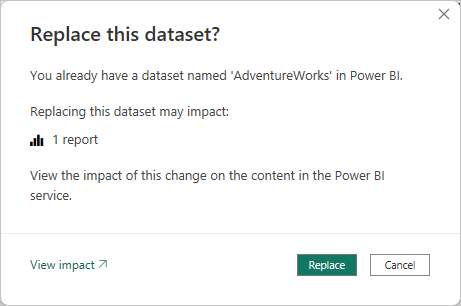
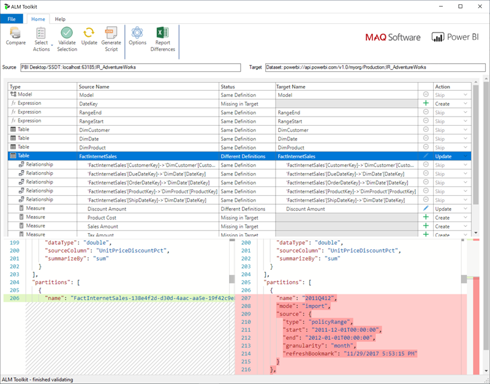

# Advanced incremental refresh and real-time data with the XMLA endpoint

Semantic models in a Premium capacity with the [XMLA endpoint](../enterprise/service-premium-connect-tools.md) enabled for read/write operations allow more advanced refresh, partition management, and metadata only deployments through tool, scripting, and API support. In addition, refresh operations through the XMLA endpoint aren't limited to [48 refreshes per day](../connect-data/refresh-data.md#data-refresh), and the [scheduled refresh time limit](../connect-data/refresh-troubleshooting-refresh-scenarios.md#scheduled-refresh-time-out) isn't imposed.

## Partitions

Semantic model table partitions aren't visible and can't be managed by using Power BI Desktop or the Power BI service. For models in a workspace assigned to a Premium capacity, partitions can be managed through the XMLA endpoint by using tools like SQL Server Management Studio (SSMS), the open-source Tabular Editor, scripted with Tabular Model Scripting Language (TMSL), and programmatically with the Tabular Object Model (TOM).

When you first publish a model to the Power BI service, each table in the new model has one partition. For tables with no incremental refresh policy, that one partition contains all rows of data for that table, unless filters have been applied. For tables with an incremental refresh policy, that one initial partition only exists because Power BI hasn't yet applied the policy. You configure the initial partition in Power BI Desktop when you define the date/time range filter for your table based on the `RangeStart` and `RangeEnd` parameters, and any other filters applied in Power Query Editor. This initial partition contains only those rows of data that meet your filter criteria.

When you perform the *first* refresh operation, tables with no incremental refresh policy refresh all rows contained in that table's default single partition. For tables with an incremental refresh policy, refresh and historical partitions are automatically created and rows are loaded into them according to the date/time for each row. If the incremental refresh policy includes getting data in real time, Power BI also adds a DirectQuery partition to the table.

This first refresh operation can take quite some time depending on the amount of data that needs to be loaded from the data source. The complexity of the model can also be a significant factor because refresh operations must do more processing and recalculation. This operation can be bootstrapped. For more information, see [Prevent timeouts on initial full refresh](#prevent-timeouts-on-initial-full-refresh).

Partitions are created for and named by period granularity: Years, quarters, months, and days. The most recent partitions, the *refresh* partitions, contains rows in the refresh period you specify in the policy. Historical partitions contain rows by complete period up to the refresh period. If real time is enabled, a DirectQuery partition picks up any data changes that occurred after the end date of the refresh period. Granularity for refresh and historical partitions is dependent on the refresh and historical (store) periods you choose when defining the policy.

For example, if today's date is February 2, 2021 and our **FactInternetSales** table at the data source contains rows up through today, if our policy specifies to include real-time changes, refresh rows in the last one day refresh period, and store rows in the last three years historical period. Then with the first refresh operation, a DirectQuery partition is created for changes in the future, a new import partition is created for today's rows, a historical partition is created for yesterday, a whole day period, February 1, 2021. A historical partition is created for the previous whole month period (January 2021), a historical partition is created for the previous whole year period (2020), and historical partitions for 2019 and 2018 whole year periods are created. No whole quarter partitions are created because we haven't yet completed the first full quarter of 2021.

:::image type="content" source="media/incremental-refresh-xmla/partition-naming.png" border="false" alt-text="Diagram shows the partition naming granularity described in the text.":::

With each refresh operation, only the refresh period partitions are refreshed and the date filter of the DirectQuery partition is updated to include only those changes that occur after the current refresh period. A new refresh partition is created for new rows with a new date/time within the updated refresh period, and existing rows with a date/time already within existing partitions in the refresh period are refreshed with updates. Rows with a date/time older than the refresh period are no longer refreshed.

As whole periods close, partitions are merged. For example, if a one-day refresh period and three year historical store period is specified in the policy, on the first day of the month, all day partitions for the previous month are merged into a month partition. On the first day of a new quarter, all three previous month partitions are merged into a quarter partition. On the first day of a new year, all four previous quarter partitions are merged into a year partition.

A model always retains partitions for the entire historical store period plus whole period partitions up through the current refresh period. In the example, a full three years of historical data are retained in partitions for 2018, 2019, 2020, and also partitions for the 2021Q101 month period, the 2021Q10201 day period, and the current day refresh period partition. Because the example retains historical data for three *years*, the 2018 partition is retained until the first refresh on January 1, 2022.

With Power BI incremental refresh and real-time data, the service handles the partition management for you based on the policy. While the service can handle all of the partition management for you, by using tools through the XMLA endpoint, you can selectively refresh partitions individually, sequentially, or in parallel.

## Refresh management with SQL Server Management Studio

SQL Server Management Studio (SSMS) can be used to view and manage partitions created by the application of incremental refresh policies. By using SSMS you can, for example, refresh a specific historical partition not in the incremental refresh period to perform a back-dated update without having to refresh all historical data. SSMS can also be used when bootstrapping to load historical data for large models by incrementally adding/refreshing historical partitions in batches.


### Override incremental refresh behavior

With SSMS, you also have more control over how to invoke refreshes by using [Tabular Model Scripting Language](/analysis-services/tmsl/tabular-model-scripting-language-tmsl-reference?view=power-bi-premium-current&preserve-view=true) and the [Tabular Object Model](/analysis-services/tom/introduction-to-the-tabular-object-model-tom-in-analysis-services-amo?view=power-bi-premium-current&preserve-view=true). For example, in SSMS, in Object Explorer, right-click a table and then select the **Process Table** menu option, and then select the **Script** button to generate a TMSL refresh command.


These parameters can be used with the TMSL refresh command to override the default incremental refresh behavior:

- **applyRefreshPolicy**. If a table has an incremental refresh policy defined, `applyRefreshPolicy` determines if the policy is applied or not. If the policy isn't applied, a process full operation leaves partition definitions unchanged and all partitions in the table are fully refreshed. Default value is true.

- **effectiveDate**. If an incremental refresh policy is being applied, it needs to know the current date to determine rolling window ranges for the incremental refresh and historical periods. The `effectiveDate` parameter allows you to override the current date. This parameter is useful for testing, demos, and business scenarios where data is incrementally refreshed up to a date in the past or the future, for example, budgets in the future. The default value is the current date.

```json
{ 
  "refresh": {
    "type": "full",

    "applyRefreshPolicy": true,
    "effectiveDate": "12/31/2013",

    "objects": [
      {
        "database": "IR_AdventureWorks", 
        "table": "FactInternetSales" 
      }
    ]
  }
}
```

To learn more about overriding default incremental refresh behavior with TMSL, see [Refresh command](/analysis-services/tmsl/refresh-command-tmsl?view=power-bi-premium-current&preserve-view=true).

## Ensuring optimal performance

With each refresh operation, the Power BI service might send initialization queries to the data source for each incremental refresh partition. You might be able to improve incremental refresh performance by reducing the number of initialization queries by ensuring the following configuration:

- The table you configure incremental refresh for should get data from a single data source. If the table gets data from more than one data source, the number of queries sent by the service for each refresh operation is multiplied by the number of data sources, potentially reducing refresh performance. Ensure the query for the incremental refresh table is for a single data source.
- For solutions with both incremental refresh of import partitions and real-time data with Direct Query, *all partitions* must query data from a single data source.
- If your security requirements allow, set the Data source privacy level setting to *Organizational* or *Public*. By default, the privacy level is *Private*, however this level can prevent data from being exchanged with other cloud sources. To set the privacy level, select the **More options** menu and then choose **Settings** > **Data source credentials** > **Edit credentials** > **Privacy level setting for this data source**. If Privacy level is set in the Power BI Desktop model before publishing to the service, it isn't transferred to the service when you publish. You must still set it in semantic model settings in the service. To learn more, see [Privacy levels](../enterprise/desktop-privacy-levels.md).
- If using an On-premises Data Gateway, be sure you’re using version 3000.77.3 or higher.

## Prevent timeouts on initial full refresh

After you publish to the Power BI service, the initial full refresh operation for the model creates partitions for the incremental refresh table, loads, and processes historical data for the entire period defined in the incremental refresh policy. For some models that load and process large amounts of data, the amount of time the initial refresh operation takes can exceed the refresh time limit imposed by the service or a query time limit imposed by the data source.

Bootstrapping the initial refresh operation allows the service to create partition objects for the incremental refresh table, but not load and process historical data into any of the partitions. SSMS is then used to selectively process partitions. Depending on the amount of data to be loaded for each partition, you can process each partition sequentially or in small batches to reduce the potential for one or more of those partitions to cause a timeout. The following methods work for any data source.

### Apply Refresh Policy

The open-source [Tabular Editor 2](https://github.com/otykier/TabularEditor/releases/) tool provides an easy way to bootstrap an initial refresh operation. After publishing a model with an incremental refresh policy defined for it from Power BI Desktop to the service, connect to the model by using the XMLA endpoint in Read/Write mode. Run **Apply Refresh Policy** on the incremental refresh table. With only the policy applied, partitions are created but no data is loaded into them. Then connect with SSMS to refresh the partitions sequentially or in batches to load and process the data. For more information, see [Incremental refresh](https://docs.tabulareditor.com/te2/incremental-refresh.html) in the Tabular editor documentation.

:::image type="content" source="media/incremental-refresh-xmla/tabular-editor.png" alt-text="Screenshot show the Tabular Editor with Apply Refresh Policy selected.":::

### Power Query filter for empty partitions

Prior to publishing the model to the service, in Power Query Editor, add another filter to the `ProductKey` column that filters out any value other than 0, effectively or filtering out *all* data from the **FactInternetSales** table.


After selecting **Close & Apply** in Power Query Editor, defining the incremental refresh policy, and saving the model, the model is published to the service. From the service, the initial refresh operation is run on the model. Partitions for the **FactInternetSales** table are created according to the policy, but no data is loaded and processed because all data is filtered out.

After the initial refresh operation is complete, back in Power Query Editor, the other filter on the `ProductKey` column is removed. After selecting **Close & Apply** in Power Query Editor and saving the model, the model *is not published again*. If the model is published again, it overwrites the incremental refresh policy settings and forces a full refresh on the model when a subsequent refresh operation is performed from the service. Instead, perform a [metadata only deployment](#metadata-only-deployment) by using the Application Lifecycle Management (ALM) Toolkit that removes the filter on the `ProductKey` column from the *model*. SSMS can then be used to selectively process partitions. When all partitions have been fully processed, which must include a process recalculation on all partitions, from SSMS, subsequent refresh operations on the model from the service refresh only the incremental refresh partitions.

> [!TIP]
> Be sure to check out videos, blogs, and more provided by Power BI's community of BI experts.
>
>- [Search for **"Prevent timeouts with incremental refresh"** on Bing](https://www.bing.com/video/search?q=prevent+timeouts+with+incremental+refresh).

To learn more about processing tables and partitions from SSMS, see [Process database, table, or partitions (Analysis Services)](/analysis-services/tabular-models/process-database-table-or-partition-analysis-services?view=power-bi-premium-current&preserve-view=true). To learn more about processing models, tables, and partitions by using TMSL, see [Refresh command (TMSL)](/analysis-services/tmsl/refresh-command-tmsl?view=power-bi-premium-current&preserve-view=true).

## Custom queries for detect data changes

TMSL and TOM can be used to override the detected data changes behavior. Not only can this method be used to avoid persisting the last-update column in the in-memory cache, it can enable scenarios where a configuration or instruction table is prepared by extract, transform, and load (ETL) processes for flagging only the partitions that need to be refreshed. This method can create a more efficient incremental refresh process where only the required periods are refreshed, no matter how long ago data updates took place.

The `pollingExpression` is intended to be a lightweight M expression or name of another M query. It must return a scalar value and will be executed for each partition. If the value returned is different to what it was the last time an incremental refresh occurred, the partition is flagged for full processing.

The following example covers all 120 months in the historical period for backdated changes. Specifying 120 months instead of 10 years means data compression might not be quite as efficient, but avoids having to refresh a whole historical year, which would be more expensive when a month would be sufficient for a backdated change.

```json
"refreshPolicy": {
    "policyType": "basic",
    "rollingWindowGranularity": "month",
    "rollingWindowPeriods": 120,
    "incrementalGranularity": "month",
    "incrementalPeriods": 120,
    "pollingExpression": "<M expression or name of custom polling query>",
    "sourceExpression": [
    "let ..."
    ]
}
```

> [!TIP]
> Be sure to check out videos, blogs, and more provided by Power BI's community of BI experts.
>
>- [Search for **"Power BI Incremental refresh detect data changes"** on Bing](https://www.bing.com/videos/search?q=power+bi+incremental+refresh+detect+data+changes).

## Metadata only deployment

When publishing a new version of a *.pbix* file from Power BI Desktop to a workspace, if a model with the same name already exists, you're prompted to replace the existing model.



In some cases, you might not want to replace the model, especially with incremental refresh. The model in Power BI Desktop could be much smaller than the one in the Power BI service. If the model in the Power BI service has an incremental refresh policy applied, it might have several years of historical data that will be lost if the model is replaced. Refreshing all the historical data could take hours and result in system downtime for users.

Instead, it's better to perform a metadata only deployment, which allows deployment of new objects without losing the historical data. For example, if you've added a few measures you can deploy only the new measures without needing to refresh the data, saving time.

For workspaces assigned to a Premium capacity configured for XMLA endpoint read/write, compatible tools enable metadata only deployment. For example, the ALM Toolkit is a schema diff tool for Power BI models and can be used to perform deployment of metadata only.

Download and install the latest version of the ALM Toolkit from the [Analysis Services Git repo](https://github.com/microsoft/Analysis-Services/releases). Step-by-step guidance on using ALM Toolkit isn't included in Microsoft documentation. ALM Toolkit documentation links and information on supportability are available on the **Help** ribbon. To perform a metadata only deployment, perform a comparison and select the running Power BI Desktop instance as the source, and the existing model in the Power BI service as the target. Consider the differences displayed and skip the update of the table with incremental refresh partitions or use the **Options** dialog to retain partitions for table updates. Validate the selection to ensure the integrity of the target model and then update.



## Adding an incremental refresh policy and real-time data programmatically

You can also use the TMSL and TOM to add an incremental refresh policy to an existing model through the XMLA endpoint.

> [!NOTE]
> To avoid compatibility issues, make sure you use the latest version of the Analysis Services client libraries. For example, to work with Hybrid policies, the version must be 19.27.1.8 or higher.

The process includes of the following steps:

1. Ensure the target model has the required minimum compatibility level. In SSMS, right-click the **[model name]** > **Properties** > **Compatibility Level**. To increase the compatibility level, either use a createOrReplace TMSL script or check the following TOM sample code for an example.

   ```text
   a. Import policy - 1550
   b. Hybrid policy - 1565
   ```

2. Add the `RangeStart` and `RangeEnd` parameters to the model expressions. If necessary, also add a function to convert Date/Time values to date keys.
3. Define a `RefreshPolicy` object with the desired archiving (rolling window) and incremental refresh periods as well as a source expression that filters the target table based on the `RangeStart` and `RangeEnd` parameters. Set the refresh policy mode to *Import* or *Hybrid* depending on your real-time data requirements. Hybrid causes Power BI to add a DirectQuery partition to the table to fetch the latest changes from the data source that occurred after the last refresh time.
4. Add the refresh policy to the table and perform a full refresh so that Power BI partitions the table according to your requirements.

The following code sample demonstrates how to perform the previous steps by using TOM. If you want to use this sample as is, you must have a copy for the AdventureWorksDW database and import the **FactInternetSales** table into a model. The code sample assumes that the `RangeStart` and `RangeEnd` parameters and the `DateKey` function don't exist in the model. Just import the **FactInternetSales** table and publish the model to a workspace on Power BI Premium. Then update the `workspaceUrl` so that the code sample can connect to your model. Update any more code lines as necessary.

```csharp
using System;
using TOM = Microsoft.AnalysisServices.Tabular;
namespace Hybrid_Tables
{
    class Program
    {
        static string workspaceUrl = "<Enter your Workspace URL here>";
        static string databaseName = "AdventureWorks";
        static string tableName = "FactInternetSales";
        static void Main(string[] args)
        {
            using (var server = new TOM.Server())
            {
                // Connect to the dataset.
                server.Connect(workspaceUrl);
                TOM.Database database = server.Databases.FindByName(databaseName);
                if (database == null)
                {
                    throw new ApplicationException("Database cannot be found!");
                }
                if(database.CompatibilityLevel < 1565)
                {
                    database.CompatibilityLevel = 1565;
                    database.Update();
                }
                TOM.Model model = database.Model;
                // Add RangeStart, RangeEnd, and DateKey function.
                model.Expressions.Add(new TOM.NamedExpression {
                    Name = "RangeStart",
                    Kind = TOM.ExpressionKind.M,
                    Expression = "#datetime(2021, 12, 30, 0, 0, 0) meta [IsParameterQuery=true, Type=\"DateTime\", IsParameterQueryRequired=true]"
                });
                model.Expressions.Add(new TOM.NamedExpression
                {
                    Name = "RangeEnd",
                    Kind = TOM.ExpressionKind.M,
                    Expression = "#datetime(2021, 12, 31, 0, 0, 0) meta [IsParameterQuery=true, Type=\"DateTime\", IsParameterQueryRequired=true]"
                });
                model.Expressions.Add(new TOM.NamedExpression
                {
                    Name = "DateKey",
                    Kind = TOM.ExpressionKind.M,
                    Expression =
                        "let\n" +
                        "    Source = (x as datetime) => Date.Year(x)*10000 + Date.Month(x)*100 + Date.Day(x)\n" +
                        "in\n" +
                        "    Source"
                });
                // Apply a RefreshPolicy with Real-Time to the target table.
                TOM.Table salesTable = model.Tables[tableName];
                TOM.RefreshPolicy hybridPolicy = new TOM.BasicRefreshPolicy
                {
                    Mode = TOM.RefreshPolicyMode.Hybrid,
                    IncrementalPeriodsOffset = -1,
                    RollingWindowPeriods = 1,
                    RollingWindowGranularity = TOM.RefreshGranularityType.Year,
                    IncrementalPeriods = 1,
                    IncrementalGranularity = TOM.RefreshGranularityType.Day,
                    SourceExpression =
                        "let\n" +
                        "    Source = Sql.Database(\"demopm.database.windows.net\", \"AdventureWorksDW\"),\n" +
                        "    dbo_FactInternetSales = Source{[Schema=\"dbo\",Item=\"FactInternetSales\"]}[Data],\n" +
                        "    #\"Filtered Rows\" = Table.SelectRows(dbo_FactInternetSales, each [OrderDateKey] >= DateKey(RangeStart) and [OrderDateKey] < DateKey(RangeEnd))\n" +
                        "in\n" +
                        "    #\"Filtered Rows\""
                };
                salesTable.RefreshPolicy = hybridPolicy;
                model.RequestRefresh(TOM.RefreshType.Full);
                model.SaveChanges();
            }
            Console.WriteLine("{0}{1}", Environment.NewLine, "Press [Enter] to exit...");
            Console.ReadLine();
        }
    }
}
```

## Related content

- [Partitions in tabular models](/analysis-services/tabular-models/partitions-ssas-tabular?view=power-bi-premium-current&preserve-view=true)
- [External tools in Power BI Desktop](../transform-model/desktop-external-tools.md)
- [Configure scheduled refresh](../connect-data/refresh-scheduled-refresh.md)
- [Troubleshoot incremental refresh and real-time data](incremental-refresh-troubleshoot.md)
