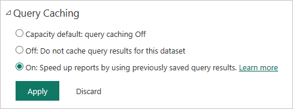

# Query caching in Power BI Premium or Power BI Embedded

Organizations with Power BI Premium or Power BI Embedded can take advantage of *query caching* to speed up reports associated with a semantic model. Query caching instructs the Power BI Premium or Power BI Embedded capacity to use its local caching service to maintain query results, avoiding having the underlying data source compute those results.

> [!IMPORTANT]
> Query caching is only available on Power BI Premium or Power BI Embedded, for Import semantic models. It is not applicable DirectQuery or LiveConnect semantic models that use Azure Analysis Services or SQL Server Analysis Services.

The caching is performed the first time a user opens the report. The service only does query caching for the initial page that they land on. In other words, queries aren't cached when you interact with the report. Cached query results are specific to user and semantic model context and always respect security rules. The query cache respects [personal bookmarks](../consumer/end-user-bookmarks.md) and [persistent filters](https://powerbi.microsoft.com/blog/announcing-persistent-filters-in-the-service/), so queries generated by a personalized report are cached. [Dashboard tiles](../create-reports/service-dashboard-tiles.md) that are powered by the same queries also benefit once the query is cached. Performance especially benefits when a semantic model is accessed frequently and doesn't need to be refreshed often. Query caching can also reduce load on your capacity by reducing the overall number of queries.

You control query caching behavior on the **Settings** page for the semantic model in the Power BI service. It has three possible settings:

- **Capacity default**: Query caching Off
- **Off**: Don't use query caching for this semantic model.
- **On**: Use query caching for this semantic model.

## Considerations and limitations

- When you change caching settings from **On** to **Off**, all previously saved query results for the semantic model are removed from the capacity cache. You can turn off caching either explicitly or by reverting to capacity default setting that an administrator sets to **Off**. Turning it off can introduce a small delay the next time any report runs queries against this semantic model. The delay is caused by those report queries running on demand and not applying saved results. Also, the required semantic model might need to be loaded into memory before it can service queries.
- The query cache is refreshed when Power BI performs a semantic model refresh. When the query cache is refreshed, Power BI must run queries against the underlying data models to get the latest results. If a large number of semantic models have query caching enabled and the Premium/Embedded capacity is under heavy load, some performance degradation might occur during cache refresh. Degradation results from the increased volume of queries being executed.

## Related content

- [What is Power BI embedded analytics?](../developer/embedded/embedded-analytics-power-bi.md)