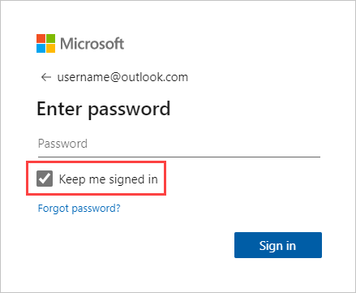

# Refresh a semantic model created from a .CSV file on OneDrive or SharePoint

When you connect to a comma separated value (*.csv*) file on OneDrive or SharePoint, a semantic model is created in Power BI. Data from the *.csv* file is imported into the semantic model in Power BI. Power BI then automatically connects to the file and refreshes any changes with the semantic model in Power BI. If you edit the *.csv* file in OneDrive, or SharePoint, after you save, those changes will appear in Power BI, usually within about an hour. Any visualizations in Power BI based on the semantic model are automatically updated.

> [!NOTE]
> By default, using the **Get Data** experience for specific file type connectors in Power BI Desktop uses a local reference to the file stored on OneDrive, which will not automatically update unless you have a gateway configured. To have your CSV automatically update without having to configure a gateway, rather than using the **Text/CSV** connector, use the **Web** connector and reference the online version of your CSV. 

## Advantages

If your files are in a shared folder on OneDrive for work or school, or SharePoint, other users can work on the same file. After they save the file, changes are automatically updated in Power BI, usually within an hour.

Many organizations run processes that automatically query databases for data that's saved to a *.csv* file each day. If the file is stored on OneDrive, or SharePoint, and the same file is overwritten each day, as opposed to a new file with a different name being created each day, you can connect to that file in Power BI. Your semantic model that connects to the file will be synchronized soon after the file on OneDrive, or SharePoint, is updated. Any visualizations based on the semantic model are automatically updated.

## What’s supported

Comma separated value files are simple text files, connections to external data sources and reports aren't supported. You can't schedule a refresh on a semantic model created from a *.csv* file. However, when the file is on OneDrive, or SharePoint, Power BI will automatically synchronize any changes to the file with the semantic model about every hour.

## What's the difference between personal OneDrive and OneDrive for work or school

If you have both a personal OneDrive and OneDrive for work or school, we recommended you keep any files you want to connect to Power BI on OneDrive for work or school. Why? Because you likely use two different accounts to sign into them.

Connecting to OneDrive for work or school and Power BI is typically seamless because the same account you use to sign into Power BI is often the same account used to sign into OneDrive for work or school. But, with personal OneDrive, you're likely to use a different [Microsoft account](https://account.microsoft.com).

When you sign into your Microsoft account, be sure to select **Keep me signed in**. Power BI can then synchronize any updates with semantic models in Power BI.

When you make changes to your *.csv* file on OneDrive, and they don't synchronize with the semantic model in Power BI. It might be because your Microsoft account credentials changed, you’ll need to connect to the file and import it again from your personal OneDrive.

## When things go wrong

If data in the *.csv* file on OneDrive changes, and the changes aren’t reflected in Power BI, it’s most likely because Power BI can't connect to OneDrive. Try connecting to the file and importing it again. If you’re prompted to sign in, make sure you select **Keep me signed in**.

## Related content

* [Troubleshoot gateways - Power BI](service-gateway-onprem-tshoot.md)
* [Troubleshoot refresh scenarios](refresh-troubleshooting-refresh-scenarios.md)

More questions? [Ask the Power BI Community](https://community.powerbi.com/)

