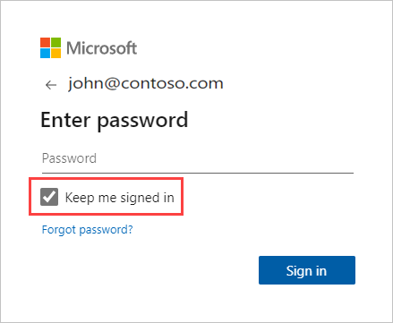

# Refresh a dataset created from a .CSV file on OneDrive or SharePoint Online
## What are the advantages?
When you connect to a .csv file on OneDrive or SharePoint Online, a dataset is created in Power BI. Data from the .csv file is then imported into the dataset in Power BI. Power BI then automatically connects to the file and refreshes any changes with the dataset in Power BI. If you edit the .csv file in OneDrive, or SharePoint Online, once you save, those changes will appear in Power BI, usually within about an hour. Any visualizations in Power BI based on the dataset are automatically updated too.

If your files are in a shared folder on OneDrive for Business, or SharePoint Online, other users can work on the same file. Once saved, any changes made are automatically updated in Power BI, usually within an hour.

Many organizations run processes that automatically query databases for data that is then saved to a .csv file each day. If the file is stored on OneDrive, or SharePoint Online, and the same file is overwritten each day, as opposed to a new file with a different name being created each day, you can connect to that file in Power BI. Your dataset that connects to the file will be synchronized soon after the file on OneDrive, or SharePoint Online, is updated. Any visualizations based on the dataset are automatically updated too.

## What’s supported?
Comma separated value files are simple text files, so connections to external data sources and reports are not supported. You cannot schedule refresh on a dataset created from a comma delimited file. However, when the file is on OneDrive, or SharePoint Online, Power BI will synchronize any changes to the file with the dataset automatically about every hour.

## OneDrive or OneDrive for Business. What’s the difference?
If you have both a personal OneDrive and OneDrive for Business, it’s recommended you keep any files you want to connect to in Power BI on OneDrive for Business. Here’s why: You likely use two different accounts to sign into them.

Connecting to OneDrive for Business in Power BI is typically seamless because the same account you use to sign into Power BI with is often the same account used to sign into OneDrive for Business. But, with personal OneDrive, you likely sign in with a different [Microsoft account](https://account.microsoft.com).

When you sign into your Microsoft account, be sure to select Keep me signed in. Power BI can then synchronize any updates with datasets in Power BI

If you make changes to your .csv file on OneDrive that cannot be synchronized with the dataset in Power BI because your Microsoft account credentials might have changed, you’ll need to connect to the file and import it again from your personal OneDrive.

## When things go wrong
If data in the .csv file on OneDrive is changing and those changes aren’t being reflected in Power BI, it’s most likely because Power BI cannot connect to your OneDrive. Try connecting to the file and importing it again. If you’re prompted to sign in, make sure you select **Keep me signed in**.

## Next steps
[Tools for troubleshooting refresh issues](service-gateway-onprem-tshoot.md)
[Troubleshooting refresh scenarios](refresh-troubleshooting-refresh-scenarios.md)

More questions? [Try asking the Power BI Community](https://community.powerbi.com/)

