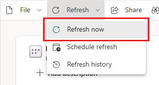
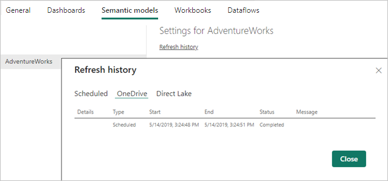
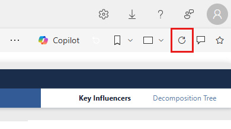
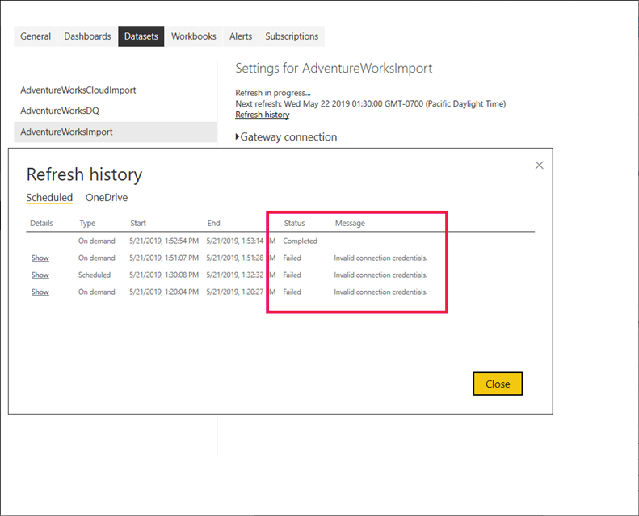

# Data refresh in Power BI

Power BI enables you to go from data to insight to action quickly, yet you must make sure the data in your Power BI reports and dashboards is recent. Knowing how to refresh the data is often critical in delivering accurate results.

This article describes the data refresh features of Power BI and their dependencies at a conceptual level. It also provides best practices and tips to avoid common refresh issues. The content lays a foundation to help you understand how data refresh works. For targeted step-by-step instructions to configure data refresh, refer to the tutorials and how-to guides listed in the Related content section at the end of this article.

## Understanding data refresh

[Embed Power BI content with service principal and an application secret](../developer/embedded/embed-service-principal.md)

Whenever you refresh data, Power BI must query the underlying data sources, possibly load the source data into a semantic model, and then update any visualizations in your reports or dashboards that rely on the updated semantic model. The entire process consists of multiple phases, depending on the storage modes of your semantic models, as explained in the following sections.

To understand how Power BI refreshes your semantic models, reports, and dashboards, you must be aware of the following concepts:

- **Storage modes and semantic model types**: The storage modes and semantic model types that Power BI supports have different refresh requirements. You can choose between reimporting data into Power BI to see any changes that occurred or querying the data directly at the source.
- **Power BI refresh types**: Regardless of semantic model specifics, knowing the various refresh types can help you understand where Power BI might spend its time during a refresh operation. And combining these details with storage mode specifics helps to understand what exactly Power BI performs when you select **Refresh now** for a semantic model.

### Storage modes and semantic model types

A Power BI semantic model can operate in one of the following modes to access data from various data sources. For more information, see [Storage mode in Power BI Desktop](../transform-model/desktop-storage-mode.md).

- Import mode
- DirectQuery mode
- LiveConnect mode
- Push mode

The following diagram illustrates the different data flows, based on storage mode. The most significant point is that only Import mode semantic models require a source data refresh. They require refresh because only this type of semantic model imports data from its data sources, and the imported data might be updated on a regular or ad-hoc basis. DirectQuery semantic models and semantic models in LiveConnect mode to Analysis Services don't import data; they query the underlying data source with every user interaction. Semantic models in push mode don't access any data sources directly but expect you to push the data into Power BI. Semantic model refresh requirements vary depending on the storage mode/semantic model type.


#### Semantic models in Import mode

Power BI imports the data from the original data sources into the semantic model. Power BI report and dashboard queries submitted to the semantic model return results from the imported tables and columns. You might consider such a semantic model a point-in-time copy. Because Power BI copies the data, you must refresh the semantic model to fetch changes from the underlying data sources.

When a semantic model is refreshed, it's either fully refreshed or partially refreshed. Partial refresh will take place in semantic models that have tables with an [incremental refresh](incremental-refresh-overview.md) policy. In these semantic models, only a subset of the table partitions are refreshed. In addition, advanced users can use the [XMLA endpoint](./../enterprise/service-premium-connect-tools.md) to refresh specific partitions in any semantic model.

The amount of memory required to refresh a semantic model depends on whether you're performing a full or partial refresh. During the refresh, a copy of the semantic model is kept to handle queries to the semantic model. This means that if you're performing a full refresh, you'll need twice the amount of memory the semantic model requires.

We recommend that you plan your capacity usage to ensure that the extra memory needed for semantic model refresh, is accounted for. Having enough memory prevents refresh issues that can occur if your semantic models require more memory than available, during refresh operations. To find out how much memory is available for each semantic model on a Premium capacity, refer to the [Capacities and SKUs](./../enterprise/service-premium-what-is.md#capacities-and-skus) table.

For more information about large semantic models in Premium capacities, see [large semantic models](../enterprise/service-premium-large-models.md).

#### Semantic models in DirectQuery mode

Power BI doesn't import data over connections that operate in DirectQuery mode. Instead, the semantic model returns results from the underlying data source whenever a report or dashboard queries the semantic model. Power BI transforms and forwards the queries to the data source.

> [!NOTE]
>Live connection reports submit queries to the capacity or Analysis Services instance that hosts the semantic model or the model. When using external analysis services such as SQL Server Analysis Services (SSAS) or Azure Analysis Services (AAS), resources are consumed outside of Power BI.

Because Power BI doesn't import the data, you don't need to run a data refresh. However, Power BI still performs tile refreshes and possibly report refreshes, as the next section on refresh types explains. A tile is a report visual pinned to a dashboard, and dashboard tile refreshes happen about every hour so that the tiles show recent results. You can change the schedule in the semantic model settings, as in the screenshot below, or force a dashboard update manually by using the **Refresh now** option.


> [!NOTE]
> * Semantic models in import mode and composite semantic models that combine import mode and DirectQuery mode don't require a separate tile refresh, because Power BI refreshes the tiles automatically during each scheduled or on-demand data refresh. Semantic models that are updated based on the XMLA endpoint will only clear the cached tile data (invalidate cache). The tile caches aren't refreshed until each user accesses the dashboard. For import models, you can find the refresh schedule in the "Scheduled refresh" section of the **Semantic models** tab. For composite semantic models, the  "Scheduled refresh" section is located in the **Optimize Performance** section. 
> * Power BI does not support cross-border live connections to Azure Analysis Services (AAS) in a sovereign cloud.

#### Push semantic models

Push semantic models don't contain a formal definition of a data source, so they don't require you to perform a data refresh in Power BI. You refresh them by pushing your data into the semantic model through an external service or process, such as Azure Stream Analytics. This is a common approach for real-time analytics with Power BI. Power BI still performs cache refreshes for any tiles used on top of a push semantic model. For a detailed walkthrough, see [Tutorial: Stream Analytics and Power BI: A real-time analytics dashboard for streaming data](/azure/stream-analytics/stream-analytics-power-bi-dashboard).

### Power BI refresh types

A Power BI refresh operation can consist of multiple refresh types, including data refresh, OneDrive refresh, refresh of query caches, tile refresh, and refresh of report visuals. While Power BI determines the required refresh steps for a given semantic model automatically, you should know how they contribute to the complexity and duration of a refresh operation. For a quick reference, refer to the following table.

| Storage mode | Data refresh | OneDrive refresh | Query caches | Tile refresh | Report visuals |
| --- | --- | --- | --- | --- | --- |
| Import | Scheduled and on-demand | Yes, for connected semantic models | If enabled on Premium capacity | Automatically and on-demand | No |
| DirectQuery | Not applicable | Yes, for connected semantic models | If enabled on Premium capacity | Automatically and on-demand | No |
| LiveConnect | Not applicable | Yes, for connected semantic models | If enabled on Premium capacity | Automatically and on-demand | Yes |
| Push | Not applicable | Not applicable | Not practical | Automatically and on-demand | No |

Another way to consider the different refresh types is what they impact and where you can apply them. Changes in data source table structure, or schema, such as a new, renamed, or removed column can only be applied in Power BI Desktop, and in the Power BI service they can cause the refresh to fail. For a quick reference on what they impact, refer to the following table.

<br> | Refresh of report visuals | Data refresh | Schema refresh
---------|----------|---------|--------- 
 What do the different refresh types do? | **Queries used to populate visuals are refreshed.** <br><br> For visuals using DirectQuery tables the visual will query to get the latest data from the data source. <br><br> For visuals using imported tables the visual will only query data already imported to the semantic model on the last data refresh. | **Data is refreshed from the data source.** <br><br>Doesn't apply to DirectQuery tables as they are at the visual level and rely on refresh of report visuals. <br><br> For imported tables the data is refreshed from the source. | **Any data source table structure change since previous refresh will show.** <br><br> For example: To show a new column added to a Power BI Dataflow or SQL Database view. <br><br> Applies to both imported and DirectQuery tables.
 
 In **Power BI Desktop** refresh of report visuals, data refresh, and schema refresh all happen together using
- **Home** ribbon > **Refresh** button
 - **Home** ribbon > **Transform data** > **Close & Apply** button
 - The context menu (right-click or select the ellipsis) on any table then choosing **Refresh data**

 These refresh types cannot always be applied independently, and where you can apply them is different in Power BI Desktop and the Power BI service. For a quick reference, refer to the following table.
 
|<br>  | Refresh of report visuals | Data refresh | Schema refresh
|---------|----------|---------|--------- 
 | In **Power BI Desktop**| <ul> <li>**View** ribbon > **Performance Analyzer** button > **Refresh visuals** <li> Creating and changing visuals causing a DAX query to run <li>When [Page Refresh](../create-reports/desktop-automatic-page-refresh.md) is turned on (DirectQuery only) <li> Opening the PBIX file </ul> | Not available independently from other refresh types | Not available independently from other refresh types
 | In the **Power BI service** | <ul><li>When the browser loads or reloads the report	<li> Clicking the **Refresh Visuals** top right menu bar button <li> Clicking the **Refresh** button in edit mode <li> When [Page Refresh](../create-reports/desktop-automatic-page-refresh.md) is turned on (DirectQuery only) | <ul> <li> Scheduled refresh <li>	Refresh now <li> Refresh a Power BI semantic model from Power Automate <li> Processing the table from SQL Server Management Studio (Premium) </ul> | Not available
 | Keep in mind | For example, if you open a report in the browser, then the scheduled refresh performs a data refresh of the imported tables, the report visuals in the open browser won't update until a refresh of report visuals is initiated. | Data refresh on the Power BI service will fail when the source column or table is renamed or removed. It fails because the Power BI service doesn't also include a schema refresh. To correct this error, a schema refresh needs to happen in Power BI Desktop and the semantic model republished to the service. | A renamed or removed column or table at the data source will be updated with a schema refresh in Power BI Desktop, but it can break visuals and DAX expressions (measures, calculated columns, row level security, etc.), as well as remove relationships, that are dependent on those columns or tables.

#### Data refresh

For Power BI users, refreshing data typically means importing data from the original data sources into a semantic model, either based on a refresh schedule or on-demand. You can perform multiple semantic model refreshes daily, which might be necessary if the underlying source data changes frequently. Power BI limits semantic models on shared capacity to eight scheduled daily semantic model refreshes. The eight time values are stored in the backend database and are based on the *local time* zone that was selected on the Semantic model Settings page. The scheduler checks which model should be refreshed and at what time(s).  The quota of eight refreshes resets daily at 12:01 a.m. local time.


If the semantic model resides on a Premium capacity, you can schedule up to 48 refreshes per day in the semantic model settings. For more information, see [Configure scheduled refresh](#configure-scheduled-refresh) later in this article. Semantic models on a Premium capacity with the [XMLA endpoint](../enterprise/service-premium-connect-tools.md) enabled for read-write support unlimited refresh operations when configured programmatically with TMSL or PowerShell.


It's also important to call out that the shared-capacity limitation for daily refreshes applies to both scheduled refreshes and API refreshes combined. You can also trigger an on-demand refresh by selecting **Refresh now** in the semantic model menu, as the following screenshot depicts. On-demand refreshes aren't included in the refresh limitation. Also note that semantic models on a Premium capacity don't impose limitations for API refreshes. If you're interested in building your own refresh solution by using the Power BI REST API, see [semantic models - Refresh semantic model](/rest/api/power-bi/datasets/refreshdataset).



> [!NOTE]
> Data refreshes must complete in less than 2 hours on shared capacity. If your semantic models require longer refresh operations, consider moving the semantic model onto a Premium capacity. On Premium, the maximum refresh duration is 5 hours, but using XMLA endpoint to refresh data can bypass the 5-hour limit.

#### OneDrive refresh

If you created your semantic models and reports based on a Power BI Desktop file, Excel workbook, or comma separated value (.csv) file on OneDrive or SharePoint Online, Power BI performs another type of refresh, known as OneDrive refresh. For more information, see [Get data from files for Power BI](service-get-data-from-files.md).

Unlike a semantic model refresh during which Power BI imports data from a data source into a semantic model, OneDrive refresh synchronizes semantic models and reports with their source files. By default, Power BI checks about every hour if a semantic model connected to a file on OneDrive or SharePoint Online requires synchronization.

Power BI performs refresh based on an item ID in OneDrive, so be thoughtful when considering updates versus replacement. When you set a OneDrive file as the data source, Power BI references the item ID of the file when it performs the refresh. Consider the following scenario: you have a master file _A_ and a production copy of that file _B_, and you configure OneDrive refresh for file B. If you then _copy_ file A over file B, the copy operation deletes the old file B and creates a new file B with a different item ID, which breaks OneDrive refresh. To avoid that situation, you can instead upload and replace file B, which keeps its same item ID.

You can move the file to another location (using drag and drop, for example) and refresh will continue to work because Power BI still knows the file ID. However, if you copy that file to another location, a new instance of the file and a new fileID is created. Therefore, your Power BI file reference is no longer valid and refresh will fail.

> [!NOTE]
> It can take Power BI up to 60 minutes to refresh a semantic model, even once the sync has completed on your local machine and after you've used *Refresh now* in the Power BI service.

To review past synchronization cycles, check the OneDrive tab in the refresh history. The following screenshot shows a completed synchronization cycle for a sample semantic model.



As the above screenshot shows, Power BI identified this OneDrive refresh as a **Scheduled** refresh, but it isn't possible to configure the refresh interval. You can only deactivate OneDrive refresh in the semantic model's settings. Deactivating refresh is useful if you don't want your semantic models and reports in Power BI to pick up any changes from the source files automatically.

The semantic model settings page only shows the **OneDrive Credentials** and **OneDrive refresh** sections if the semantic model is connected to a file in OneDrive or SharePoint Online, as in the following screenshot. Semantic models that aren't connected to sources file in OneDrive or SharePoint Online don't show these sections.


If you disable OneDrive refresh for a semantic model, you can still synchronize your semantic model on-demand by selecting **Refresh now** in the semantic model menu. As part of the on-demand refresh, Power BI checks if the source file on OneDrive or SharePoint Online is newer than the semantic model in Power BI and synchronizes the semantic model if so. The **Refresh history** lists these activities as on-demand refreshes on the **OneDrive** tab.

Keep in mind that OneDrive refresh doesn't pull data from the original data sources. OneDrive refresh simply updates the resources in Power BI with the metadata and data from the .pbix, .xlsx, or .csv file, as the following diagram illustrates. To ensure that the semantic model has the most recent data from the data sources, Power BI also triggers a data refresh as part of an on-demand refresh. You can verify this in the **Refresh history** if you switch to the **Scheduled** tab.


If you keep OneDrive refresh enabled for a OneDrive or SharePoint Online-connected semantic model and you want to perform data refresh on a scheduled basis, make sure you configure the schedule so that Power BI performs the data refresh after the OneDrive refresh. For example, if you created your own service or process to update the source file in OneDrive or SharePoint Online every night at 1 am, you could configure scheduled refresh for 2:30 am to give Power BI enough time to complete the OneDrive refresh before starting the data refresh.

#### Refresh of query caches

If your semantic model resides on a Premium capacity, you might be able to improve the performance of any associated reports and dashboards by enabling query caching, as in the following screenshot. Query caching instructs the Premium capacity to use its local caching service to maintain query results, avoiding having the underlying data source compute those results. For more information, see [Query caching in Power BI Premium](power-bi-query-caching.md).


Following a data refresh, however, previously cached query results are no longer valid. Power BI discards these cached results and must rebuild them. For this reason, query caching might not be as beneficial for reports and dashboards associated with semantic models that you refresh often, for example 48 times per day.

#### Refresh of report visuals

This refresh process is less important because it's only relevant for live connections to Analysis Services. For these connections, Power BI caches the last state of the report visuals so that when you view the report again, Power BI doesn't have to query the Analysis Services tabular model. When you interact with the report, such as by changing a report filter, Power BI queries the tabular model and updates the report visuals automatically. If you suspect that a report is showing stale data, you can also select the Refresh button of the report to trigger a refresh of all report visuals, as the following screenshot illustrates.



Only pinned visuals are refreshed, not pinned live pages. To refresh a pinned live page, you can use the browser's Refresh button.

## Review data infrastructure dependencies

Regardless of storage modes, no data refresh can succeed unless the underlying data sources are accessible. There are three main data access scenarios:

- A semantic model uses data sources that reside on-premises
- A semantic model uses data sources in the cloud
- A semantic model uses data from both, on-premises and cloud sources

### Connecting to on-premises data sources

If your semantic model uses a data source that Power BI can't access over a direct network connection, you must configure a gateway connection for this semantic model before you can enable a refresh schedule or perform an on-demand data refresh. For more information about data gateways and how they work, see [What are on-premises data gateways?](service-gateway-onprem.md)

You have the following options:

- Choose an enterprise data gateway with the required data source definition
- Deploy a personal data gateway

> [!NOTE]
> You can find a list of data source types that require a data gateway in the article [Manage your data source - Import/Scheduled Refresh](service-gateway-enterprise-manage-scheduled-refresh.md).

#### Using an enterprise data gateway

Microsoft recommends using an enterprise data gateway instead of a personal gateway to connect a semantic model to an on-premises data source. Make sure the gateway is properly configured, which means the gateway must have the latest updates and all required data source definitions. A data source definition provides Power BI with the connection information for a given source, including connection endpoints, authentication mode, and credentials. For more information about managing data sources on a gateway, see [Manage your data source - import/scheduled refresh](service-gateway-enterprise-manage-scheduled-refresh.md).

Connecting a semantic model to an enterprise gateway is relatively straightforward if you're a gateway administrator. With admin permissions, you can promptly update the gateway and add missing data sources, if necessary. In fact, you can add a missing data source to your gateway straight from the semantic model settings page. Expand the toggle button to view the data sources and select the **Add to gateway** link, as in the following screenshot. If you aren't a gateway administrator, on the other hand, you must contact a gateway admin to add the required data source definition.

> [!NOTE]
> Only gateway admins can add data sources to a gateway. Also make sure your gateway admin adds your user account to the list of users with permissions to use the data source. The semantic model settings page only lets you select an enterprise gateway with a matching data source that you have permission to use.


Make sure you map the correct data source definition to your data source. As the above screenshot illustrates, gateway admins can create multiple definitions on a single gateway connecting to the same data source, each with different credentials. In the example shown, a semantic model owner in the Sales department would choose the AdventureWorksProducts-Sales data source definition while a semantic model owner in the Support department would map the semantic model to the AdventureWorksProducts-Support data source definition. If the names of the data source definition aren't intuitive, contact your gateway admin to clarify which definition to pick.

> [!NOTE]
> A semantic model can only use a single gateway connection. In other words, it is not possible to access on-premises data sources across multiple gateway connections. Accordingly, you must add all required data source definitions to the same gateway.

#### Deploying a personal data gateway

If you have no access to an enterprise data gateway and you're the only person who manages semantic models so you don't need to share data sources with others, you can deploy a data gateway in personal mode. In the **Gateway connection** section, under **You have no personal gateways installed** , select **Install now**. The personal data gateway has several limitations as documented in [On-premises data gateway (personal mode)](service-gateway-personal-mode.md).

Unlike for an enterprise data gateway, you don't need to add data source definitions to a personal gateway. Instead, you manage the data source configuration by using the **Data source credentials** section in the semantic model settings, as the following screenshot illustrates.


### Accessing cloud data sources

Semantic models that use cloud data sources, such as Azure SQL DB, don't require a data gateway if Power BI can establish a direct network connection to the source. Accordingly, you can manage the configuration of these data sources by using the **Data source credentials** section in the semantic model settings. As the following screenshot shows, you don't need to configure a gateway connection.


> [!NOTE]
> Each user can only have one set of credentials per data source, across all of the semantic models they own, regardless of the workspaces where the semantic models reside. And each semantic model can only have one owner. If your want to update the credentials for a semantic model where you are not the semantic model owner, you must first take over the semantic model by clicking on the Take Over button on the semantic model settings page.

### Accessing on-premises and cloud sources in the same source query

A semantic model can get data from multiple sources, and these sources can reside on-premises or in the cloud. However, a semantic model can only use a single gateway connection, as mentioned earlier. While cloud data sources don't necessarily require a gateway, a gateway is required if a semantic model connects to both on-premises and cloud sources in a single mashup query. In this scenario, Power BI must use a gateway for the cloud data sources as well. The following diagram illustrates how such a semantic model accesses its data sources.


> [!NOTE]
> If a semantic model uses separate mashup queries to connect to on-premises and cloud sources, Power BI uses a gateway connection to reach the on-premises sources and a direct network connection to the cloud sources. If a mashup query merges or appends data from on-premises and cloud sources, Power BI switches to the gateway connection even for the cloud sources.

Power BI semantic models rely on Power Query to access and retrieve source data. The following mashup listing shows a basic example of a query that merges data from an on-premises source and a cloud source.

```
Let

    OnPremSource = Sql.Database("on-premises-db", "AdventureWorks"),

    CloudSource = Sql.Databases("cloudsql.database.windows.net", "AdventureWorks"),

    TableData1 = OnPremSource{[Schema="Sales",Item="Customer"]}[Data],

    TableData2 = CloudSource {[Schema="Sales",Item="Customer"]}[Data],

    MergedData = Table.NestedJoin(TableData1, {"BusinessEntityID"}, TableData2, {"BusinessEntityID"}, "MergedData", JoinKind.Inner)

in

    MergedData
```

There are two options to configure a data gateway to support merging or appending data from on-premises and cloud sources:

- Add a data source definition for the cloud source to the data gateway in addition to the on-premises data sources.
- Enable the checkbox **Allow user's cloud data sources to refresh through this gateway cluster**.


If you enable the checkbox **Allow user's cloud data sources to refresh through this gateway cluster in the gateway configuration**, as in the screenshot above, Power BI can use the configuration that the user defined for the cloud source under **Data source credentials** in the semantic model settings. This can help to lower the gateway configuration overhead. On the other hand, if you want to have greater control over the connections that your gateway establishes, you shouldn't enable this checkbox. In this case, you must add an explicit data source definition for every cloud source that you want to support to your gateway. It's also possible to enable the checkbox and add explicit data source definitions for your cloud sources to a gateway. In this case, the gateway uses the data source definitions for all matching sources.

### Configuring query parameters

The mashup or M queries you create by using Power Query can vary in complexity from trivial steps to parameterized constructs. The following listing shows a small sample mashup query that uses two parameters called _SchemaName_ and _TableName_ to access a given table in an AdventureWorks database.

```
let

    Source = Sql.Database("SqlServer01", "AdventureWorks"),

    TableData = Source{[Schema=SchemaName,Item=TableName]}[Data]

in

    TableData
```

> [!NOTE]
> Query parameters are only supported for Import mode semantic models. DirectQuery/LiveConnect mode does not support query parameter definitions.

To ensure that a parameterized semantic model accesses the correct data, you must configure the mashup query parameters in the semantic model settings. You can also update the parameters programmatically by using the [Power BI REST API](/rest/api/power-bi/datasets/updateparametersingroup). The following screenshot shows the user interface to configure the query parameters for a semantic model that uses the above mashup query.


## Refresh and dynamic data sources
 
A *dynamic data source* is a data source in which some or all of the information required to connect can't be determined until Power Query runs its query, because the data is generated in code or returned from another data source. Examples include: the instance name and database of a SQL Server database; the path of a CSV file; or the URL of a web service. 
 
In most cases, Power BI semantic models that use dynamic data sources can't be refreshed in the Power BI service. There are a few exceptions in which dynamic data sources can be refreshed in the Power BI service, such as when using the RelativePath and Query options with the Web.Contents M function. Queries that reference Power Query parameters can also be refreshed.
 
To determine whether your dynamic data source can be refreshed, open the **Data Source Settings** dialog in **Power Query Editor**, and then select **Data Sources In Current File**. In the window that appears, look for the following warning message, as shown in the following image:
 
> [!NOTE]
> Some data sources may not be listed because of hand-authored queries.


If that warning is present in the **Data Source Settings** dialog that appears, then a dynamic data source that can't be refreshed in the Power BI service is present.

## Configure scheduled refresh

Establishing connectivity between Power BI and your data sources is by far the most challenging task in configuring a data refresh. The remaining steps are relatively straightforward and include setting the refresh schedule and enabling refresh failure notifications. For step-by-step instructions, see the how-to guide [Configuring scheduled refresh](refresh-scheduled-refresh.md).

### Setting a refresh schedule

The **Scheduled refresh** section is where you define the frequency and time slots to refresh a semantic model. As mentioned earlier, you can configure up to eight daily time slots if your semantic model is on shared capacity, or 48 time slots on Power BI Premium. The following screenshot shows a refresh schedule on a twelve-hour interval.


Having configured a refresh schedule, the semantic model settings page informs you about the next refresh time, as in the screenshot above. If you want to refresh the data sooner, such as to test your gateway and data source configuration, perform an on-demand refresh by using the **Refresh Now** option in the semantic model menu in the nav pane. On-demand refreshes don't affect the next scheduled refresh time.

> [!TIP]
> Power BI does not have a monthly refresh interval option. However, you can use Power Automate to create a custom refresh interval that occurs monthly, as described in the following [Power BI blog post](https://powerbi.microsoft.com/blog/refresh-your-power-bi-dataset-using-microsoft-flow/). 

Note also that the configured refresh time might not be the exact time when Power BI starts the next scheduled process. Power BI starts scheduled refreshes on a best effort basis. The target is to initiate the refresh within 15 minutes of the scheduled time slot, but a delay of up to one hour can occur if the service can't allocate the required resources sooner.

> [!NOTE]
> Power BI deactivates your refresh schedule after four consecutive failures or when the service detects an unrecoverable error that requires a configuration update, such as invalid or expired credentials. It is not possible to change the consecutive failures threshold.

### Getting refresh failure notifications

By default, Power BI sends refresh failure notifications to the semantic model owner through email, so that they can act in a timely manner should refresh issues occur. If the owner has the Power BI app on their mobile device, they will also get the failure notification there. Power BI also sends an email notification when the service disables a scheduled refresh due to consecutive failures. Microsoft recommends that you leave the checkbox **Send refresh failure notification emails semantic model owner** enabled.

It's also a good idea to specify additional recipients for scheduled refresh failure notifications by using the **Email these contacts when the refresh fails** textbox. Specified recipients receive refresh failure notifications via email and push notifications to the mobile app, just like the semantic model owner does. Specified recipients might include a colleague taking care of your semantic models while you are on vacation, or the email alias of your support team taking care of refresh issues for your department or organization. Sending refresh failure notifications to others in addition to the semantic model owner helps ensure that issues get noticed and addressed in a timely manner.

> [!NOTE]
> Push notifications to the mobile apps do not support group aliases.

Note that Power BI not only sends notifications on refresh failures but also when the service pauses a scheduled refresh due to inactivity. After two months, when no user has visited any dashboard or report built on the semantic model, Power BI considers the semantic model inactive. In this situation, Power BI sends an email message to the semantic model owner indicating that the service paused the refresh schedule for the semantic model. See the following screenshot for an example of such a notification.


To resume scheduled refresh, visit a report or dashboard built using this semantic model or manually refresh the semantic model using the **Refresh Now** option.

> [!NOTE]
> Sending refresh notifications to external users is not supported. The recipients you specify in the **Email these users when the refresh fails** textbox must have accounts in your Microsoft Entra tenant. This limitation applies to both semantic model refresh and dataflow refresh.

### Checking refresh status and history

In addition to failure notifications, it's a good idea to check your semantic models periodically for refresh errors. A quick way is to view the list of semantic models in a workspace. Semantic models with errors show a small warning icon. Select the warning icon to obtain additional information, as in the following screenshot. For more information about troubleshooting specific refresh errors, see [Troubleshooting refresh scenarios](refresh-troubleshooting-refresh-scenarios.md).


The warning icon helps to indicate current semantic model issues, but it's also a good idea to check the refresh history occasionally. As the name implies, the refresh history enables you to review the success or failure status of past synchronization cycles. For example, a gateway administrator might have updated an expired set of database credentials. As you can see in the following screenshot, the refresh history shows when an affected refresh started working again.



> [!NOTE]
> You can find a link to display the refresh history in the semantic model settings. You can also retrieve the refresh history programmatically by using the [Power BI REST API](/rest/api/power-bi/datasets/getrefreshhistoryingroup). By using a custom solution, you can monitor the refresh history of multiple semantic models in a centralized way.

## Automatic page refresh

Automatic page refresh works at a report page level, and allows report authors to set a refresh interval for visuals in a page that is only active when the page is being consumed. Automatic page refresh is only available for DirectQuery data sources. The minimum refresh interval depends on which type of workspace the report is published in, and the capacity admin settings for Premium workspaces and [embedded workspaces](../developer/embedded/embedded-capacity.md).

Learn more about automatic page refresh in the [automatic page refresh](../create-reports/desktop-automatic-page-refresh.md) article.


## Semantic model refresh history

Refresh attempts for Power BI semantic models may not always go smoothly, or may take longer than expected. You can use the **Refresh history** page to help you diagnose why a refresh may not have happened as you expected. 

Power BI automatically makes multiple attempts to refresh a semantic model if it experiences a refresh failure. Without insight into refresh history activities, it may just seem like a refresh is taking longer than expected. With the **Refresh history** page, you can see those failed attempts and gain insight into the reason for the failure. 

The following screenshot shows a failed refresh, with details about each time Power BI automatically attempted to successfully complete the refresh. 

:::image type="content" source="media/refresh-data/refresh-history-01.png" alt-text="Screenshot of refresh history details.":::

You can also see when Power BI succeeds in when previous attempts failed, as shown in the following image, which reveals that Power BI succeeded only after three previous failures. Notice the successful data refresh and query cache share the same index number, indicating they both were successful on the fourth attempt.

:::image type="content" source="media/refresh-data/refresh-history-02.png" alt-text="Screenshot of refresh history when successful.":::

You can select the *Show* link beside a failure to get more information about the failed refresh attempt, which can help with troubleshooting the issue.

In addition, each Power BI refresh attempt is divided into two operations:

* **Data** – Load data into the semantic model
* **Query Cache** – Premium query caches and/or dashboard tiles refresh

The following images show how **Refresh history** separates those operations, and provides information about each.

:::image type="content" source="media/refresh-data/refresh-history-03.png" alt-text="Screenshot of refresh history with refresh operations separated.":::

Significant use of dashboard tiles or premium caching can increase refresh duration, since either can queue many queries after each refresh. You can either reduce the number of dashboards or [disable automatic cache refresh](/analysis-services/server-properties/general-properties) setting to help reduce the number of queries.

The data and query cache phases are independent of each other, but run in sequence. The data refresh runs first and when that succeeds, the query cache refresh runs. If the data refresh fails, the query refresh is not initiated. It's possible that the data refresh can run successfully, but the query cache refresh fails. 

Refreshes made using the [XMLA Endpoint](../enterprise/service-premium-connect-tools.md#semantic-model-refresh) won't show attempt details in the **Refresh history** window.


## Refresh cancellation

Stopping a semantic model refresh is useful when you want to stop a refresh of a large semantic model during peak time. Use the refresh cancellation feature to stop refreshing semantic models that reside on [Premium](./../enterprise/service-premium-what-is.md), [Premium Per User (PPU)](./../enterprise/service-premium-per-user-faq.yml) or [Power BI Embedded](./../developer/embedded/embedded-analytics-power-bi.md) capacities.

To cancel a semantic model refresh, you need to be a contributor, member or an admin of the semantic model's workspace. Semantic model refresh cancellation only works with semantic models that use [import mode](./../connect-data/service-dataset-modes-understand.md#import-mode) or [composite mode](./../connect-data/service-dataset-modes-understand.md#composite-mode).

>[!NOTE]
>Semantic models created as part of datamarts aren't supported.

To start a refresh go to the semantic model you want to refresh, and select **Refresh now**.

:::image type="content" source="media/refresh-data/start-dataset-refresh.png" alt-text="A screenshot of the refreshing a semantic model.":::

To stop a refresh follow these steps:

1. Go to the semantic model that's refreshing and select **Cancel refresh**.

    :::image type="content" source="media/refresh-data/stop-dataset-refresh.png" alt-text="A screenshot of stopping a semantic model refresh.":::

2. In the *Cancel refresh* pop-up window, select **Yes**.

    :::image type="content" source="media/refresh-data/cancel-refresh-window.png" alt-text="A screenshot of the cancel refresh pop-up window with the yes button highlighted.":::

## Best practices

Checking the refresh history of your semantic models regularly is one of the most important best practices you can adopt to ensure that your reports and dashboards use current data. If you discover issues, address them promptly and follow up with data source owners and gateway administrators if necessary.

In addition, consider the following recommendations to establish and maintain reliable data refresh processes for your semantic models:

- Schedule your refreshes for less busy times, especially if your semantic models are on Power BI Premium. If you distribute the refresh cycles for your semantic models across a broader time window, you can help to avoid peaks that might otherwise overtax available resources. Delays starting a refresh cycle are an indicator of resource overload. If a Premium capacity is exhausted, Power BI might even skip a refresh cycle.
- Keep refresh limits in mind. If the source data changes frequently or the data volume is substantial, consider using DirectQuery/LiveConnect mode instead of Import mode if the increased load at the source and the impact on query performance are acceptable. Avoid constantly refreshing an Import mode semantic model. However, DirectQuery/LiveConnect mode has several limitations, such as a one-million-row limit for returning data and a 225-seconds response time limit for running queries, as documented in [Use DirectQuery in Power BI Desktop](desktop-use-directquery.md). These limitations might require you to use Import mode nonetheless. For large data volumes, consider the use of [aggregations in Power BI](../enterprise/aggregations-auto.md).
- Verify that your semantic model refresh time doesn't exceed the maximum refresh duration. Use Power BI Desktop to check the refresh duration. If it takes more than 2 hours, consider moving your semantic model to Power BI Premium. Your semantic model might not be refreshable on shared capacity. Also consider using [Incremental refresh](../connect-data/incremental-refresh-overview.md) for semantic models that are larger than 1 GB or take several hours to refresh.
- Optimize your semantic models to include only those tables and columns that your reports and dashboards use. Optimize your mashup queries and, if possible, avoid dynamic data source definitions and expensive DAX calculations. Specifically avoid DAX functions that test every row in a table because of the high memory consumption and processing overhead.
- Apply the same privacy settings as in Power BI Desktop to ensure that Power BI can generate efficient source queries. Keep in mind that Power BI Desktop does not publish privacy settings. You must manually reapply the settings in the data source definitions after publishing your semantic model.
- Limit the number of visuals on your dashboards, especially if you use [row-level security (RLS)](/fabric/security/service-admin-row-level-security). As explained earlier in this article, an excessive number of dashboard tiles can significantly increase the refresh duration.
- Use a reliable enterprise data gateway deployment to connect your semantic models to on-premises data sources. If you notice gateway-related refresh failures, such as gateway unavailable or overloaded, follow up with gateway administrators to either add additional gateways to an existing cluster or deploy a new cluster (scale up versus scale out).
- Use separate data gateways for Import semantic models and DirectQuery/LiveConnect semantic models so that the data imports during scheduled refresh don't impact the performance of reports and dashboards on top of DirectQuery/LiveConnect semantic models, which query the data sources with each user interaction.
- Ensure that Power BI can send refresh failure notifications to your mailbox. Spam filters might block the email messages or move them into a separate folder where you might not notice them immediately.

## Related content

- [Configuring scheduled refresh](refresh-scheduled-refresh.md)  
- [Tools for troubleshooting refresh issues](service-gateway-onprem-tshoot.md)  
- [Troubleshooting refresh scenarios](refresh-troubleshooting-refresh-scenarios.md)  

More questions? [Try asking the Power BI Community](https://community.powerbi.com/)
