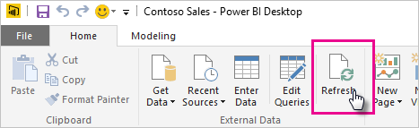
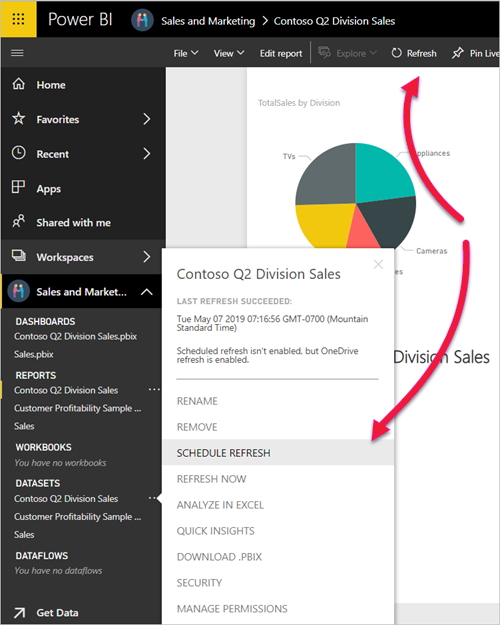
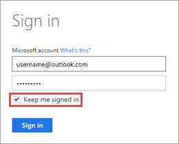

# Refresh a Power BI Desktop File (pbix file) stored on OneDrive or SharePoint Online
Importing files from OneDrive or SharePoint Online into the Power BI service is a great way to make sure your work in Power BI Desktop stays in sync with the Power BI service.

## Advantages of storing a Power BI Desktop file on OneDrive or SharePoint Online
When you store a Power BI Desktop file on OneDrive or SharePoint Online, any data you’ve loaded into your file’s model is imported into the semantic model. Any reports you’ve created from the file are loaded into **Reports** in the Power BI service. Let's say you make changes to your file on OneDrive or SharePoint Online. These changes can include adding new measures, changing column names, or editing visualizations. Once you save the file, Power BI service syncs with those changes too, usually within about an hour.

You can do a one-time, manual refresh right in Power BI Desktop by selecting **Refresh** on the **Home** ribbon. When you select **Refresh**, you refresh the file’s model with updated data from the original data source. This kind of refresh happens entirely from within the Power BI Desktop application itself. It's different from a manual or scheduled refresh in Power BI, and it’s important to understand the distinction.

When you import your Power BI Desktop file from OneDrive or SharePoint Online, you load data and model information into a semantic model in Power BI. After that, you refresh the semantic model in the Power BI service because that's what your reports are based on. Because the data sources are external, you can manually refresh the semantic model by using **Refresh now** or you can set up a refresh schedule by using **Schedule refresh**. 

When you refresh the semantic model, Power BI doesn't connect to the file on OneDrive or SharePoint Online to query for updated data. It uses information in the semantic model to connect directly to the data sources and query for updated data. Then, it loads that data into the semantic model. This refreshed data in the semantic model isn't synchronized back to the file on OneDrive or SharePoint Online.

## Automatic versus manual updates of model information

By default, Power BI updates model information from OneDrive and SharePoint on an hourly basis. If you want these updates to occur manually, you can disable automatic OneDrive refresh in the semantic model settings. Open the semantic model settings, expand the **OneDrive refresh** section, and set the toggle to **Off**.

:::image type="content" source="./media/refresh-desktop-file-onedrive/powerbi-service-onedrive-refresh-off.png" alt-text="Screenshot showing automatic OneDrive refresh off toggle.":::
 
## Semantic model owners versus users with write permission

By default, semantic model owners and semantic model users with write permission can manually refresh the model information and data in a semantic model by using **Refresh now**. As part of a manual refresh, Power BI retrieves the latest model information from OneDrive or SharePoint and then refreshes the data. The latest model information can include new and modified data connections and tables added to the files in OneDrive or SharePoint.

You can restrict the ability to add new data sources to a semantic model in Power BI by limiting model information updates to semantic model owners. In the semantic model settings, expand **Sync with OneDrive and SharePoint**, select **Restrict updates**, and then select **Apply**. 

:::image type="content" source="./media/refresh-desktop-file-onedrive/powerbi-service-onedrive-refresh-restrict-updates.png" alt-text="Screenshot showing automatic OneDrive refresh restrict updates option.":::

With restricted updates, only semantic model owners can update the model information in the semantic model with changes made to the version stored in OneDrive and SharePoint. Semantic model owners must manually refresh semantic models for the changes to be reflected. If a semantic model user with write permission refreshes the semantic model, changes from files stored in OneDrive or SharePoint won't be reflected.

If you want semantic model owners and semantic model users with write permission to have the ability to update the model information, select **Automatic updates**. Semantic models in the Power BI service are automatically updated with changes made to the versions of the semantic models stored in OneDrive and SharePoint.  

Existing semantic models will be set to **Default updates**. Once the setting is changed to either **Restrict updates** or **Automatic updates**, **Default updates** will no longer be an option for the semantic model.  

New semantic models will be assigned **Restricted updates** upon creation. The setting can be changed to **Automatic updates** if desired, with no option to apply the **Default updates** setting.

The difference between **Automatic updates** and **Default updates** is that the **Default updates** setting is applied to existing semantic models, while the **Automatic updates** setting needs to be applied after a new semantic model is created, since new semantic models default to **Restricted updates**.

| Setting name | Who can make updates | Refresh type | Availability | Default setting |
|--------------|----------------------|--------------|--------------|-----------------|
| Restrict updates | Semantic model owners only | Manual | Always an option | On new semantic models |
| Automatic updates | Semantic model owners and semantic model users with write permission | Automatic | Always an option | Never | 
| Default updates | Semantic model owners and semantic model users with write permission | Automatic | Once another setting is applied, no longer an option | On existing semantic models |

## Enforcing restricted updates

Tenant admins can enforce restricted updates across all semantic models in their organization by disabling the tenant setting **Semantic model owners can choose to automatically update semantic models from files imported from OneDrive or SharePoint**.

:::image type="content" source="./media/refresh-desktop-file-onedrive/powerbi-service-onedrive-automatic-dataset-refresh-off-tenant-setting.png" alt-text="Screenshot showing automatic OneDrive refresh disabled in tenant settings.":::
 
With restricted updates enforced at the tenant level, semantic model owners can no longer enable automatic updates in the **Sync with OneDrive and SharePoint** section. An information block shows the user that an admin has disabled automatic updates for the organization.

:::image type="content" source="./media/refresh-desktop-file-onedrive/powerbi-service-onedrive-automatic-dataset-refresh-owner-blocked-note.png" alt-text="Screenshot showing semantic model settings note that owner can't enable automatic updates.":::

## What’s supported?
Power BI supports **Refresh** and **Schedule refresh** for semantic models created from Power BI Desktop files imported from a local drive where you use **Get data** or **Power Query Editor** to connect to and load data from the following data sources.

> [!NOTE]
> Onedrive refresh for live connection semantic models is supported. However, changing the live connection semantic model, from one semantic model to another in an already published report, is not supported in the OneDrive refresh scenario.

### Power BI Gateway - Personal
* All online data sources shown in Power BI Desktop’s **Get data** and **Power Query Editor**.
* All on-premises data sources shown in Power BI Desktop’s **Get data** and **Power Query Editor** except for Hadoop File (HDFS) and Microsoft Exchange.

<!-- Refresh Data sources-->
[!INCLUDE [refresh-datasources](../includes/refresh-datasources.md)]

> [!NOTE]
> A gateway must be installed and running in order for Power BI to connect to on-premises data sources and refresh the semantic model.

## OneDrive or OneDrive for work or school. What’s the difference?
If you have both a personal OneDrive and OneDrive for work or school, you should keep any files you want to import into Power BI in OneDrive for work or school. Here’s why: You likely use two different accounts to sign into them.

When you connect to OneDrive for work or school in Power BI, connection is easy because your Power BI account is often the same account as your OneDrive for work or school account. With personal OneDrive, you usually sign in with a different [Microsoft account](https://account.microsoft.com).

When you sign in with your Microsoft account, be sure to select **Keep me signed in**. Power BI can then synchronize any updates you make in the file in Power BI Desktop with semantic models in Power BI.

If you've changed your Microsoft credentials, you can't synchronize changes between your file on OneDrive and the semantic model in Power BI. You need to connect to and import your file again from OneDrive.

## How do I schedule refresh?
When you set up a refresh schedule, Power BI connects directly to the data sources. Power BI uses connection information and credentials in the semantic model to query for updated data. Then Power BI loads the updated data into the semantic model. It then updates any report visualizations and dashboards based on that semantic model in the Power BI service.

For details on how to set up schedule refresh, see [Configure scheduled refresh](refresh-scheduled-refresh.md).

## When things go wrong
When things go wrong, it’s usually because Power BI can’t sign into data sources. Things may also go wrong if the semantic model tries to connect to an on-premises data source but the gateway is offline. To avoid these issues, make sure Power BI can sign into data sources. Try signing into your data sources in **Data Source Credentials**. Sometimes the password you use to sign into a data source changes or Power BI gets signed out from a data source.

When you save your changes to the Power BI Desktop file on OneDrive and you don't see those changes in Power BI within an hour or so, it could be because Power BI can't connect to your OneDrive. Try connecting to the file on OneDrive again. If you’re prompted to sign in, make sure you select **Keep me signed in**. Because Power BI wasn't able to connect to your OneDrive to synchronize with the file, you need to import your file again.

Semantic models stored on OneDrive or SharePoint are set to **restrict updates** by default. If the semantic model is set to restrict updates, then updates can only happen when the semantic model owner manually refreshes the semantic model, which can cause changes to Power BI files on OneDrive and SharePoint to not be reflected in the Power BI service. A semantic model owner might run into an error message after updating a file in OneDrive or SharePoint. The semantic model owner can fix the error by choosing to always manually refresh the semantic model, or changing the semantic model setting to **automatic updates**.

If the semantic model owner is unable to change the setting of the semantic model to **automatic updates**, the tenant admin has likely enforced restricted updates across all semantic models in the organization. To enable the semantic model owner to change the setting, they must contact their Fabric admin and request that the admin enable the **Semantic model owners can choose to automatically update from files imported from OneDrive or SharePoint** setting.

If the semantic model owner has set up scheduled refresh on semantic models, then the model will still refresh on schedule. However, the other contents of the report, such as visuals, will not refresh unless manual updates are made. 

* Import of sensitivity-labeled *.pbix* files (both protected and unprotected) stored on OneDrive or SharePoint Online, as well as on-demand and automatic semantic model refresh from such files, is supported, except for the following scenarios:

    * Protected live-connected *.pbix* files and protected Azure Analysis Services *.pbix* files. Refresh will fail. Neither report content nor label will be updated.
    * Labeled unprotected Live Connect *.pbix* files: Report content will be updated but label won't be updated.
    * When the *.pbix* file has had a new sensitivity label applied that the semantic model owner doesn't have usage rights to. In this case, refresh will fail. Neither report content nor label will be updated.
    * If the semantic model owner's access token for OneDrive/SharePoint has expired. In this case, refresh will fail. Neither report content nor label will be updated.

## Troubleshooting
Sometimes refreshing data may not go as expected. You'll typically run into data refresh issues when you're connected with a gateway. Take a look at the gateway troubleshooting articles for tools and known issues.

[Troubleshooting the On-premises data gateway](service-gateway-onprem-tshoot.md)

[Troubleshooting the Power BI Gateway - Personal](service-admin-troubleshooting-power-bi-personal-gateway.md)

More questions? Try asking the [Power BI Community](https://community.powerbi.com/).
