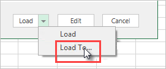
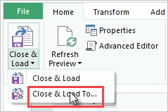
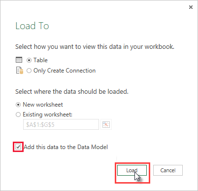

# Refresh a dataset created from an Excel workbook on a local drive

## What's supported?

> [!IMPORTANT]
> The following capabilities are deprecated and will no longer be available starting September 29th, 2023:
> - Upload of local workbooks to Power BI workspaces will no longer be allowed.
> - Configuring scheduling of refresh and refresh now for Excel files that don’t already have scheduled refresh configured will no longer be allowed.
>
> The following capabilities are deprecated and will no longer be available starting October 31, 2023:
> - Scheduled refresh and refresh now for existing Excel files that were previously configured for scheduled refresh will no longer be allowed.
> - Local workbooks uploaded to Power BI workspaces will no longer open in Power BI.
>
> After October 31, 2023:
> - You can download existing local workbooks from your Power BI workspace.
> - You can publish your Excel data model as a Power BI dataset and schedule refresh.
> - You can import Excel workbooks from OneDrive and SharePoint Document libraries to view them in Power BI.
>   
> If your organization uses these capabilities, see more details in [Migrating your Excel workbooks](service-excel-workbook-files.md#migrating-your-excel-workbooks).  

In Power BI, Refresh Now and Schedule Refresh is supported for datasets created from Excel workbooks imported from a local drive where Power Query or Power Pivot is used to connect to any of the following data sources and load data into the Excel data model. Power Query is *Get & Transform data* in Excel 2016.

### Power BI Gateway - Personal

* All online data sources shown in Power Query.
* All on-premises data sources shown in Power Query except for Hadoop file (HDFS) and Microsoft Exchange.
* All online data sources shown in Power Pivot.
* All on-premises data sources shown in Power Pivot except for Hadoop file (HDFS) and Microsoft Exchange.

<!-- Refresh Data sources-->
[!INCLUDE [refresh-datasources](../includes/refresh-datasources.md)]

Keep the following notes in mind:

* A gateway must be installed and running in order for the Power BI service to connect to on-premises data sources and refresh the dataset.
* When using Excel 2013, make sure you've updated Power Query to the latest version.
* Refresh isn't supported for Excel workbooks imported from a local drive where data exists only in worksheets or linked tables. Refresh is supported for worksheet data if it's stored and imported from OneDrive. To learn more, see [Refresh a dataset created from an Excel workbook on OneDrive, or SharePoint Online](refresh-excel-file-onedrive.md).
* When you refresh a dataset created from an Excel workbook imported from a local drive, only the data queried from data sources is refreshed.

  If you change the structure of the data model in Excel or Power Pivot, for example, create a new measure or change the name of a column, those changes aren't copied to the dataset. If you make such changes, reupload or republish the workbook.

  If you expect to make regular changes to the structure of your workbook and you want those changes to be reflected in the dataset in the Power BI service without having to reupload, consider putting your workbook on OneDrive. The Power BI service automatically refreshes both the structure and worksheet data from workbooks stored and imported from OneDrive.

## How do I make sure data is loaded to the Excel data model?

When you use Power Query to connect to a data source, you have several options where to load the data. Power Query is *Get & Transform data* in Excel 2016. To make sure you load data into the data model, you must select the **Add this data to the Data Model** option in the **Load To** dialog.

> [!NOTE]
> The images here show Excel 2016.

In **Navigator**, select **Load To…**

Or, if you select **Edit** in Navigator, you open the Query Editor. There you can select **Close & Load To….**

Then in **Load To**, make sure you select **Add this data to the Data Model**.

### What if I use Get External Data in Power Pivot?

No problem. Whenever you use Power Pivot to connect to and query data from an on-premises or online data source, the data is automatically loaded to the data model.

## How do I schedule refresh?

When you set up a refresh schedule, Power BI connects directly to the data sources using connection information and credentials in the dataset to query for updated data, then loads the updated data into the dataset. Any visualizations in reports and dashboards based on that dataset in the Power BI service are also updated.

For details on how to setup schedule refresh, see [Configure Schedule Refresh](refresh-scheduled-refresh.md).

## When things go wrong

When things go wrong, it's usually because Power BI can't sign into data sources, or if the dataset connects to an on-premises data source, the gateway is offline. Make sure Power BI can sign into data sources. If a password you use to sign into a data source changes, or Power BI gets signed out from a data source, be sure to try signing into your data sources again in Data Source Credentials.

Be sure to leave the **Send refresh failure notification email to me** selected. You want to know right away if a scheduled refresh fails.

> [!IMPORTANT]
> Refresh isn't supported for OData feeds connected to and queried from Power Pivot. When using an OData feed as a data source, use Power Query.

## Troubleshooting

Sometimes refreshing data might not go as expected. Typically problems are caused by an issue connected with a gateway. Take a look at the gateway troubleshooting articles for tools and known issues.

* [Troubleshooting the On-premises data gateway](service-gateway-onprem-tshoot.md)
* [Troubleshooting the Power BI Gateway - Personal](service-admin-troubleshooting-power-bi-personal-gateway.md)

## Related content

More questions? [Try the Power BI Community](https://community.powerbi.com/)
