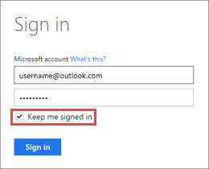
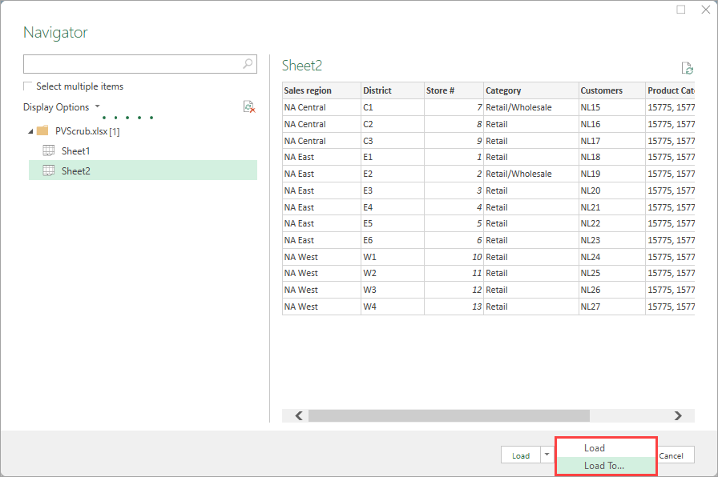
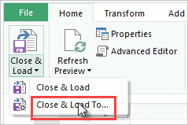
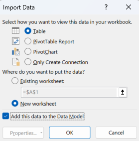

# Refresh a semantic model created from an Excel workbook on OneDrive or SharePoint Online

> [!IMPORTANT]
> The following capabilities are deprecated and will no longer be available starting September 29th, 2023:
> - Upload of local workbooks to Power BI workspaces will no longer be allowed.
> - Configuring scheduling of refresh and refresh now for Excel files that don’t already have scheduled refresh configured will no longer be allowed.
>
> The following capabilities are deprecated and will no longer be available starting October 31, 2023:
> - Scheduled refresh and refresh now for existing Excel files that were previously configured for scheduled refresh will no longer be allowed.
> - Local workbooks uploaded to Power BI workspaces will no longer open in Power BI.
>
> After October 31, 2023:
> - You can download existing local workbooks from your Power BI workspace.
> - You can publish your Excel data model as a Power BI semantic model and schedule refresh.
> - You can import Excel workbooks from OneDrive and SharePoint Document libraries to view them in Power BI.
>
> If your organization uses these capabilities, see more details in [Migrating your Excel workbooks](service-excel-workbook-files.md#migrating-your-excel-workbooks).  

You can import Excel workbooks from your local machine, or from cloud storage such as OneDrive for work or school or SharePoint Online. This article explores the advantages of using cloud storage for your Excel files. For more information about how to import Excel files into Power BI, see [Get data from Excel workbook files](service-excel-workbook-files.md).

## What are the advantages?

When you import files from OneDrive, or SharePoint Online, it ensures the work you’re doing in Excel stays in sync with the Power BI service. Any data that you’ve loaded into your file’s model then updates in the semantic model. Any reports you’ve created in the file load into Reports in Power BI. If you make and save changes to your file on OneDrive or SharePoint Online, Power BI shows the updates to those changes. For example, if you add new measures, change column names, or edit visualizations, Power BI reflects the changes. Your changes typically update within an hour after you've saved them.

When you import an Excel workbook from your personal OneDrive, any data in the workbook loads into a new semantic model in Power BI. For example, tables in worksheets, data loaded into the Excel data model, and the structure of the data model goes into a new semantic model. Power BI automatically connects to the workbook on OneDrive, or SharePoint Online, approximately every hour to check for updates. If the workbook changed, Power BI refreshes the semantic model and reports in the Power BI service.

You can refresh the semantic model in the Power BI service. When you manually refresh or schedule a refresh on the semantic model, Power BI connects directly to the external data sources to query for any updated data. It then loads updated data into the semantic model. Refreshing a semantic model from within Power BI doesn't refresh the data in the workbook on OneDrive or SharePoint Online.

## What’s supported?

Power BI supports the **Refresh Now** and **Schedule Refresh** options for semantic models that meet the following conditions:  

* The semantic models are created from Power BI Desktop files that are imported from a local drive.
* Get data or Power Query Editor in Power BI is used to connect to and load the data.
* The data is from a source that's described in one of the following sections.

### Power BI gateway - personal

* All online data sources shown in Power BI Desktop’s Get data and Power Query Editor.
* All on-premises data sources shown in Power BI Desktop’s Get data and Power Query Editor except for Hadoop file (HDFS) and Microsoft Exchange.

<!-- Refresh Data sources-->
[!INCLUDE [refresh-datasources](../includes/refresh-datasources.md)]

> [!NOTE]
> A gateway must be installed and running in order for Power BI to connect to on-premises data sources and refresh the semantic model.
>
>

## OneDrive or OneDrive for work or school. What’s the difference?

If you have both a personal OneDrive and OneDrive for work or school, it’s recommended you keep files you want to import in OneDrive for work or school. Here’s why: You likely use two different accounts to sign in and access your files.

In Power BI, connecting to OneDrive for work or school is typically seamless because you likely use the same account to sign in to Power BI as OneDrive for work or school. But with personal OneDrive, it's more common to sign in with a different [Microsoft account](https://account.microsoft.com).

When you sign in to OneDrive for work or school with your Microsoft account, select **Keep me signed in**. Power BI can then synchronize any updates you make in the file in Power BI Desktop with semantic models in Power BI.  

If your Microsoft account credentials change, edits to your file on OneDrive can't synchronize with the semantic model or reports in Power BI. You need to reconnect and import the file again from your personal OneDrive.

## Options for connecting to an Excel file

When you connect to an Excel workbook in OneDrive for work or school, or SharePoint Online, you have two options on how to get what’s in your workbook into Power BI.

[**Import Excel data into Power BI**](service-excel-workbook-files.md#import-or-connect-to-an-excel-workbook-from-power-bi) – When you import an Excel workbook from your OneDrive for work or school or SharePoint Online, it works as described previously.

[**Connect, manage, and view Excel in Power BI**](service-excel-workbook-files.md#one-excel-workbook--two-ways-to-use-it) – When using this option, you create a connection from Power BI right to your workbook on OneDrive for work or school or SharePoint Online.

When you connect to an Excel workbook this way, a semantic model isn't created in Power BI. But the workbook appears in the Power BI service under Reports with an Excel icon next to the name. Unlike with Excel Online, when you connect to your workbook from Power BI, if your workbook has connections to external data sources that load data into the Excel data model, you can set up a refresh schedule.

When you set up a refresh schedule this way, the only difference is refreshed data goes into the workbook’s data model on OneDrive, or SharePoint Online, rather than a semantic model in Power BI.

## How do I make sure data is loaded to the Excel data model?

When you use Power Query (**Get & Transform Data** in Excel 2016) to connect to a data source, you have several options of where to load the data. To ensure that you load data into the data model, you must select the **Add this data to the Data Model** option in the **Import Data** dialog box.

1. In Excel, select **Data** > **Get Data**  and select where you want your data to come from. In this example, the data loads from an Excel workbook file.
1. In the file browser window, locate and select your data file and then select **Import**.
1. In **Navigator**, select your file and choose **Load To…** .

      

   Or, in Excel, select **Data** > **Get Data** > **Launch Power Query Editor** to open the Query Editor. There you can select **Close & Load To….**  

   

1. Then, in **Import Data**, be sure to select **Add this data to the Data Model** and select **OK**.  

   

### What if I use Get External Data in Power Pivot?

No problem. Whenever you use Power Pivot to connect to and query data from an on-premises or online data source, the data automatically loads to the data model.

## How do I schedule a refresh?

When you set up a refresh schedule, Power BI connects directly to the data sources by using connection information and credentials in the semantic model to query for updated data. It then loads the updated data into the semantic model. Any visualizations in reports and dashboards based on that semantic model in the Power BI service also update.

For more information about how to set up a scheduled refresh, see [Configure scheduled refresh](refresh-scheduled-refresh.md).

## When things go wrong

When things go wrong, it’s usually because Power BI can’t sign in to data sources. Or it's because the semantic model connects to an on-premises data source and the gateway is offline. Be sure Power BI can sign in to data sources. If a password you use to sign in to a data source changes, or Power BI is signed out from a data source, be sure to sign in to your data sources again in Data Source Credentials.

Be sure to leave the **Send refresh failure notification email to me** setting selected. You want to know right away if a scheduled refresh fails.

## Important notes

Refresh isn't supported for OData feeds connected to and queried from Power Pivot. When using an OData feed as a data source, use Power Query.

## Troubleshooting

Sometimes refreshing data might not go as expected. Typically, problems with refreshing are an issue with the data gateway. For tools, tips, and known issues, see the following articles about troubleshooting the gateway.

* [Troubleshoot the on-premises data gateway](service-gateway-onprem-tshoot.md)
* [Troubleshoot the Power BI gateway - personal](service-admin-troubleshooting-power-bi-personal-gateway.md)

More questions? [Try the Power BI Community](https://community.powerbi.com/).
